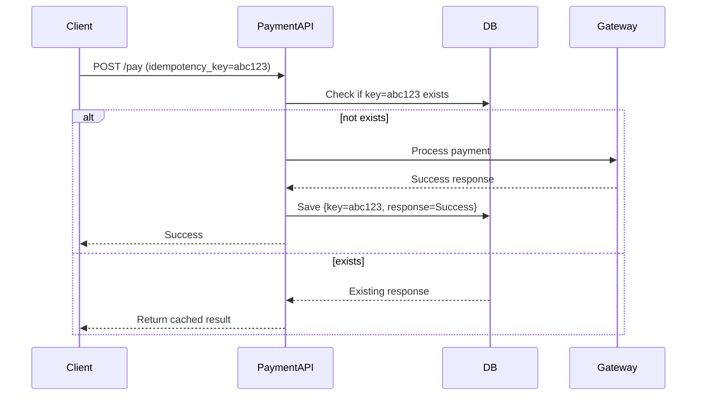
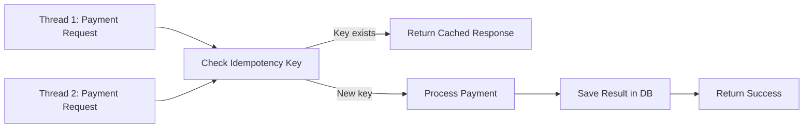
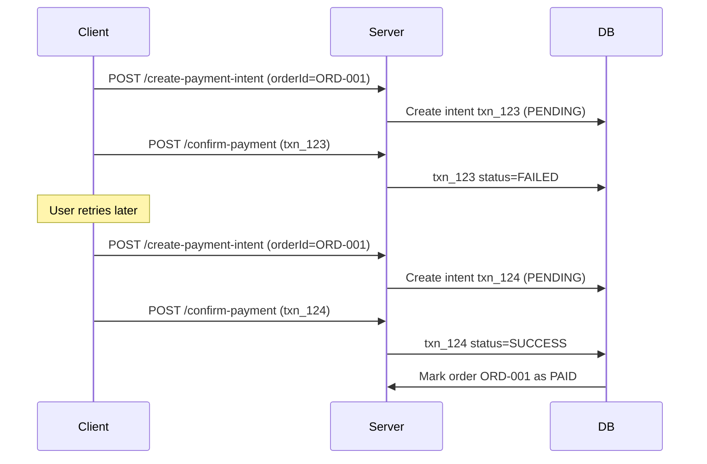

---

# 🧠 **Designing a Payment System: Correctness over Speed**

> “In payments, correctness wins. Every. Single. Time.”

---

## 🧩 The Problem

Payments require **idempotent**, **auditable**, and **strongly consistent** processing.
A user may retry a payment (due to a network glitch, refresh, or app crash), but **you must not  charge them twice**.

---

## 💡 Marco’s Choices

| Option                                           | Description                                                                    | Pros                                    | Cons                                           | Verdict                                               |
| ------------------------------------------------ | ------------------------------------------------------------------------------ | --------------------------------------- | ---------------------------------------------- | ----------------------------------------------------- |
| **A. Strong Consistency (DB + Idempotency Key)** | Store a client-generated key and result in a durable DB with unique constraint | Correct, auditable, prevents duplicates | Slightly slower (DB write)                     | ✅ **Best for Payments**                               |
| **B. Redis TTL Hack**                            | Lock with Redis `SETNX`, store result temporarily                              | Fast                                    | Risky — TTL expiry, restart = duplicate charge | ❌ Unsafe                                              |
| **C. Kafka “Exactly Once”**                      | Rely on event pipeline for deduplication                                       | Scales                                  | Doesn’t ensure *client-level correctness*      | ⚠️ Good for async systems, not for payment initiation |
| **D. Fix It Later**                              | Reconcile errors later                                                         | Fast to build                           | Refund pain, user distrust                     | 🚫 Never do this in payments                          |

---

# 🏦 Correct Approach — Option A: **Strong Consistency with Idempotency Key**

---

## 🔐 **Idempotency Concept**

> Idempotency ensures that multiple identical requests result in **only one charge**.

Each client generates a **unique idempotency key** per payment request.

**Flow:**



---

# 🧰 **Java Implementation Example**

Let’s build a simple thread-safe idempotent payment service.

### **1️⃣ PaymentRequest Model**

```java
public class PaymentRequest {
    private String idempotencyKey;
    private double amount;
    private String userId;
    // Getters and Setters
}
```

---

### **2️⃣ Repository (Simulated Persistent Store)**

```java
import java.util.concurrent.ConcurrentHashMap;

public class PaymentRepository {
    private final ConcurrentHashMap<String, String> store = new ConcurrentHashMap<>();

    public boolean exists(String key) {
        return store.containsKey(key);
    }

    public void save(String key, String result) {
        store.put(key, result);
    }

    public String get(String key) {
        return store.get(key);
    }
}
```

---

### **3️⃣ PaymentService with Thread Safety**

```java
import java.util.concurrent.*;

public class PaymentService {
    private final PaymentRepository repository = new PaymentRepository();

    // Simulate payment processing
    private String processPayment(PaymentRequest request) {
        try {
            Thread.sleep(1000); // simulate delay
        } catch (InterruptedException e) {
            Thread.currentThread().interrupt();
        }
        return "Payment of $" + request.getAmount() + " for " + request.getUserId() + " processed.";
    }

    public synchronized String handlePayment(PaymentRequest request) {
        String key = request.getIdempotencyKey();

        if (repository.exists(key)) {
            return "Duplicate request. Returning previous result: " + repository.get(key);
        }

        String result = processPayment(request);
        repository.save(key, result);
        return result;
    }
}
```

---

### **4️⃣ Testing with Threads**

```java
public class PaymentDemo {
    public static void main(String[] args) throws InterruptedException {
        PaymentService service = new PaymentService();

        PaymentRequest req = new PaymentRequest();
        req.setIdempotencyKey("txn-123");
        req.setAmount(100.0);
        req.setUserId("userA");

        Runnable task = () -> System.out.println(service.handlePayment(req));

        ExecutorService executor = Executors.newFixedThreadPool(3);
        executor.submit(task);
        executor.submit(task);
        executor.submit(task);

        executor.shutdown();
    }
}
```

🧾 **Output Example:**

```
Payment of $100.0 for userA processed.
Duplicate request. Returning previous result: Payment of $100.0 for userA processed.
Duplicate request. Returning previous result: Payment of $100.0 for userA processed.
```

✅ Correct, even with concurrent requests.

---

# ⚙️ **Frameworks that Handle This Well**

| Framework                       | Feature                                         | Usage                          |
| ------------------------------- | ----------------------------------------------- | ------------------------------ |
| **Spring Boot + JPA**           | Use `@Transactional` with DB unique constraints | Best for microservices         |
| **Spring Retry / Resilience4j** | Safe retries for transient failures             | Combine with idempotency       |
| **Kafka + Outbox Pattern**      | Reliable event propagation                      | For async events post-payment  |
| **Hazelcast / Redis**           | Optional cache for reads                        | Not for correctness guarantees |
| **PostgreSQL**                  | Unique constraint on `idempotency_key`          | Prevents double inserts        |

---

# 🧮 **Database Schema Example**

```sql
CREATE TABLE payments (
  id SERIAL PRIMARY KEY,
  idempotency_key VARCHAR(100) UNIQUE NOT NULL,
  user_id VARCHAR(50),
  amount DECIMAL(10,2),
  status VARCHAR(20),
  response JSONB,
  created_at TIMESTAMP DEFAULT NOW()
);
```

---

# 📊 **Thread Handling & Scalability**

* Use **ExecutorService** or **CompletableFuture** for concurrent processing.
* Wrap DB writes in **transactions**.
* Use **distributed locks (like PostgreSQL advisory locks)** for multi-node safety.
* For at-least-once retry logic, **store operation status** before sending response.

---

# 🔍 **Diagram: Thread-safe Payment Handling**



---

# 🧾 **Summary Table**

| Concern           | Recommended Solution                     |
| ----------------- | ---------------------------------------- |
| Duplicate Charges | Use DB-level unique key                  |
| High Concurrency  | Use synchronized block or DB lock        |
| Failover          | Durable store (PostgreSQL, MySQL)        |
| Speed             | Use cache for reads, not writes          |
| Scaling           | Use Kafka Outbox after successful commit |
| Auditability      | Store full request + response            |

---

# 📘 **GitHub Markdown Documentation**

You can copy-paste this content directly into a GitHub README file:

````markdown
# 💳 Idempotent Payment System in Java

## Overview
This example demonstrates how to design a payment API that guarantees correctness and prevents duplicate charges, even under concurrent requests.

### Key Principles
- Strong Consistency > Low Latency
- Durable Storage of Responses
- Thread-Safe Processing

### Architecture Diagram
```mermaid
sequenceDiagram
    participant Client
    participant PaymentAPI
    participant DB
    participant Gateway
    Client->>PaymentAPI: POST /pay (idempotency_key)
    PaymentAPI->>DB: Check if key exists
    alt not exists
        PaymentAPI->>Gateway: Process payment
        Gateway-->>PaymentAPI: Success
        PaymentAPI->>DB: Save key + response
        PaymentAPI-->>Client: Success
    else exists
        PaymentAPI-->>Client: Return cached result
    end
````


Excellent — that’s *the* core follow-up question every **FinTech architect** must answer. 🔥

You're asking:

> ❓ How do we make sure that when a user retries or starts a new payment, the backend doesn’t confuse it with the *previous* failed attempt or mix up different transactions?

Let’s go deep into **how real payment systems (Stripe, Razorpay, PayPal, etc.) solve this** — conceptually and in code.

---

## 🧠 The Core Principle

> **Each payment attempt must have a unique identity, but it should also be tied to a higher-level entity that represents what the user is paying for.**

That’s where **Payment Intent** (or sometimes called **Order / Checkout Session**) comes in.

There are *two layers* of identity:

| Level                       | Entity                | Meaning                                          | Lifetime                      |
| --------------------------- | --------------------- | ------------------------------------------------ | ----------------------------- |
| 🧾 **Business-level ID**    | **Order ID**          | Represents what user is paying for (the “thing”) | Long (until paid or canceled) |
| 💳 **Transaction-level ID** | **Payment Intent ID** | Represents *an attempt* to pay that order        | Short (each attempt unique)   |

---

## 🎯 Real-World Example — Stripe

* You create a `PaymentIntent` for a specific **Order ID**
* If it fails, the client can **retry** on the *same intent* (same key)
* If user **starts a new purchase**, you create a **new PaymentIntent** tied to a *different Order ID*

---

## 🔁 **Hierarchy of IDs**

```mermaid
flowchart TD
A[Order ID: order_456] --> B1[Payment Intent 1: txn_abc123 - FAILED]
A --> B2[Payment Intent 2: txn_def456 - SUCCESS]
C[Order ID: order_789] --> D[Payment Intent 3: txn_xyz999 - PENDING]
```

* Both `txn_abc123` and `txn_def456` belong to the same `order_456`.
* But they are **distinct attempts**.
* Only the **latest SUCCESSFUL** one counts.

---

## ⚙️ **How We Link Them in Java**

### ✅ 1️⃣ Database Schema

```sql
CREATE TABLE orders (
  id SERIAL PRIMARY KEY,
  order_id VARCHAR(100) UNIQUE NOT NULL,
  user_id VARCHAR(50),
  amount DECIMAL(10,2),
  status VARCHAR(20) CHECK (status IN ('CREATED', 'PAID', 'FAILED')),
  created_at TIMESTAMP DEFAULT NOW()
);

CREATE TABLE payment_intents (
  id SERIAL PRIMARY KEY,
  intent_id VARCHAR(100) UNIQUE NOT NULL,
  order_id VARCHAR(100) REFERENCES orders(order_id),
  status VARCHAR(20) CHECK (status IN ('PENDING', 'SUCCESS', 'FAILED')),
  idempotency_key VARCHAR(100) UNIQUE,
  created_at TIMESTAMP DEFAULT NOW()
);
```

So you have:

* **Order ID** → business-level key
* **Payment Intent ID** → technical key (idempotent per attempt)
* **Foreign key** ensures each payment attempt belongs to an order

---

### ✅ 2️⃣ Workflow

#### Step 1: User initiates checkout

```bash
POST /create-order
{
  "orderId": "ORD-001",
  "amount": 100.0,
  "userId": "userA"
}
```

→ Server creates `orders(order_id='ORD-001', status='CREATED')`

---

#### Step 2: User begins payment

```bash
POST /create-payment-intent
{
  "orderId": "ORD-001"
}
```

→ Server creates a new record:

```
intent_id = txn_12345
order_id  = ORD-001
status    = PENDING
idempotency_key = uuid
```

Returns:

```json
{
  "orderId": "ORD-001",
  "intentId": "txn_12345",
  "idempotencyKey": "uuid-xyz"
}
```

---

#### Step 3: User confirms payment

```bash
POST /confirm-payment
{
  "intentId": "txn_12345",
  "idempotencyKey": "uuid-xyz"
}
```

Server logic:

```java
@Transactional
public PaymentResponse confirmPayment(String intentId, String key) {
    PaymentIntent intent = repository.findByIntentId(intentId);
    if (intent == null) throw new IllegalArgumentException("Invalid intent");

    // Check idempotency
    if (repository.existsByIdempotencyKey(key)) {
        return repository.getResponseByKey(key);
    }

    if ("SUCCESS".equals(intent.getStatus())) {
        return intent.getResponse(); // Already processed
    }

    // Process with payment gateway
    PaymentGatewayResponse gatewayResp = gateway.charge(intent.getOrderId(), intent.getAmount());

    intent.setStatus("SUCCESS");
    intent.setIdempotencyKey(key);
    repository.save(intent);

    // Update order status
    orderRepo.updateStatus(intent.getOrderId(), "PAID");

    return gatewayResp;
}
```

---

## 🚨 3️⃣ What If User Starts a New Payment After Failure?

Let’s visualize it 👇



✅ Result:

* **Old intent** (txn_123) = failed
* **New intent** (txn_124) = success
* **Order ORD-001** = paid once only
* Both are linked through `order_id`

---

## 💡 4️⃣ How Backend Ensures Intent Belongs to Right Transaction

When confirming a payment, the backend always verifies:

```java
PaymentIntent intent = repository.findByIntentId(intentId);

if (!intent.getOrderId().equals(clientProvidedOrderId)) {
    throw new SecurityException("Intent does not belong to this order");
}
```

This prevents:

* Linking someone else’s payment
* Reusing old failed intents for new orders

---

## 🔍 5️⃣ Audit and Recovery

You can easily track:

* All intents per order
* Their outcomes
* Gateway responses

Example query:

```sql
SELECT order_id, intent_id, status, created_at 
FROM payment_intents
WHERE order_id = 'ORD-001';
```

---

## ✅ Summary Table

| Case                                  | Behavior                           | Why It’s Safe               |
| ------------------------------------- | ---------------------------------- | --------------------------- |
| User retries same payment             | Uses same intent & idempotency key | Prevents double charge      |
| User starts new payment after failure | New intent under same order        | Keeps payment history clean |
| App/browser crash                     | Server holds state                 | Client can resume safely    |
| Malicious reuse of old key            | Rejected if order/intent mismatch  | Prevents fraud              |
| Multiple tabs click “Pay”             | DB constraint + key dedupe         | Thread-safe correctness     |

---

## 🧩 Recommended Stack

| Layer                | Technology                                 | Role                                  |
| -------------------- | ------------------------------------------ | ------------------------------------- |
| **DB**               | PostgreSQL                                 | Durable store with unique keys        |
| **ORM**              | Spring Data JPA                            | Entity relationships (Order ↔ Intent) |
| **Concurrency**      | `@Transactional`, `synchronized`, DB locks | Prevent double commit                 |
| **Queue (Optional)** | Kafka Outbox                               | For downstream notifications          |
| **Cache**            | Redis (read-only)                          | Query recent transactions             |

---

## 🔐 Diagram — End-to-End Payment Lifecycle

```mermaid
flowchart TD
A[User Places Order ORD-001] --> B[Server Creates PaymentIntent txn_123]
B --> C[DB: txn_123 - PENDING]
C --> D[User Confirms Payment]
D --> E[Gateway Processing...]
E -->|Success| F[txn_123 -> SUCCESS]
F --> G[Order ORD-001 -> PAID]
E -->|Fail| H[txn_123 -> FAILED]
H --> I[User Retries → txn_124 (new intent)]
I --> J[txn_124 -> SUCCESS]
J --> G
```

---

## 🚀 Takeaway

> **Each payment attempt gets its own PaymentIntent**,
> **Each PaymentIntent links to one Order**,
> **The Order decides final truth (paid or not)**.

That’s how fintechs achieve **correctness + clarity + auditability**, even when:

* Users retry
* Apps crash
* Network drops
* Multiple attempts happen

---
