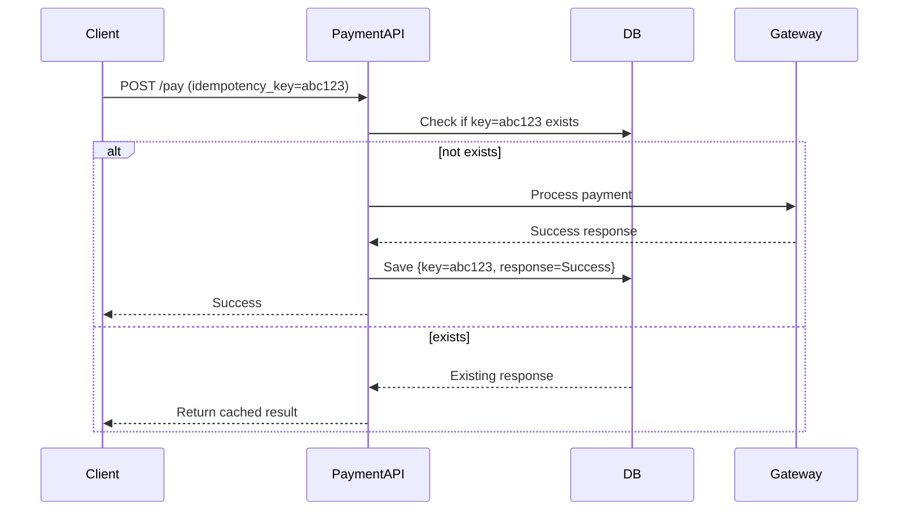
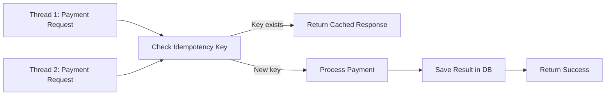

---

# 🧠 **Designing a Payment System: Correctness over Speed**

> “In payments, correctness wins. Every. Single. Time.”

---

## 🧩 The Problem

Payments require **idempotent**, **auditable**, and **strongly consistent** processing.
A user may retry a payment (due to a network glitch, refresh, or app crash), but **you must not  charge them twice**.

---

## 💡 Marco’s Choices

| Option                                           | Description                                                                    | Pros                                    | Cons                                           | Verdict                                               |
| ------------------------------------------------ | ------------------------------------------------------------------------------ | --------------------------------------- | ---------------------------------------------- | ----------------------------------------------------- |
| **A. Strong Consistency (DB + Idempotency Key)** | Store a client-generated key and result in a durable DB with unique constraint | Correct, auditable, prevents duplicates | Slightly slower (DB write)                     | ✅ **Best for Payments**                               |
| **B. Redis TTL Hack**                            | Lock with Redis `SETNX`, store result temporarily                              | Fast                                    | Risky — TTL expiry, restart = duplicate charge | ❌ Unsafe                                              |
| **C. Kafka “Exactly Once”**                      | Rely on event pipeline for deduplication                                       | Scales                                  | Doesn’t ensure *client-level correctness*      | ⚠️ Good for async systems, not for payment initiation |
| **D. Fix It Later**                              | Reconcile errors later                                                         | Fast to build                           | Refund pain, user distrust                     | 🚫 Never do this in payments                          |

---

# 🏦 Correct Approach — Option A: **Strong Consistency with Idempotency Key**

---

## 🔐 **Idempotency Concept**

> Idempotency ensures that multiple identical requests result in **only one charge**.

Each client generates a **unique idempotency key** per payment request.

**Flow:**



---

# 🧰 **Java Implementation Example**

Let’s build a simple thread-safe idempotent payment service.

### **1️⃣ PaymentRequest Model**

```java
public class PaymentRequest {
    private String idempotencyKey;
    private double amount;
    private String userId;
    // Getters and Setters
}
```

---

### **2️⃣ Repository (Simulated Persistent Store)**

```java
import java.util.concurrent.ConcurrentHashMap;

public class PaymentRepository {
    private final ConcurrentHashMap<String, String> store = new ConcurrentHashMap<>();

    public boolean exists(String key) {
        return store.containsKey(key);
    }

    public void save(String key, String result) {
        store.put(key, result);
    }

    public String get(String key) {
        return store.get(key);
    }
}
```

---

### **3️⃣ PaymentService with Thread Safety**

```java
import java.util.concurrent.*;

public class PaymentService {
    private final PaymentRepository repository = new PaymentRepository();

    // Simulate payment processing
    private String processPayment(PaymentRequest request) {
        try {
            Thread.sleep(1000); // simulate delay
        } catch (InterruptedException e) {
            Thread.currentThread().interrupt();
        }
        return "Payment of $" + request.getAmount() + " for " + request.getUserId() + " processed.";
    }

    public synchronized String handlePayment(PaymentRequest request) {
        String key = request.getIdempotencyKey();

        if (repository.exists(key)) {
            return "Duplicate request. Returning previous result: " + repository.get(key);
        }

        String result = processPayment(request);
        repository.save(key, result);
        return result;
    }
}
```

---

### **4️⃣ Testing with Threads**

```java
public class PaymentDemo {
    public static void main(String[] args) throws InterruptedException {
        PaymentService service = new PaymentService();

        PaymentRequest req = new PaymentRequest();
        req.setIdempotencyKey("txn-123");
        req.setAmount(100.0);
        req.setUserId("userA");

        Runnable task = () -> System.out.println(service.handlePayment(req));

        ExecutorService executor = Executors.newFixedThreadPool(3);
        executor.submit(task);
        executor.submit(task);
        executor.submit(task);

        executor.shutdown();
    }
}
```

🧾 **Output Example:**

```
Payment of $100.0 for userA processed.
Duplicate request. Returning previous result: Payment of $100.0 for userA processed.
Duplicate request. Returning previous result: Payment of $100.0 for userA processed.
```

✅ Correct, even with concurrent requests.

---

# ⚙️ **Frameworks that Handle This Well**

| Framework                       | Feature                                         | Usage                          |
| ------------------------------- | ----------------------------------------------- | ------------------------------ |
| **Spring Boot + JPA**           | Use `@Transactional` with DB unique constraints | Best for microservices         |
| **Spring Retry / Resilience4j** | Safe retries for transient failures             | Combine with idempotency       |
| **Kafka + Outbox Pattern**      | Reliable event propagation                      | For async events post-payment  |
| **Hazelcast / Redis**           | Optional cache for reads                        | Not for correctness guarantees |
| **PostgreSQL**                  | Unique constraint on `idempotency_key`          | Prevents double inserts        |

---

# 🧮 **Database Schema Example**

```sql
CREATE TABLE payments (
  id SERIAL PRIMARY KEY,
  idempotency_key VARCHAR(100) UNIQUE NOT NULL,
  user_id VARCHAR(50),
  amount DECIMAL(10,2),
  status VARCHAR(20),
  response JSONB,
  created_at TIMESTAMP DEFAULT NOW()
);
```

---

# 📊 **Thread Handling & Scalability**

* Use **ExecutorService** or **CompletableFuture** for concurrent processing.
* Wrap DB writes in **transactions**.
* Use **distributed locks (like PostgreSQL advisory locks)** for multi-node safety.
* For at-least-once retry logic, **store operation status** before sending response.

---

# 🔍 **Diagram: Thread-safe Payment Handling**



---

# 🧾 **Summary Table**

| Concern           | Recommended Solution                     |
| ----------------- | ---------------------------------------- |
| Duplicate Charges | Use DB-level unique key                  |
| High Concurrency  | Use synchronized block or DB lock        |
| Failover          | Durable store (PostgreSQL, MySQL)        |
| Speed             | Use cache for reads, not writes          |
| Scaling           | Use Kafka Outbox after successful commit |
| Auditability      | Store full request + response            |

---

# 📘 **GitHub Markdown Documentation**

You can copy-paste this content directly into a GitHub README file:

````markdown
# 💳 Idempotent Payment System in Java

## Overview
This example demonstrates how to design a payment API that guarantees correctness and prevents duplicate charges, even under concurrent requests.

### Key Principles
- Strong Consistency > Low Latency
- Durable Storage of Responses
- Thread-Safe Processing

### Architecture Diagram
```mermaid
sequenceDiagram
    participant Client
    participant PaymentAPI
    participant DB
    participant Gateway
    Client->>PaymentAPI: POST /pay (idempotency_key)
    PaymentAPI->>DB: Check if key exists
    alt not exists
        PaymentAPI->>Gateway: Process payment
        Gateway-->>PaymentAPI: Success
        PaymentAPI->>DB: Save key + response
        PaymentAPI-->>Client: Success
    else exists
        PaymentAPI-->>Client: Return cached result
    end
````