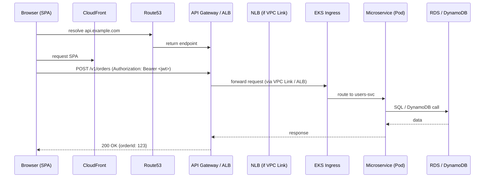
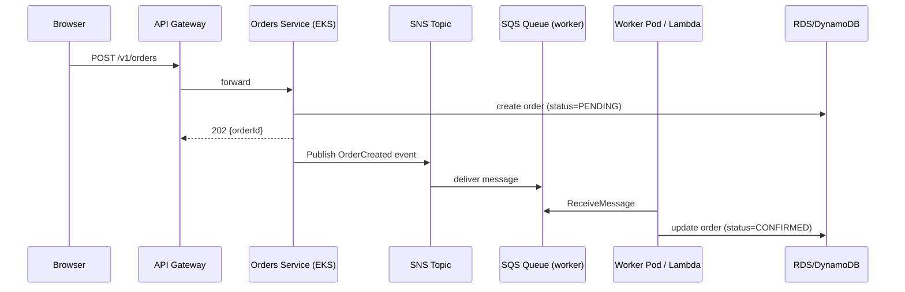

Nice — I’ll make the **communication flow** crystal clear and concrete, with small examples you can copy/paste. I’ll cover:

* how requests travel from the browser to the right backend (CDN → API Gateway / ALB → Lambda / EKS)
* what headers and tokens travel with the request (auth, tracing, idempotency)
* synchronous vs asynchronous flows (SNS → SQS → workers)
* how services discover each other inside EKS (DNS, Cloud Map, service mesh)
* how DB connections and secrets get to pods (Secrets Manager/IRSA)
* realtime (websockets) patterns and fallback
* reliability patterns (retries, backoff, DLQ, idempotency, circuit breakers)
* short diagrams and concrete request/response examples

I’ll keep it practical and not just high-level prose.

---

# 1) The simple synchronous HTTP flow (user → CDN → API → service → DB)

### Overview (short)

User (browser/mobile) calls `https://www.example.com`. Static files served from **CloudFront**. When the SPA makes an API call (e.g. `POST https://api.example.com/v1/orders`), DNS resolves `api.example.com` via **Route 53** to your API ingress (API Gateway custom domain or ALB). API Gateway validates auth and forwards the request to either a **Lambda** or to an **internal NLB/ALB** that routes to your **EKS Ingress**, which forwards to the correct Kubernetes Service and Pod (microservice). The microservice reads/writes DB (RDS or DynamoDB), returns a response, API Gateway returns it to the client.

### Sequence (mermaid)



### Concrete HTTP request example

Request from SPA:

```
POST https://api.example.com/v1/orders
Headers:
  Authorization: Bearer eyJhbGci...
  Content-Type: application/json
  X-Request-ID: d4e8c9f6-1234-4baf-8b3b-3fb7c11a8b2a
  X-Correlation-ID: 7fda-xyz-0001
Body:
{
  "productId":"sku-328",
  "qty":2,
  "idempotencyKey":"order-20251206-abc123"   // optional but recommended for POSTs
}
```

Server response:

```
HTTP/1.1 201 Created
Content-Type: application/json
X-Request-ID: d4e8c9f6-1234-4baf-8b3b-3fb7c11a8b2a

{
  "orderId": 12345,
  "status": "ACCEPTED"
}
```

**Notes:**

* `Authorization` typically contains a JWT from Cognito or another OIDC provider. API Gateway can validate the JWT before forwarding.
* `X-Request-ID` generated at the edge (CloudFront or the SPA) and passed downstream for tracing.
* `idempotencyKey` lets backend treat duplicate POSTs safely.

---

# 2) Asynchronous flow (decoupling heavy work)

Use-case: creating an order triggers inventory updates, payment processing, emails. Rather than making the client wait, the API accepts the request and publishes an event. Workers do downstream tasks.

### Pattern

* Client → API Gateway → microservice accepts request and immediately responds `202 Accepted` with `orderId`.
* Microservice publishes an event to **SNS** (topic).
* One or more **SQS** queues subscribe to the SNS topic (one queue per logical consumer). Worker pods (EKS or Lambda) pull from SQS and process independently.
* If a job fails repeatedly, it goes to a DLQ for inspection.

### Sequence (mermaid)



### Example event (SNS message body)

```json
{
  "eventType":"OrderCreated",
  "orderId":12345,
  "userId":"user-999",
  "payload": { "product":"sku-328","qty":2 },
  "createdAt":"2025-12-06T14:00:00Z"
}
```

**Key operational pieces**

* **DLQ**: configure redrive policy on SQS so messages failing >N times move to a DLQ.
* **Visibility timeout**: set long enough for job processing.
* **Idempotency**: workers should handle duplicate events (store processed event IDs).
* **Message size**: if events are big, store payload in S3 and pass pointer in message.

---

# 3) How the frontend discovers the API / CDN endpoints

Three common options:

1. **Build-time env var**

   * At build time (CI), set `REACT_APP_API_URL=https://api.example.com`. Pros: simple. Cons: requires rebuild to change URL.

2. **Runtime config file** (recommended for flexibility)

   * Host `/config.json` on S3 (served via CloudFront). SPA fetches `/config.json` at startup and uses the URL it contains.
   * Example `/config.json`:

     ```json
     {
       "apiUrl":"https://api.example.com",
       "staticAssetsUrl":"https://d1234.cloudfront.net",
       "sentryDsn":"https://..."
     }
     ```
   * Change DNS or API endpoints without rebuilding the SPA.

3. **Service discovery for internal clients**

   * If you have server-side rendered parts or multiple backend services, backend code uses service discovery (Kubernetes DNS, Cloud Map).

**DNS:** `api.example.com` is a Route 53 record pointing to API Gateway custom domain or ALB/CloudFront. The SPA simply uses that domain.

---

# 4) How microservices find each other inside EKS (service discovery)

1. **Kubernetes Service DNS** (default)

   * Services have DNS names: `orders.svc.cluster.local` or `orders.namespace.svc.cluster.local`.
   * A pod calls `http://orders:8080` (Kubernetes resolves it).
   * Pros: works well inside a cluster.

2. **Cloud Map / Route 53 private hosted zones**

   * Useful cross-VPC or cross-cluster. Services register themselves in Cloud Map and clients resolve via private Route 53 records.

3. **Service Mesh (App Mesh / Istio / Linkerd)**

   * Each pod has a sidecar proxy (Envoy). The sidecar intercepts calls and does:

     * mTLS
     * retries, timeouts, circuit breaking
     * observability/tracing
   * Service names still used, but routing/traffic control handled by mesh control plane.

4. **API Gateway as central gateway**

   * External calls go to API Gateway which then routes to the right microservices (suitable if you want a single external entrypoint).

**Example internal call from service A to service B in Java (Spring RestTemplate):**

```java
String url = "http://orders.svc.cluster.local:8080/api/v1/orders/123";
ResponseEntity<Order> resp = restTemplate.getForEntity(url, Order.class);
```

**But prefer:** environment variables injected by Helm (e.g., `ORDERS_URL=http://orders:8080`).

---

# 5) Service-to-service security (how to authenticate calls)

* **IRSA & IAM**: use IAM roles for service accounts to give pods permission to AWS APIs (DynamoDB, SQS). But IAM isn't used for intra-cluster HTTP auth.
* **mTLS with service mesh**: mutual TLS between sidecars; policies control which services can call which.
* **JWTs / internal tokens**: services exchange JWTs signed by internal PKI or use short-lived tokens.
* **Network policies**: Kubernetes NetworkPolicies restrict which pods can talk to others.

---

# 6) How DB connection info gets to pods (and connection best practices)

* **Where to store secrets**: AWS Secrets Manager or SSM Parameter Store (encrypted). Don’t hardcode credentials.
* **How to mount**:

  * Use Kubernetes External Secrets or AWS Secrets Manager CSI driver to sync secrets into K8s secrets or mount them directly as files.
  * Use environment variables or files inside pod.
* **Example env vars in Deployment**:

```yaml
env:
- name: SPRING_DATASOURCE_URL
  valueFrom:
    secretKeyRef:
      name: myapp-db-secret
      key: jdbcUrl
- name: SPRING_DATASOURCE_USERNAME
  valueFrom:
    secretKeyRef:
      name: myapp-db-secret
      key: username
```

* **Connection pooling**: configure HikariCP (for Java) with appropriate max connections (N * replicas). If too many pods open too many DB connections, use a proxy (RDS Proxy) to reduce connection churn.
* **Network**: RDS in private subnets, pods access via private endpoint. For DynamoDB, best practice is to use IAM role and DynamoDB SDK; optionally use VPC endpoints.

---

# 7) Realtime communications (WebSockets / Push)

Options:

1. **API Gateway WebSockets** — managed websockets; Lambda or EKS can be backend. API Gateway manages connections scale.
2. **ALB with sticky websocket connections** — ALB forwards to EKS pod; you still need to scale and maintain sticky sessions.
3. **Managed service (e.g., AppSync subscriptions)** — GraphQL subscriptions.

**Fallback:** If websocket fails, fallback to long-polling or server-sent events.

---

# 8) Reliability & resiliency patterns (how to make communication robust)

* **Retries + exponential backoff** on client/service calls, but only for idempotent operations.
* **Idempotency**: assign an `idempotencyKey` for POST requests allowing safe retries.
* **Circuit breakers**: open circuit to prevent cascading failures (Hystrix-style or Resilience4j).
* **Timeouts**: set short timeouts on calls (e.g., request timeout ≤ 5s).
* **DLQ**: SQS DLQ for failed messages.
* **Visibility timeout**: adjust so that worker has enough time to process message.
* **Rate limiting**: API Gateway rate limits per API key or usage plan.
* **Health checks**: ALB health checks to remove bad pods.
* **Chaos testing**: introduce simulated failures to validate resiliency.

---

# 9) Tracing and correlation (how to follow a request across services)

* **Propagate `X-Request-ID` or `traceparent`** headers from the client to API Gateway to all downstream services.
* **Use OpenTelemetry / AWS X-Ray**:

  * Each service records spans and exports traces to a tracing system.
* **Example propagation**:

  * Client generates `X-Request-ID`.
  * API Gateway attaches `X-Amzn-Trace-Id` and forwards header.
  * Services add span IDs and log `X-Request-ID`.

**Log line example**:

```
2025-12-06T14:01:23Z INFO orders-service RequestId=d4e8c9f6-... OrderCreated orderId=12345 userId=user-999 durationMs=72
```

---

# 10) Failure scenarios & what changes in the flow

1. **EKS down in region → API Gateway can route to Lambda fallback**

   * Implement fallback APIs (Lambda) that do degraded behavior (read-only) or return friendly error.

2. **DB failure → write path to SQS**

   * If DB is temporarily unavailable, write the request to SQS to replay when DB recovers.

3. **Partial failures**

   * Use distributed transactions patterns (sagas) for cross-service consistency.

---

# 11) Quick checklist for implementing communication correctly

* [ ] Use a single external domain for APIs (Route 53 → API Gateway/ALB).
* [ ] SPA fetches runtime `config.json` from CloudFront.
* [ ] Edge generates `X-Request-ID`. Always forward it.
* [ ] API Gateway validates JWT (Cognito) and injects claims into request context.
* [ ] Use `idempotencyKey` for mutating endpoints.
* [ ] For heavy work, publish to SNS → SQS. Worker consumes with DLQ.
* [ ] Use Secrets Manager + IRSA + Secrets CSI driver for DB credentials.
* [ ] Use connection pooling / RDS Proxy to limit DB connections.
* [ ] Add tracing (OpenTelemetry/X-Ray) and log `X-Request-ID` everywhere.
* [ ] Add retries with exponential backoff and circuit breaker on inter-service calls.
* [ ] Use service mesh for mTLS and advanced traffic control if needed.

---

# 12) Two small, concrete end-to-end examples you can copy

### Synchronous order creation (compact)

1. SPA `POST /v1/orders` with JWT and `idempotencyKey`.
2. API Gateway validates JWT and forwards to `orders-service` (EKS).
3. orders-service inserts a row in RDS (status=PENDING) and returns `202`.
4. orders-service emits `OrderCreated` to SNS.
5. Worker consumes `OrderCreated` from SQS, processes payment, updates DB (status=CONFIRMED).

### Asynchronous-only (client only enqueues)

1. SPA `POST /v1/orders/async` → API validates and immediately enqueues message to SQS (or publishes to SNS).
2. Return `202` to client with `orderId`.
3. Workers later create DB record and do heavy processing.

---
Short answer first: **`api.example.com` is a DNS name (a Route 53 record) — not a hard-coded IP.** That record is an *alias* (or CNAME) that points to whatever AWS endpoint you chose: **API Gateway (which may itself use CloudFront), an ALB/NLB, or a CloudFront distribution**. You should never hardcode IPs for AWS endpoints because load-balancers and CloudFront use changing IPs — Route 53 alias records handle that for you. ([AWS Documentation][1])

Below is a clear, practical explanation of the options and how the frontend is maintained so it always resolves to the correct backend.

---

# 1) What `api.example.com` actually points to

* **API Gateway (edge-optimized)**

  * When you create an *edge-optimized* custom domain, API Gateway sets up a CloudFront distribution and gives you a CloudFront domain (e.g. `d1234.cloudfront.net`). You create a Route 53 alias record for `api.example.com` that points to that CloudFront distribution. So the frontend uses `https://api.example.com` and Route 53 + CloudFront + API Gateway route the traffic. ([AWS Documentation][2])

* **API Gateway (regional)**

  * A *regional* API uses a regional endpoint and you create a regional custom domain (with an ACM cert in the same region). Route 53 is configured to alias to that regional domain name (API Gateway exposes a regional target you can alias to). ([AWS Documentation][3])

* **ALB (Application Load Balancer) / NLB**

  * If you put an ALB/NLB in front of your EKS Ingress, Route 53 `A` (alias) records point to the ALB’s DNS name. The ALB’s IPs can change; Route 53 alias keeps DNS updated. Do **not** use static IPs. ([AWS Documentation][1])

* **CloudFront in front of APIs**

  * You can put CloudFront in front of API Gateway or ALB for extra edge caching and WAF. Route 53 alias points to the CloudFront distribution. CloudFront is commonly used both for static SPA assets and to accelerate API responses. ([AWS Documentation][4])

---

# 2) Why you don’t hardcode IPs

* AWS networking endpoints (CloudFront, ALB, NLB) use many ephemeral IPs that can change as AWS scales or does maintenance. Using DNS alias/CNAME avoids breaking changes; Route 53 resolves to the right current IPs for you. Alias records to AWS resources also auto-track target changes. ([AWS Documentation][1])

---

# 3) What the frontend stores / uses at runtime

You have three good options — choose based on how often you need to change endpoints:

1. **Use a stable DNS name (`api.example.com`) in the code**

   * In SPA code or mobile clients store `https://api.example.com` — *not* an IP. This is the common default. If you need to change where `api.example.com` points, update Route 53 to point to the new ALB/CloudFront/API Gateway. No rebuild needed. ([AWS Documentation][5])

2. **Build-time environment variable**

   * Inject `REACT_APP_API_URL` during your CI build (works for non-frequent changes). Requires rebuild to change. Useful for different environments (dev/staging/prod).

3. **Runtime configuration (recommended for flexibility)**

   * Host a small `/config.json` in S3 (served by CloudFront). On app startup the SPA fetches `/config.json` and reads `apiUrl`. This lets you change DNS mappings, switch endpoints, or roll traffic without rebuilding the app. (I recommended this earlier.) ([AWS Documentation][4])

---

# 4) How to wire Route 53 to each AWS target (practical)

* **To CloudFront**: create a Route 53 **ALIAS** record that points to your CloudFront distribution. CloudFront must have the alternate domain name (CNAME) configured and a matching ACM certificate in `us-east-1` for edge distributions. ([AWS Documentation][4])

* **To API Gateway (edge-optimized)**: after creating the custom domain in API Gateway, the console shows a CloudFront domain. Create a Route 53 **ALIAS** record that points to that distribution name. (Edge-optimized uses CloudFront under the hood.) ([AWS Documentation][2])

* **To API Gateway (regional)**: create a regional custom domain in API Gateway (ACM cert in the same region). Create a Route 53 **ALIAS** record that points to the regional API Gateway domain name. ([AWS Documentation][3])

* **To ALB**: create a Route 53 **ALIAS** A record and choose the ALB (or supply the ALB’s hosted zone ID and DNS name when using CLI/JSON). This alias ensures Route 53 returns updated IPs as the load balancer changes. ([Stack Overflow][6])

---

# 5) Example Route 53 change batch (alias to CloudFront)

Save as `r53-change.json` and run `aws route53 change-resource-record-sets --hosted-zone-id Z123... --change-batch file://r53-change.json`:

```json
{
  "Comment": "Alias example to CloudFront",
  "Changes": [
    {
      "Action": "UPSERT",
      "ResourceRecordSet": {
        "Name": "api.example.com.",
        "Type": "A",
        "AliasTarget": {
          "HostedZoneId": "Z2FDTNDATAQYW2",   /* CloudFront hosted zone ID (constant) */
          "DNSName": "d1234abcdef8.cloudfront.net.",
          "EvaluateTargetHealth": false
        }
      }
    }
  ]
}
```

(CloudFront’s hosted zone ID is a well-known ID; AWS docs list it. For ALB you use the ALB-specific hosted zone ID shown in the ALB description.) ([AWS Documentation][5])

---

# 6) Important certificate region detail

* For **edge-optimized API Gateway / CloudFront** you must request the ACM certificate in **us-east-1** (N. Virginia). For **regional** API Gateway endpoints the ACM certificate must be in the same region as the API. If you get this wrong the custom domain setup will fail. ([SystemsArchitect.io][7])

---

# 7) Other practical items to remember

* **CORS**: When SPA calls `api.example.com`, enable CORS on API Gateway or your EKS services and ensure the `Access-Control-Allow-Origin` header allows your SPA origin.
* **TLS**: Always use HTTPS — ACM + Route 53 alias keeps TLS certs working with custom domains. ([AWS Documentation][2])
* **Health checks & failover**: Route 53 supports health checks and failover routing policies (short TTLs help with failover). For multi-region active-active you can use latency/geo routing. ([AWS Documentation][1])
* **Use alias records, not IPs** — the alias will automatically follow AWS resource changes. ([AWS Documentation][1])

---

# 8) Quick recommended setup for a typical SPA + EKS API

1. Create API in API Gateway (regional or edge-optimized as your needs dictate). Configure custom domain `api.example.com` and upload ACM cert in correct region. ([AWS Documentation][3])
2. If using EKS behind ALB: create ALB (Ingress) and have internal NLB if you want API Gateway VPC Link to talk to it. Route 53 alias `api.example.com` → CloudFront or ALB depending on whether CloudFront in front. ([Reddit][8])
3. In SPA, fetch runtime `config.json` for `apiUrl` or reference `https://api.example.com` directly. Avoid embedding IPs. ([AWS Documentation][4])

---
