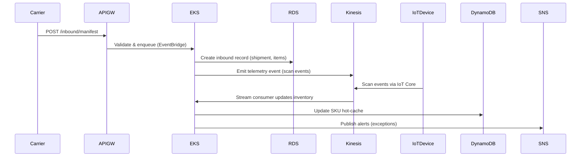

# Logistics Warehouse & Inventory Management System (AWS)

> **Complete GitHub-ready markdown**: HLD, LLD, system design, mermaid diagrams, AWS architecture diagrams, development → deployment steps, Terraform examples, CI/CD, monitoring, security, and production considerations.

---

## Table of contents

1. [Overview & Goals](#overview--goals)
2. [Real-world use case (Maersk-like)](#real-world-use-case-maersk-like)
3. [High-Level Architecture (HLD)](#high-level-architecture-hld)
4. [Mermaid Diagrams (HLD + Sequence)](#mermaid-diagrams-hld--sequence)
5. [Low-Level Design (LLD)](#low-level-design-lld)
6. [Data Model](#data-model)
7. [API Design (REST + Events)](#api-design-rest--events)
8. [Operational Workflows](#operational-workflows)
9. [AWS Services Mapping & Rationale](#aws-services-mapping--rationale)
10. [Security & Compliance](#security--compliance)
11. [Observability & Monitoring](#observability--monitoring)
12. [Development → Deployment Steps (End-to-end)](#development--deployment-steps-end-to-end)
13. [Terraform: Starter Modules & Example](#terraform-starter-modules--example)
14. [CI/CD: GitHub Actions Example](#cicd-github-actions-example)
15. [Scaling, Cost & Production Considerations](#scaling-cost--production-considerations)
16. [Appendix: Useful Commands & References](#appendix-useful-commands--references)

---

## Overview & Goals

Build a **production-ready Warehouse & Inventory Management System** for a logistics operator (think *Maersk* handling ports, yards, and warehousing) using AWS managed services. Goals:

* Real-time inventory visibility
* Scalable microservices backend
* Event-driven processes for inbound/outbound/transfer
* Integration with IoT (scanners, conveyors, RFID)
* Traceability, auditing, and alerts
* Secure, deployable via IaC (Terraform)

---

## Real-world use case (Maersk-like)

**Scenario**: Global logistics provider managing multiple warehouses and container yards. Workloads include:

* Container check-in/check-out at ports
* Pallet-level inventory in fulfillment centers
* Cross-dock (short term storage) and long-term storage
* Temperature-controlled goods (alerting/monitoring)
* B2B order fulfilment and returns

Actors:

* Yard workers with handheld scanners (offline-first mobile apps)
* Warehouse operators (web dashboard)
* External carriers / shipping partners (EDI / APIs)
* Internal analytics and planning teams

Key non-functional requirements:

* 99.9% uptime for core APIs
* 2s API latency SLO for operational endpoints
* Eventual consistency across distributed systems using events

---

## High-Level Architecture (HLD)

* **Edge / Ingress**: Amazon API Gateway for HTTP APIs + AWS IoT Core / MQTT for device telemetry
* **Compute**: EKS (Kubernetes) for microservices + Lambda for lightweight tasks
* **Storage**: RDS (Aurora PostgreSQL) as primary relational DB; DynamoDB for hot, low-latency lookups (e.g., SKU cache); S3 for object storage (documents, manifests)
* **Messaging**: SNS + SQS + EventBridge for fan-out and workflow orchestration
* **Streaming**: Kinesis Data Streams for telemetry/telemetry-replay/analytics
* **Search & Analytics**: OpenSearch for fast search; Redshift / Glue for analytics
* **Infrastructure as Code**: Terraform modules
* **CI/CD**: GitHub Actions → ECR → EKS / Lambda deploy
* **Observability**: CloudWatch (logs/metrics), X-Ray (tracing)

---

## Mermaid Diagrams (HLD + Sequence)

### HLD Diagram (Mermaid flowchart)

```mermaid
flowchart LR
  subgraph Edge
    A[Clients: Web/Mobile] -->|HTTPS| APIGW[API Gateway]
    Devices[Scanners / IoT devices] -->|MQTT| IoT[AWS IoT Core]
  end

  APIGW --> Auth[Cognito / OIDC]
  APIGW --> ALB[ALB -> EKS Service]
  APIGW --> Lambda[Lambda (webhooks, lightweight)]

  IoT --> KDS[Kinesis Data Stream]
  KDS --> Analytics[Consumer: EKS / Lambda]

  subgraph Compute
    ALB --> EKS[EKS Cluster]
    EKS --> RDS[(Aurora PostgreSQL)]
    EKS --> DynamoDB[(DynamoDB: Inventory Cache)]
    EKS --> S3[(S3: Documents / Manifests)]
    EKS --> OpenSearch[(OpenSearch)]
  end

  Lambda --> SNS[(SNS Topic: Alerts)]
  CloudWatch[(CloudWatch/AWS X-Ray)] <-- EKS
  CloudWatch <-- Lambda
  SNS --> Email[Email/SMS/Admin Ops]
  SNS --> SQS[Worker Queue (SQS)]
  SQS --> EKS

  Analytics --> Redshift[(Redshift)]
  Glue[Glue ETL] --> Redshift

  classDef awsFill fill:#f8f9fa,stroke:#333
  class APIGW,ALB,EKS,RDS,S3,DynamoDB,OpenSearch,KDS,SNS,SQS,Redshift,Glue,AWSIoT,CloudWatch awsFill
```

### Sequence: Inbound Goods Flow



---

## Low-Level Design (LLD)

### Microservice boundaries (suggested)

* **Auth Service**: JWT, Cognito integration
* **Inventory Service**: CRUD for SKUs, stock levels, reservations
* **Inbound Service**: Create inbound shipments, process ASN
* **Outbound Service**: Pick/Pack/Ship workflows
* **Warehouse Ops Service**: Yard maps, slotting, bin locations
* **Telematics Service**: IoT ingestion, telemetry processing
* **Notification Service**: SNS integration & subscription
* **Search Service**: OpenSearch wrapper for fast lookups
* **Analytics Service**: ETL and reporting

Each microservice:

* Exposes REST + gRPC internal APIs
* Publishes domain events to EventBridge / SNS
* Owns its DB schema (schema-per-service) — RDS schemas or DynamoDB tables

### Service-to-service communication

* Internal: gRPC (mTLS) over EKS Service Mesh (Istio/Linkerd or AWS App Mesh)
* Async: EventBridge + SNS + SQS

### State & Consistency patterns

* Use **sagas / orchestration** for multi-step processes (e.g., reservations → pick → ship)
* Use **read models** for eventual-consistent views (materialized in DynamoDB / OpenSearch)

---

## Data Model (Core tables)

### `sku` (RDS / Aurora)

```sql
CREATE TABLE sku (
  sku_id UUID PRIMARY KEY,
  sku_code VARCHAR(64) UNIQUE NOT NULL,
  description TEXT,
  uom VARCHAR(16),
  weight_kg NUMERIC,
  dimensions JSONB,
  created_at TIMESTAMP WITH TIME ZONE DEFAULT now()
);
```

### `inventory_snapshot` (hot cache in DynamoDB)

```json
{
  "sku_id": "uuid",
  "available_qty": 120,
  "reserved_qty": 10,
  "location": {
     "warehouse_id": "w-001",
     "bin": "A-12-03"
  },
  "last_update_ts": "2025-11-20T...Z"
}
```

### `inbound_shipment` (RDS)

```sql
CREATE TABLE inbound_shipment (
  shipment_id UUID PRIMARY KEY,
  carrier VARCHAR,
  expected_arrival TIMESTAMP,
  status VARCHAR,
  created_at TIMESTAMP
);
```

### `inventory_transaction` (audit log)

```sql
CREATE TABLE inventory_transaction (
  tx_id UUID PRIMARY KEY,
  sku_id UUID,
  qty_change INTEGER,
  type VARCHAR, -- ADJUSTMENT | INBOUND | OUTBOUND | TRANSFER
  created_by VARCHAR,
  created_at TIMESTAMP DEFAULT now(),
  meta JSONB
);
```

---

## API Design (REST + Events)

### REST endpoints (Inventory Service)

* `POST /inventory/sku` → create SKU
* `GET /inventory/sku/{sku_code}` → sku details
* `GET /inventory/sku/{sku_code}/availability` → availability (reads from DynamoDB)
* `POST /inventory/reserve` → reserve items for order (transactional)
* `POST /inventory/adjust` → manual adjustment (audited)

### Events (EventBridge / SNS)

* `inventory.reserved` (payload: sku, qty, order_id)
* `inventory.released` (payload)
* `inventory.updated` (payload)
* `shipment.arrived` (payload: shipment_id)

Producers: Inbound, Outbound, Inventory Service
Consumers: Warehouse Ops, Picking Service, Analytics

---

## Operational Workflows

### Inbound processing

1. Carrier posts ASN → inbound service creates `inbound_shipment`
2. Warehouse schedules dock slot → update shipment
3. On arrival, workers scan containers → telematics events sent to Kinesis
4. Scans processed → create `inventory_transaction` and update DynamoDB cache
5. If temperature breach → SNS alert to ops

### Outbound processing

1. Order created → Inventory Service reserves qty
2. Pick list generated → Picking Service assigns tasks
3. Scanners confirm picks → inventory_transaction reduces available qty
4. Carrier pickup → shipment.status=SHIPPED

### Transfer between warehouses

* Transfer request → reserve at source → create transfer shipment → on receipt at destination, commit transaction

---

## AWS Services Mapping & Rationale

* **AWS API Gateway (HTTP APIs)** — secure ingress, request validation, WAF
* **AWS Cognito / OIDC** — user auth for operators and partners
* **EKS (AWS Fargate nodes)** — containerized microservices, autoscaling, service mesh compatibility
* **Aurora PostgreSQL** — relational strong consistency, read replicas for reporting
* **DynamoDB** — hot inventory lookups, low-latency counters (atomic increment)
* **Kinesis Data Streams** — high-throughput telemetry and event replay
* **EventBridge + SNS + SQS** — event distribution and decoupling; SQS backs async workers
* **AWS IoT Core** — secure device connectivity (MQTT) for scanners and sensors
* **S3** — manifests, images, backup snapshots
* **OpenSearch** — search, SKU lookups, faceted queries
* **Glue / Redshift** — datawarehouse for long-term analytics
* **CloudWatch & X-Ray** — monitoring and tracing
* **Secrets Manager** — database credentials and API keys

---

## Security & Compliance

* **Network**: VPC with public/private subnets; RDS in private-only subnets; use security groups and NACLs
* **IAM**: Principle of least privilege, Roles for Services (EKS, Lambda, CodeBuild/CodeDeploy)
* **Encryption**: KMS for S3/RDS/DynamoDB encryption at rest; TLS for in-transit
* **Secrets**: AWS Secrets Manager for DB credentials; use IAM auth for Aurora where possible
* **Audit**: CloudTrail enabled, centralized logging to S3
* **Compliance**: PII masking in logs; retention policies

---

## Observability & Monitoring

* **Metrics**: CloudWatch metrics (API latency, 5xx, RDS CPU, DynamoDB throttling)
* **Logs**: Centralized logs in CloudWatch Logs; export to S3
* **Tracing**: AWS X-Ray integrated with EKS and Lambda
* **Dashboards**: CloudWatch dashboards for business KPIs (inventory health, backorders)
* **Alerts**: CloudWatch Alarms → SNS → PagerDuty/Slack/Email
* **Cost monitoring**: AWS Cost Explorer + budgets + alerts

---

## Development → Deployment Steps (End-to-end)

### 1) Developer setup

* Git repo with mono-repo or multi-repo (services per subdir)
* Local dev: docker-compose for dependent services (Postgres emulation)
* Define local environment variables and `.env.example`

### 2) Infrastructure as code

* Terraform modules for VPC, EKS, RDS, DynamoDB, S3, Kinesis, IAM
* Keep state in remote backend (S3 + DynamoDB locking)

### 3) Build & Test

* Unit tests, integration tests (containerized local), contract tests for APIs
* Contract tests for events (pact / local-run)

### 4) CI Pipeline

* Build container images → push to ECR
* Run integration tests in ephemeral environment
* Terraform plan + apply in staging (via CI role)

### 5) Deploy

* Canary deployments on EKS (Argo Rollouts or Kubernetes deployments with 10% traffic)
* DB migrations via migration job (e.g., Flyway) run as Kubernetes Job

### 6) Post-deploy

* Smoke tests, synthetic transactions
* Monitor alarms and metrics

---

## Terraform: Starter Modules & Example

> **Note**: These are simplified examples. In production, split into modules (network, compute, db, observability, iam).

### Backend config (remote state)

```hcl
# backend.tf
terraform {
  backend "s3" {
    bucket = "tf-state-your-org"
    key    = "warehouse/terraform.tfstate"
    region = "us-east-1"
    dynamodb_table = "tf-locks"
  }
}
```

### VPC (example)

```hcl
# modules/vpc/main.tf
resource "aws_vpc" "main" {
  cidr_block = var.cidr
  tags = { Name = "wms-vpc" }
}

resource "aws_subnet" "private" {
  count = 2
  vpc_id = aws_vpc.main.id
  cidr_block = cidrsubnet(aws_vpc.main.cidr_block, 8, count.index)
  availability_zone = data.aws_availability_zones.available.names[count.index]
}
```

### EKS cluster (example)

```hcl
module "eks" {
  source          = "terraform-aws-modules/eks/aws"
  cluster_name    = "wms-eks-cluster"
  cluster_version = "1.27"
  subnet_ids      = module.vpc.private_subnets
  vpc_id          = module.vpc.vpc_id
  node_groups = {
    wms_nodes = {
      desired_capacity = 3
      max_capacity     = 6
      instance_type    = "t3.medium"
    }
  }
}
```

### Aurora (RDS) example

```hcl
resource "aws_rds_cluster" "aurora" {
  cluster_identifier = "wms-aurora"
  engine = "aurora-postgresql"
  engine_version = "15.2"
  master_username = var.db_user
  master_password = var.db_pass
  skip_final_snapshot = true
  vpc_security_group_ids = [module.vpc.rds_sg_id]
}
```

### DynamoDB (inventory cache)

```hcl
resource "aws_dynamodb_table" "inventory_cache" {
  name           = "inventory-cache"
  billing_mode   = "PAY_PER_REQUEST"
  hash_key       = "sku_id"
  attribute {
    name = "sku_id"
    type = "S"
  }
}
```

---

## CI/CD: GitHub Actions Example

`.github/workflows/ci-cd.yml`

```yaml
name: CI/CD
on: [push]

jobs:
  build:
    runs-on: ubuntu-latest
    steps:
      - uses: actions/checkout@v4
      - name: Set up JDK
        uses: actions/setup-java@v4
        with: java-version: '17'

      - name: Build Docker Image
        run: |
          docker build -t ${{ env.ECR_REGISTRY }}/${{ env.SERVICE }}:${{ github.sha }} ./services/${{ env.SERVICE }}

      - name: Login to ECR
        uses: aws-actions/amazon-ecr-login@v1

      - name: Push to ECR
        run: |
          docker tag ...
          docker push ...

  deploy-staging:
    needs: build
    runs-on: ubuntu-latest
    steps:
      - name: Terraform Init/Apply
        uses: hashicorp/terraform-github-actions@v1
        with:
          tf_actions_working_dir: ./infra
        env:
          AWS_ACCESS_KEY_ID: ${{ secrets.AWS_ACCESS_KEY_ID }}
          AWS_SECRET_ACCESS_KEY: ${{ secrets.AWS_SECRET_ACCESS_KEY }}

      - name: Update K8s Deployment
        uses: azure/setup-kubectl@v3
        with:
          version: '1.27.3'
        env:
          KUBECONFIG: ${{ secrets.KUBECONFIG_STAGING }}
        run: |
          kubectl set image deploy/${{ env.DEPLOYMENT }} ${ { env.CONTAINER }}=${{ env.ECR_REGISTRY }}/${{ env.SERVICE }}:${{ github.sha }}
```

---

## Scaling, Cost & Production Considerations

* **Autoscaling**: EKS HPA + Cluster Autoscaler; Aurora Serverless for unpredictable workloads
* **Cold-starts**: Use provisioned concurrency for Lambda if used for critical paths
* **Cost**: Use Savings Plans / Reserved Instances for baseline compute; use lifecycle policies for S3; DynamoDB autoscaling and on-demand
* **DR**: cross-region read replica for Aurora, S3 cross-region replication, Route53 failover
* **Backups**: automated RDS snapshots, S3 versioning

---

## Appendix: Useful Commands & References

* `kubectl` for cluster ops
* `aws eks update-kubeconfig --name wms-eks-cluster --region us-east-1`
* `psql` connect to Aurora via bastion host
* Terraform docs: [https://registry.terraform.io/](https://registry.terraform.io/)
* AWS Well-Architected: [https://wa.amazon.com](https://wa.amazon.com)

---
Great — here’s a focused, practical guide showing **how applications connect to API Gateway → EKS → RDS**, plus **networking and security** for **SNS / SQS**. I’ll show the common production patterns, configuration items you must create, and concrete security recommendations (SGs, IAM, VPC endpoints, KMS). I include short examples and point you to authoritative docs for the important bits.

I’ll cover three production patterns for ingress, then EKS → DB connectivity, then SNS/SQS security.

---

# 1) How API Gateway talks to services running on EKS — 3 production patterns

Which pattern you use depends on your visibility, integration type, and security posture.

### Pattern A — Public API Gateway → Internet-facing ALB → EKS (Ingress Controller)

* API Gateway is public (regional/edge) and forwards traffic to a public **Application Load Balancer (ALB)** (internet-facing) in front of EKS.
* ALB routes to Kubernetes Service (via AWS Load Balancer Controller), which sends to pods.
* Use for public APIs that can be exposed directly to the internet and where ALB can handle path-based routing, WAF, TLS termination.

**When to use:** simple public APIs, want ALB path-based routing, WAF, web ACLs.

**Network items:**

* ALB in *public subnets* (with public IPs).
* EKS worker nodes & pods in *private subnets* (ALB forwards to nodes/pods).
* Security Group: ALB SG allows inbound 443/80 from 0.0.0.0/0 (or restricted), worker SG allows inbound from ALB SG on node port / target port.

**Docs:** ALB + ALB ingress controller pattern is standard (ALB via AWS Load Balancer Controller). ([Repost][1])

---

### Pattern B — API Gateway Private Integration (VPC Link) → NLB → EKS (private)

* Create a **VPC Link** in API Gateway and attach it to a **Network Load Balancer (NLB)** (or ALB in some HTTP API private integration cases).
* NLB is internal (private) and routes to EKS services (target type can be IP for pod IPs or instance IDs).
* API Gateway becomes the public API endpoint but traffic to backend stays within your VPC via the VPC Link; backend is not public.

**When to use:** you want API Gateway as public gateway but keep services private inside VPC; better isolation.

**Network items:**

* NLB in the same VPC subnets as EKS (usually private subnets with ENIs).
* VPC Link creates ENIs in selected subnets.
* NLB target group can be IP targets (pod ENIs) if you use the AWS NLB target IP mode supported by the AWS Load Balancer Controller.
* Security groups: NLB uses no SG (NLB is L4), but pods/instances must accept traffic from NLB's source (NLB will use node/pod IPs).

**Important:** For REST APIs, API Gateway private integration traditionally uses NLB. For HTTP APIs, ALB private integrations may be possible — check API Gateway VPC Link docs for supported combos. ([AWS Documentation][2])

---

### Pattern C — API Gateway → Lambda proxy → internal EKS service (via VPC access)

* API Gateway triggers Lambda functions (public). Those Lambdas run inside your VPC (or have access via ENI) and call internal EKS services (service-to-service) or call RDS.
* Use when you prefer Lambda as a control plane/edge that performs auth/composition before hitting EKS.

**When to use:** small orchestration, API composition, or when you want simpler deployment surface.

**Considerations:** Lambda in VPC causes ENI creation and cold-start increases — mitigate with provisioned concurrency if needed.

---

# 2) VPC & Subnet layout (recommended production layout)

```
VPC (10.0.0.0/16)
├─ Public Subnets (3 AZs)        -> ALB/NATGW (if ALB internet-facing)
├─ Private App Subnets (3 AZs)   -> EKS worker nodes (private)
├─ Private DB Subnets (3 AZs)    -> RDS (no public access)
└─ Isolated/Management Subnets   -> Bastion, backups
```

Network essentials:

* **EKS nodes/pods:** in *private subnets*. Use AWS Load Balancer Controller for ALB/NLB integration.
* **ALB**: Typically in *public subnets* (internet-facing). If ALB is internal, place in private subnets.
* **NAT Gateway** in public subnets for egress (pods needing internet access e.g., for image pulls).
* **RDS** in private DB subnets, no public access.
* **Route tables**: ensure private subnets route internet-bound traffic via NAT Gateway in public subnets.

---

# 3) Security Groups and flow examples (concrete)

### Basic SGs and rules (3 SGs)

1. **SG-ALB** (if internet ALB)

   * Inbound: 443 from `0.0.0.0/0` (or narrow to API Gateway IP ranges if desired)
   * Outbound: all (or to SG-EKS on app ports)

2. **SG-EKS-nodes / SG-pods**

   * Inbound: app port (e.g., 8080) from **SG-ALB** (or NLB source)
   * Outbound: 5432 -> SG-RDS (for DB), or to Secrets Manager endpoints

3. **SG-RDS**

   * Inbound: 5432 from **SG-EKS-nodes** (and optionally CI bastion SG)
   * Outbound: restricted as needed

**Notes:**

* Use SG references (SG id) for better manageability (e.g., SG-RDS allows inbound from SG-EKS).
* If using NLB (pass-through), ensure EKS pods accept traffic from NLB -> can use target IP or node target with proper SGs.

---

# 4) EKS → RDS connectivity (best practices & concrete steps)

**Primary goals:** secure private connectivity, close control over DB credentials, avoid connection storms, handle pooling.

### Steps & recommendations

1. **Put RDS in private subnets** and *disable public access*.
2. **Create SG-RDS** which allows inbound on DB port (e.g., 5432) only from **SG-EKS-nodes** (or the SG of the EKS node group / NLB).
3. **Use Secrets Manager** to store DB credentials — do **not** bake credentials into containers. Use IAM roles to grant access. Docs: Secrets Manager + EKS integration patterns. ([AWS Documentation][3])
4. **Use IAM DB authentication** (Aurora/Postgres supports it) or regular credentials — IAM auth reduces static secrets.
5. **Use RDS Proxy** in front of RDS when you have many short-lived connections (serverless pods or many replicas). RDS Proxy pools connections and prevents DB overload.
6. **Service account IAM (IRSA)** — give your pod/service an IAM role (via IRSA) to read only the Secrets Manager secret. This avoids node-level AWS credentials. ([AWS Documentation][4])
7. **Network path** — EKS pod → Node local routing → private subnet → SG-RDS. If you use Pod ENI mode (AWS CNI with prefix delegation) pods have their own IPs and SGs can be applied at node level still — consider security implications.
8. **TLS** — enforce DB TLS/SSL connections (verify server cert), and encrypt RDS at rest with KMS.

**Example minimal IAM trust / pod access flow**

* Create IAM role `eks-inventory-role` with policy `secretsmanager:GetSecretValue` on the DB secret.
* Annotate Kubernetes ServiceAccount with that IAM role ARN (IRSA).
* Pods using that ServiceAccount can fetch DB creds at runtime.

**Doc references:** IRSA details and Secrets Manager usage. ([AWS Documentation][4])

---

# 5) SNS / SQS — secure design & configuration

You will use SNS for fan-out/alerts and SQS for buffering/backpressure.

### Security goals

* Keep messaging traffic off the public internet when possible.
* Restrict who can publish/subscribe.
* Encrypt messages at rest and control KMS keys.

### Concrete controls

1. **VPC Endpoints (Interface endpoints)**

   * Create **Interface VPC Endpoints** (AWS PrivateLink) for SNS and SQS so traffic from EKS to SNS/SQS doesn’t go over the public internet. This gives private connectivity from your VPC to SNS/SQS. (AWS supports VPC endpoints for SNS/SQS.) ([AWS Documentation][5])

2. **Server-side encryption (SSE)** with **KMS**

   * Enable SSE for SQS and SNS using a customer-managed KMS key to control who can decrypt messages. Example docs for SQS/SNS SSE. ([AWS Documentation][6])

3. **Resource policies + IAM**

   * Apply **resource policies** on SNS topics and SQS queues to restrict access by:

     * Principal (IAM roles / accounts)
     * Source VPC Endpoint ID (deny requests not via your VPC endpoint)
     * Source IP (in case you must)
   * Example: Deny `SendMessage` unless `aws:SourceVpce == vpce-xxxx`.

4. **Queue encryption + access**

   * For SQS, enable SSE and restrict who can `SendMessage`, `ReceiveMessage`. Use IAM roles for services (IRSA) to allow only the EKS pods/service account to publish or consume.

5. **Avoid public topics/queues**

   * Do not expose SNS topics for anonymous publishing. Always use authenticated calls (IAM).

6. **Audit & Monitoring**

   * Enable CloudWatch metrics and CloudTrail for SNS/SQS usage for auditing and anomaly detection.

**Docs:** SQS internetwork privacy & SSE docs. ([AWS Documentation][7])

---

# 6) IAM patterns that secure EKS <-> AWS services

1. **IRSA (IAM Roles for Service Accounts)**

   * Attach minimal IAM policy to a role and map it to a Kubernetes ServiceAccount. This role is assumed by pods and gives fine-grained privileges (e.g., `sqs:SendMessage` on a specific queue, `secretsmanager:GetSecretValue` for one secret). ([AWS Documentation][4])

2. **Least privilege policies**

   * Grant the pod exactly the actions and resource ARNs it needs (e.g., `sqs:SendMessage` only for `arn:aws:sqs:...:my-queue`).

3. **KMS key policies**

   * If you use a CMK for SNS/SQS encryption, include the IAM roles that need decrypt permissions in the key policy — not just IAM policies.

4. **Network-level restrictions**

   * Combine IAM restrictions with VPC endpoint policies to ensure traffic must come from your VPC.

---

# 7) Example resource policy snippet (SQS) — deny access unless via VPC endpoint

```json
{
  "Version": "2012-10-17",
  "Id": "RestrictByVpce",
  "Statement": [
    {
      "Sid": "DenyNotFromVpce",
      "Effect": "Deny",
      "Principal": "*",
      "Action": "sqs:*",
      "Resource": "arn:aws:sqs:us-east-1:123456789012:my-queue",
      "Condition": {
        "StringNotEquals": {
          "aws:SourceVpce": "vpce-0abcd1234efgh5678"
        }
      }
    }
  ]
}
```

Use a similar approach for SNS topic policies (conditions support `aws:SourceVpce`). Docs show sample patterns. ([AWS Documentation][7])

---

# 8) Practical checklist — create and wire up components securely

1. **Infrastructure**

   * Create VPC (public/private/db subnets) + NAT + IGW.
   * Create EKS cluster in private subnets (node groups in private subnets).
   * Create RDS cluster in DB subnets (private, no public access).
   * Create ALB (internet-facing) or NLB (internal) depending on chosen pattern.
   * Create API Gateway (Regional or Edge for public; create VPC Link if private integration).

     * If using VPC Link, create an NLB and register backend (NLB → EKS targets). ([AWS Documentation][2])

2. **Network & Security**

   * Security groups: ALB → EKS → RDS using SG references.
   * Enable VPC endpoints for SQS/SNS (Interface endpoints).
   * Add VPC endpoint policies (limit to principals).
   * Create KMS keys for SNS/SQS encryption and RDS (if using custom key).
   * Configure Secrets Manager for DB credentials + IAM role for access (IRSA).

3. **EKS / App config**

   * Install AWS Load Balancer Controller for ALB/NLB integration.
   * Configure ServiceAccount + IRSA role for pods that need AWS API access.
   * Use Secrets Store CSI driver or ASCP to mount Secrets Manager secrets into pods securely. ([AWS Documentation][3])
   * Use RDS Proxy for pooled DB connections.

4. **Messaging**

   * Create SNS topics, SQS queues, configure encryption and access policies.
   * Use EventBridge for higher-level event routing if needed.

5. **Monitoring & Audit**

   * CloudWatch Logs / X-Ray for tracing.
   * CloudTrail for API audit.

---

# 9) Quick reference links (authoritative)

* API Gateway private integrations / VPC link docs. ([AWS Documentation][8])
* Set up NLB for API Gateway VPC Link. ([AWS Documentation][2])
* API Gateway + EKS integration blog / pattern. ([Amazon Web Services, Inc.][9])
* EKS IAM Roles for Service Accounts (IRSA). ([AWS Documentation][4])
* Secrets Manager + EKS integration (ASCP/CSI). ([AWS Documentation][3])
* SQS & SNS encryption and VPC endpoints docs. ([AWS Documentation][6])

---

# 10) If you want, next steps I can do for you (pick any)

* Generate a **diagram** showing the exact pattern you want (ALB vs NLB private) and produce a downloadable PNG.
* Provide **Terraform module** examples for: VPC → EKS → ALB/NLB → API Gateway VPC Link → RDS → VPC endpoints.
* Give **Kubernetes YAML/Helm** for exposing services to ALB/NLB + ServiceAccount IRSA example + SecretsProvider config.
* Produce sample **IAM policies** for a pod that publishes to SNS and reads DB credentials.

Below is a **clear, production-grade explanation** of:

1. **How an ALB is configured for EKS**
2. **How ALB knows pod IP addresses** (via AWS Load Balancer Controller)
3. **How pods securely connect to databases (Aurora/RDS)**

Everything explained with real AWS behavior, no hand-waving.

---

# ✅ 1. How ALB is Configured for EKS

In AWS EKS, you **do not manually configure ALB**.
Instead, you install an operator called:

### **AWS Load Balancer Controller (LBC)**

This controller:

* Watches your Kubernetes **Ingress** objects
* Automatically creates:

  * **Application Load Balancers (ALB)**
  * **Listeners**
  * **Target Groups**
  * **Health checks**
  * **Rules**

You only define **Ingress YAML** with annotations, and Kubernetes + LBC build everything for you.

---

## 🔧 **Example Ingress YAML that creates an ALB**

```yaml
apiVersion: networking.k8s.io/v1
kind: Ingress
metadata:
  name: inventory-ingress
  annotations:
    kubernetes.io/ingress.class: alb
    alb.ingress.kubernetes.io/scheme: internet-facing
    alb.ingress.kubernetes.io/target-type: ip
    alb.ingress.kubernetes.io/listen-ports: '[{"HTTPS":443}]'
spec:
  rules:
    - http:
        paths:
          - path: /inventory
            pathType: Prefix
            backend:
              service:
                name: inventory-service
                port:
                  number: 8080
```

### What happens automatically:

| Component                           | Created by |
| ----------------------------------- | ---------- |
| ALB (internet-facing)               | LBC        |
| Listener on port 443                | LBC        |
| Target Group                        | LBC        |
| Health check on `/`                 | LBC        |
| Security Group for ALB              | LBC        |
| SG rules to allow ALB to reach pods | LBC        |

---

# ✅ 2. How ALB Knows Pod IP Addresses

### KEY POINT:

**ALB discovers pod IPs through the Kubernetes API**, not via EC2 or VPC discovery.

When you use:

```
alb.ingress.kubernetes.io/target-type: ip
```

The Load Balancer Controller:

1. Reads Kubernetes Service → Endpoints
2. Reads Endpoints → Pod IP addresses
3. Registers those pod IPs in the ALB Target Group
4. Continuously watches for:

   * New pods
   * Deleted pods
   * Pods failing readiness/liveness checks

### 🔁 Continuous Sync Loop

The controller keeps ALB target groups in sync with Kubernetes pods.

---

## 🔎 Sequence: How ALB gets Pod IPs

```
You create Ingress →
AWS LBC sees it →
LBC reads Service (ClusterIP) →
LBC reads EndpointSlice →
LBC extracts pod IP + port →
LBC registers pod IP as ALB Target →
ALB starts health checks →
Traffic flows to healthy pods
```

### Example EndpointSlice (behind the scenes)

```yaml
endpoints:
  - addresses: ["10.1.40.21"]
  - addresses: ["10.1.41.14"]
ports:
  - port: 8080
```

These IPs get added to the ALB target group automatically.

---

# 🧠 Why ALB Target Type = `ip` is better?

| Target Type | Works With       | Notes                                                      |
| ----------- | ---------------- | ---------------------------------------------------------- |
| **ip**      | Pod IPs          | Best for EKS because it supports native pod-level routing. |
| instance    | Worker node EC2s | Then kube-proxy must forward traffic → less efficient.     |

**Use IP mode always for EKS** unless you have legacy reasons.

---

# ✅ 3. How Pods Connect Securely to Databases (Aurora/RDS)

You must secure database access at **multiple layers**:

---

# 🔐 **A) Network Security (VPC + Security Groups)**

### Architecture

```
Pod (EKS Private Subnet)
     ↓
Security Group (SG-EKS)
     ↓
RDS SG (allow from SG-EKS only)
     ↓
RDS Instance (Private Subnet)
```

### RDS inbound rule

```
Port 5432 (Postgres)
Source: SG-EKS (NOT 0.0.0.0/0)
```

Pods inside the EKS node SG can connect; everything else is blocked.

---

# 🔐 **B) Authentication (Best Practice: IRSA + Secrets Manager)**

Use IAM Roles for Service Accounts:

1. Create an IAM role
2. Attach policy to allow access to **one specific secret**
3. Map IAM role to Kubernetes ServiceAccount

### ServiceAccount example:

```yaml
apiVersion: v1
kind: ServiceAccount
metadata:
  name: inventory-sa
  annotations:
    eks.amazonaws.com/role-arn: arn:aws:iam::123456789012:role/inventory-app-role
```

Pods using this SA assume the IAM role.

### DB credentials are retrieved securely at runtime from:

* **AWS Secrets Manager**, or
* **IAM DB Authentication (Aurora)** → no passwords at all

---

# 🔐 **C) Encryption (TLS + KMS)**

1. Enable **TLS/SSL connection** (Postgres `verify-full`)
2. Enable **RDS encryption at rest with KMS**
3. Store sensitive info in Secrets Manager encrypted with KMS

---

# 🔐 **D) RDS Proxy (Highly recommended)**

Prevents:

* Too many connections from bursty pods
* Cold start connection storms
* DB overload

Flow:

```
Pod → RDS Proxy → RDS Instance
```

RDS Proxy also uses IAM to manage credentials automatically.

---

# 🔄 Example secure DB connection string (with SSL)

```
postgres://db_user:@myproxy.proxy-c8fe1234.us-east-1.rds.amazonaws.com:5432/inventory?sslmode=require
```

---

# 🔥 Putting It All Together (Architecture Overview)

```
        Internet
           |
        ALB (Public)
           |
           v
      EKS Ingress
           |
   Kubernetes Service
           |
          Pods -------+
           |           \
           |            \--> Secrets Manager (via IRSA + IAM)
           |
           v
   RDS Proxy (optional)
           |
           v
   Aurora PostgreSQL (Private Subnets)
```

---

# 🧰 Summary (Simple & Clear)

### **How ALB works with EKS**

* ALB is automatically created via AWS Load Balancer Controller.
* Controller reads pod IPs from Kubernetes (EndpointSlices).
* Registers pod IPs into ALB target groups.
* Auto-heals and auto-updates target groups on pod changes.

### **How Pods securely connect to RDS**

* Pods in private subnets → RDS in private DB subnets.
* Allow only SG-EKS → SG-RDS on port 5432.
* Use IRSA → IAM role → Secrets Manager (no hardcoded creds).
* Enable SSL + KMS.
* Use RDS Proxy for stability.

---

---
