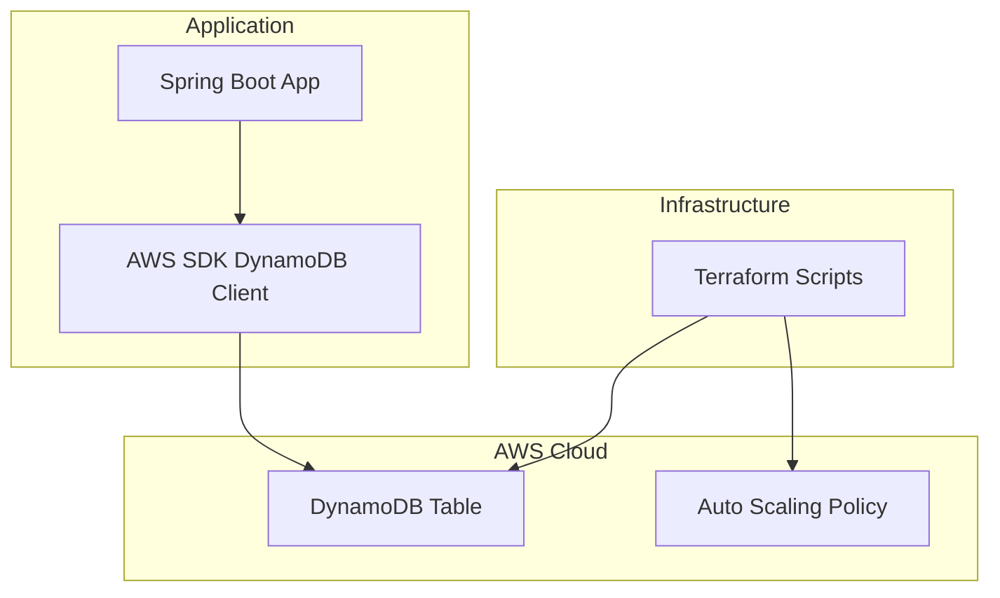

Perfect ✅ — here’s the **complete GitHub-style documentation** (`README.md`) you can directly put in your repository for **Terraform + Spring Boot + DynamoDB integration** with scaling and real-world use cases.

---

# 🧩 **DynamoDB with Terraform & Spring Boot Integration**

This repository demonstrates how to set up **Amazon DynamoDB** using **Terraform**, integrate it into a **Spring Boot** application using the **AWS SDK**, and configure **auto-scaling** for production-ready performance.

---

## 📘 **Overview**

**Amazon DynamoDB** is a **fully managed, serverless NoSQL database** that delivers high performance at scale.
With **Terraform**, we can automate infrastructure provisioning, and with **Spring Boot**, we can easily connect and perform CRUD operations.

---

## 🏗️ **Architecture**



---

## ⚙️ **Project Structure**

```
dynamodb-terraform-springboot/
│
├── terraform/
│   ├── main.tf
│   ├── variables.tf
│   ├── outputs.tf
│
├── springboot-app/
│   ├── src/main/java/com/example/dynamo/
│   │   ├── config/DynamoDBConfig.java
│   │   ├── controller/UserController.java
│   │   ├── service/UserService.java
│   │   ├── model/User.java
│   │   └── DynamoDbApp.java
│   └── pom.xml
│
└── README.md
```

---

## ☁️ **1. Terraform Configuration**

### 📄 `main.tf`

```hcl
provider "aws" {
  region = "ap-south-1"
}

resource "aws_dynamodb_table" "users_table" {
  name           = "Users"
  billing_mode   = "PAY_PER_REQUEST"  # On-demand scaling
  hash_key       = "UserId"

  attribute {
    name = "UserId"
    type = "S"
  }

  attribute {
    name = "Email"
    type = "S"
  }

  global_secondary_index {
    name            = "EmailIndex"
    hash_key        = "Email"
    projection_type = "ALL"
  }

  tags = {
    Environment = "dev"
    Name        = "users-table"
  }
}
```

### 💡 To Deploy:

```bash
cd terraform
terraform init
terraform plan
terraform apply
```

This creates a **DynamoDB table** named `Users` with an **EmailIndex (GSI)**.

---

## ⚖️ **2. Auto Scaling Configuration (Optional)**

To handle unpredictable workloads, enable auto-scaling if using provisioned mode.

```hcl
resource "aws_appautoscaling_target" "read_target" {
  max_capacity       = 100
  min_capacity       = 5
  resource_id        = "table/Users"
  scalable_dimension = "dynamodb:table:ReadCapacityUnits"
  service_namespace  = "dynamodb"
}

resource "aws_appautoscaling_policy" "read_policy" {
  name               = "DynamoDBReadAutoScaling"
  policy_type        = "TargetTrackingScaling"
  resource_id        = aws_appautoscaling_target.read_target.resource_id
  scalable_dimension = aws_appautoscaling_target.read_target.scalable_dimension
  service_namespace  = aws_appautoscaling_target.read_target.service_namespace

  target_tracking_scaling_policy_configuration {
    target_value       = 70
    predefined_metric_specification {
      predefined_metric_type = "DynamoDBReadCapacityUtilization"
    }
  }
}
```

---

## ☕ **3. Spring Boot Configuration**

### 📄 `pom.xml`

```xml
<dependencies>
    <dependency>
        <groupId>software.amazon.awssdk</groupId>
        <artifactId>dynamodb</artifactId>
    </dependency>
    <dependency>
        <groupId>org.springframework.boot</groupId>
        <artifactId>spring-boot-starter-web</artifactId>
    </dependency>
</dependencies>
```

---

### 📄 `DynamoDBConfig.java`

```java
package com.example.dynamo.config;

import org.springframework.context.annotation.Bean;
import org.springframework.context.annotation.Configuration;
import software.amazon.awssdk.regions.Region;
import software.amazon.awssdk.services.dynamodb.DynamoDbClient;
import software.amazon.awssdk.auth.credentials.DefaultCredentialsProvider;

@Configuration
public class DynamoDBConfig {

    @Bean
    public DynamoDbClient dynamoDbClient() {
        return DynamoDbClient.builder()
                .region(Region.AP_SOUTH_1)
                .credentialsProvider(DefaultCredentialsProvider.create())
                .build();
    }
}
```

---

### 📄 `User.java`

```java
package com.example.dynamo.model;

import lombok.AllArgsConstructor;
import lombok.Data;
import lombok.NoArgsConstructor;

@Data
@NoArgsConstructor
@AllArgsConstructor
public class User {
    private String userId;
    private String name;
    private String email;
}
```

---

### 📄 `UserService.java`

```java
package com.example.dynamo.service;

import org.springframework.stereotype.Service;
import software.amazon.awssdk.services.dynamodb.DynamoDbClient;
import software.amazon.awssdk.services.dynamodb.model.*;
import com.example.dynamo.model.User;
import java.util.HashMap;
import java.util.Map;

@Service
public class UserService {
    private final DynamoDbClient dynamoDbClient;
    private final String tableName = "Users";

    public UserService(DynamoDbClient dynamoDbClient) {
        this.dynamoDbClient = dynamoDbClient;
    }

    public void saveUser(User user) {
        Map<String, AttributeValue> item = new HashMap<>();
        item.put("UserId", AttributeValue.builder().s(user.getUserId()).build());
        item.put("Name", AttributeValue.builder().s(user.getName()).build());
        item.put("Email", AttributeValue.builder().s(user.getEmail()).build());

        dynamoDbClient.putItem(PutItemRequest.builder()
                .tableName(tableName)
                .item(item)
                .build());
    }

    public User getUser(String userId) {
        GetItemRequest request = GetItemRequest.builder()
                .tableName(tableName)
                .key(Map.of("UserId", AttributeValue.builder().s(userId).build()))
                .build();

        Map<String, AttributeValue> item = dynamoDbClient.getItem(request).item();
        if (item == null || item.isEmpty()) {
            return null;
        }
        return new User(
                item.get("UserId").s(),
                item.get("Name").s(),
                item.get("Email").s()
        );
    }
}
```

---

### 📄 `UserController.java`

```java
package com.example.dynamo.controller;

import org.springframework.web.bind.annotation.*;
import com.example.dynamo.service.UserService;
import com.example.dynamo.model.User;

@RestController
@RequestMapping("/api/users")
public class UserController {
    private final UserService userService;
    
    public UserController(UserService userService) {
        this.userService = userService;
    }

    @PostMapping
    public String addUser(@RequestBody User user) {
        userService.saveUser(user);
        return "User saved successfully!";
    }

    @GetMapping("/{id}")
    public User getUser(@PathVariable String id) {
        return userService.getUser(id);
    }
}
```

---

## 🌐 **4. Run the Application**

```bash
cd springboot-app
mvn spring-boot:run
```

Test API using Postman:

**POST** `/api/users`

```json
{
  "userId": "U101",
  "name": "Sathish",
  "email": "sathish@example.com"
}
```

**GET** `/api/users/U101`
Response:

```json
{
  "userId": "U101",
  "name": "Sathish",
  "email": "sathish@example.com"
}
```

---

## 📈 **5. Scaling and Performance Tips**

| Feature                             | Description                                                             |
| ----------------------------------- | ----------------------------------------------------------------------- |
| **On-Demand Mode**                  | Auto-scales based on traffic (recommended for unpredictable workloads). |
| **Provisioned Mode + Auto Scaling** | Set min/max read/write capacity.                                        |
| **DAX (DynamoDB Accelerator)**      | In-memory cache for high read throughput.                               |
| **PITR (Point-in-Time Recovery)**   | Backup every second for up to 35 days.                                  |
| **Global Tables**                   | Multi-region replication for low-latency access worldwide.              |

---

## 🧠 **6. Real-World Use Cases**

| Use Case                     | Example              | Why DynamoDB?                            |
| ---------------------------- | -------------------- | ---------------------------------------- |
| **E-commerce Orders**        | Amazon, Flipkart     | High concurrency, real-time order status |
| **Gaming Leaderboards**      | PUBG, Clash of Clans | Low latency score updates                |
| **IoT Sensor Data**          | Smart homes, Tesla   | Millions of writes per second            |
| **Chat Applications**        | WhatsApp, Slack      | High throughput & flexible schema        |
| **Microservice Cache Layer** | Netflix Metadata     | Serverless, low-latency lookups          |

---

## 🔐 **7. Security & IAM**

* Use **IAM roles** for your EC2, Lambda, or ECS tasks to access DynamoDB.
* Example policy:

```json
{
  "Version": "2012-10-17",
  "Statement": [
    {
      "Effect": "Allow",
      "Action": [
        "dynamodb:PutItem",
        "dynamodb:GetItem",
        "dynamodb:Query",
        "dynamodb:Scan"
      ],
      "Resource": "arn:aws:dynamodb:ap-south-1:123456789012:table/Users"
    }
  ]
}
```

---

## 🚀 **8. Summary**

| Step    | Description                           |
| ------- | ------------------------------------- |
| **1️⃣** | Provision DynamoDB with Terraform     |
| **2️⃣** | Configure IAM and AWS SDK credentials |
| **3️⃣** | Connect Spring Boot app using AWS SDK |
| **4️⃣** | Enable Auto Scaling or On-Demand Mode |
| **5️⃣** | Use DAX and GSIs for performance      |
| **6️⃣** | Apply IAM least privilege policies    |

---

## 🧾 **References**

* [AWS DynamoDB Docs](https://docs.aws.amazon.com/amazondynamodb/)
* [Spring Data for DynamoDB (Community)](https://github.com/boostchicken/spring-data-dynamodb)
* [Terraform AWS DynamoDB Resource](https://registry.terraform.io/providers/hashicorp/aws/latest/docs/resources/dynamodb_table)
* [AWS SDK for Java v2](https://docs.aws.amazon.com/sdk-for-java/latest/developer-guide/home.html)

---

Would you like me to also add **a “serverless version”** (Spring Boot → Lambda → DynamoDB) section next — showing how to run it without EC2 or servers, using AWS Lambda and API Gateway with Terraform?
That’s often how modern production apps use DynamoDB efficiently.
