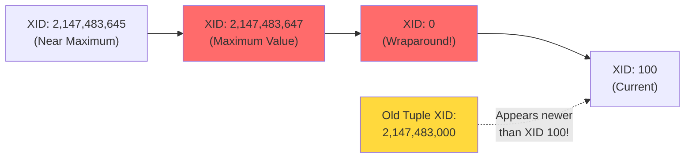
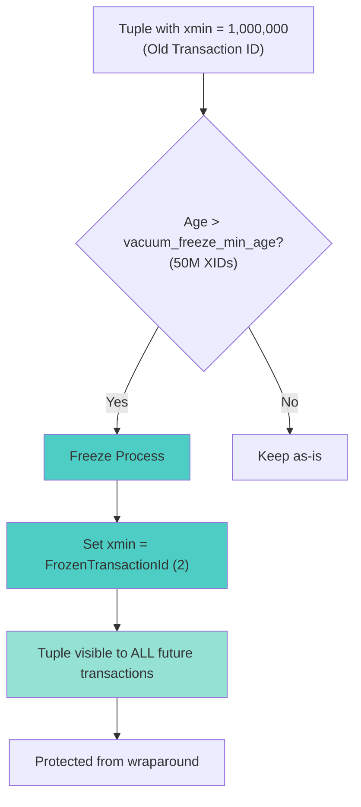
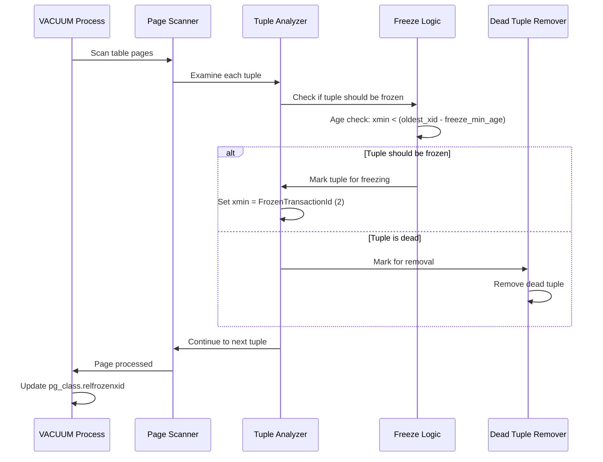
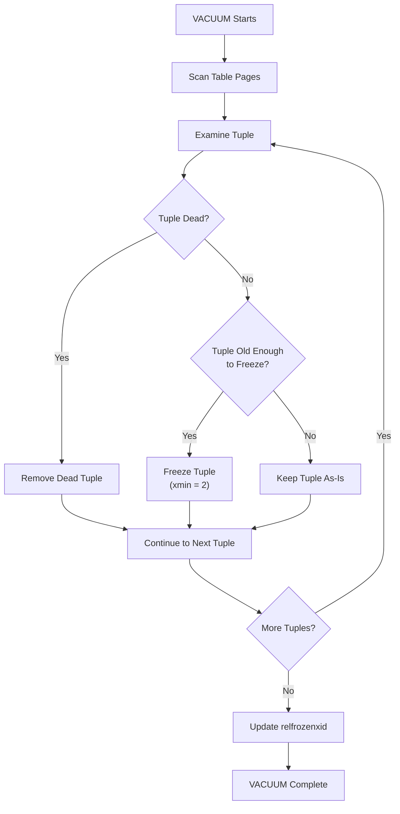
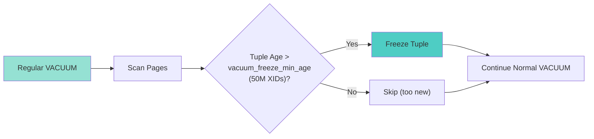
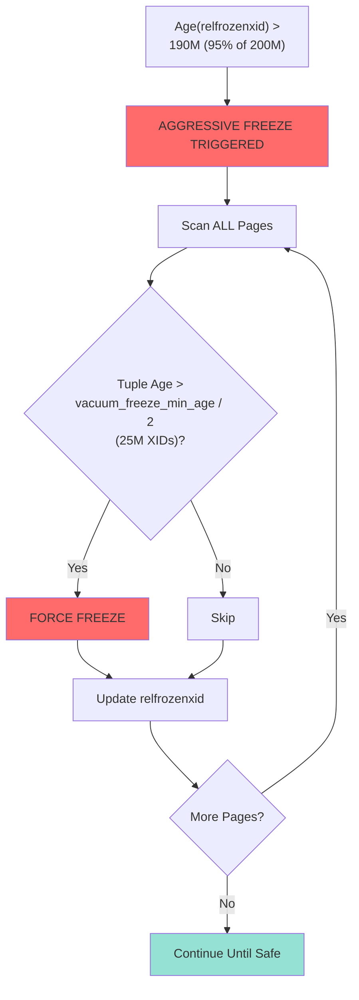
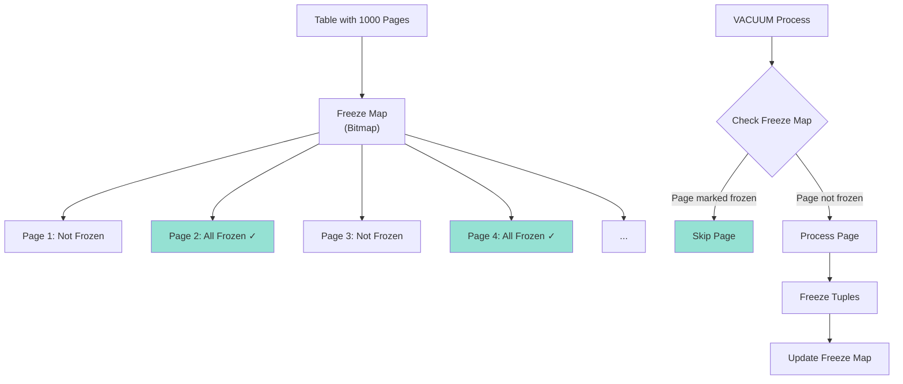
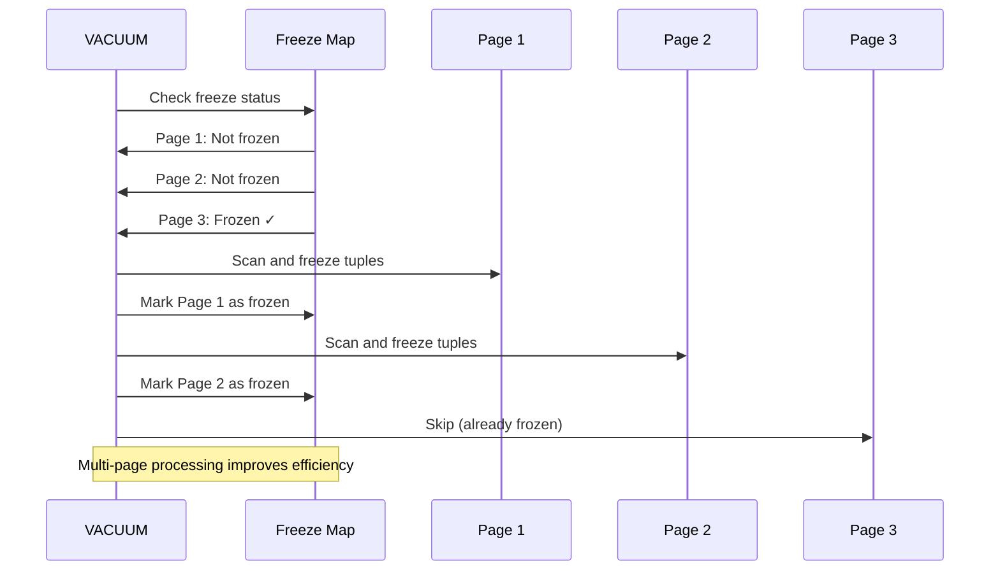

# 🧊 Advanced PostgreSQL Concepts: Transaction ID Management & Freezing

This document covers **five niche but critical PostgreSQL concepts** related to transaction ID management, freezing, and VACUUM operations. Understanding these concepts is essential for database administrators working with long-running PostgreSQL databases and high-transaction workloads.

---

## 📋 Table of Contents

1. [Transaction Wraparound Problem](#1-transaction-wraparound-problem)
2. [Transaction ID Freezing](#2-transaction-id-freezing)
3. [Integration of Freezing Logic in VACUUM](#3-integration-of-freezing-logic-in-vacuum)
4. [Aggressive Freezing vs. Lazy Freezing](#4-aggressive-freezing-vs-lazy-freezing)
5. [Multi-page Freezing and Freeze Map Maintenance](#5-multi-page-freezing-and-freeze-map-maintenance)

---

## 1. Transaction Wraparound Problem

### 🎯 What is the Transaction Wraparound Problem?

PostgreSQL uses a **32-bit transaction ID (XID)** system, which provides approximately **2.1 billion unique transaction IDs** (2³¹ - 1, since one bit is reserved for the sign). When transaction IDs reach the maximum value, they **wrap around** to 0, creating a critical problem for visibility checks.

### ⚠️ Why is This a Problem?

PostgreSQL uses transaction IDs to determine tuple visibility:
- **`xmin`**: The transaction ID that created the tuple
- **`xmax`**: The transaction ID that deleted/updated the tuple
- **Visibility rules**: A tuple is visible to transaction T if `xmin < T < xmax` (simplified)

When XIDs wrap around, older transactions could appear "newer" than current ones, breaking visibility semantics.

#### Example Scenario

```
Initial State:
- Current XID: 2,147,483,645 (near max 32-bit value)
- Tuple created by XID: 2,147,483,000
- New transaction starts with XID: 2,147,483,650

After Wraparound:
- XIDs exhausted, wraparound occurs
- Next XID becomes: 100 (wraps to start)
- Current XID: 100
- Old tuple created by XID: 2,147,483,000

Problem: 
- Old XID (2,147,483,000) appears "newer" than current XID (100)
- Visibility checks break: 2,147,483,000 > 100 (should be <)
- Database could refuse queries to prevent corruption
```

### 🔍 Visual Representation



### 🛡️ How PostgreSQL Prevents This

PostgreSQL uses a **"wraparound safe zone"** of 2 billion transactions (approximately **autovacuum_freeze_max_age**, default 200 million transactions). When the database approaches this limit, it triggers **aggressive freezing** to prevent wraparound.

### 📊 Monitoring Wraparound Risk

```sql
-- Check transaction age and wraparound risk
SELECT 
    datname,
    age(datfrozenxid) as frozen_xid_age,
    age(datfrozenxid)::bigint / 1000000 as age_millions,
    CASE 
        WHEN age(datfrozenxid) > 2000000000 THEN 'CRITICAL: Wraparound imminent!'
        WHEN age(datfrozenxid) > 1500000000 THEN 'WARNING: Approaching wraparound'
        ELSE 'OK'
    END as status
FROM pg_database
WHERE datname = current_database();

-- Check per-table transaction age
SELECT 
    schemaname,
    tablename,
    age(relfrozenxid) as frozen_xid_age,
    age(relfrozenxid)::bigint / 1000000 as age_millions
FROM pg_class c
JOIN pg_namespace n ON n.oid = c.relnamespace
WHERE c.relkind = 'r'
ORDER BY age(relfrozenxid) DESC
LIMIT 10;
```

### ⚡ Real-World Example

```sql
-- Scenario: Long-running database with high transaction volume
-- After 5 years of operation, approaching wraparound

-- Check database age
SELECT age(datfrozenxid) FROM pg_database WHERE datname = 'mydb';
-- Result: 1,900,000,000 (1.9 billion - critical zone!)

-- PostgreSQL will automatically trigger aggressive autovacuum
-- Manual intervention: Force freeze on critical tables
VACUUM FREEZE ANALYZE users;
VACUUM FREEZE ANALYZE orders;
```

### 🚨 Critical Consequences

If wraparound protection fails:
- **Database shutdown**: PostgreSQL will shut down to prevent data corruption
- **Emergency freeze required**: Must run `VACUUM FREEZE` before normal operations resume
- **Extended downtime**: Freezing large tables can take hours or days

---

## 2. Transaction ID Freezing

### 🎯 What is Transaction ID Freezing?

**Freezing** is the process of marking old tuples as "frozen" (immutable) so they're visible to **all future transactions**, regardless of transaction ID wraparound. Frozen tuples have their transaction IDs replaced with a special **"frozen" transaction ID (FrozenTransactionId = 2)**.

### 🔄 The Freezing Process

When a tuple is frozen:
1. The tuple's `xmin` is set to `FrozenTransactionId` (value = 2)
2. The tuple becomes visible to all future transactions
3. The tuple is protected from wraparound issues

### 📐 Freezing Rules

PostgreSQL freezes tuples when:
- **`xmin < (oldest_active_xid - vacuum_freeze_min_age)`** (default 50 million XIDs)
- The tuple's transaction ID is old enough to be safely frozen

### 🔍 Visual Representation



### 📊 Understanding Frozen Transaction IDs

```sql
-- Check frozen transaction ID
SELECT 2::xid; -- Returns: (2) - This is FrozenTransactionId

-- View tuple xmin values
SELECT 
    xmin, 
    xmax,
    CASE 
        WHEN xmin = 2 THEN 'FROZEN'
        ELSE 'NOT FROZEN'
    END as frozen_status
FROM users
LIMIT 10;

-- Count frozen vs non-frozen tuples
SELECT 
    CASE 
        WHEN xmin = 2 THEN 'Frozen'
        ELSE 'Not Frozen'
    END as status,
    COUNT(*) as count
FROM users
GROUP BY (xmin = 2);
```

### 💡 Example: Freezing in Action

```sql
-- Initial state: Tuple created by transaction 1,000,000
-- Current oldest active XID: 55,000,000
-- vacuum_freeze_min_age: 50,000,000

-- Age check: 55,000,000 - 1,000,000 = 54,000,000 > 50,000,000 ✓
-- Result: Tuple can be frozen

-- Before freezing:
SELECT xmin, xmax FROM users WHERE id = 1;
-- xmin: 1000000, xmax: NULL

-- After VACUUM FREEZE:
VACUUM FREEZE users;

SELECT xmin, xmax FROM users WHERE id = 1;
-- xmin: 2 (FrozenTransactionId), xmax: NULL
-- This tuple is now visible to ALL future transactions
```

### 🎛️ Configuration Parameters

```sql
-- Key parameters affecting freezing behavior

-- Minimum age before freezing (default: 50 million XIDs)
SHOW vacuum_freeze_min_age;
-- Result: 50000000

-- Maximum age before forcing aggressive freeze (default: 200 million XIDs)
SHOW autovacuum_freeze_max_age;
-- Result: 200000000

-- Freeze table threshold (default: 150 million XIDs)
SHOW vacuum_freeze_table_age;
-- Result: 150000000
```

### ⚙️ Manual Freezing

```sql
-- Force immediate freezing (ignores vacuum_freeze_min_age)
VACUUM FREEZE users;

-- Freeze with analysis
VACUUM FREEZE ANALYZE users;

-- Check which tuples were frozen
SELECT 
    n_tup_ins,
    n_tup_upd,
    n_tup_del,
    n_live_tup,
    n_dead_tup,
    last_vacuum,
    last_autovacuum,
    last_freeze
FROM pg_stat_user_tables 
WHERE tablename = 'users';
```

---

## 3. Integration of Freezing Logic in VACUUM

### 🎯 How VACUUM Integrates Freezing

**VACUUM** doesn't just remove dead tuples—it also performs **freezing** as part of its normal operation. The freezing logic is seamlessly integrated into the VACUUM process.

### 🔄 VACUUM Process Flow with Freezing



### 📋 Step-by-Step VACUUM with Freezing

1. **Page Scanning**
   - VACUUM scans pages sequentially
   - Examines each tuple on the page

2. **Tuple Examination**
   - Checks tuple visibility (alive or dead)
   - Checks tuple age (xmin value)
   - Determines if freezing is needed

3. **Freezing Decision**
   ```sql
   -- Pseudo-code for freezing decision
   IF tuple.xmin < (oldest_active_xid - vacuum_freeze_min_age) THEN
       tuple.xmin = FrozenTransactionId (2)
       frozen_count++
   END IF
   ```

4. **Dead Tuple Removal**
   - Dead tuples (marked by xmax) are removed
   - Space is reclaimed for reuse

5. **Statistics Update**
   - Updates `pg_class.relfrozenxid` (oldest unfrozen XID in table)
   - Updates table statistics

### 🔍 Visual Representation



### 💻 Example: VACUUM Freezing in Practice

```sql
-- Check current table state
SELECT 
    relname,
    relfrozenxid,
    age(relfrozenxid) as xid_age
FROM pg_class
WHERE relname = 'orders';

-- Result:
-- relname: orders
-- relfrozenxid: 15000000
-- xid_age: 45000000

-- Run VACUUM (includes freezing)
VACUUM VERBOSE orders;

-- Output shows freezing activity:
-- INFO:  "orders": scanned 1500 pages, removed 5000 dead tuples
-- INFO:  "orders": froze 12000 row versions
-- INFO:  "orders": relfrozenxid updated from 15000000 to 48000000

-- Verify freezing occurred
SELECT 
    relname,
    relfrozenxid,
    age(relfrozenxid) as xid_age
FROM pg_class
WHERE relname = 'orders';

-- Result:
-- relname: orders
-- relfrozenxid: 48000000  -- Updated!
-- xid_age: 12000000       -- Reduced!
```

### 📊 Understanding relfrozenxid

The `pg_class.relfrozenxid` column tracks the **oldest unfrozen transaction ID** in the table. This is critical for wraparound prevention.

```sql
-- Check relfrozenxid for all tables
SELECT 
    schemaname,
    tablename,
    relfrozenxid::text,
    age(relfrozenxid) as frozen_xid_age,
    pg_size_pretty(pg_total_relation_size(schemaname||'.'||tablename)) as size
FROM pg_stat_user_tables t
JOIN pg_class c ON c.oid = t.relid
JOIN pg_namespace n ON n.oid = c.relnamespace
ORDER BY age(relfrozenxid) DESC
LIMIT 10;
```

### ⚙️ VACUUM Modes and Freezing

```sql
-- Standard VACUUM (includes freezing if needed)
VACUUM orders;
-- Freezes tuples based on vacuum_freeze_min_age

-- VACUUM FREEZE (aggressive freezing)
VACUUM FREEZE orders;
-- Freezes ALL tuples older than the cutoff, regardless of vacuum_freeze_min_age

-- VACUUM with VERBOSE (shows freezing stats)
VACUUM VERBOSE orders;
-- Output includes: "froze X row versions"

-- VACUUM FULL (rebuilds table, includes freezing)
VACUUM FULL orders;
-- More aggressive, but requires exclusive lock
```

### 🔄 Integration with Autovacuum

Autovacuum automatically performs freezing:

```sql
-- Check autovacuum settings
SHOW autovacuum_freeze_max_age;  -- Default: 200000000
SHOW autovacuum_naptime;         -- Default: 1 minute

-- When relfrozenxid age approaches autovacuum_freeze_max_age,
-- autovacuum triggers with aggressive freezing
```

---

## 4. Aggressive Freezing vs. Lazy Freezing

### 🎯 Overview

PostgreSQL uses two freezing strategies:
- **Lazy Freezing**: Normal, efficient freezing during regular VACUUM
- **Aggressive Freezing**: Forced freezing to prevent wraparound

### 🐌 Lazy Freezing

**Lazy freezing** is the default behavior during regular VACUUM operations. It freezes tuples that are old enough based on `vacuum_freeze_min_age`, but doesn't prioritize it.

#### Characteristics:
- **Trigger**: Regular VACUUM or autovacuum
- **Threshold**: `vacuum_freeze_min_age` (default: 50M XIDs)
- **Efficiency**: Only freezes what's necessary during normal cleanup
- **Performance**: Minimal impact on normal operations

#### Visual Representation



#### Example: Lazy Freezing

```sql
-- Normal VACUUM with lazy freezing
VACUUM VERBOSE users;

-- Output:
-- INFO:  "users": scanned 3000 pages
-- INFO:  "users": removed 200 dead tuples in 500 usages
-- INFO:  "users": froze 150 row versions  -- Lazy freezing
-- INFO:  "users": relfrozenxid: 100000000
-- DETAIL:  3000 pages, 100000 rows analyzed

-- Only freezes tuples older than (oldest_xid - 50M)
-- Doesn't aggressively freeze everything
```

### ⚡ Aggressive Freezing

**Aggressive freezing** is triggered when the database approaches the wraparound danger zone. It freezes **all eligible tuples**, prioritizing wraparound prevention over efficiency.

#### Characteristics:
- **Trigger**: When `age(relfrozenxid) > autovacuum_freeze_max_age * 0.95` (95% of 200M)
- **Threshold**: Much lower - freezes tuples older than `vacuum_freeze_min_age / 2`
- **Priority**: **High** - can interrupt normal operations
- **Scope**: All tables approaching the limit

#### Visual Representation



#### Example: Aggressive Freezing Scenario

```sql
-- Check if aggressive freezing is needed
SELECT 
    datname,
    age(datfrozenxid) as db_age,
    CASE 
        WHEN age(datfrozenxid) > 190000000 THEN 'AGGRESSIVE FREEZE NEEDED'
        WHEN age(datfrozenxid) > 150000000 THEN 'Warning Zone'
        ELSE 'OK'
    END as status
FROM pg_database
WHERE datname = current_database();

-- Result:
-- db_age: 195000000
-- status: AGGRESSIVE FREEZE NEEDED

-- PostgreSQL automatically triggers aggressive autovacuum
-- Or manually force it:
VACUUM FREEZE users;
VACUUM FREEZE orders;

-- Aggressive freezing output:
-- INFO:  "users": aggressively froze 50000 row versions
-- INFO:  "users": relfrozenxid updated from 5000000 to 195000000
```

### 📊 Comparison Table

| Aspect | Lazy Freezing | Aggressive Freezing |
|--------|--------------|---------------------|
| **Trigger** | Regular VACUUM | Wraparound danger zone |
| **Age Threshold** | `vacuum_freeze_min_age` (50M) | `vacuum_freeze_min_age / 2` (25M) |
| **Priority** | Low (background) | High (can block) |
| **Scope** | Only old enough tuples | All eligible tuples |
| **Performance Impact** | Minimal | Significant |
| **Purpose** | Normal maintenance | Wraparound prevention |
| **Frequency** | Regular intervals | Emergency situation |

### 🔍 Monitoring Freezing Behavior

```sql
-- Check which mode autovacuum is using
SELECT 
    schemaname,
    tablename,
    age(relfrozenxid) as frozen_xid_age,
    CASE 
        WHEN age(relfrozenxid) > 190000000 THEN 'AGGRESSIVE FREEZE'
        WHEN age(relfrozenxid) > 150000000 THEN 'PREPARING AGGRESSIVE'
        ELSE 'LAZY FREEZE'
    END as freeze_mode,
    last_autovacuum,
    n_dead_tup
FROM pg_stat_user_tables t
JOIN pg_class c ON c.oid = t.relid
JOIN pg_namespace n ON n.oid = c.relnamespace
WHERE age(relfrozenxid) > 100000000
ORDER BY age(relfrozenxid) DESC;
```

### 💡 Real-World Example

```sql
-- Scenario: High-transaction database approaching wraparound

-- Current state
SELECT age(datfrozenxid) FROM pg_database WHERE datname = 'production';
-- Result: 195,000,000 (95% of 200M limit)

-- Lazy freezing (normal VACUUM)
VACUUM users;
-- Freezes: ~1,000 tuples (only very old ones)
-- Takes: 30 seconds
-- Impact: Minimal

-- Aggressive freezing (approaching limit)
VACUUM FREEZE users;
-- Freezes: ~50,000 tuples (all eligible)
-- Takes: 5 minutes
-- Impact: Higher I/O, may cause brief locks

-- If not addressed, database will shut down at 200M!
```

### ⚙️ Configuration Tuning

```sql
-- Adjust thresholds (requires restart)
-- Lower autovacuum_freeze_max_age to trigger earlier
ALTER SYSTEM SET autovacuum_freeze_max_age = 150000000;

-- Increase vacuum_freeze_min_age to reduce lazy freezing
ALTER SYSTEM SET vacuum_freeze_min_age = 100000000;

-- Reload configuration
SELECT pg_reload_conf();
```

---

## 5. Multi-page Freezing and Freeze Map Maintenance

### 🎯 What is Multi-page Freezing?

**Multi-page freezing** is an optimization where VACUUM freezes multiple pages in a single pass, rather than freezing pages individually. This improves efficiency for large tables.

### 🗺️ What is the Freeze Map?

The **freeze map** (also called **visibility map**) is a bitmap that tracks which pages have been fully processed by VACUUM. It helps VACUUM skip pages that don't need processing.

However, there's a more specific concept: **freeze map bits** that track whether all tuples on a page have been frozen.

### 🔄 Freeze Map Structure



### 📋 Visibility Map vs. Freeze Map

PostgreSQL maintains **two related but distinct** structures:

1. **Visibility Map (VM)**: Tracks pages where all tuples are visible to all transactions (no dead tuples)
2. **Freeze Map**: Conceptually part of the visibility map - tracks pages where all tuples are frozen

Actually, in PostgreSQL, the **visibility map has two bits per page**:
- **All-visible bit**: All tuples are visible (no dead tuples)
- **All-frozen bit**: All tuples are frozen (xmin = 2)

### 🔍 Understanding the Freeze Map Bits

```sql
-- Check visibility map (includes freeze information)
-- Note: Direct inspection requires low-level functions

-- Check table's visibility map statistics
SELECT 
    schemaname,
    tablename,
    n_live_tup,
    n_dead_tup,
    last_vacuum,
    last_autovacuum
FROM pg_stat_user_tables
WHERE tablename = 'users';

-- Pages with all-frozen tuples are tracked in the visibility map
-- VACUUM uses this to skip pages that don't need freezing
```

### 🔄 Multi-page Freezing Process



### 💻 Example: Multi-page Freezing

```sql
-- Large table with 10,000 pages
SELECT 
    relname,
    relpages,
    reltuples
FROM pg_class
WHERE relname = 'large_table';

-- Result:
-- relpages: 10000
-- reltuples: 10000000

-- Run VACUUM with verbose output
VACUUM VERBOSE large_table;

-- Output shows multi-page processing:
-- INFO:  "large_table": scanned 8500 of 10000 pages (85%)
-- INFO:  "large_table": froze 500000 row versions in 8500 pages
-- INFO:  "large_table": skipped 1500 pages (frozen)

-- The 1500 skipped pages were already marked as frozen in the freeze map
```

### 🔧 Freeze Map Maintenance

The freeze map is maintained automatically by VACUUM, but understanding its lifecycle is important:

#### 1. **Initial State**
   - New tables: Freeze map is empty (all pages need processing)

#### 2. **After First VACUUM**
   - Pages are scanned
   - Tuples are frozen
   - Freeze map bits are set for processed pages

#### 3. **Subsequent VACUUMs**
   - VACUUM checks freeze map first
   - Skips pages marked as frozen (unless new data added)
   - Only processes pages with unfrozen tuples

#### 4. **After UPDATE/INSERT**
   - New tuples on a page reset the freeze map bit
   - Page must be re-processed on next VACUUM

### 📊 Monitoring Freeze Map Efficiency

```sql
-- Check VACUUM efficiency (indirect measure of freeze map usage)
SELECT 
    schemaname,
    tablename,
    n_live_tup,
    n_dead_tup,
    last_vacuum,
    last_autovacuum,
    vacuum_count,
    autovacuum_count
FROM pg_stat_user_tables
WHERE schemaname = 'public'
ORDER BY n_live_tup DESC
LIMIT 10;

-- High vacuum_count with low n_dead_tup suggests
-- VACUUM is running efficiently (freeze map working)
```

### 🔄 Freeze Map Updates

```sql
-- Force freeze map update (by running VACUUM)
VACUUM FREEZE large_table;

-- This will:
-- 1. Scan all pages (or skip frozen ones)
-- 2. Freeze eligible tuples
-- 3. Update freeze map bits
-- 4. Update pg_class.relfrozenxid

-- Verify freeze map was updated
SELECT 
    relname,
    relfrozenxid,
    age(relfrozenxid) as xid_age
FROM pg_class
WHERE relname = 'large_table';
```

### ⚙️ Performance Implications

**Benefits of Freeze Map:**
- **Skips unnecessary pages**: Pages with all-frozen tuples are skipped
- **Faster VACUUMs**: Reduces I/O for large tables
- **Efficient maintenance**: Only processes what's needed

**Limitations:**
- **Bit-level granularity**: One bit per page (not per tuple)
- **Coarse tracking**: If one tuple on a page isn't frozen, the whole page must be scanned
- **Maintenance overhead**: Freeze map itself needs to be maintained

### 🎯 Real-World Example

```sql
-- Scenario: Large table with mixed frozen/unfrozen pages

-- Table state
SELECT 
    relname,
    relpages,
    reltuples
FROM pg_class
WHERE relname = 'transactions';

-- Result:
-- relpages: 50000
-- reltuples: 50000000

-- Run VACUUM
VACUUM VERBOSE transactions;

-- Output:
-- INFO:  "transactions": scanned 12000 of 50000 pages (24%)
-- INFO:  "transactions": froze 200000 row versions
-- INFO:  "transactions": skipped 38000 pages (frozen)

-- Efficiency: Only 24% of pages needed processing!
-- Freeze map saved processing 76% of pages
```

### 🔍 Advanced: Inspecting Freeze Map (Low-level)

```sql
-- Note: Direct freeze map inspection requires extension or low-level access
-- This is for advanced users only

-- Check if visibility map extension exists
SELECT * FROM pg_available_extensions WHERE name = 'pg_visibility';

-- If available, can inspect freeze map directly
-- (Requires pg_visibility extension)
```

### 📋 Summary: Multi-page Freezing Benefits

| Aspect | Without Freeze Map | With Freeze Map |
|--------|-------------------|-----------------|
| **Pages Scanned** | All pages every time | Only unfrozen pages |
| **I/O Operations** | High | Reduced |
| **VACUUM Time** | Longer | Shorter |
| **Efficiency** | Low | High |

---

## 🎓 Summary: Key Takeaways

### 1. Transaction Wraparound Problem
- 32-bit XID limit (~2.1 billion) causes wraparound
- Can break visibility semantics
- Prevented by freezing old tuples

### 2. Transaction ID Freezing
- Marks old tuples as "frozen" (xmin = 2)
- Makes tuples visible to all future transactions
- Protects against wraparound

### 3. Integration in VACUUM
- Freezing is automatic during VACUUM
- Updates `pg_class.relfrozenxid`
- Part of normal maintenance

### 4. Aggressive vs. Lazy Freezing
- **Lazy**: Normal, efficient (threshold: 50M XIDs)
- **Aggressive**: Emergency mode (threshold: 25M XIDs)
- Aggressive triggered near wraparound limit

### 5. Multi-page Freezing & Freeze Map
- Freeze map tracks frozen pages
- Enables skipping already-frozen pages
- Significantly improves VACUUM efficiency

---

## 📚 Additional Resources

### Monitoring Queries

```sql
-- Comprehensive wraparound monitoring
SELECT 
    datname,
    age(datfrozenxid) as db_age,
    ROUND(age(datfrozenxid)::numeric / 1000000, 2) as age_millions,
    CASE 
        WHEN age(datfrozenxid) > 2000000000 THEN 'SHUTDOWN IMMINENT'
        WHEN age(datfrozenxid) > 1900000000 THEN 'CRITICAL'
        WHEN age(datfrozenxid) > 1500000000 THEN 'WARNING'
        ELSE 'OK'
    END as status
FROM pg_database
ORDER BY age(datfrozenxid) DESC;
```

### Best Practices

1. **Monitor regularly**: Check `age(datfrozenxid)` and `age(relfrozenxid)`
2. **Preventive maintenance**: Run VACUUM FREEZE on critical tables before reaching 150M
3. **Tune autovacuum**: Adjust `autovacuum_freeze_max_age` based on transaction volume
4. **Monitor large tables**: Keep an eye on tables with high transaction rates
5. **Plan for downtime**: Aggressive freezing can take hours on large tables

---

*This document covers advanced PostgreSQL internals. For production systems, always test changes in a staging environment first.*