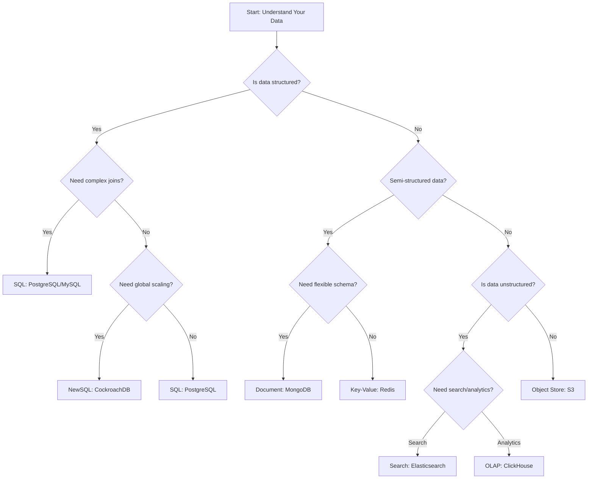
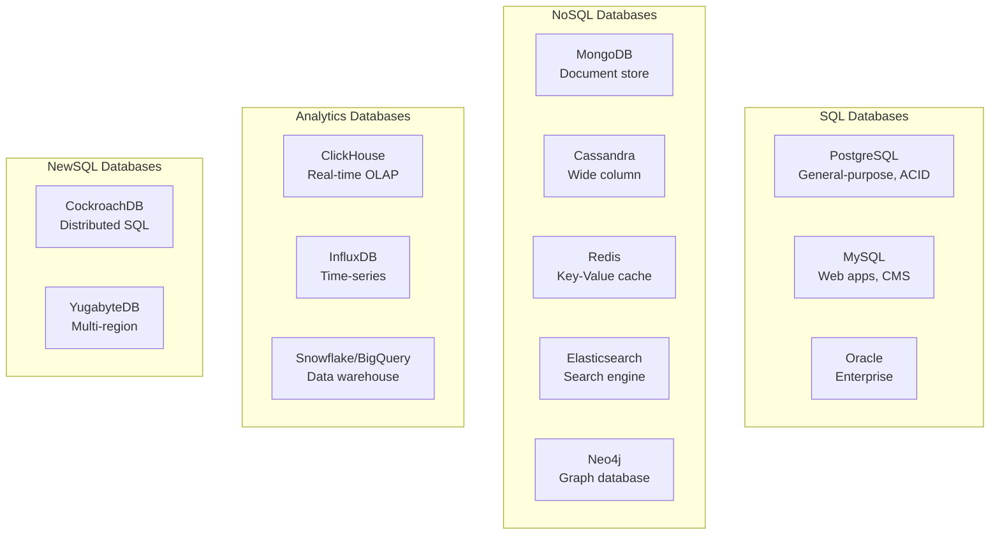

# 🧭 Database Selection Guide

Choosing the right database for your application is one of the most critical architectural decisions that affects **performance**, **scalability**, **data consistency**, and **maintenance cost**.

This guide helps you navigate SQL, NoSQL, and NewSQL databases with **real-world examples and decision frameworks**.

---

## 🔑 Key Concepts

### ⚙️ OLTP (Online Transaction Processing)
OLTP systems are optimized for **real-time transactional workloads**—frequent inserts, updates, and deletes.

- **Goal:** Fast query response and data integrity for concurrent users  
- **Examples:** Banking systems, order processing, inventory, user registration  
- **Databases:** PostgreSQL, MySQL, Oracle, CockroachDB  

**Example:**  
When a customer places an order on Amazon, the system deducts inventory, records payment, and confirms the order instantly — all requiring ACID transactions.

---

### 📊 OLAP (Online Analytical Processing)
OLAP systems are optimized for **complex analytical queries** on large datasets.

- **Goal:** Aggregate data from OLTP systems for insights  
- **Examples:** Reporting dashboards, trend analysis, business intelligence  
- **Databases:** Snowflake, Google BigQuery, Amazon Redshift, ClickHouse  

**Example:**  
Amazon's analytics system aggregates millions of sales transactions daily to identify best-selling products or predict demand trends.

---

### ⚖️ ACID vs BASE

| Concept | Description | Used In | Example Databases |
|----------|--------------|----------|--------------------|
| **ACID** (Atomicity, Consistency, Isolation, Durability) | Ensures transactions are **fully reliable** and **consistent** | OLTP systems | PostgreSQL, MySQL, Oracle |
| **BASE** (Basically Available, Soft state, Eventual consistency) | Prioritizes **availability and scalability**, allowing temporary inconsistency | Large-scale distributed apps | Cassandra, DynamoDB, MongoDB |

**Example:**  
- **ACID:** Bank transfers must commit both debit and credit together (no partial state).  
- **BASE:** A social media post may take a few seconds to appear on all user feeds — eventual consistency.

---

## 🧩 Understand Your Data Requirements

| Data Type | Description | Real-World Example | Suitable Databases |
|------------|--------------|-------------------|--------------------|
| **Structured** | Fixed schema, relational | Banking, ERP | PostgreSQL, MySQL |
| **Semi-structured** | Flexible, JSON/XML | Product catalogs, APIs | MongoDB, PostgreSQL (JSONB) |
| **Unstructured** | Free-form (text, images, logs) | Social media, logs | Elasticsearch, Cassandra, S3 |

---

## 🎯 Identify Your Use Cases

| Use Case | Example Scenario | Recommended Databases |
|-----------|------------------|------------------------|
| **Transactional (OLTP)** | Banking, eCommerce checkout | PostgreSQL, MySQL |
| **Analytical (OLAP)** | BI dashboards, analytics | Snowflake, BigQuery, ClickHouse |
| **Real-Time Analytics** | Stock prices, IoT dashboards | ClickHouse, Apache Druid |
| **Read-Heavy Apps** | Blogs, news sites | MySQL replicas, MongoDB |
| **Write-Heavy Apps** | IoT sensors, logs | Cassandra, DynamoDB |
| **Caching / Sessions** | Shopping carts, API cache | Redis, Memcached |
| **Search** | Full-text or fuzzy search | Elasticsearch, OpenSearch |
| **Graph Data** | Social networks, recommendations | Neo4j, ArangoDB |
| **Time-Series** | Metrics, IoT, monitoring | TimescaleDB, InfluxDB |
| **Event Streaming** | Fraud detection, order events | Kafka + Materialize |

---

## 📈 Scalability

| Scaling Type | When Needed | Example | Databases |
|---------------|--------------|----------|------------|
| **Vertical Scaling** | Increase CPU/RAM | Mid-size enterprise | PostgreSQL, Oracle |
| **Horizontal Scaling** | Add more servers/nodes | Global-scale systems | MongoDB, Cassandra, CockroachDB |

---

## 🧮 Data Consistency

| Consistency Level | Use Case | Example | Databases |
|-------------------|-----------|----------|-----------|
| **Strong Consistency (ACID)** | Banking, ledgers | Financial apps | PostgreSQL, MySQL |
| **Eventual Consistency (BASE)** | Messaging, feeds | Twitter, Instagram | Cassandra, DynamoDB |

---

## 🔍 Query Complexity

| Query Type | Example | Databases |
|-------------|----------|------------|
| **Complex Joins / Aggregations** | Analytics dashboards | PostgreSQL, Snowflake |
| **Simple Key-Value Lookups** | Session store | Redis |
| **Graph Traversal** | Friends-of-friends | Neo4j |
| **Full-Text Search** | Search posts, products | Elasticsearch |

---

## 🧱 Data Model

| Model | Description | When to Use | Example Databases |
|--------|--------------|--------------|-------------------|
| **Relational (SQL)** | Structured schema | Financial, ERP | PostgreSQL, MySQL |
| **Document (NoSQL)** | JSON docs | CMS, APIs | MongoDB, Couchbase |
| **Key-Value** | Simple key-based lookups | Caching | Redis, DynamoDB |
| **Wide Column** | High write throughput | IoT, telemetry | Cassandra, HBase |
| **Graph** | Relationship-heavy | Social networks | Neo4j, ArangoDB |

---

## 🧠 Real-World Scenarios

### 🏦 Banking / FinTech
- Core Transactions → **PostgreSQL**
- Caching → **Redis**
- Analytics → **Snowflake**
- Audit Logs → **S3 + Athena**

### 🛒 E-Commerce
- Product Catalog → **MongoDB**
- Orders/Payments → **PostgreSQL**
- Search → **Elasticsearch**
- Caching → **Redis**

### 🌐 Social Media
- User Graph → **Neo4j**
- Feeds → **Cassandra**
- Search → **Elasticsearch**
- Analytics → **ClickHouse**

### 📊 IoT Platform
- Sensor Data → **InfluxDB**
- Device Registry → **MongoDB**
- Stream Processing → **Kafka + Materialize**

---

## 🧾 Summary Table

| Database | Type | Best For | Example Use Case |
|-----------|------|----------|------------------|
| **PostgreSQL** | SQL | Complex queries, reliability | Banking, SaaS |
| **MySQL** | SQL | Simple OLTP workloads | CMS, Web apps |
| **MongoDB** | NoSQL Document | Flexible schema | Product catalogs |
| **Cassandra** | NoSQL Wide Column | High write throughput | IoT, feeds |
| **Redis** | In-memory KV | Caching, sessions | API cache |
| **Elasticsearch** | Search Engine | Full-text search | E-commerce search |
| **Neo4j** | Graph | Relationship data | Social networks |
| **ClickHouse** | OLAP | Real-time analytics | BI dashboards |
| **InfluxDB** | Time-series | Metrics, IoT | Device monitoring |
| **Snowflake / BigQuery** | Data Warehouse | Analytical workloads | Enterprise BI |
| **CockroachDB / YugabyteDB** | NewSQL | Global distributed SQL | Multi-region systems |

---

## 🌳 SQL vs NoSQL Decision Tree

---

## 🗂️ Database Type Comparison

---

## 🧰 Practical Advice

✅ Start simple: **PostgreSQL** covers most structured workloads.  
✅ Add **Redis** for caching heavy read operations.  
✅ Use **MongoDB** for flexible schemas.  
✅ Add **Elasticsearch** for search.  
✅ For analytics, scale to **ClickHouse** or **BigQuery**.

---

## 📚 References

* [PostgreSQL Docs](https://www.postgresql.org/docs/)
* [MongoDB Architecture](https://www.mongodb.com/)
* [Snowflake Whitepaper](https://www.snowflake.com/resources/)
* [CockroachDB Architecture](https://www.cockroachlabs.com/)
* [Cassandra Documentation](https://cassandra.apache.org/)
