```mermaid
sequenceDiagram
    participant Client
    participant Postgres
    participant WAL
    participant DataFile

    Client->>Postgres: INSERT INTO users ...
    Postgres->>Postgres: Locate or create target page
    Postgres->>DataFile: Write tuple in memory buffer (marked dirty)
    Postgres->>WAL: Write WAL record
    WAL->>Disk: Flush WAL to durable storage
    Postgres-->>Client: ✅ Acknowledgement (Insert success)
    Note over DataFile: Later checkpoint flushes dirty pages to disk
```

```mermaid
sequenceDiagram
    participant Disk as 🧮 Data Files (Heap)
    participant WAL as 🧾 Write-Ahead Log
    participant Memory as 🧠 Shared Buffers
    participant Postgres as 🐘 PostgreSQL
    participant User as 👤 Client

    User->>Postgres: INSERT INTO accounts ...
    Postgres->>Memory: Write new row (dirty page)
    Postgres->>WAL: Append WAL record
    WAL->>Disk: Flush WAL (fsync)
    Postgres-->>User: ✅ Commit Success

    Note over Memory,Disk: Suddenly... 💥 System Crash

    Postgres->>WAL: 🔁 On Restart → Read WAL from last checkpoint
    WAL->>Postgres: Replay INSERT / UPDATE / DELETE entries
    Postgres->>Disk: Reapply missing changes to data files
    Postgres-->>User: System Ready (Data Restored ✅)
```

Absolutely 🔥 — here’s a **beautifully structured**, **GitHub-ready Markdown README section** explaining what happens internally during **`INSERT`, `UPDATE`, and `DELETE`** in **PostgreSQL**, including **visual representations** (with Mermaid diagrams), **deep internals (WAL, MVCC, checkpoints)**, and **real-world notes** for developers and DBAs.

---

# ⚙️ PostgreSQL Write Operations Deep Dive

PostgreSQL is built on strong principles of **durability**, **consistency**, and **crash recovery**.
Whether you `INSERT`, `UPDATE`, or `DELETE`, PostgreSQL uses a **Write-Ahead Log (WAL)** and **MVCC (Multi-Version Concurrency Control)** to ensure your data is safe and queries remain concurrent.

---

## 🧩 What Happens When You `INSERT` a Row

PostgreSQL must ensure data durability while maintaining fast writes and safe crash recovery.
The key mechanism: **Write-Ahead Log (WAL)**.

### ⚙️ Steps of an `INSERT` Operation

1. **Receive Query & Identify Target Page**

   * PostgreSQL parses the query and identifies the target **table page** (a block of 8 KB).
   * This page could already be in **shared buffers (memory)** or loaded from disk—or a new one may be created.

2. **Write Data in Memory (Not Yet on Disk)**

   * The new tuple (row) is written into the page in memory.
   * The page is now **“dirty”**, meaning it needs to be flushed to disk later.

3. **Create WAL Record**

   * A record describing the change is added to the **WAL buffer**.
   * It includes enough info to redo this insert if a crash occurs.

4. **Flush WAL to Disk**

   * WAL is **fsynced to durable storage** (sequential write = very fast).
   * Only after this, PostgreSQL returns `INSERT successful` to the client.

5. **Later: Data File Flush**

   * The actual data page (heap) may still be only in memory.
   * Background writer or checkpoints flush it to disk later.
   * If PostgreSQL crashes before that, WAL is replayed during recovery.

✅ **Guarantee:** When you get success, your data is safely in WAL — recoverable even after a crash.

---

### 🧠 Visual Representation



---

## 🔄 What Happens When You `UPDATE` a Row

In PostgreSQL, **updates create new tuples** instead of overwriting old data — enabling **MVCC** and **concurrent reads**.

### ⚙️ Steps of an `UPDATE` Operation

1. **Find Target Tuple**

   * PostgreSQL locates the row version that matches the `WHERE` condition.

2. **Mark Old Tuple as Dead (in Memory)**

   * The old row isn’t deleted immediately.
   * It’s marked with a **new transaction ID** and a flag indicating it’s obsolete.

3. **Create a New Tuple**

   * A new version of the row is inserted into the same or another page.
   * This new row carries a new transaction ID and points back to the old one.

4. **Write WAL Record**

   * WAL is updated with info to redo this change if a crash occurs.

5. **Commit and Flush WAL**

   * Once WAL is flushed, PostgreSQL confirms the transaction to the client.

6. **Cleanup (Later)**

   * Old, dead tuples remain until **VACUUM** reclaims space.
   * This ensures concurrent transactions can still see consistent snapshots.

✅ **Guarantee:** No data corruption; consistent reads across concurrent transactions.

---

### 🧠 Visual Representation

```mermaid
graph TD
    A[Old Row Version] -->|UPDATE| B[New Row Version]
    B --> C[New Transaction ID (XMIN)]
    A --> D[Marked Dead by Transaction (XMAX)]
    C --> E[WAL Record for Recovery]
    E --> F[Commit + Flush WAL]
    F --> G[Success Response to Client]
    G --> H[Later: VACUUM removes old version]
```

---

## ❌ What Happens When You `DELETE` a Row

`DELETE` in PostgreSQL does not immediately remove data — it marks the row as **dead**.

### ⚙️ Steps of a `DELETE` Operation

1. **Find Target Row**

   * PostgreSQL finds the tuple based on your condition.

2. **Mark Tuple as Deleted**

   * The row’s header (XMAX) is updated with the current transaction ID.
   * The physical data remains on the page for now.

3. **Write WAL Record**

   * WAL entry logs this deletion for crash recovery.

4. **Flush WAL and Return Success**

   * Once WAL is flushed to disk, PostgreSQL reports success.

5. **VACUUM Reclaims Space**

   * During periodic cleanup, `VACUUM` or `autovacuum` physically removes dead tuples to free space.

✅ **Guarantee:** Deletion is crash-safe; recovery replays WAL to restore consistent state.

---

### 🧠 Visual Representation


---

## 🧱 The Write-Ahead Log (WAL) — The Heart of Durability

| Aspect             | Description                                                         |
| ------------------ | ------------------------------------------------------------------- |
| **Purpose**        | Ensure every change is logged before being applied                  |
| **Performance**    | Sequential I/O — fast and efficient                                 |
| **Crash Recovery** | Replays WAL to restore consistent state                             |
| **Replication**    | WAL is also the source for streaming replication                    |
| **Checkpoints**    | Periodically flush dirty pages to disk, truncating old WAL segments |

---

## 🧹 MVCC, VACUUM, and Visibility

PostgreSQL’s **MVCC** model ensures readers never block writers.
Each row version carries transaction IDs:

* `xmin`: transaction that created it
* `xmax`: transaction that deleted or superseded it

### Lifecycle

```mermaid
graph LR
A[Tuple Created (xmin=X1)] --> B[Updated (xmax=X2)]
B --> C[New Tuple (xmin=X2)]
C --> D[Old Tuple Reclaimed by VACUUM]
```

---

## 💡 Real-World Example: Banking or Trading Systems

| Operation | Example                         | Why WAL Matters                        |
| --------- | ------------------------------- | -------------------------------------- |
| `INSERT`  | Adding a new transaction record | Ensures logs survive power failures    |
| `UPDATE`  | Changing account balance        | Allows rollback and recovery           |
| `DELETE`  | Removing old audit data         | Keeps history safe until VACUUM cleans |

---

## 🧾 Summary Table

| Operation  | Immediate Action    | WAL Written | Data Page Flushed Later | Cleaned by VACUUM | Durability Guarantee |
| ---------- | ------------------- | ----------- | ----------------------- | ----------------- | -------------------- |
| **INSERT** | Add tuple in memory | ✅           | ✅                       | ❌                 | WAL Flush            |
| **UPDATE** | Create new tuple    | ✅           | ✅                       | ✅                 | WAL Flush            |
| **DELETE** | Mark tuple dead     | ✅           | ✅                       | ✅                 | WAL Flush            |

---

### 🚀 In a Nutshell

> **PostgreSQL never trusts memory.**
> Every modification is first logged in the **Write-Ahead Log (WAL)** —
> only then is it applied to data pages, flushed asynchronously for performance,
> and cleaned later via **VACUUM**.

---

Excellent — you’re thinking like a real PostgreSQL internals engineer! 🧠
Here’s the **Crash Recovery Flow** section written in **GitHub-ready Markdown**, with **a visual Mermaid diagram** that clearly illustrates how PostgreSQL restores data using the **WAL (Write-Ahead Log)** after a system crash.

You can paste this directly into your README.md — it will blend perfectly with your previous sections.

---

## 💥 Crash Recovery Flow — How PostgreSQL Heals Itself

Even the most reliable systems crash — power failures, kernel panics, hardware faults happen.
PostgreSQL’s **WAL (Write-Ahead Log)** ensures that even in such events, **no committed data is ever lost** and **no partial transactions are left behind**.

Let’s explore what happens step-by-step when a crash occurs and how recovery works.

---

### ⚙️ Crash Recovery Steps

1. **Crash Happens 💥**

   * PostgreSQL crashes while some data pages were still in memory and not flushed to disk.
   * However, all **committed transactions have their WAL records safely written** to disk (that’s the durability guarantee).

2. **PostgreSQL Restarts 🌀**

   * On startup, PostgreSQL enters **recovery mode**.
   * It scans the **WAL files** sequentially to detect the last **checkpoint** (the last known consistent state).

3. **Replay Phase (REDO) 🔁**

   * PostgreSQL replays WAL entries from the last checkpoint onward.
   * Each WAL record is re-applied to bring the data files up to date.
   * This includes **re-inserting, updating, or deleting tuples** that were confirmed to clients but not yet persisted in heap files.

4. **Crash Recovery Completes ✅**

   * After replaying all WAL records up to the latest commit, PostgreSQL reaches a consistent state.
   * Uncommitted transactions are rolled back automatically.
   * Finally, the database transitions to **normal operation mode**.

5. **Optional: Archive/Streaming Replication**

   * In replicated setups, the same WAL files are streamed to standby servers to keep them in sync — ensuring high availability.

---

### 🧠 Visual Representation



---

### 🔍 Key Concepts

| Concept               | Description                                                                                    |
| --------------------- | ---------------------------------------------------------------------------------------------- |
| **Checkpoint**        | A snapshot of the database’s consistent state at a given moment. WAL replay starts from here.  |
| **Redo Phase**        | The phase where PostgreSQL replays WAL entries to apply changes not yet written to heap files. |
| **Undo (Rollback)**   | Uncommitted transactions are undone to maintain atomicity.                                     |
| **Crash-Safe Commit** | A transaction is considered durable only after its WAL record is flushed to disk.              |

---

### 💡 Example Scenario

| Event                         | What Happens                               | Data Safety            |
| ----------------------------- | ------------------------------------------ | ---------------------- |
| App inserts a row and commits | WAL flushed, but heap page not yet written | ✅ Safe                 |
| Server crashes                | Dirty page lost, but WAL exists            | ✅ Recoverable          |
| PostgreSQL restarts           | WAL replayed, re-applies the insert        | ✅ Data restored        |
| Normal operations resume      | System consistent again                    | ✅ Integrity maintained |

---

### 🔄 Simplified Recovery Flow Diagram

```mermaid
graph LR
A[Crash Occurs 💥] --> B[Restart PostgreSQL 🐘]
B --> C[Locate Last Checkpoint 📍]
C --> D[Replay WAL Entries 🔁]
D --> E[Apply Missing Inserts/Updates/Deletes]
E --> F[Rollback Uncommitted TXNs 🔄]
F --> G[Database Consistent ✅]
```



---

### 🧾 Summary: Why WAL Replay Matters

* **No Committed Data Loss:** All confirmed commits survive crashes.
* **Automatic Recovery:** No manual repair needed; WAL ensures consistency.
* **Replication-Friendly:** WAL drives streaming replication and point-in-time recovery (PITR).
* **Performance-Safe:** Sequential WAL writes are faster and safer than random heap writes.

---

> 🧠 **In essence:**
> PostgreSQL treats the **WAL as the source of truth** for recent changes.
> Even if the data pages are lost mid-flight, replaying the WAL guarantees that **every committed transaction is restored** — automatically, efficiently, and safely.

---

