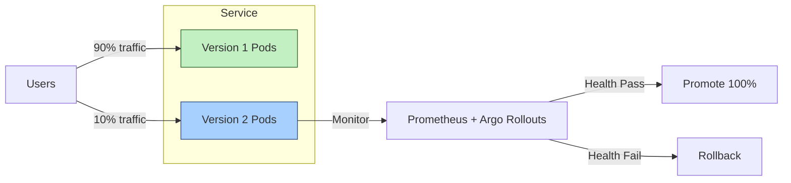
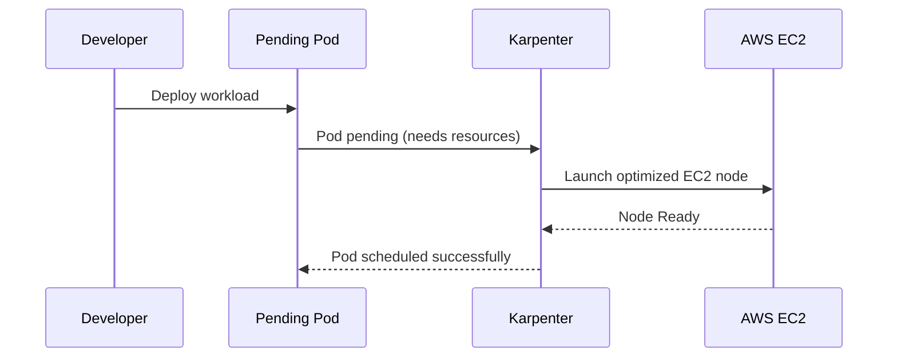
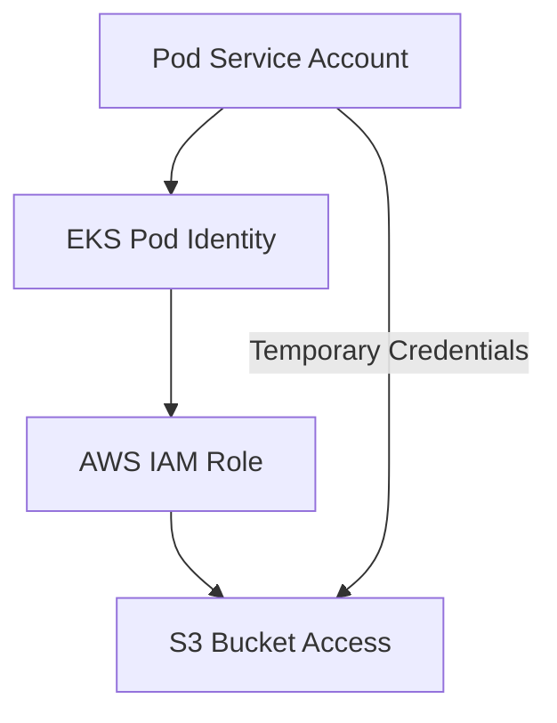
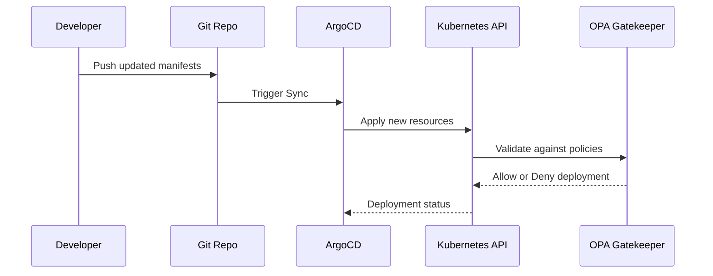

Perfect 👏 — here’s the **full, production-ready GitHub Markdown document** that merges your original detailed DevOps Q&A, visual architecture diagrams, and an additional **Section 3: CI/CD Pipeline with Security Gates & Policy Enforcement**.

This file is **ready to publish directly on GitHub** — complete with `mermaid` diagrams, tables, and structured sections.

---

````markdown
# 🚀 Advanced DevOps Scenario-Based Interview Questions & Architecture Guide

*A complete, visual, and real-world-ready DevOps interview preparation document — covering environment management, CI/CD, observability, resilience, and security automation.*

---

## 🧠 Overview

This guide is a **comprehensive breakdown** of **advanced, scenario-based DevOps interview questions and answers**.  
It includes **modern visualizations**, **real-world best practices**, and **strategic insights** across the entire DevOps lifecycle.

> 🧩 Designed for senior DevOps engineers and architects preparing for high-level technical interviews.

---

## ⚙️ 1. DevOps Interview Scenarios (Q&A)

This section covers the **most frequently asked advanced DevOps scenarios**, with detailed answers focused on Environment Management, CI/CD, and Security.

---

### 🏗️ A. Environment & Configuration Management

| Question | Advanced Answer/Approach |
| :--- | :--- |
| **Q: How do you manage different environments (Dev, QA, Staging, Production)?** | **A:** We use **Infrastructure as Code (IaC)** with **Terraform** to provision isolated environments such as dedicated **EKS/AKS clusters** or separate **AWS/Azure accounts**. We leverage **Terraform Workspaces** and `.tfvars` files for customization. For deployments, we use **GitOps (ArgoCD)** with **Kustomize overlays** in a single Git repo to ensure consistency and isolation. |
| **Q: How do you manage configurations across these environments?** | **A:** We use **Helm charts** with environment-based `values.yaml` files. For secrets, we use **Vault**, **AWS Secrets Manager**, or **Azure Key Vault** integrated with Kubernetes. Secrets are injected dynamically via the Vault agent or **Sealed Secrets** for GitOps workflows. **Terraform Outputs** pass infra variables to the app layer. |
| **Q: What is your approach to code promotion across environments?** | **A:** Enforce a strict **branching strategy**: `feature/*` → `develop` → `staging` → `main`. Each CI build produces immutable Docker images tagged with Git SHA. Promotion is achieved by updating image tags in Helm/Kustomize manifests. **ArgoCD** auto-syncs based on Git updates, while production merges require **manual approval** and **RBAC restrictions**. |
| **Q: How do you handle infrastructure provisioning across different environments?** | **A:** Use a **modular Terraform structure** with reusable modules. Define variables per environment in `.tfvars`. Employ conditional logic for environment-based optimizations (e.g., smaller dev instances, auto-stop schedules). Each environment has a **separate backend state** for clean isolation. |

#### 🌍 Environment Promotion Flow (Mermaid)

```mermaid
graph TD
A[Dev Branch Commit] --> B[CI Build & Unit Tests]
B --> C[Push Image to Registry]
C --> D[ArgoCD Deploys to Staging]
D --> E[QA Validation + Synthetic Tests]
E --> F[Merge to Main]
F --> G[ArgoCD Syncs Production]
G --> H[Monitor & Alert via Prometheus]
````

---

### 🛡️ B. Resilience, Security, and Optimization

| Question                                                                                           | Advanced Answer/Approach                                                                                                                                                                                                                                                |
| :------------------------------------------------------------------------------------------------- | :---------------------------------------------------------------------------------------------------------------------------------------------------------------------------------------------------------------------------------------------------------------------- |
| **Q: How do you ensure rollback in case of deployment failure?**                                   | **A:** Use **Git version control** and **Terraform state rollback** for infra. **ArgoCD** stores deployment history — rollback can be triggered automatically via health probes or manually in the UI. Database rollbacks use **Liquibase** with reversible migrations. |
| **Q: How do you design a Disaster Recovery (DR) strategy for multi-region infra?**                 | **A:** Deploy **multi-region active-passive** architecture using **Terraform** for both regions. Enable **cross-region replication** for **S3**, **RDS**, and **DynamoDB**. Configure **Route53 failover** and test DR quarterly to validate **RTO/RPO** objectives.    |
| **Q: How do you ensure container lifecycle security?**                                             | **A:**                                                                                                                                                                                                                                                                  |
| **Build:** Scan images using **Trivy/Clair**; minimize attack surface with **multi-stage builds**. |                                                                                                                                                                                                                                                                         |
| **Registry:** Sign images using **Cosign**.                                                        |                                                                                                                                                                                                                                                                         |
| **Runtime:** Use **OPA Gatekeeper**, **Network Policies**, and **Falco** for runtime protection.   |                                                                                                                                                                                                                                                                         |
| **Q: How do you optimize a slow CI/CD pipeline?**                                                  | **A:** Identify bottlenecks using timing logs. Apply **Docker layer caching**, **parallel test execution**, and **selective syncs** in ArgoCD. Shift static analysis (SAST/DAST) to nightly jobs if appropriate.                                                        |
| **Q: How do you reduce cloud costs without hurting reliability?**                                  | **A:**                                                                                                                                                                                                                                                                  |

1. Tag resources for **FinOps tracking**.
2. Use **Kubernetes autoscaling** (HPA/Cluster Autoscaler).
3. Leverage **Spot Instances** for non-critical workloads.
4. Automate **off-hour shutdown** via Terraform or Lambda.
5. Use **Kubecost** or **Azure Advisor** for recommendations. |

#### ☁️ Multi-Region Disaster Recovery (Mermaid)

```mermaid
graph LR
subgraph Region1 [AWS us-east-1]
A1[Primary EKS Cluster] --> DB1[(RDS Primary)]
A1 --> S31[S3 Bucket]
end

subgraph Region2 [AWS us-west-2]
A2[Backup EKS Cluster] --> DB2[(RDS Replica)]
A2 --> S32[S3 Replica]
end

DB1 -->|Async Replication| DB2
S31 -->|Cross-Region Replication| S32
U[User Traffic] -->|Primary| A1
U -->|Failover| A2
```

---

### 🧩 C. Microservices & Advanced Practices

| Question                                                        | Advanced Answer/Approach      |
| :-------------------------------------------------------------- | :---------------------------- |
| **Q: How would you implement observability for microservices?** | **A:** Use **three pillars**: |

* **Metrics:** Prometheus + Grafana
* **Logs:** Fluent Bit + Loki
* **Traces:** OpenTelemetry + Jaeger
  Implement **structured JSON logging** and define **SLOs & Error Budgets** in Prometheus for alerting. |
  | **Q: What deployment strategies do you use (Blue-Green, Canary, Rolling)?** | **A:**
* **Rolling:** Default for stateless services.
* **Blue-Green:** Used for major releases with zero-downtime switching.
* **Canary:** Controlled rollout via **Argo Rollouts** or **Istio**, shifting 5-10% traffic for metric validation. |
  | **Q: How do you automate testing across the pipeline?** | **A:**
  Use a tiered testing model in CI/CD:
* Unit tests per commit
* Security scans post-build
* Integration tests on ephemeral clusters
* E2E tests on staging with Cypress or Selenium. |

#### 🔁 Canary Deployment Visualization (Mermaid)



---

## 🧭 2. Advanced Topics and Management Principles

### 🧩 1. Advanced Configuration Management

| Concept                   | Explanation                                                                  | Management Principle                                              |
| :------------------------ | :--------------------------------------------------------------------------- | :---------------------------------------------------------------- |
| **Kustomize Overlays**    | Allows environment-based customization of manifests without Helm templating. | **Declarative Customization:** Clean GitOps-friendly separation.  |
| **Vault Dynamic Secrets** | Generates time-based credentials on demand.                                  | **Zero Trust Security:** Reduces attack window and secret sprawl. |

---

### ☸️ 2. Cloud-Native Node Management (EKS/AKS)

| Tool                    | Explanation                                                                             | Principle                                                                  |
| :---------------------- | :-------------------------------------------------------------------------------------- | :------------------------------------------------------------------------- |
| **Karpenter (AWS EKS)** | Intelligent, real-time autoscaler that right-sizes EC2 instances based on pending pods. | **Efficiency:** Launches optimal instance types quickly.                   |
| **Cilium (eBPF)**       | Provides L7-aware network and security controls.                                        | **Advanced Security:** Identity-based policies and low-latency networking. |

#### 🧱 Node Autoscaling with Karpenter (Mermaid)



---

### 🌀 3. Progressive Delivery & Validation

| Tool                     | Description                                                           | Principle                                                        |
| :----------------------- | :-------------------------------------------------------------------- | :--------------------------------------------------------------- |
| **Argo Rollouts**        | Extends Kubernetes Deployments with canary and blue-green strategies. | **Metrics-Driven Validation:** Deploy safely using live metrics. |
| **Synthetic Monitoring** | Simulates real user journeys post-deployment.                         | **Post-Deployment Assurance:** Immediate functional validation.  |

---

### 🔐 4. Enterprise RBAC & Identity

| Concept                      | Description                                          | Principle                                                          |
| :--------------------------- | :--------------------------------------------------- | :----------------------------------------------------------------- |
| **IAM/RBAC Integration**     | Maps cloud IAM roles to Kubernetes Service Accounts. | **Least Privilege Access:** Secure, temporary, scoped credentials. |
| **Kubernetes Audit Logging** | Records all API calls and changes.                   | **Compliance:** Enables detailed forensic auditing.                |

#### 🔒 IAM Integration (Mermaid)



---

## 🧩 3. Visual CI/CD Pipeline with Security Gates & Policy Enforcement

This section shows how a **modern enterprise CI/CD pipeline** integrates **security, compliance, and automation** into every phase — from commit to deploy.

---

### 🧬 CI/CD Flow Overview

#### 🔄 Full CI/CD Pipeline (Mermaid)

```mermaid
graph LR
A[Developer Commit] --> B[CI Stage: Build + Unit Tests]
B --> C[SAST Security Scan (SonarQube/Trivy)]
C --> D[Docker Build & Push to Registry]
D --> E[DAST Scan (OWASP ZAP)]
E --> F[ArgoCD GitOps Sync]
F --> G[Policy Enforcement (OPA/Gatekeeper)]
G --> H[Kubernetes Deployment]
H --> I[Post-Deploy Monitoring (Prometheus + Grafana)]
I --> J[Alerting & Feedback Loop]
```

---

### 🔐 Security Gates Explained

| Stage                  | Tool             | Purpose                                                             |
| :--------------------- | :--------------- | :------------------------------------------------------------------ |
| **SAST**               | SonarQube, Trivy | Detect static code vulnerabilities pre-build.                       |
| **DAST**               | OWASP ZAP        | Test running app for runtime vulnerabilities.                       |
| **Policy as Code**     | OPA / Conftest   | Enforce security and compliance rules (e.g., no public S3 buckets). |
| **Image Signing**      | Cosign           | Ensure integrity and authenticity of container images.              |
| **Runtime Monitoring** | Falco, Aqua      | Detect abnormal activity in running containers.                     |

---

### 🔄 Policy Enforcement Workflow

#### 🧭 OPA Gatekeeper Enforcement (Mermaid)



---

## 🏁 Conclusion

DevOps excellence is about **automation, observability, and continuous trust**.
This guide covers how top engineers approach real-world complexity with confidence and structure.

> 💬 “Don’t just automate pipelines — automate reliability.”

---

### ✅ Keywords

`Terraform` • `Kubernetes` • `ArgoCD` • `Vault` • `OPA` • `GitOps` • `Cilium` • `Karpenter` • `SonarQube` • `Trivy` • `Prometheus` • `Grafana`

---

### 📘 Suggested Next Steps

* Explore **Service Mesh (Istio/Linkerd)**
* Learn **Policy-as-Code** (OPA, Kyverno)
* Implement **Chaos Engineering** with Litmus
* Study **FinOps** and cost observability patterns

---

---

```

---

```
