Perfect — let’s go *deep* into **Java Concurrency interview questions** with **in-depth explanations**, **real-world examples**, and **answers** designed to help you handle advanced product-based or FAANG-level interviews.

---

## 🧠 **Java Concurrency Interview Questions and Answers (In-Depth)**

---

### **1. What is Concurrency in Java? How is it different from Parallelism?**

**Answer:**

* **Concurrency** means *dealing with multiple tasks at once* — not necessarily executing them at the same instant, but making progress on all of them.
* **Parallelism** means *executing multiple tasks simultaneously* (requires multiple cores).

**Example:**

```java
// Concurrency: tasks are interleaved
Thread t1 = new Thread(() -> task1());
Thread t2 = new Thread(() -> task2());
t1.start(); t2.start();
```

Even on a single-core CPU, the JVM can switch between threads to give the illusion of parallelism.

**In short:**

* Concurrency = *structure of tasks*
* Parallelism = *execution of tasks*

---

### **2. What happens internally when you create and start a thread in Java?**

**Answer:**
When you call:

```java
Thread t = new Thread(() -> doSomething());
t.start();
```

1. A new **OS-level thread** is requested from the JVM.
2. JVM maps Java threads → OS native threads.
3. The thread transitions through lifecycle states:

   * **NEW** → **RUNNABLE** → **RUNNING** → **TERMINATED**
4. Thread scheduling is managed by the **OS thread scheduler**, not JVM directly.
5. Once scheduled, the `run()` method executes.

---

### **3. What are the different thread states in Java?**

| State             | Description                             |
| ----------------- | --------------------------------------- |
| **NEW**           | Thread created but not started          |
| **RUNNABLE**      | Ready to run, waiting for CPU time      |
| **BLOCKED**       | Waiting to acquire a lock               |
| **WAITING**       | Waiting indefinitely for another thread |
| **TIMED_WAITING** | Waiting for a specific time             |
| **TERMINATED**    | Completed execution                     |

---

### **4. What is a race condition? How can it be prevented?**

**Answer:**
A **race condition** occurs when multiple threads access shared data simultaneously and at least one modifies it.

**Example (race):**

```java
class Counter {
    private int count = 0;
    void increment() { count++; } // Not atomic
}
```

If multiple threads call `increment()`, `count` may become inconsistent.

**Fix:**

```java
synchronized void increment() { count++; }
```

or

```java
AtomicInteger count = new AtomicInteger(0);
count.incrementAndGet();
```

---

### **5. How does the `synchronized` keyword work internally?**

**Answer:**
`synchronized` ensures:

1. **Mutual exclusion** — only one thread executes the block at a time.
2. **Visibility** — changes made by one thread are visible to others.

**Internally:**

* The JVM uses **monitor locks** (object monitors).
* Entering a synchronized block → thread acquires the monitor.
* Exiting → releases the monitor.

**Example:**

```java
synchronized(this) {
    // critical section
}
```

This uses the **object header’s monitor** to track ownership.

---

### **6. What is the Java Memory Model (JMM)?**

**Answer:**
The **JMM** defines:

* How threads interact through memory.
* When writes by one thread become visible to others.

Without JMM guarantees, one thread’s changes might not be visible due to CPU caching or reordering.

**Rules enforced by JMM:**

* `synchronized`, `volatile`, and atomic classes establish *happens-before relationships*.
* Happens-before means visibility + ordering.

---

### **7. What is `volatile` in Java and how does it differ from `synchronized`?**

**Answer:**
`volatile` ensures:

1. Visibility — all threads see the latest value.
2. No caching of the variable.

It does **not** ensure atomicity.

**Example:**

```java
volatile boolean flag = false;

void setFlag() { flag = true; }  // visible to all threads
```

Use `volatile` for flags, not for compound operations like `count++`.

---

### **8. What are Atomic classes and how do they work internally?**

**Answer:**
Atomic classes (`AtomicInteger`, `AtomicReference`, etc.) provide **lock-free thread safety** using **CAS (Compare-And-Swap)**.

**Example:**

```java
AtomicInteger count = new AtomicInteger(0);
count.incrementAndGet(); // Atomic operation
```

**CAS internally:**

```java
do {
    int oldValue = count;
    int newValue = oldValue + 1;
} while(!compareAndSwap(count, oldValue, newValue));
```

Hardware-level atomicity provided by CPU instructions.

---

### **9. What is a Deadlock? How to avoid it?**

**Answer:**
A **deadlock** occurs when two threads hold locks and wait for each other indefinitely.

**Example:**

```java
synchronized(obj1) {
    synchronized(obj2) { ... }
}
```

Another thread does reverse locking → deadlock.

**Avoid:**

* Acquire locks in consistent order.
* Use `tryLock()` from `ReentrantLock` with timeout.

---

### **10. What is a `ThreadPoolExecutor` and why is it used?**

**Answer:**
Creating too many threads can overwhelm CPU and memory.
`ThreadPoolExecutor` manages a pool of threads efficiently.

**Example:**

```java
ExecutorService executor = Executors.newFixedThreadPool(10);
executor.submit(() -> processTask());
```

Internally:

* Maintains a queue of tasks.
* Reuses threads to execute them.
* Controls concurrency level.

---

### **11. What is the difference between `submit()` and `execute()` in ExecutorService?**

| Method      | Returns   | Exception Handling                    |
| ----------- | --------- | ------------------------------------- |
| `execute()` | void      | Unhandled exceptions terminate thread |
| `submit()`  | Future<?> | Exceptions captured inside `Future`   |

---

### **12. What is a Future and CompletableFuture?**

**Answer:**
`Future` represents a result of an async computation.

**Example:**

```java
Future<Integer> future = executor.submit(() -> compute());
int result = future.get();
```

**`CompletableFuture`** (Java 8+):
Supports **callback chaining** and **non-blocking composition**.

```java
CompletableFuture.supplyAsync(() -> getData())
    .thenApply(data -> transform(data))
    .thenAccept(System.out::println);
```

---

### **13. What is `ForkJoinPool` and Work-Stealing Algorithm?**

**Answer:**
Used for **divide-and-conquer** tasks like parallel streams or recursive computations.

**Work-Stealing Algorithm:**

* Each worker thread has its own task queue.
* If one finishes early, it *steals* tasks from others.

**Example:**

```java
ForkJoinPool pool = new ForkJoinPool();
pool.invoke(new RecursiveTaskExample());
```

---

### **14. How do you ensure thread-safety in Collections?**

**Options:**

1. **Legacy synchronized classes:** `Vector`, `Hashtable`.
2. **Collections.synchronizedXXX():**

   ```java
   List list = Collections.synchronizedList(new ArrayList<>());
   ```
3. **Concurrent Collections:**

   * `ConcurrentHashMap`
   * `CopyOnWriteArrayList`

**Example:**

```java
ConcurrentHashMap<String, Integer> map = new ConcurrentHashMap<>();
map.putIfAbsent("key", 1);
```

---

### **15. How does `ConcurrentHashMap` achieve concurrency?**

**Answer:**

* Uses **segmented locking** in older Java (pre-Java 8).
* In **Java 8+,** uses **CAS + synchronized blocks** on individual bins.
* Supports full concurrency for reads and high concurrency for writes.

**Key points:**

* No global lock.
* Avoids blocking for read operations.
* Thread-safe without locking the entire map.

---

### **16. What is the difference between wait(), sleep(), and yield()?**

| Method    | Belongs To   | Releases Lock | Purpose                          |
| --------- | ------------ | ------------- | -------------------------------- |
| `wait()`  | Object class | ✅ Yes         | Wait until notified              |
| `sleep()` | Thread class | ❌ No          | Pause for time                   |
| `yield()` | Thread class | ❌ No          | Hint scheduler to switch threads |

---

### **17. What are Daemon Threads?**

**Answer:**
Daemon threads are background service threads (e.g., GC).
JVM exits when only daemon threads remain.

```java
Thread t = new Thread(task);
t.setDaemon(true);
```

---

### **18. How does `Lock` interface differ from `synchronized`?**

**Answer:**

* More flexible (tryLock, lockInterruptibly).
* Can check and avoid deadlocks.
* Supports fair ordering.

**Example:**

```java
Lock lock = new ReentrantLock();
try {
    if (lock.tryLock(1, TimeUnit.SECONDS)) {
        // critical section
    }
} finally {
    lock.unlock();
}
```

---

### **19. Explain `CountDownLatch`, `CyclicBarrier`, and `Semaphore`.**

| Tool               | Purpose                                     | Resets Automatically? |
| ------------------ | ------------------------------------------- | --------------------- |
| **CountDownLatch** | Wait until all tasks complete               | ❌ No                  |
| **CyclicBarrier**  | Wait until a group of threads reach a point | ✅ Yes                 |
| **Semaphore**      | Limit concurrent access                     | ✅ Yes                 |

---

### **20. What are best practices for concurrency in Java?**

✅ Prefer immutable objects
✅ Minimize shared mutable state
✅ Use higher-level abstractions (`ExecutorService`, `CompletableFuture`)
✅ Avoid low-level thread management
✅ Monitor thread contention using tools like `jconsole` or `VisualVM`

---

## ⚙️ **Diagram: Concurrency Management Flow**


---

Excellent — this is exactly how to go from *“good at threads”* to *“true concurrency expert.”*
Let’s now go **beyond the basics** and cover **advanced concurrency patterns** and **deep concepts** that interviewers love — with *real code, internal behavior, and mental models.*

---

## 🧩 **Advanced Java Concurrency Concepts (In Depth)**

---

### 🔹 **1. Semaphore**

**Concept:**
A `Semaphore` is a concurrency control mechanism that restricts the number of threads that can access a shared resource simultaneously.

* Think of it as *permits*:
  Only `N` threads can hold a permit at a time.

**Example:**

```java
import java.util.concurrent.Semaphore;

class PrintQueue {
    private final Semaphore semaphore = new Semaphore(3); // Only 3 threads can print at once

    void printJob(Object document) {
        try {
            semaphore.acquire();
            System.out.println(Thread.currentThread().getName() + " is printing...");
            Thread.sleep(2000);
        } catch (InterruptedException e) {
            Thread.currentThread().interrupt();
        } finally {
            semaphore.release();
        }
    }
}

public class SemaphoreExample {
    public static void main(String[] args) {
        PrintQueue pq = new PrintQueue();
        for (int i = 0; i < 10; i++) {
            new Thread(() -> pq.printJob(new Object())).start();
        }
    }
}
```

**Key Points:**

* `acquire()` → Blocks until a permit is available.
* `release()` → Returns a permit.
* You can use it for **connection pools**, **rate limiting**, or **resource throttling**.

---

### 🔹 **2. Producer–Consumer Problem**

**Concept:**
A classic synchronization challenge where:

* **Producers** generate data.
* **Consumers** use data.
* They share a **bounded buffer**.

---

#### **Approach 1: Using wait() / notify()**

```java
class Buffer {
    private final Queue<Integer> queue = new LinkedList<>();
    private final int CAPACITY = 5;

    synchronized void produce(int value) throws InterruptedException {
        while (queue.size() == CAPACITY)
            wait(); // wait for consumer
        queue.add(value);
        System.out.println("Produced: " + value);
        notifyAll(); // wake up consumers
    }

    synchronized int consume() throws InterruptedException {
        while (queue.isEmpty())
            wait(); // wait for producer
        int value = queue.remove();
        System.out.println("Consumed: " + value);
        notifyAll(); // wake up producers
        return value;
    }
}
```

**Advantages:**

* Classic low-level synchronization.
* But can be tricky to debug and error-prone.

---

#### **Approach 2: Using `BlockingQueue` (Preferred)**

```java
import java.util.concurrent.*;

public class ProducerConsumerBQ {
    public static void main(String[] args) {
        BlockingQueue<Integer> queue = new ArrayBlockingQueue<>(5);

        Runnable producer = () -> {
            for (int i = 0; i < 10; i++) {
                try {
                    queue.put(i);
                    System.out.println("Produced: " + i);
                } catch (InterruptedException e) {
                    Thread.currentThread().interrupt();
                }
            }
        };

        Runnable consumer = () -> {
            while (true) {
                try {
                    int value = queue.take();
                    System.out.println("Consumed: " + value);
                } catch (InterruptedException e) {
                    Thread.currentThread().interrupt();
                    break;
                }
            }
        };

        new Thread(producer).start();
        new Thread(consumer).start();
    }
}
```

**Why Better?**

* Handles synchronization internally.
* Prevents race conditions.
* Clean and scalable.

---

### 🔹 **3. ThreadLocal**

**Concept:**
`ThreadLocal` allows each thread to have its own isolated variable instance — **no shared state**.

**Example:**

```java
class UserContext {
    private static final ThreadLocal<String> userName = ThreadLocal.withInitial(() -> "Guest");

    static void setUser(String name) { userName.set(name); }
    static String getUser() { return userName.get(); }
}

public class ThreadLocalExample {
    public static void main(String[] args) {
        Runnable task = () -> {
            UserContext.setUser(Thread.currentThread().getName());
            System.out.println("Running for user: " + UserContext.getUser());
        };

        new Thread(task, "Alice").start();
        new Thread(task, "Bob").start();
    }
}
```

**Used For:**

* Request context in web servers.
* DB connection per thread.
* Avoiding synchronization for thread-isolated data.

**Caution:** Always call `remove()` to prevent **memory leaks** in thread pools.

---

### 🔹 **4. ReadWriteLock**

**Concept:**
Allows **multiple readers** or **one writer** at a time.

**Example:**

```java
import java.util.concurrent.locks.*;

class SharedData {
    private final ReadWriteLock rwLock = new ReentrantReadWriteLock();
    private int value = 0;

    void read() {
        rwLock.readLock().lock();
        try {
            System.out.println(Thread.currentThread().getName() + " reads " + value);
        } finally {
            rwLock.readLock().unlock();
        }
    }

    void write(int newValue) {
        rwLock.writeLock().lock();
        try {
            System.out.println(Thread.currentThread().getName() + " writes " + newValue);
            value = newValue;
        } finally {
            rwLock.writeLock().unlock();
        }
    }
}
```

**Why useful:**
Ideal for scenarios with **frequent reads, infrequent writes** (e.g., caching systems).

---

### 🔹 **5. Phaser**

**Concept:**
An advanced synchronization barrier for coordinating threads that may **dynamically register or deregister**.

**Example:**

```java
import java.util.concurrent.Phaser;

class PhaserExample {
    public static void main(String[] args) {
        Phaser phaser = new Phaser(1); // Register main thread

        for (int i = 0; i < 3; i++) {
            phaser.register();
            new Thread(() -> {
                System.out.println(Thread.currentThread().getName() + " arrived");
                phaser.arriveAndAwaitAdvance(); // wait for others
                System.out.println(Thread.currentThread().getName() + " proceeding");
            }).start();
        }

        phaser.arriveAndDeregister(); // Main thread ready
    }
}
```

**Used In:**

* Multi-phase workflows (e.g., simulations, pipeline stages).

---

### 🔹 **6. Exchanger**

**Concept:**
Two threads exchange data at a **synchronization point**.

**Example:**

```java
import java.util.concurrent.Exchanger;

public class ExchangerExample {
    public static void main(String[] args) {
        Exchanger<String> exchanger = new Exchanger<>();

        new Thread(() -> {
            try {
                String data = "Data from Producer";
                String reply = exchanger.exchange(data);
                System.out.println("Producer got: " + reply);
            } catch (InterruptedException e) {
                Thread.currentThread().interrupt();
            }
        }).start();

        new Thread(() -> {
            try {
                String data = "Data from Consumer";
                String reply = exchanger.exchange(data);
                System.out.println("Consumer got: " + reply);
            } catch (InterruptedException e) {
                Thread.currentThread().interrupt();
            }
        }).start();
    }
}
```

**Use case:**
Pipelines where data batches are swapped between threads.

---

### 🔹 **7. CompletableFuture Advanced Usage**

**Parallel Composition Example:**

```java
CompletableFuture<String> user = CompletableFuture.supplyAsync(() -> getUser());
CompletableFuture<Integer> orders = CompletableFuture.supplyAsync(() -> getOrders());

CompletableFuture<Void> combined = CompletableFuture.allOf(user, orders)
    .thenRun(() -> System.out.println("All data loaded!"));
```

**Exception Handling:**

```java
future.exceptionally(ex -> {
    System.out.println("Error: " + ex.getMessage());
    return defaultValue;
});
```

---

### 🔹 **8. Thread-Safe Singleton with Double-Checked Locking**

**Example:**

```java
class Singleton {
    private static volatile Singleton instance;

    private Singleton() {}

    public static Singleton getInstance() {
        if (instance == null) { // First check
            synchronized (Singleton.class) {
                if (instance == null) { // Second check
                    instance = new Singleton();
                }
            }
        }
        return instance;
    }
}
```

**Why volatile:**
Ensures visibility and prevents half-constructed objects due to instruction reordering.

---

### 🔹 **9. Thread Dump & Deadlock Detection**

**Thread dump command:**

```bash
jstack <pid>
```

You can identify:

* Thread state (`BLOCKED`, `WAITING`)
* Deadlocks (look for `Found one Java-level deadlock`)

**Programmatically:**

```java
ThreadMXBean bean = ManagementFactory.getThreadMXBean();
long[] ids = bean.findDeadlockedThreads();
```

---

### 🔹 **10. Lock Contention and Optimization**

**Symptoms:**

* High CPU but low throughput.
* Thread dump shows many `BLOCKED` threads.

**Solutions:**

* Reduce critical section size.
* Use lock-free algorithms (`Atomic*`, `ConcurrentHashMap`).
* Apply read-write locks or partitioned data.

---

### ⚙️ **Visualization: Producer–Consumer Coordination**

```mermaid
sequenceDiagram
    participant Producer
    participant Buffer
    participant Consumer

    Producer->>Buffer: put(item)
    Note over Buffer: If full → wait()
    Buffer-->>Consumer: notify()
    Consumer->>Buffer: take(item)
    Note over Buffer: If empty → wait()
    Buffer-->>Producer: notify()
```



---

## ✅ **Key Interview Takeaways**

| Concept           | Use Case             | Key API                   |
| ----------------- | -------------------- | ------------------------- |
| Semaphore         | Limit access         | `acquire() / release()`   |
| ThreadLocal       | Thread-specific data | `ThreadLocal.get()`       |
| ReadWriteLock     | High read, low write | `ReentrantReadWriteLock`  |
| Phaser            | Multi-phase sync     | `arriveAndAwaitAdvance()` |
| Exchanger         | Thread data swap     | `exchange()`              |
| BlockingQueue     | Producer–consumer    | `put() / take()`          |
| CompletableFuture | Async pipeline       | `thenApply()`, `allOf()`  |

---

Perfect 👌 — you’re now getting into the **core concurrency design** zone.
Let’s go *deep* into **Thread Pools** in Java — understanding their types, internals, and how to design **custom executors** that are both efficient and production-grade.

---

# 🧩 **Java Thread Pools — Advanced Interview Guide**

---

## ⚙️ **1. Why Thread Pools?**

Creating a new thread for every task is expensive because:

* Each thread consumes **~1MB stack memory**.
* Context switching between threads is costly.
* Unbounded thread creation can **crash the JVM**.

✅ **Thread Pools** manage a fixed number of reusable threads that pick up tasks from a queue.

---

## 🧠 **2. The Core Idea Behind ThreadPoolExecutor**

At the heart of all executor types is:

```java
ThreadPoolExecutor executor = new ThreadPoolExecutor(
    corePoolSize,       // Minimum number of threads kept alive
    maximumPoolSize,    // Max number of threads
    keepAliveTime,      // Time non-core threads are kept alive
    TimeUnit.SECONDS,   // Unit for keepAliveTime
    workQueue,          // Where tasks wait
    threadFactory,      // How threads are created
    handler             // RejectedExecutionHandler
);
```

**Lifecycle Flow:**


---

## 🧩 **3. Built-in Thread Pool Types (via Executors)**

| Factory Method              | Description                                | Use Case                       |
| --------------------------- | ------------------------------------------ | ------------------------------ |
| `newFixedThreadPool(n)`     | Fixed number of threads, queued tasks wait | CPU-bound tasks                |
| `newCachedThreadPool()`     | Unbounded pool, reuses idle threads        | Lightweight async or I/O tasks |
| `newSingleThreadExecutor()` | One thread executes tasks sequentially     | Task ordering required         |
| `newScheduledThreadPool(n)` | Supports delayed or periodic execution     | Timers, schedulers             |
| `newWorkStealingPool(n)`    | ForkJoin-based pool                        | Divide-and-conquer tasks       |

---

### 🧩 Example: Fixed Thread Pool

```java
ExecutorService executor = Executors.newFixedThreadPool(3);

for (int i = 0; i < 10; i++) {
    int taskId = i;
    executor.submit(() -> {
        System.out.println("Task " + taskId + " running on " + Thread.currentThread().getName());
        try { Thread.sleep(2000); } catch (InterruptedException ignored) {}
    });
}

executor.shutdown();
```

✅ Reuses threads efficiently.
🚫 But if tasks are long-running, queue can grow unbounded → potential memory issues.

---

### 🧩 Example: Cached Thread Pool

```java
ExecutorService executor = Executors.newCachedThreadPool();
```

* Uses **`SynchronousQueue`** — each task is handed off to a thread immediately.
* If no idle thread → a **new thread** is created.
* Idle threads die after 60s.

**Best for:** Many short-lived asynchronous tasks.
🚫 Not good if task creation rate > execution rate → unbounded threads.

---

### 🧩 Example: Scheduled Thread Pool

```java
ScheduledExecutorService scheduler = Executors.newScheduledThreadPool(2);

scheduler.scheduleAtFixedRate(() -> {
    System.out.println("Running periodic task at " + System.currentTimeMillis());
}, 0, 2, TimeUnit.SECONDS);
```

Used for:

* Repeating background jobs (cron replacement)
* Cache refreshing
* Delayed execution

---

## 💪 **4. Creating a Custom ThreadPoolExecutor**

Let’s build one from scratch 👇

```java
import java.util.concurrent.*;

public class CustomThreadPoolExample {

    public static void main(String[] args) {

        ThreadFactory customThreadFactory = runnable -> {
            Thread t = new Thread(runnable);
            t.setName("CustomPool-" + t.getId());
            t.setDaemon(false);
            return t;
        };

        RejectedExecutionHandler customHandler = (r, executor) -> {
            System.err.println("Task rejected: " + r.toString());
        };

        ThreadPoolExecutor executor = new ThreadPoolExecutor(
                2,                    // core threads
                4,                    // max threads
                30, TimeUnit.SECONDS, // keep alive
                new ArrayBlockingQueue<>(2),  // queue size
                customThreadFactory,  // named threads
                customHandler         // rejection policy
        );

        for (int i = 0; i < 10; i++) {
            final int taskId = i;
            executor.submit(() -> {
                System.out.println(Thread.currentThread().getName() + " executing task " + taskId);
                try { Thread.sleep(2000); } catch (InterruptedException ignored) {}
            });
        }

        executor.shutdown();
    }
}
```

**What happens here:**

1. 2 core threads start immediately.
2. Next 2 queued in ArrayBlockingQueue.
3. Beyond that → creates up to 4 total threads.
4. Any more tasks → rejected with custom handler.

---

### 💡 **Common RejectedExecutionHandler Strategies**

| Handler               | Behavior                                            |
| --------------------- | --------------------------------------------------- |
| `AbortPolicy`         | Throws `RejectedExecutionException`                 |
| `CallerRunsPolicy`    | Runs task in the caller’s thread (slows submission) |
| `DiscardPolicy`       | Silently discards task                              |
| `DiscardOldestPolicy` | Drops oldest queued task, retries new one           |
| Custom handler        | Log, alert, retry, or enqueue elsewhere             |

---

## 🔧 **5. ThreadFactory for Custom Naming and Monitoring**

Custom thread naming helps debugging:

```java
ThreadFactory factory = new ThreadFactory() {
    private final AtomicInteger counter = new AtomicInteger(1);
    public Thread newThread(Runnable r) {
        Thread t = new Thread(r);
        t.setName("app-worker-" + counter.getAndIncrement());
        return t;
    }
};
```

**Pro tip:**
Always give **unique and descriptive thread names** to trace errors easily in logs and monitoring tools.

---

## 🧮 **6. Tuning Thread Pool Size**

**Formula for CPU-bound tasks:**

```
nThreads = cores + 1
```

**Formula for I/O-bound tasks:**

```
nThreads = cores * (1 + waitTime / computeTime)
```

**Example:**
If a thread spends 70% waiting on I/O → `n = cores * (1 + 0.7/0.3) ≈ cores * 3.3`

---

## 🔍 **7. Monitoring and Managing Thread Pools**

**Using `ThreadPoolExecutor` APIs:**

```java
System.out.println("Active threads: " + executor.getActiveCount());
System.out.println("Completed tasks: " + executor.getCompletedTaskCount());
System.out.println("Queue size: " + executor.getQueue().size());
```

**Using JMX (Java Mission Control / VisualVM):**

* Monitor thread count, queue usage, and CPU utilization.
* Look for thread leaks or starvation.

---

## ⚙️ **8. ForkJoinPool vs ThreadPoolExecutor**

| Feature       | ThreadPoolExecutor           | ForkJoinPool                      |
| ------------- | ---------------------------- | --------------------------------- |
| Task Model    | Independent tasks            | Divide & conquer (recursive)      |
| Work Stealing | ❌ No                         | ✅ Yes                             |
| Usage         | Server requests, task queues | Parallel streams, recursive tasks |
| Example       | Web server                   | Data processing, sorting          |

---

### Example: ForkJoin Recursive Sum

```java
import java.util.concurrent.*;

class SumTask extends RecursiveTask<Long> {
    private final long[] numbers;
    private final int start, end;

    SumTask(long[] numbers, int start, int end) {
        this.numbers = numbers;
        this.start = start;
        this.end = end;
    }

    protected Long compute() {
        if (end - start <= 10_000) {
            long sum = 0;
            for (int i = start; i < end; i++) sum += numbers[i];
            return sum;
        }
        int mid = (start + end) / 2;
        SumTask left = new SumTask(numbers, start, mid);
        SumTask right = new SumTask(numbers, mid, end);
        left.fork();
        return right.compute() + left.join();
    }
}
```

```java
ForkJoinPool pool = new ForkJoinPool();
long result = pool.invoke(new SumTask(array, 0, array.length));
```

---

## 🧩 **9. Thread Pool States**

`ThreadPoolExecutor` maintains a state machine:

| State      | Meaning                                       |
| ---------- | --------------------------------------------- |
| RUNNING    | Accepts new tasks                             |
| SHUTDOWN   | Stops accepting new tasks but executes queued |
| STOP       | Discards queued tasks and interrupts running  |
| TIDYING    | All tasks completed, pool cleaning up         |
| TERMINATED | Fully shut down                               |

---

## ⚙️ **10. Graceful Shutdown Pattern**

```java
executor.shutdown(); // no new tasks
if (!executor.awaitTermination(60, TimeUnit.SECONDS)) {
    executor.shutdownNow(); // force stop
}
```

**Avoid:** abruptly calling `System.exit()` — it kills all threads instantly.

---

## ✅ **Summary Cheat Sheet**

| Component          | Purpose              | Example                           |
| ------------------ | -------------------- | --------------------------------- |
| Fixed pool         | Bounded threads      | `Executors.newFixedThreadPool(4)` |
| Cached pool        | Dynamic threads      | `Executors.newCachedThreadPool()` |
| Scheduled pool     | Periodic tasks       | `scheduleAtFixedRate()`           |
| Work-stealing pool | Parallelism          | `Executors.newWorkStealingPool()` |
| Custom pool        | Fine-grained control | `new ThreadPoolExecutor(...)`     |
| ForkJoinPool       | Divide & conquer     | `pool.invoke(task)`               |

---

Excellent — you’re now getting into **advanced concurrency** topics. Let’s go step by step with **ForkJoinPool**, **RecursiveTask/RecursiveAction**, and **RejectedExecutionHandler** — all key for deep Java concurrency interview prep.

---

## 🧠 **1. ForkJoinPool Overview**

**ForkJoinPool** is a special thread pool designed for **divide-and-conquer** algorithms — where large tasks are recursively broken into smaller subtasks that can execute in parallel and later combine their results.

It is based on the **work-stealing algorithm** — meaning idle threads “steal” work from other busy threads’ queues, maximizing CPU utilization.

---

### ⚙️ **When to Use ForkJoinPool**

Use it for:

* Recursive problems (like sum of arrays, merge sort, Fibonacci)
* CPU-intensive workloads
* Tasks that can be broken down and joined efficiently

---

### 🧩 **ForkJoinPool Example**

#### Example: Sum of array using `RecursiveTask`

```java
import java.util.concurrent.RecursiveTask;
import java.util.concurrent.ForkJoinPool;

class SumTask extends RecursiveTask<Long> {
    private static final int THRESHOLD = 10_000;
    private final long[] array;
    private final int start;
    private final int end;

    public SumTask(long[] array, int start, int end) {
        this.array = array;
        this.start = start;
        this.end = end;
    }

    @Override
    protected Long compute() {
        if (end - start <= THRESHOLD) {
            long sum = 0;
            for (int i = start; i < end; i++) sum += array[i];
            return sum;
        } else {
            int mid = (start + end) / 2;
            SumTask left = new SumTask(array, start, mid);
            SumTask right = new SumTask(array, mid, end);

            // fork both tasks (asynchronously)
            left.fork();
            right.fork();

            // join results (waits for completion)
            return left.join() + right.join();
        }
    }
}

public class ForkJoinExample {
    public static void main(String[] args) {
        long[] numbers = new long[1_000_000];
        for (int i = 0; i < numbers.length; i++) numbers[i] = i;

        ForkJoinPool pool = new ForkJoinPool();
        SumTask task = new SumTask(numbers, 0, numbers.length);
        long result = pool.invoke(task);
        System.out.println("Sum = " + result);
    }
}
```

---

### 💡 **Key Points:**

* **`RecursiveTask<V>`** → returns a result.
* **`RecursiveAction`** → used when you don’t need a return value.
* **`fork()`** schedules a subtask asynchronously.
* **`join()`** waits for subtask completion and retrieves the result.
* **`compute()`** is where the task logic goes.

---

## 🧰 **2. RejectedExecutionHandler (in ThreadPoolExecutor)**

When you submit tasks to a `ThreadPoolExecutor`, if:

* all threads are busy **AND**
* the task queue is full,

the executor needs a **rejection policy** to decide what to do with new tasks.

That’s where **RejectedExecutionHandler** comes in.

---

### 🔍 **Built-in Rejection Policies**

| Policy Class          | Behavior                                                  |
| --------------------- | --------------------------------------------------------- |
| `AbortPolicy`         | Throws `RejectedExecutionException`                       |
| `CallerRunsPolicy`    | Executes the task in the calling thread                   |
| `DiscardPolicy`       | Silently discards the new task                            |
| `DiscardOldestPolicy` | Discards the oldest unprocessed task and adds the new one |

---

### 🧠 **Custom RejectedExecutionHandler Example**

```java
import java.util.concurrent.*;

public class CustomRejectedExecutionExample {
    public static void main(String[] args) {
        RejectedExecutionHandler handler = (r, executor) -> {
            System.out.println("Task rejected: " + r.toString());
        };

        ThreadPoolExecutor executor = new ThreadPoolExecutor(
                2,                // core threads
                4,                // max threads
                10, TimeUnit.SECONDS,
                new ArrayBlockingQueue<>(2), // small queue
                Executors.defaultThreadFactory(),
                handler // custom rejection handler
        );

        for (int i = 0; i < 10; i++) {
            final int taskId = i;
            executor.execute(() -> {
                System.out.println("Executing task " + taskId + " by " + Thread.currentThread().getName());
                try { Thread.sleep(2000); } catch (InterruptedException ignored) {}
            });
        }

        executor.shutdown();
    }
}
```

🧩 **Explanation:**

* Only 4 threads max + 2 queue slots = 6 tasks possible concurrently.
* Tasks 7–9 will be **rejected** and handled by the custom handler.

---

## 🧮 **3. ForkJoinPool vs ThreadPoolExecutor**

| Feature   | ForkJoinPool                    | ThreadPoolExecutor     |
| --------- | ------------------------------- | ---------------------- |
| Goal      | Divide & Conquer                | General task execution |
| Algorithm | Work-stealing                   | Task queue             |
| Use Case  | CPU-bound parallel computation  | Mixed workloads, I/O   |
| Task Type | RecursiveTask / RecursiveAction | Runnable / Callable    |
| Threads   | Common pool or custom           | Configurable pool size |

---

## 💡 **Interview Tips**

* ✅ Know how to **customize ThreadPoolExecutor** — core size, queue type, rejection policy.
* ✅ Explain **why work-stealing is efficient** (reduces thread contention).
* ✅ Understand **`ForkJoinPool.commonPool()`** — shared across the JVM.
* ✅ Mention **ForkJoin vs Parallel Streams** — parallel streams internally use ForkJoinPool.
* ✅ Be able to explain **backpressure and task rejection**.

---

Perfect 🔥 — these are **high-leverage concurrency topics** that separate intermediate Java devs from senior/backend-level engineers. Let’s go **deep** into both:

---

## 🧩 1. **Parallel Streams in Java & Their Relationship with ForkJoinPool**

Java 8 introduced **Streams**, which can run sequentially or in parallel.
Parallel Streams leverage the **ForkJoinPool.commonPool()** under the hood for concurrent processing.

---

### 🧠 What Happens Internally

When you call:

```java
list.parallelStream().forEach(System.out::println);
```

👉 Internally:

1. Java splits the data source into multiple chunks using **Spliterator**.
2. These chunks are submitted as **tasks** to a `ForkJoinPool`.
3. The pool’s **worker threads** process tasks in parallel (work-stealing).
4. Results are combined automatically at the end.

---

### 🧮 Default ForkJoinPool in Parallel Streams

By default, `parallelStream()` uses the **common pool**, which typically has:

```java
number of threads = Runtime.getRuntime().availableProcessors() - 1
```

This is designed for **CPU-bound tasks** (e.g., pure computation).
You can check it like this:

```java
System.out.println(ForkJoinPool.getCommonPoolParallelism());
```

---

### ⚙️ Example: Sequential vs Parallel Streams

```java
import java.util.*;
import java.util.stream.*;
import java.time.*;

public class ParallelStreamExample {
    public static void main(String[] args) {
        List<Integer> numbers = IntStream.range(1, 1_000_000).boxed().toList();

        Instant start = Instant.now();
        long sum1 = numbers.stream()
                           .mapToLong(Integer::longValue)
                           .sum();
        System.out.println("Sequential time: " + Duration.between(start, Instant.now()).toMillis() + "ms");

        start = Instant.now();
        long sum2 = numbers.parallelStream()
                           .mapToLong(Integer::longValue)
                           .sum();
        System.out.println("Parallel time: " + Duration.between(start, Instant.now()).toMillis() + "ms");
    }
}
```

🧩 **Observation:**

* Parallel streams shine for **CPU-heavy** tasks.
* They can **hurt performance** for small or IO-bound workloads (due to thread overhead).

---

### 🚨 Custom ForkJoinPool for Parallel Streams

By default, `parallelStream()` uses the shared common pool — you **cannot change it directly**.
But you can run a parallel stream in your own pool like this:

```java
ForkJoinPool customPool = new ForkJoinPool(8);
try {
    customPool.submit(() ->
        IntStream.range(1, 100)
                 .parallel()
                 .forEach(i -> System.out.println(Thread.currentThread().getName() + " -> " + i))
    ).get();
} catch (Exception e) {
    e.printStackTrace();
} finally {
    customPool.shutdown();
}
```

✅ This is how you **customize** parallelism safely (without affecting the global pool).

---

## 🧮 2. **Tuning Thread Pool Size — CPU-Bound vs IO-Bound Tasks**

Thread pool tuning is about **maximizing throughput** while avoiding **context switching** and **resource contention**.

---

### ⚙️ Formula for Thread Pool Sizing

| Workload Type | Formula                                                  | Example (8-core CPU)               |
| ------------- | -------------------------------------------------------- | ---------------------------------- |
| **CPU-bound** | `#threads = #CPU cores + 1`                              | `9 threads`                        |
| **IO-bound**  | `#threads = #CPU cores * (1 + wait_time / compute_time)` | e.g., `8 * (1 + 9/1) = 80 threads` |

---

### 🔍 Why the Difference?

* **CPU-bound tasks** (math, compression, sorting) → fully occupy CPU; adding more threads **doesn’t help**.
* **IO-bound tasks** (database calls, network) → threads spend time waiting; more threads keep CPU busy while others wait.

---

### 🧠 Example: Creating a Custom Thread Pool

```java
import java.util.concurrent.*;

public class ThreadPoolTuningExample {
    public static void main(String[] args) {
        int cores = Runtime.getRuntime().availableProcessors();
        int poolSize = cores * 2; // for IO-bound, use higher multiplier

        ThreadPoolExecutor executor = new ThreadPoolExecutor(
                poolSize,
                poolSize * 2,
                30, TimeUnit.SECONDS,
                new LinkedBlockingQueue<>(100),
                Executors.defaultThreadFactory(),
                new ThreadPoolExecutor.CallerRunsPolicy()
        );

        for (int i = 0; i < 100; i++) {
            final int taskId = i;
            executor.submit(() -> {
                System.out.println("Task " + taskId + " by " + Thread.currentThread().getName());
                try { Thread.sleep(100); } catch (InterruptedException e) { Thread.currentThread().interrupt(); }
            });
        }

        executor.shutdown();
    }
}
```

---

## 📈 Interview Summary Table

| Concept                      | What It Does                                        | Example Question                                        |
| ---------------------------- | --------------------------------------------------- | ------------------------------------------------------- |
| **ForkJoinPool**             | Manages divide-and-conquer tasks with work-stealing | “How does ForkJoinPool differ from ThreadPoolExecutor?” |
| **Parallel Streams**         | Automatically parallelize stream processing         | “How can you customize parallelism in streams?”         |
| **Common Pool**              | Shared pool for parallel streams                    | “What’s the default parallelism level?”                 |
| **Thread Pool Tuning**       | Optimize for CPU vs IO workloads                    | “How do you decide pool size for IO-heavy workloads?”   |
| **RejectedExecutionHandler** | Defines behavior when pool is overloaded            | “What are the built-in rejection policies?”             |

---

### 💬 Quick Real-World Analogy

* **ForkJoinPool** → a kitchen with smart chefs stealing uncompleted dishes (tasks) from others if idle.
* **ThreadPoolExecutor** → a restaurant manager assigning new orders to chefs, rejecting new ones if too many.
* **Parallel Streams** → an automatic kitchen that uses the shared staff (common pool) by default.
* **Tuning pool size** → deciding how many chefs you really need depending on cooking (CPU) vs waiting (IO).

---


