# Java Design Patterns — Practical Examples

This README gives clear, production-ready Java examples for common design patterns with **real-time / realistic contexts**, UML-style diagrams (Mermaid), and usage notes so you can paste this into a GitHub repo.

---

## Table of Contents

1. Builder Pattern — HTTP Request / API Client Builder
2. Adapter Pattern — Payment Provider Adapter
3. Bridge Pattern — Remote Control / Device Renderer (UI vs Headless)
4. Factory Pattern — Notification Factory (Factory Method & Abstract Factory)
5. Observer Pattern — Stock Price Ticker / Event Bus
6. Chain of Responsibility Pattern — HTTP Request Filters / Support Ticket Handlers

---

> **How to use**: Each pattern section contains a short explanation, a real-world scenario, a Mermaid UML diagram, and a compact Java example that you can copy into a project. Use `javac`/`java` or your IDE to compile and run.

---

# 1) Builder Pattern — HTTP Request / API Client Builder

**When to use:** Creating complex objects with optional parameters and good readability (fluent API). Great for building HTTP requests or configuration objects.

**Real-time example:** Building an HTTP request for a microservice client where headers, query params, body, and timeouts are optional.

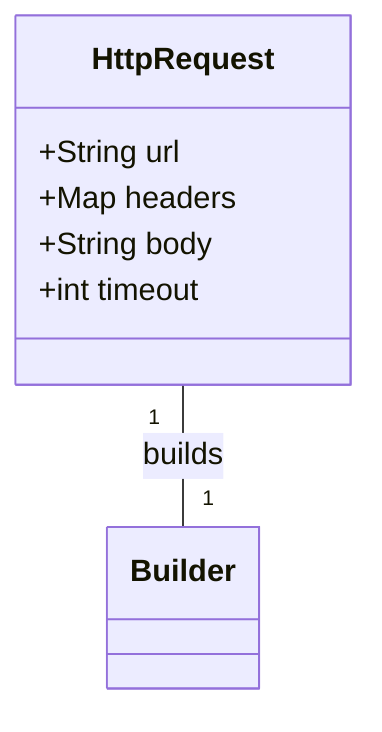

**Java example:**

```java
public class HttpRequest {
    private final String url;
    private final Map<String,String> headers;
    private final String body;
    private final int timeoutMs;

    private HttpRequest(Builder b) {
        this.url = b.url;
        this.headers = Collections.unmodifiableMap(new HashMap<>(b.headers));
        this.body = b.body;
        this.timeoutMs = b.timeoutMs;
    }

    public static class Builder {
        private final String url; // required
        private Map<String,String> headers = new HashMap<>();
        private String body = null;
        private int timeoutMs = 5000;

        public Builder(String url) { this.url = url; }
        public Builder addHeader(String k, String v) { headers.put(k,v); return this; }
        public Builder body(String body) { this.body = body; return this; }
        public Builder timeoutMs(int t) { this.timeoutMs = t; return this; }
        public HttpRequest build() { return new HttpRequest(this); }
    }

    @Override
    public String toString() {
        return "HttpRequest{" + "url='" + url + '\'' + ", headers=" + headers + ", body='" + body + '\'' + ", timeoutMs=" + timeoutMs + '}';
    }
}

// Usage
// HttpRequest req = new HttpRequest.Builder("https://api.example.com/users")
//     .addHeader("Authorization","Bearer xyz")
//     .body("{\"name\":\"alice\"}")
//     .timeoutMs(10000)
//     .build();
```

**Notes:** Immutable object, thread-safe (after construction), fluent readability.

---

# 2) Adapter Pattern — Payment Provider Adapter

**When to use:** Convert one interface to another. Useful when integrating third-party libraries with your internal interfaces.

**Real-time example:** Your app has a `PaymentProcessor` interface. You integrate `StripeSdk` and `LegacyPay` with different APIs — adapters wrap them.

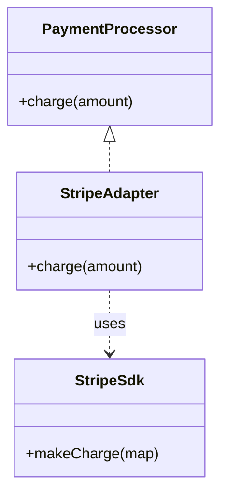

**Java example:**

```java
// Your app interface
public interface PaymentProcessor {
    boolean charge(String customerId, double amount);
}

// Third-party SDK that doesn't match our interface
public class StripeSdk {
    public String makeCharge(Map<String,Object> payload) {
        // returns charge id
        return "ch_123";
    }
}

// Adapter
public class StripeAdapter implements PaymentProcessor {
    private final StripeSdk sdk;
    public StripeAdapter(StripeSdk sdk) { this.sdk = sdk; }

    @Override
    public boolean charge(String customerId, double amount) {
        Map<String,Object> payload = new HashMap<>();
        payload.put("customer", customerId);
        payload.put("amount", (long)(amount * 100));
        String chargeId = sdk.makeCharge(payload);
        return chargeId != null;
    }
}
```

**Notes:** Adapters allow swapping providers without touching business logic.

---

# 3) Bridge Pattern — Remote Control / Device Renderer

**When to use:** Decouple an abstraction from its implementation so they can vary independently. Useful for platform-specific renderers, or UI vs Headless implementations.

**Real-time example:** A `RemoteControl` abstraction controls different `Device` implementations (TV, Radio, SmartLight) — the abstraction and implementation evolve independently.

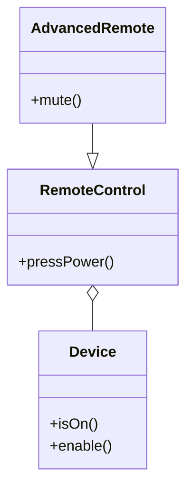

**Java example:**

```java
// Implementor
public interface Device {
    boolean isEnabled();
    void enable();
    void disable();
    int getVolume();
    void setVolume(int percent);
}

// Concrete Implementor A
public class TvDevice implements Device {
    private boolean on = false;
    private int volume = 30;
    public boolean isEnabled() { return on; }
    public void enable() { on = true; }
    public void disable() { on = false; }
    public int getVolume() { return volume; }
    public void setVolume(int percent) { this.volume = percent; }
}

// Abstraction
public class RemoteControl {
    protected Device device;
    public RemoteControl(Device device) { this.device = device; }
    public void togglePower() { if(device.isEnabled()) device.disable(); else device.enable(); }
    public void volumeUp() { device.setVolume(device.getVolume() + 10); }
}

// Refined Abstraction
public class AdvancedRemote extends RemoteControl {
    public AdvancedRemote(Device d) { super(d); }
    public void mute() { device.setVolume(0); }
}
```

**Notes:** Bridge is like strategy but focused on separating abstraction and implementation hierarchies.

---

# 4) Factory Pattern — Notification Factory

**When to use:** Encapsulate object creation. Use Factory Method for single-product families, Abstract Factory for related products.

**Real-time example:** Creating `Notification` objects (Email, SMS, Push) depending on runtime config.

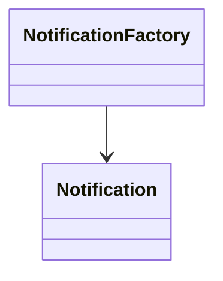

**Java example (Factory Method):**

```java
public interface Notification { void send(String to, String message); }
public class EmailNotification implements Notification { public void send(String to, String message){ /* smtp */ } }
public class SmsNotification implements Notification { public void send(String to, String message){ /* sms gateway */ } }

public class NotificationFactory {
    public static Notification create(String type){
        switch(type.toLowerCase()){
            case "email": return new EmailNotification();
            case "sms": return new SmsNotification();
            default: throw new IllegalArgumentException("Unknown");
        }
    }
}

// Usage: Notification n = NotificationFactory.create("email"); n.send(...);
```

**Abstract Factory (multiple related products):**

```java
public interface MessagingFactory {
    Notification createNotification();
    TemplateRenderer createRenderer();
}

// Concrete factories for e.g., "Transactional" vs "Promotional" flows.
```

**Notes:** Factories centralize and hide creation logic.

---

# 5) Observer Pattern — Stock Price Ticker / Event Bus

**When to use:** One-to-many dependency; observers automatically update when subject changes.

**Real-time example:** Market data feed updates many subscribers (UI charts, alert system, persistent logger).

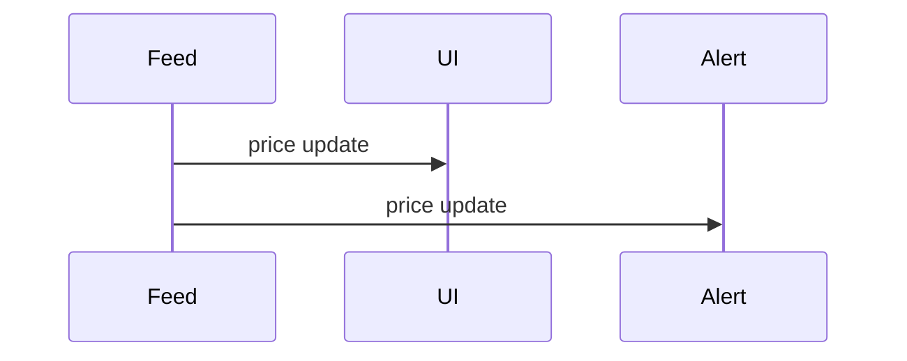

**Java example:**

```java
public interface Observer { void update(String symbol, double price); }
public interface Subject {
    void register(Observer o);
    void unregister(Observer o);
    void notifyObservers();
}

public class StockTicker implements Subject {
    private final List<Observer> observers = new CopyOnWriteArrayList<>();
    private String symbol;
    private double price;

    public void register(Observer o) { observers.add(o); }
    public void unregister(Observer o) { observers.remove(o); }
    public void setPrice(String symbol, double price){ this.symbol = symbol; this.price = price; notifyObservers(); }
    public void notifyObservers(){ for(Observer o : observers) o.update(symbol, price); }
}

// Usage: UI and Alert implement Observer and register to StockTicker
```

**Notes:** Use thread-safe lists for concurrent updates; consider Reactive streams for more advanced use.

---

# 6) Chain of Responsibility — HTTP Request Filters / Support Ticket Handlers

**When to use:** Multiple handlers may process a request; pass along a chain until handled.

**Real-time example:** HTTP request processing pipeline: authentication -> rate-limiting -> validation -> business handling.

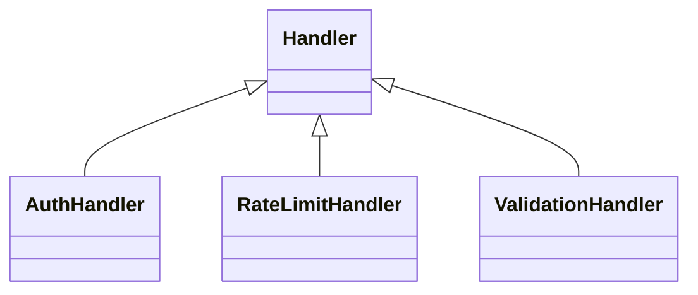

**Java example:**

```java
public abstract class Handler {
    protected Handler next;
    public Handler setNext(Handler next){ this.next = next; return next; }
    public abstract void handle(Request req);
}

public class AuthHandler extends Handler {
    @Override
    public void handle(Request req){
        if(!req.hasHeader("Authorization")){
            req.fail(401,"Unauthorized"); return;
        }
        if(next != null) next.handle(req);
    }
}

public class RateLimitHandler extends Handler { /* checks counters then next.handle(req) */ }

// Request class holds state and easy fail() method
```

**Notes:** Chain allows dynamic assembly of pipelines. In frameworks, middleware stacks are implemented this way.

---

# Tips, Anti-patterns & When to Combine

* **Builder** + **Factory**: combine when you need complex construction with interchangeable factories.
* **Adapter** vs **Bridge**: Adapter wraps an existing component; Bridge is design-time separation of abstraction and implementation.
* Avoid overuse: don't create patterns where simple code suffices.

---

I'll extend your design patterns collection with more real-world patterns commonly used in Java enterprise applications. Here's a comprehensive markdown document with additional patterns:

# Java Design Patterns — Extended Real-World Examples

## Additional Patterns (7-18)

---

# 7) Singleton Pattern — Database Connection Pool

**When to use:** Ensure only one instance exists throughout the application. Common for connection pools, config managers, caches.

**Real-time example:** Database connection pool manager that maintains a single pool of reusable connections.

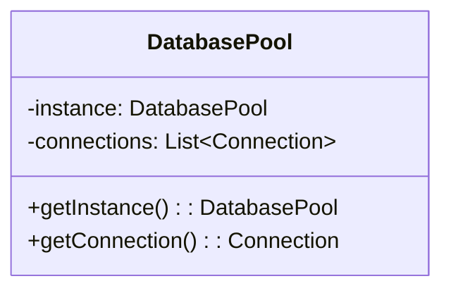

**Java example:**

```java
public class DatabasePool {
    private static volatile DatabasePool instance;
    private final List<Connection> availableConnections;
    private final List<Connection> usedConnections;
    private static final int MAX_POOL_SIZE = 10;
    
    private DatabasePool() {
        availableConnections = new ArrayList<>();
        usedConnections = new ArrayList<>();
        for(int i = 0; i < MAX_POOL_SIZE; i++) {
            availableConnections.add(createConnection());
        }
    }
    
    // Thread-safe lazy initialization
    public static DatabasePool getInstance() {
        if (instance == null) {
            synchronized (DatabasePool.class) {
                if (instance == null) {
                    instance = new DatabasePool();
                }
            }
        }
        return instance;
    }
    
    public synchronized Connection getConnection() {
        if (availableConnections.isEmpty()) {
            throw new RuntimeException("No connections available");
        }
        Connection conn = availableConnections.remove(0);
        usedConnections.add(conn);
        return conn;
    }
    
    public synchronized void releaseConnection(Connection conn) {
        usedConnections.remove(conn);
        availableConnections.add(conn);
    }
    
    private Connection createConnection() {
        // return DriverManager.getConnection(url, user, pass);
        return new MockConnection();
    }
}
```

**Notes:** Double-checked locking for thread safety. Consider using enum for simpler singleton implementation.

---

# 8) Strategy Pattern — Payment Processing Strategy

**When to use:** Define a family of algorithms, encapsulate each one, and make them interchangeable at runtime.

**Real-time example:** E-commerce checkout with multiple payment methods (Credit Card, PayPal, Crypto).

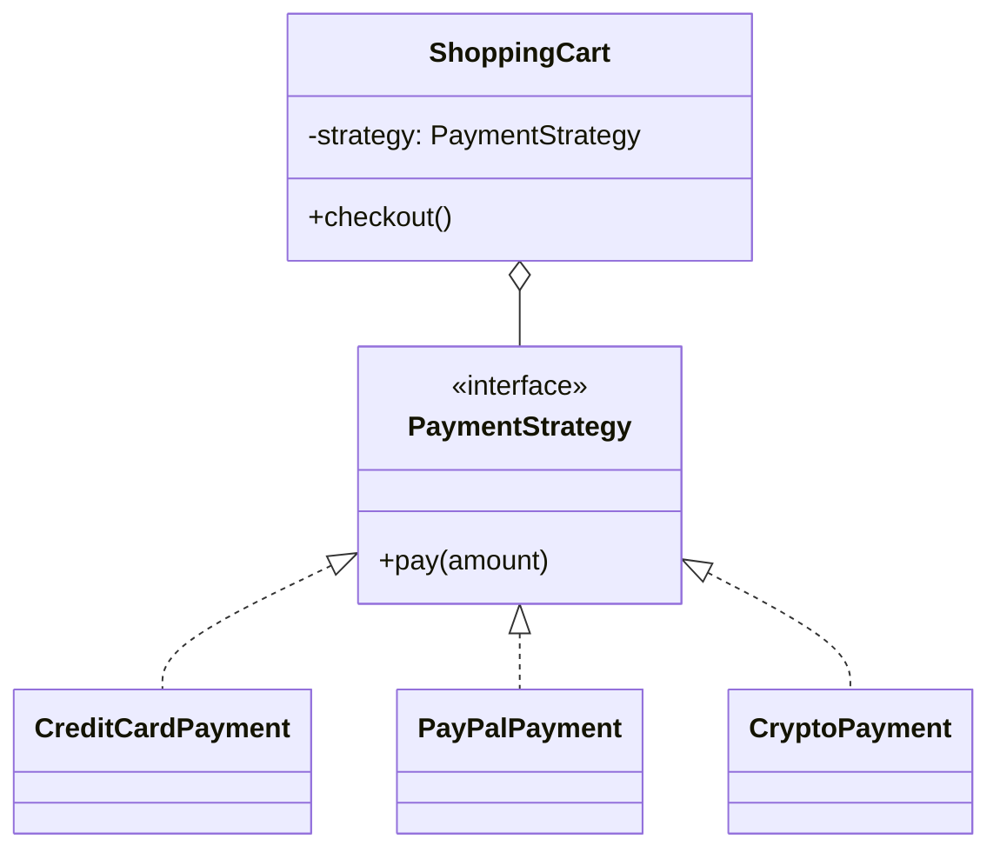

**Java example:**

```java
public interface PaymentStrategy {
    PaymentResult pay(double amount);
}

public class CreditCardPayment implements PaymentStrategy {
    private String cardNumber;
    private String cvv;
    
    public CreditCardPayment(String cardNumber, String cvv) {
        this.cardNumber = cardNumber;
        this.cvv = cvv;
    }
    
    @Override
    public PaymentResult pay(double amount) {
        // Validate card, charge via payment gateway
        System.out.println("Paid $" + amount + " via Credit Card");
        return new PaymentResult(true, "CC_" + System.currentTimeMillis());
    }
}

public class PayPalPayment implements PaymentStrategy {
    private String email;
    
    public PayPalPayment(String email) {
        this.email = email;
    }
    
    @Override
    public PaymentResult pay(double amount) {
        // PayPal API integration
        System.out.println("Paid $" + amount + " via PayPal");
        return new PaymentResult(true, "PP_" + System.currentTimeMillis());
    }
}

public class ShoppingCart {
    private List<Item> items = new ArrayList<>();
    private PaymentStrategy paymentStrategy;
    
    public void setPaymentStrategy(PaymentStrategy strategy) {
        this.paymentStrategy = strategy;
    }
    
    public void checkout() {
        double total = items.stream().mapToDouble(Item::getPrice).sum();
        PaymentResult result = paymentStrategy.pay(total);
        if(result.isSuccess()) {
            System.out.println("Order confirmed: " + result.getTransactionId());
        }
    }
}

// Usage:
// cart.setPaymentStrategy(new CreditCardPayment("1234-5678", "123"));
// cart.checkout();
```

---

# 9) Decorator Pattern — Feature Toggle / Request Enhancement

**When to use:** Add responsibilities to objects dynamically without altering their structure.

**Real-time example:** HTTP request processing with compression, encryption, logging layers.

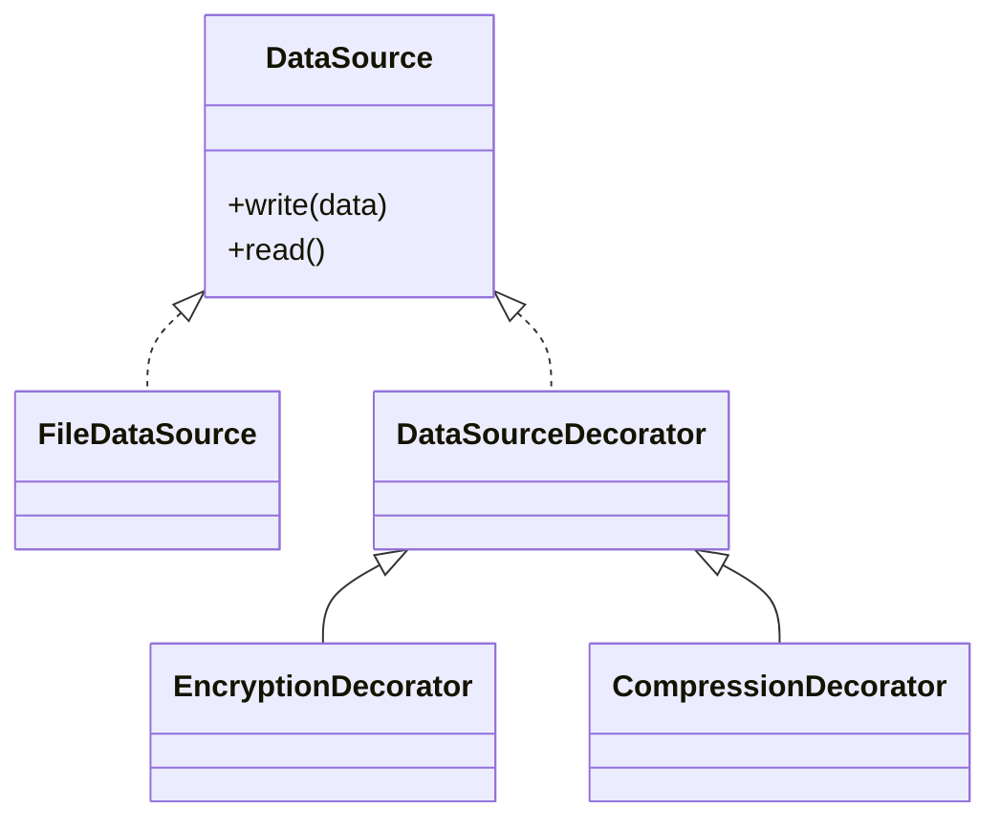

**Java example:**

```java
public interface DataSource {
    void writeData(String data);
    String readData();
}

public class FileDataSource implements DataSource {
    private String filename;
    
    public FileDataSource(String filename) {
        this.filename = filename;
    }
    
    @Override
    public void writeData(String data) {
        // Write to file
        System.out.println("Writing to file: " + data);
    }
    
    @Override
    public String readData() {
        // Read from file
        return "file_content";
    }
}

public abstract class DataSourceDecorator implements DataSource {
    protected DataSource wrappee;
    
    public DataSourceDecorator(DataSource source) {
        this.wrappee = source;
    }
    
    @Override
    public void writeData(String data) {
        wrappee.writeData(data);
    }
    
    @Override
    public String readData() {
        return wrappee.readData();
    }
}

public class EncryptionDecorator extends DataSourceDecorator {
    public EncryptionDecorator(DataSource source) {
        super(source);
    }
    
    @Override
    public void writeData(String data) {
        String encrypted = encrypt(data);
        super.writeData(encrypted);
    }
    
    @Override
    public String readData() {
        String data = super.readData();
        return decrypt(data);
    }
    
    private String encrypt(String data) {
        return Base64.getEncoder().encodeToString(data.getBytes());
    }
    
    private String decrypt(String data) {
        return new String(Base64.getDecoder().decode(data));
    }
}

public class CompressionDecorator extends DataSourceDecorator {
    public CompressionDecorator(DataSource source) {
        super(source);
    }
    
    @Override
    public void writeData(String data) {
        String compressed = compress(data);
        super.writeData(compressed);
    }
    
    private String compress(String data) {
        // Compression logic (e.g., GZIP)
        return "compressed_" + data;
    }
}

// Usage: Stack decorators
// DataSource source = new CompressionDecorator(
//     new EncryptionDecorator(
//         new FileDataSource("data.txt")
//     )
// );
```

---

# 10) Template Method Pattern — Data Import Pipeline

**When to use:** Define skeleton of algorithm in base class, let subclasses override specific steps.

**Real-time example:** ETL pipeline for importing data from different sources (CSV, JSON, XML).

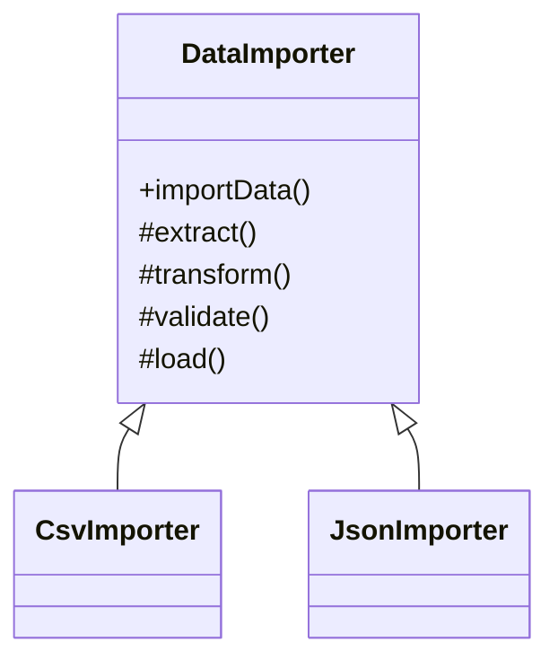

**Java example:**

```java
public abstract class DataImporter {
    // Template method
    public final ImportResult importData(String source) {
        try {
            List<Map<String,Object>> rawData = extract(source);
            List<Record> records = transform(rawData);
            ValidationResult validation = validate(records);
            if (!validation.isValid()) {
                return ImportResult.failed(validation.getErrors());
            }
            int count = load(records);
            postProcess(records);
            return ImportResult.success(count);
        } catch (Exception e) {
            return ImportResult.failed(e.getMessage());
        }
    }
    
    // Abstract methods to be implemented
    protected abstract List<Map<String,Object>> extract(String source);
    protected abstract List<Record> transform(List<Map<String,Object>> rawData);
    
    // Concrete method with default implementation
    protected ValidationResult validate(List<Record> records) {
        // Default validation
        for (Record r : records) {
            if (r.getId() == null) {
                return ValidationResult.invalid("Missing ID");
            }
        }
        return ValidationResult.valid();
    }
    
    // Hook method (optional override)
    protected void postProcess(List<Record> records) {
        // Default: do nothing
    }
    
    private int load(List<Record> records) {
        // Save to database
        return records.size();
    }
}

public class CsvImporter extends DataImporter {
    @Override
    protected List<Map<String,Object>> extract(String source) {
        // Parse CSV file
        List<Map<String,Object>> data = new ArrayList<>();
        // CSV parsing logic
        return data;
    }
    
    @Override
    protected List<Record> transform(List<Map<String,Object>> rawData) {
        return rawData.stream()
            .map(row -> new Record(
                row.get("id").toString(),
                row.get("name").toString()
            ))
            .collect(Collectors.toList());
    }
    
    @Override
    protected void postProcess(List<Record> records) {
        // Send notification after CSV import
        System.out.println("CSV import completed: " + records.size());
    }
}
```

---

# 11) Proxy Pattern — Cache Proxy / Lazy Loading

**When to use:** Provide a placeholder/surrogate for another object to control access to it.

**Real-time example:** Database query cache proxy, image lazy loading, security proxy for service calls.

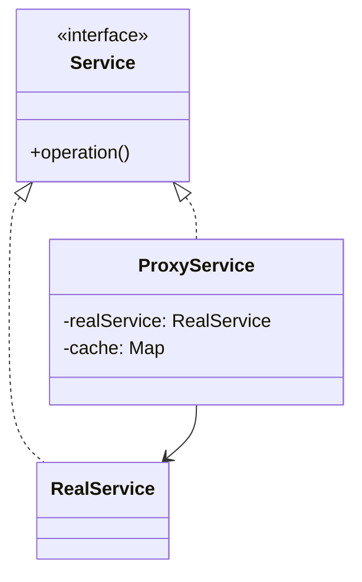

**Java example:**

```java
public interface DatabaseService {
    List<User> getUsers();
    User getUserById(String id);
}

public class RealDatabaseService implements DatabaseService {
    @Override
    public List<User> getUsers() {
        // Expensive database query
        System.out.println("Fetching users from database...");
        simulateSlowQuery();
        return Arrays.asList(
            new User("1", "Alice"),
            new User("2", "Bob")
        );
    }
    
    @Override
    public User getUserById(String id) {
        System.out.println("Fetching user " + id + " from database...");
        simulateSlowQuery();
        return new User(id, "User" + id);
    }
    
    private void simulateSlowQuery() {
        try { Thread.sleep(1000); } catch (InterruptedException e) {}
    }
}

public class CachingProxyService implements DatabaseService {
    private RealDatabaseService realService;
    private Map<String, User> userCache = new HashMap<>();
    private List<User> allUsersCache;
    private long cacheExpiry = 60000; // 1 minute
    private long lastFetch;
    
    public CachingProxyService() {
        this.realService = new RealDatabaseService();
    }
    
    @Override
    public List<User> getUsers() {
        if (allUsersCache == null || isCacheExpired()) {
            allUsersCache = realService.getUsers();
            lastFetch = System.currentTimeMillis();
        } else {
            System.out.println("Returning cached users");
        }
        return allUsersCache;
    }
    
    @Override
    public User getUserById(String id) {
        if (!userCache.containsKey(id)) {
            userCache.put(id, realService.getUserById(id));
        } else {
            System.out.println("Returning cached user: " + id);
        }
        return userCache.get(id);
    }
    
    private boolean isCacheExpired() {
        return System.currentTimeMillis() - lastFetch > cacheExpiry;
    }
}

// Security Proxy Example
public class SecurityProxy implements DatabaseService {
    private DatabaseService service;
    private String userRole;
    
    public SecurityProxy(DatabaseService service, String userRole) {
        this.service = service;
        this.userRole = userRole;
    }
    
    @Override
    public List<User> getUsers() {
        if ("ADMIN".equals(userRole)) {
            return service.getUsers();
        }
        throw new SecurityException("Unauthorized access");
    }
}
```

---

# 12) Command Pattern — Undo/Redo Operations

**When to use:** Encapsulate requests as objects, allowing you to parameterize clients with queues, requests, and operations.

**Real-time example:** Text editor with undo/redo, macro recording, queued database operations.

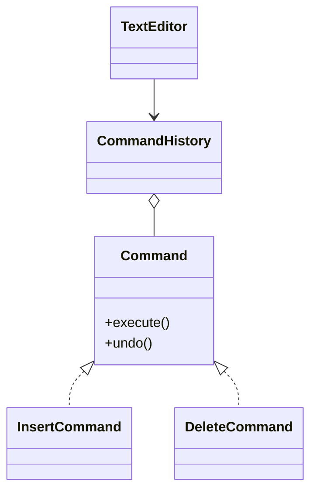

**Java example:**

```java
public interface Command {
    void execute();
    void undo();
    String getDescription();
}

public class TextEditor {
    private StringBuilder content = new StringBuilder();
    
    public void insert(int position, String text) {
        content.insert(position, text);
    }
    
    public void delete(int position, int length) {
        content.delete(position, position + length);
    }
    
    public String getContent() {
        return content.toString();
    }
}

public class InsertCommand implements Command {
    private TextEditor editor;
    private int position;
    private String text;
    
    public InsertCommand(TextEditor editor, int position, String text) {
        this.editor = editor;
        this.position = position;
        this.text = text;
    }
    
    @Override
    public void execute() {
        editor.insert(position, text);
    }
    
    @Override
    public void undo() {
        editor.delete(position, text.length());
    }
    
    @Override
    public String getDescription() {
        return "Insert '" + text + "' at position " + position;
    }
}

public class DeleteCommand implements Command {
    private TextEditor editor;
    private int position;
    private int length;
    private String deletedText;
    
    public DeleteCommand(TextEditor editor, int position, int length) {
        this.editor = editor;
        this.position = position;
        this.length = length;
    }
    
    @Override
    public void execute() {
        deletedText = editor.getContent().substring(position, position + length);
        editor.delete(position, length);
    }
    
    @Override
    public void undo() {
        editor.insert(position, deletedText);
    }
    
    @Override
    public String getDescription() {
        return "Delete " + length + " characters at position " + position;
    }
}

public class CommandHistory {
    private Stack<Command> history = new Stack<>();
    private Stack<Command> redoStack = new Stack<>();
    
    public void executeCommand(Command cmd) {
        cmd.execute();
        history.push(cmd);
        redoStack.clear(); // Clear redo stack on new command
    }
    
    public void undo() {
        if (!history.isEmpty()) {
            Command cmd = history.pop();
            cmd.undo();
            redoStack.push(cmd);
        }
    }
    
    public void redo() {
        if (!redoStack.isEmpty()) {
            Command cmd = redoStack.pop();
            cmd.execute();
            history.push(cmd);
        }
    }
}

// Usage:
// TextEditor editor = new TextEditor();
// CommandHistory history = new CommandHistory();
// history.executeCommand(new InsertCommand(editor, 0, "Hello"));
// history.executeCommand(new InsertCommand(editor, 5, " World"));
// history.undo(); // Removes " World"
// history.redo(); // Re-adds " World"
```

---

# 13) State Pattern — Order Processing State Machine

**When to use:** Object behavior changes based on its state. Appears as if the object changed its class.

**Real-time example:** E-commerce order states (New, Paid, Shipped, Delivered, Cancelled).

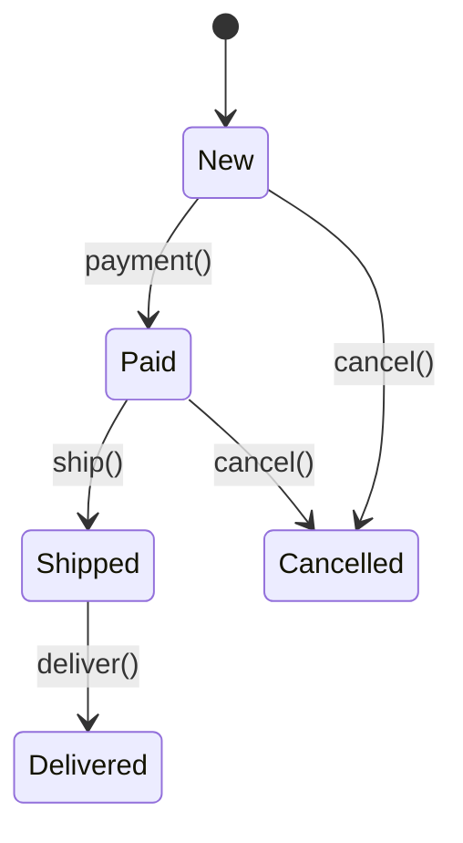

**Java example:**

```java
public interface OrderState {
    void pay(OrderContext context);
    void ship(OrderContext context);
    void deliver(OrderContext context);
    void cancel(OrderContext context);
    String getStatus();
}

public class OrderContext {
    private OrderState currentState;
    private String orderId;
    private double amount;
    
    public OrderContext(String orderId, double amount) {
        this.orderId = orderId;
        this.amount = amount;
        this.currentState = new NewOrderState();
    }
    
    public void setState(OrderState state) {
        this.currentState = state;
        System.out.println("Order " + orderId + " state: " + state.getStatus());
    }
    
    public void pay() { currentState.pay(this); }
    public void ship() { currentState.ship(this); }
    public void deliver() { currentState.deliver(this); }
    public void cancel() { currentState.cancel(this); }
}

public class NewOrderState implements OrderState {
    @Override
    public void pay(OrderContext context) {
        System.out.println("Processing payment...");
        context.setState(new PaidOrderState());
    }
    
    @Override
    public void ship(OrderContext context) {
        System.out.println("Cannot ship unpaid order");
    }
    
    @Override
    public void deliver(OrderContext context) {
        System.out.println("Cannot deliver unpaid order");
    }
    
    @Override
    public void cancel(OrderContext context) {
        System.out.println("Cancelling order");
        context.setState(new CancelledOrderState());
    }
    
    @Override
    public String getStatus() { return "NEW"; }
}

public class PaidOrderState implements OrderState {
    @Override
    public void pay(OrderContext context) {
        System.out.println("Order already paid");
    }
    
    @Override
    public void ship(OrderContext context) {
        System.out.println("Shipping order...");
        context.setState(new ShippedOrderState());
    }
    
    @Override
    public void deliver(OrderContext context) {
        System.out.println("Cannot deliver unshipped order");
    }
    
    @Override
    public void cancel(OrderContext context) {
        System.out.println("Initiating refund and cancelling");
        context.setState(new CancelledOrderState());
    }
    
    @Override
    public String getStatus() { return "PAID"; }
}

// Similar implementations for ShippedOrderState, DeliveredOrderState, CancelledOrderState
```

---

# 14) Facade Pattern — Microservice API Gateway

**When to use:** Provide a unified interface to a set of interfaces in a subsystem.

**Real-time example:** API Gateway that orchestrates multiple microservices for a single client operation.

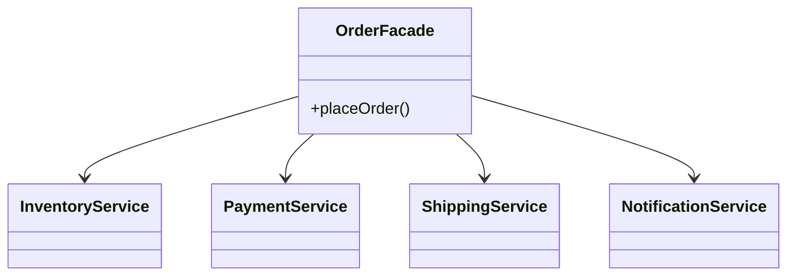

**Java example:**

```java
// Complex subsystem components
public class InventoryService {
    public boolean checkStock(String productId, int quantity) {
        System.out.println("Checking inventory for " + productId);
        return true; // Simplified
    }
    
    public void reserveItems(String productId, int quantity) {
        System.out.println("Reserving " + quantity + " items of " + productId);
    }
}

public class PaymentService {
    public String processPayment(String customerId, double amount, String method) {
        System.out.println("Processing payment of $" + amount);
        return "PAY_" + System.currentTimeMillis();
    }
    
    public void refund(String transactionId, double amount) {
        System.out.println("Refunding $" + amount);
    }
}

public class ShippingService {
    public String createShipment(String orderId, Address address) {
        System.out.println("Creating shipment for order " + orderId);
        return "SHIP_" + System.currentTimeMillis();
    }
    
    public double calculateShipping(Address address, double weight) {
        return 10.0; // Simplified
    }
}

public class NotificationService {
    public void sendEmail(String to, String subject, String body) {
        System.out.println("Sending email to " + to + ": " + subject);
    }
    
    public void sendSms(String phone, String message) {
        System.out.println("Sending SMS to " + phone);
    }
}

// Facade
public class OrderFacade {
    private InventoryService inventory;
    private PaymentService payment;
    private ShippingService shipping;
    private NotificationService notification;
    
    public OrderFacade() {
        this.inventory = new InventoryService();
        this.payment = new PaymentService();
        this.shipping = new ShippingService();
        this.notification = new NotificationService();
    }
    
    public OrderResult placeOrder(OrderRequest request) {
        try {
            // Check inventory
            if (!inventory.checkStock(request.getProductId(), request.getQuantity())) {
                return OrderResult.failed("Out of stock");
            }
            
            // Reserve items
            inventory.reserveItems(request.getProductId(), request.getQuantity());
            
            // Calculate total with shipping
            double shippingCost = shipping.calculateShipping(
                request.getAddress(), request.getWeight()
            );
            double total = request.getPrice() + shippingCost;
            
            // Process payment
            String transactionId = payment.processPayment(
                request.getCustomerId(), total, request.getPaymentMethod()
            );
            
            // Create shipment
            String shipmentId = shipping.createShipment(
                request.getOrderId(), request.getAddress()
            );
            
            // Send notifications
            notification.sendEmail(
                request.getEmail(),
                "Order Confirmed",
                "Your order " + request.getOrderId() + " has been placed"
            );
            
            return OrderResult.success(request.getOrderId(), transactionId, shipmentId);
            
        } catch (Exception e) {
            // Rollback operations
            return OrderResult.failed(e.getMessage());
        }
    }
}

// Usage: Single method call instead of orchestrating multiple services
// OrderFacade facade = new OrderFacade();
// OrderResult result = facade.placeOrder(orderRequest);
```

---

# 15) Composite Pattern — Organization Hierarchy / File System

**When to use:** Compose objects into tree structures. Treat individual objects and compositions uniformly.

**Real-time example:** Company organization chart, file system directories, UI component trees.

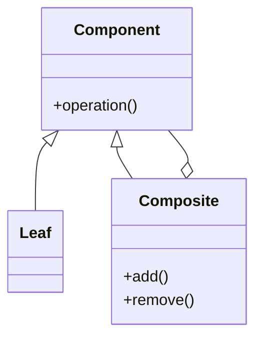

**Java example:**

```java
// Component
public abstract class Employee {
    protected String name;
    protected String position;
    protected double salary;
    
    public Employee(String name, String position, double salary) {
        this.name = name;
        this.position = position;
        this.salary = salary;
    }
    
    public abstract void showDetails();
    public abstract double getTotalSalary();
}

// Leaf
public class Developer extends Employee {
    public Developer(String name, double salary) {
        super(name, "Developer", salary);
    }
    
    @Override
    public void showDetails() {
        System.out.println("  Developer: " + name + ", Salary: $" + salary);
    }
    
    @Override
    public double getTotalSalary() {
        return salary;
    }
}

// Composite
public class Manager extends Employee {
    private List<Employee> subordinates = new ArrayList<>();
    
    public Manager(String name, double salary) {
        super(name, "Manager", salary);
    }
    
    public void addEmployee(Employee employee) {
        subordinates.add(employee);
    }
    
    public void removeEmployee(Employee employee) {
        subordinates.remove(employee);
    }
    
    @Override
    public void showDetails() {
        System.out.println("Manager: " + name + ", Salary: $" + salary);
        System.out.println("Team:");
        for (Employee emp : subordinates) {
            emp.showDetails();
        }
    }
    
    @Override
    public double getTotalSalary() {
        double total = salary;
        for (Employee emp : subordinates) {
            total += emp.getTotalSalary();
        }
        return total;
    }
}

// File System Example
public interface FileSystemComponent {
    String getName();
    long getSize();
    void display(String indent);
}

public class File implements FileSystemComponent {
    private String name;
    private long size;
    
    public File(String name, long size) {
        this.name = name;
        this.size = size;
    }
    
    @Override
    public String getName() { return name; }
    
    @Override
    public long getSize() { return size; }
    
    @Override
    public void display(String indent) {
        System.out.println(indent + "📄 " + name + " (" + size + " bytes)");
    }
}

public class Directory implements FileSystemComponent {
    private String name;
    private List<FileSystemComponent> components = new ArrayList<>();
    
    public Directory(String name) {
        this.name = name;
    }
    
    public void add(FileSystemComponent component) {
        components.add(component);
    }
    
    @Override
    public String getName() { return name; }
    
    @Override
    public long getSize() {
        return components.stream().mapToLong(FileSystemComponent::getSize).sum();
    }
    
    @Override
    public void display(String indent) {
        System.out.println(indent + "📁 " + name + "/");
        for (FileSystemComponent component : components) {
            component.display(indent + "  ");
        }
    }
}
```

---

# 16) Iterator Pattern — Custom Collection Traversal

**When to use:** Provide a way to access elements of a collection sequentially without exposing underlying structure.

**Real-time example:** Paginated API results, social media feed iteration, custom data structures.

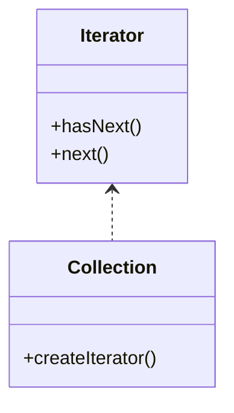

**Java example:**

```java
// Custom collection for paginated API results
public class PaginatedResults<T> implements Iterable<T> {
    private List<List<T>> pages = new ArrayList<>();
    private int pageSize;
    
    public PaginatedResults(int pageSize) {
        this.pageSize = pageSize;
    }
    
    public void addItems(List<T> items) {
        for (int i = 0; i < items.size(); i += pageSize) {
            int end = Math.min(i + pageSize, items.size());
            pages.add(items.subList(i, end));
        }
    }
    
    @Override
    public Iterator<T> iterator() {
        return new PaginatedIterator();
    }
    
    private class PaginatedIterator implements Iterator<T> {
        private int currentPage = 0;
        private int currentItem = 0;
        
        @Override
        public boolean hasNext() {
            if (currentPage >= pages.size()) return false;
            if (currentItem < pages.get(currentPage).size()) return true;
            return currentPage + 1 < pages.size();
        }
        
        @Override
        public T next() {
            if (!hasNext()) throw new NoSuchElementException();
            
            if (currentItem >= pages.get(currentPage).size()) {
                currentPage++;
                currentItem = 0;
            }
            
            return pages.get(currentPage).get(currentItem++);
        }
    }
}

// Binary tree iterator (in-order traversal)
public class BinaryTree<T> implements Iterable<T> {
    private Node<T> root;
    
    private static class Node<T> {
        T data;
        Node<T> left, right;
        
        Node(T data) {
            this.data = data;
        }
    }
    
    @Override
    public Iterator<T> iterator() {
        return new InOrderIterator();
    }
    
    private class InOrderIterator implements Iterator<T> {
        private Stack<Node<T>> stack = new Stack<>();
        
        public InOrderIterator() {
            pushLeft(root);
        }
        
        private void pushLeft(Node<T> node) {
            while (node != null) {
                stack.push(node);
                node = node.left;
            }
        }
        
        @Override
        public boolean hasNext() {
            return !stack.isEmpty();
        }
        
        @Override
        public T next() {
            if (!hasNext()) throw new NoSuchElementException();
            
            Node<T> node = stack.pop();
            T result = node.data;
            
            if (node.right != null) {
                pushLeft(node.right);
            }
            
            return result;
        }
    }
}
```

---

# 17) Mediator Pattern — Chat Room / Event Bus

**When to use:** Define object interaction without tight coupling. Centralize complex communications.

**Real-time example:** Chat room server, air traffic control, event bus in microservices.

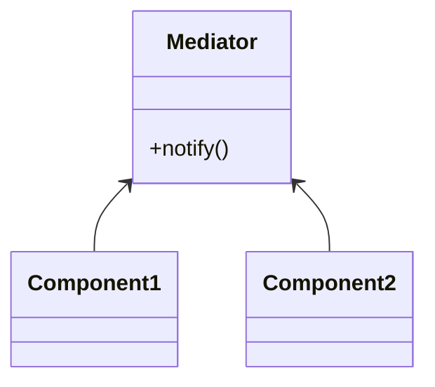

**Java example:**

```java
// Mediator interface
public interface ChatMediator {
    void sendMessage(String message, User user);
    void addUser(User user);
}

// Concrete mediator
public class ChatRoom implements ChatMediator {
    private List<User> users = new ArrayList<>();
    
    @Override
    public void addUser(User user) {
        users.add(user);
        broadcast(user.getName() + " joined the chat", null);
    }
    
    @Override
    public void sendMessage(String message, User sender) {
        String formattedMsg = "[" + sender.getName() + "]: " + message;
        broadcast(formattedMsg, sender);
        logMessage(formattedMsg);
    }
    
    private void broadcast(String message, User sender) {
        for (User user : users) {
            if (user != sender) {
                user.receive(message);
            }
        }
    }
    
    private void logMessage(String message) {
        System.out.println("LOG: " + message);
    }
}

// Component
public abstract class User {
    protected ChatMediator mediator;
    protected String name;
    
    public User(ChatMediator mediator, String name) {
        this.mediator = mediator;
        this.name = name;
    }
    
    public abstract void send(String message);
    public abstract void receive(String message);
    
    public String getName() { return name; }
}

// Concrete components
public class ChatUser extends User {
    public ChatUser(ChatMediator mediator, String name) {
        super(mediator, name);
    }
    
    @Override
    public void send(String message) {
        System.out.println(name + " sending: " + message);
        mediator.sendMessage(message, this);
    }
    
    @Override
    public void receive(String message) {
        System.out.println(name + " received: " + message);
    }
}

// Event Bus Example for Microservices
public class EventBus {
    private Map<String, List<EventHandler>> handlers = new HashMap<>();
    
    public void register(String eventType, EventHandler handler) {
        handlers.computeIfAbsent(eventType, k -> new ArrayList<>()).add(handler);
    }
    
    public void publish(Event event) {
        String type = event.getType();
        if (handlers.containsKey(type)) {
            for (EventHandler handler : handlers.get(type)) {
                handler.handle(event);
            }
        }
    }
}

@FunctionalInterface
public interface EventHandler {
    void handle(Event event);
}

// Usage:
// EventBus bus = new EventBus();
// bus.register("ORDER_CREATED", event -> inventoryService.reserve(event));
// bus.register("ORDER_CREATED", event -> emailService.sendConfirmation(event));
// bus.publish(new Event("ORDER_CREATED", orderData));
```

---

# 18) Flyweight Pattern — Object Pool / Cache

**When to use:** Minimize memory usage by sharing data between similar objects.

**Real-time example:** Game character rendering (sharing textures), database connection pooling, string intern pool.

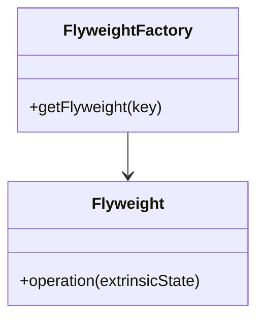

**Java example:**

```java
// Flyweight interface
public interface CharacterFlyweight {
    void display(int x, int y, String color);
}

// Concrete flyweight (intrinsic state)
public class CharacterType implements CharacterFlyweight {
    private final char symbol;
    private final String font;
    private final int size;
    
    public CharacterType(char symbol, String font, int size) {
        this.symbol = symbol;
        this.font = font;
        this.size = size;
        System.out.println("Creating character type: " + symbol);
    }
    
    @Override
    public void display(int x, int y, String color) {
        // Extrinsic state (position, color) passed as parameters
        System.out.printf("Character '%c' [%s, %d] at (%d,%d) in %s%n", 
            symbol, font, size, x, y, color);
    }
}

// Flyweight factory
public class CharacterFactory {
    private Map<String, CharacterFlyweight> characterPool = new HashMap<>();
    
    public CharacterFlyweight getCharacter(char symbol, String font, int size) {
        String key = symbol + "_" + font + "_" + size;
        
        if (!characterPool.containsKey(key)) {
            characterPool.put(key, new CharacterType(symbol, font, size));
        }
        
        return characterPool.get(key);
    }
    
    public int getPoolSize() {
        return characterPool.size();
    }
}

// Document editor using flyweights
public class Document {
    private List<Character> characters = new ArrayList<>();
    private CharacterFactory factory = new CharacterFactory();
    
    private class Character {
        private CharacterFlyweight type;
        private int x, y;
        private String color;
        
        public Character(CharacterFlyweight type, int x, int y, String color) {
            this.type = type;
            this.x = x;
            this.y = y;
            this.color = color;
        }
        
        public void display() {
            type.display(x, y, color);
        }
    }
    
    public void addCharacter(char c, String font, int size, int x, int y, String color) {
        CharacterFlyweight type = factory.getCharacter(c, font, size);
        characters.add(new Character(type, x, y, color));
    }
    
    public void display() {
        for (Character c : characters) {
            c.display();
        }
        System.out.println("Total character objects: " + characters.size());
        System.out.println("Character types in pool: " + factory.getPoolSize());
    }
}

// Usage:
// Document doc = new Document();
// String text = "Hello World";
// for (int i = 0; i < text.length(); i++) {
//     doc.addCharacter(text.charAt(i), "Arial", 12, i * 10, 0, "Black");
// }
// doc.display();
// Output: 11 character objects but only 8 types in pool (reused 'l' and 'o')
```

---

# Real-World Pattern Combinations

## Common Pattern Combinations in Enterprise Applications

### 1. **E-commerce Platform**
```java
// Combines: Strategy + State + Observer + Command
public class EcommercePlatform {
    // Strategy for payment processing
    private PaymentStrategy paymentStrategy;
    
    // State for order lifecycle
    private OrderState orderState;
    
    // Observer for inventory updates
    private List<InventoryObserver> inventoryObservers;
    
    // Command for order operations (with undo)
    private CommandHistory orderHistory;
}
```

### 2. **Microservices API Gateway**
```java
// Combines: Facade + Proxy + Chain of Responsibility + Circuit Breaker
public class ApiGateway {
    // Facade for multiple microservices
    private ServiceFacade serviceFacade;
    
    // Proxy for caching and rate limiting
    private CachingProxy cache;
    
    // Chain for request processing pipeline
    private Handler requestPipeline;
    
    // Circuit breaker for fault tolerance
    private CircuitBreaker circuitBreaker;
}
```

### 3. **Real-time Analytics System**
```java
// Combines: Observer + Decorator + Template Method + Flyweight
public class AnalyticsEngine {
    // Observer for real-time data streams
    private DataStreamObserver streamObserver;
    
    // Decorator for data transformations
    private DataProcessor processorChain;
    
    // Template for ETL pipelines
    private DataPipeline etlTemplate;
    
    // Flyweight for metrics storage
    private MetricsPool metricsPool;
}
```

---

# Best Practices & Anti-Patterns

## ✅ Best Practices

1. **Start Simple**: Don't use patterns unless they solve a real problem
2. **Composition over Inheritance**: Prefer Strategy/Decorator over deep inheritance
3. **Program to Interfaces**: Always depend on abstractions, not concrete classes
4. **Single Responsibility**: Each class should have one reason to change
5. **Open/Closed Principle**: Classes should be open for extension, closed for modification

## ❌ Anti-Patterns to Avoid

1. **Pattern Obsession**: Using patterns everywhere unnecessarily
2. **Copy-Paste Programming**: Duplicating code instead of using patterns
3. **God Object**: One class doing everything (violates Single Responsibility)
4. **Spaghetti Code**: No clear structure or pattern
5. **Premature Optimization**: Using complex patterns before they're needed

---

# Quick Reference Matrix

| Pattern | Use When | Real Example | Key Benefit |
|---------|----------|--------------|-------------|
| **Singleton** | Need exactly one instance | Database pool, Logger | Resource management |
| **Factory** | Object creation logic complex | Plugin systems | Decoupled creation |
| **Builder** | Many optional parameters | HTTP requests | Readable construction |
| **Prototype** | Cloning is cheaper than creation | Game objects | Performance |
| **Adapter** | Incompatible interfaces | Third-party integration | Interface compatibility |
| **Bridge** | Abstraction/implementation vary | Cross-platform apps | Independent evolution |
| **Composite** | Tree structures | UI components | Uniform treatment |
| **Decorator** | Add features dynamically | Stream processing | Flexible enhancement |
| **Facade** | Simplify complex subsystem | API Gateway | Simplified interface |
| **Flyweight** | Many similar objects | Text rendering | Memory optimization |
| **Proxy** | Control access to object | Lazy loading, Caching | Access control |
| **Chain of Responsibility** | Multiple handlers possible | Middleware | Decoupled handling |
| **Command** | Encapsulate requests | Undo/Redo | Request queuing |
| **Iterator** | Traverse collection | Custom collections | Uniform traversal |
| **Mediator** | Complex interactions | Chat systems | Reduced coupling |
| **Memento** | Save/restore state | Undo functionality | State snapshots |
| **Observer** | One-to-many dependencies | Event systems | Loose coupling |
| **State** | Behavior changes with state | State machines | Organized states |
| **Strategy** | Family of algorithms | Sorting, Payment | Runtime algorithm selection |
| **Template Method** | Algorithm skeleton | Data processing | Consistent structure |
| **Visitor** | Operations on object structure | AST processing | New operations |

---
