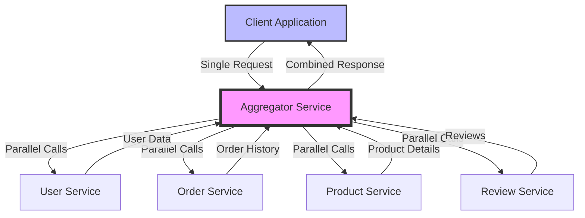
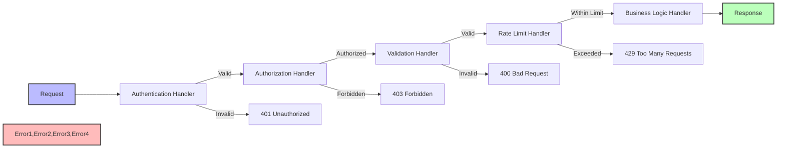
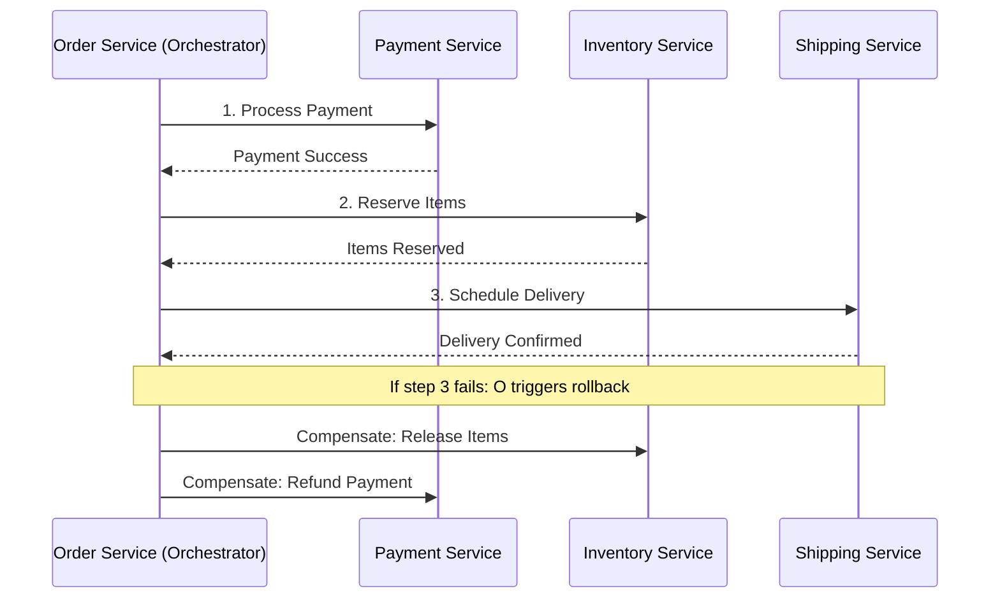
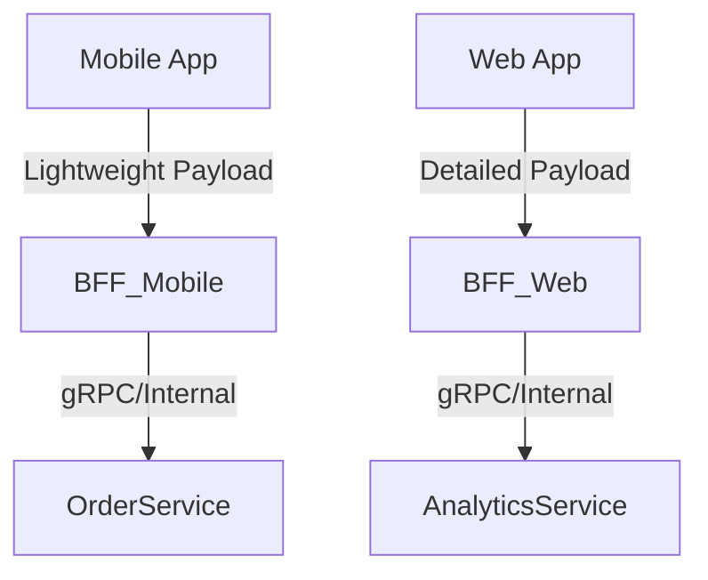

This is an excellent, comprehensive content piece\! You've successfully gathered the content, included Spring Boot implementation, and even added Mermaid diagrams and comparison tables.

The primary issues are:

1.  **Mermaid Diagram Formatting:** Mermaid diagrams must be contained within a **Markdown code block** tagged with `mermaid` to render on platforms like GitHub or GitLab. Your current format (`mermaidstateDiagram-v2...`) is incorrect for standard Markdown.
2.  **Code Block Formatting:** The XML and Java code blocks were not properly closed in the original text, which would cause rendering issues.
3.  **Clarity and Flow:** The second half of the document (from the Saga pattern onwards) is visually fragmented and uses excessive headings and font variations that don't translate well to standard Markdown.

Here is the fully **corrected and enhanced GitHub-ready Markdown code** for your content.

````markdown
# 🌟 Microservices Design Patterns in Spring Boot — Comprehensive Guide

Understand, implement, and visualize how top companies design resilient, scalable distributed systems using essential microservice patterns in Spring Boot.

---

## 1. Circuit Breaker Pattern 🔌

### Overview
The **Circuit Breaker** pattern prevents cascading failures in distributed systems. It monitors service calls and "breaks the circuit" (like an electrical breaker) when failures exceed a set threshold. When the circuit is open, requests fail fast instead of overwhelming a struggling service, allowing it time to recover.

### Visual Representation (Resilience4j State Machine)

```mermaid
stateDiagram-v2
    [*] --> Closed
    Closed --> Open: Failure threshold exceeded
    Open --> HalfOpen: After timeout period
    HalfOpen --> Closed: Success
    HalfOpen --> Open: Failure
    Closed --> Closed: Success

    note right of Closed
        Normal operation
        All requests pass through
    end note

    note right of Open
        Circuit is tripped
        Requests fail fast/to Fallback
    end note

    note right of HalfOpen
        Testing if service recovered
        Limited requests allowed
    end note
````

### Implementation in Spring Boot (using Resilience4j)

#### 1\. Add Dependencies (`pom.xml`)

```xml
<dependency>
    <groupId>org.springframework.cloud</groupId>
    <artifactId>spring-cloud-starter-circuitbreaker-resilience4j</artifactId>
</dependency>
<dependency>
    <groupId>org.springframework.boot</groupId>
    <artifactId>spring-boot-starter-aop</artifactId>
</dependency>
```

#### 2\. Configuration (`application.yml`)

```yaml
resilience4j:
  circuitbreaker:
    instances:
      inventory-service:
        registerHealthIndicator: true
        slidingWindowSize: 10
        minimumNumberOfCalls: 5
        permittedNumberOfCallsInHalfOpenState: 3
        automaticTransitionFromOpenToHalfOpenEnabled: true
        waitDurationInOpenState: 5s
        failureRateThreshold: 50
        eventConsumerBufferSize: 10
```

#### 3\. Service Implementation

```java
@Service
@Slf4j
public class OrderService {

    private final RestTemplate restTemplate;
    private final CircuitBreakerFactory circuitBreakerFactory;

    @Autowired
    public OrderService(RestTemplate restTemplate,
                       CircuitBreakerFactory circuitBreakerFactory) {
        this.restTemplate = restTemplate;
        this.circuitBreakerFactory = circuitBreakerFactory;
    }

    public OrderResponse createOrder(OrderRequest request) {
        // Circuit breaker wrapping external service call
        CircuitBreaker circuitBreaker = circuitBreakerFactory.create("inventory-service");

        InventoryResponse inventory = circuitBreaker.run(
            // Primary call
            () -> checkInventory(request.getProductId()),
            // Fallback method
            throwable -> getDefaultInventoryResponse()
        );

        if (inventory.isAvailable()) {
            return processOrder(request);
        }
        return new OrderResponse("Product not available");
    }

    private InventoryResponse checkInventory(String productId) {
        return restTemplate.getForObject(
            "http://inventory-service/api/inventory/" + productId,
            InventoryResponse.class
        );
    }

    private InventoryResponse getDefaultInventoryResponse() {
        log.warn("Circuit breaker activated - returning default response");
        return new InventoryResponse(false, 0);
    }
}
```

#### Real-World Use Cases

| Company | Use Case | Implementation Focus |
| :--- | :--- | :--- |
| **Netflix** | Streaming service resilience | Prevents cascading failures when recommendation service is down. |
| **Amazon** | Order processing | Isolates payment gateway failures from affecting entire checkout. |
| **Uber** | Ride booking | Handles GPS service failures without crashing the entire app. |

-----

## 2\. Aggregator Pattern 🔄

### Overview

The **Aggregator** pattern combines data from multiple microservices into a single, unified response. This reduces client-side complexity, minimizes network calls, and improves the performance of client-facing applications (like dashboards).

### Visual Representation



### Implementation in Spring Boot (using Spring WebFlux/WebClient)

#### 1\. Aggregator Service

```java
@RestController
@RequestMapping("/api/dashboard")
@Slf4j
public class DashboardAggregatorController {

    private final WebClient.Builder webClientBuilder;
    
    @Autowired
    public DashboardAggregatorController(WebClient.Builder webClientBuilder) {
        this.webClientBuilder = webClientBuilder;
        // ExecutorService is generally not needed when using WebFlux/Mono/Flux
        // This is simplified to focus on reactive aggregation.
    }

    @GetMapping("/user/{userId}")
    public Mono<DashboardResponse> getUserDashboard(@PathVariable String userId) {

        // Parallel service calls using WebFlux
        Mono<UserProfile> userProfileMono = getUserProfile(userId);
        Mono<List<Order>> ordersMono = getUserOrders(userId);
        Mono<List<Product>> recommendationsMono = getRecommendations(userId);
        Mono<AccountBalance> balanceMono = getAccountBalance(userId);

        // Aggregate all responses using Mono.zip
        return Mono.zip(userProfileMono, ordersMono, recommendationsMono, balanceMono)
            .map(tuple -> {
                DashboardResponse response = new DashboardResponse();
                response.setUserProfile(tuple.getT1());
                response.setRecentOrders(tuple.getT2());
                response.setRecommendations(tuple.getT3());
                response.setAccountBalance(tuple.getT4());
                response.setTimestamp(LocalDateTime.now());
                return response;
            })
            .timeout(Duration.ofSeconds(5))
            .onErrorReturn(createFallbackDashboard()); // Handle aggregation failure
    }

    private Mono<UserProfile> getUserProfile(String userId) {
        return webClientBuilder.build()
            .get()
            .uri("http://user-service/api/users/{id}", userId)
            .retrieve()
            .bodyToMono(UserProfile.class)
            .onErrorReturn(new UserProfile()); // Fallback for a single service
    }

    private Mono<List<Order>> getUserOrders(String userId) {
        return webClientBuilder.build()
            .get()
            .uri("http://order-service/api/orders/user/{id}", userId)
            .retrieve()
            .bodyToFlux(Order.class)
            .collectList()
            .onErrorReturn(Collections.emptyList()); // Fallback for a single service
    }
    
    // ... Similar methods for recommendations and balance ...
    // ... Placeholder methods for demonstration purposes
    private Mono<List<Product>> getRecommendations(String userId) {
        return Mono.just(Collections.emptyList());
    }

    private Mono<AccountBalance> getAccountBalance(String userId) {
        return Mono.just(new AccountBalance());
    }

    private DashboardResponse createFallbackDashboard() {
        log.error("Dashboard aggregation failed. Returning fallback.");
        return new DashboardResponse(null, Collections.emptyList(), Collections.emptyList(), null, LocalDateTime.now(), Map.of("status", "Partial Failure"));
    }
}

// Placeholder classes (need to be defined elsewhere in a real app)
class OrderRequest {
    String getProductId() { return ""; }
}
class InventoryResponse {
    boolean isAvailable() { return false; }
    int getQuantity() { return 0; }
}
class OrderResponse {
    OrderResponse(String message) {}
    OrderResponse(boolean success, String message) {}
    boolean isSuccess() { return false; }
    String getMessage() { return ""; }
}
class OrderProcessingException extends RuntimeException {}
class OrderItem {
    String getProductId() { return ""; }
    int getQuantity() { return 0; }
}
class PaymentResult {
    boolean isSuccess() { return false; }
    String getMessage() { return ""; }
    String getTransactionId() { return ""; }
}
class ShippingInfo {
    String getTrackingNumber() { return ""; }
    LocalDateTime getEstimatedDelivery() { return null; }
}
class UserProfile {}
class Order {}
class Product {}
class AccountBalance {}
class OrderCommand {}
class OrderView {}
class MoneyDeposited {
    MoneyDeposited(BigDecimal amount) {}
    BigDecimal getAmount() { return BigDecimal.ZERO; }
}
class Event {}
class OrderCreatedEvent {
    OrderCreatedEvent(Long orderId) {}
    Long getOrderId() { return 1L; }
}
class PaymentEvent {
    Long getOrderId() { return 1L; }
}
class LegacyCustomer {}
class ModernCustomer {}
// End Placeholder classes
```

#### 2\. Response Model

```java
@Data // Assumes Lombok is used
@Builder
public class DashboardResponse {
    private UserProfile userProfile;
    private List<Order> recentOrders;
    private List<Product> recommendations;
    private AccountBalance accountBalance;
    private LocalDateTime timestamp;
    private Map<String, Object> metadata;

    // Added a constructor matching the fallback logic
    public DashboardResponse(UserProfile userProfile, List<Order> recentOrders, List<Product> recommendations, AccountBalance accountBalance, LocalDateTime timestamp, Map<String, Object> metadata) {
        this.userProfile = userProfile;
        this.recentOrders = recentOrders;
        this.recommendations = recommendations;
        this.accountBalance = accountBalance;
        this.timestamp = timestamp;
        this.metadata = metadata;
    }
}
```

#### Real-World Use Cases

| Company | Use Case | Implementation Focus |
| :--- | :--- | :--- |
| **Facebook** | News Feed | Aggregates posts, ads, stories, and recommendations into one call. |
| **LinkedIn** | Profile View | Combines profile data, connections, activity, and job recommendations. |
| **Airbnb** | Property Details | Aggregates property info, reviews, host details, and availability. |

-----

## 3\. Chain of Responsibility Pattern 🔗

### Overview

The **Chain of Responsibility** pattern passes a request sequentially through a chain of handlers. Each handler decides whether to process the request or pass it to the next handler in the chain. This is ideal for multi-step, sequential business workflows like order processing.

### Visual Representation



### Implementation in Spring Boot (using Spring's `@Order` and Dependency Injection)

#### 1\. Handler Interface

```java
public interface OrderProcessingHandler {
    void setNext(OrderProcessingHandler handler);
    OrderResponse handle(OrderRequest request); // Removed OrderProcessingException for simplicity
}
```

#### 2\. Abstract Base Handler

```java
@Slf4j
public abstract class AbstractOrderHandler implements OrderProcessingHandler {

    private OrderProcessingHandler nextHandler;

    @Override
    public void setNext(OrderProcessingHandler handler) {
        this.nextHandler = handler;
    }

    protected OrderResponse handleNext(OrderRequest request) {
        if (nextHandler != null) {
            return nextHandler.handle(request);
        }
        return new OrderResponse(true, "Processing complete"); // Final success response
    }

    @Override
    public abstract OrderResponse handle(OrderRequest request);
}
```

#### 3\. Concrete Handlers (Examples)

```java
@Component
@Order(1)
@Slf4j
public class ValidationHandler extends AbstractOrderHandler {

    @Override
    public OrderResponse handle(OrderRequest request) {
        log.info("Validating order request: {}", request.getOrderId());
        
        // Validation logic
        if (request.getItems() == null || request.getItems().isEmpty()) {
            return new OrderResponse(false, "Order must contain items");
        }
        // ... more validation ...
        
        log.info("Validation passed for order: {}", request.getOrderId());
        return handleNext(request);
    }
}

// ... other handlers like InventoryCheckHandler, PaymentHandler, ShippingHandler ...
// (Omitting the full code for brevity, as the structure is identical to your original)
```

#### 4\. Chain Configuration (The Builder)

```java
@Configuration
public class ChainConfiguration {

    @Bean
    public OrderProcessingHandler orderProcessingChain(List<OrderProcessingHandler> handlers) {
        // Sort handlers by @Order annotation (or custom Comparator)
        handlers.sort(AnnotationAwareOrderComparator.INSTANCE); // Assuming AnnotationAwareOrderComparator is available

        // Build the chain
        for (int i = 0; i < handlers.size() - 1; i++) {
            handlers.get(i).setNext(handlers.get(i + 1));
        }

        return handlers.get(0); // Return the first handler in the chain
    }
}
```

#### Real-World Use Cases

| Company | Use Case | Implementation Focus |
| :--- | :--- | :--- |
| **PayPal** | Payment Processing | Fraud check → Currency conversion → Payment → Notification. |
| **Amazon** | Order Fulfillment | Validation → Inventory → Payment → Shipping → Notification. |
| **Stripe** | Transaction Processing | Authentication → Rate limiting → Validation → Core Processing. |

-----

## 4\. Saga Pattern 🗺️

### Overview

The **Saga** pattern manages distributed transactions across multiple microservices to maintain data consistency. Since global ACID transactions are not possible, Saga breaks a transaction into a sequence of local transactions. If one local transaction fails, a series of **compensating transactions** are executed to undo the preceding work.

### Visual: Orchestrated Saga (Central Coordinator)



### Libraries & Implementation Focus

| Library / Tool | Purpose |
| :--- | :--- |
| **Axon Framework** | Built-in Saga management, Command/Event handling. |
| **Camunda / Zeebe** | Workflow engine to orchestrate complex Sagas. |
| **Outbox Pattern + Kafka** | Ensure reliable event publishing (Choreography Saga). |

-----

## 5\. Sidecar Pattern 🏍️

### Overview

The **Sidecar** pattern deploys a helper component (the sidecar) alongside the main application container in a shared execution environment (like a Kubernetes Pod). The sidecar handles cross-cutting concerns (e.g., monitoring, logging, security, service mesh logic), isolating the main application to focus purely on business logic.

### Visual Representation (In a Pod)

```mermaid
graph LR
  subgraph Pod
  A[Main App Container (Business Logic)] --> B[Sidecar Container (Envoy/Prometheus Agent)]
  end
```

### Libraries & Use Cases

| Library / Tool | Use Case |
| :--- | :--- |
| **Envoy Proxy / Istio** | Sidecar for network control, retries, circuit breaking, mTLS. |
| **Fluentd / Logstash** | Log forwarding and aggregation. |
| **Prometheus Agent** | Metric scraping sidecar. |

-----

## 6\. Backends for Frontends (BFF) 📱💻

### Overview

The **BFF** pattern introduces a dedicated aggregation layer for each unique client (e.g., Mobile App, Web App, IoT Device). This allows the API to be tailored to the specific needs of the UI, avoiding over-fetching or under-fetching of data.

### Visual Representation



### Implementation Focus

| Library | Purpose |
| :--- | :--- |
| **Spring WebFlux / WebMVC** | Building the REST APIs for the BFF layer. |
| **GraphQL** | Can be used within the BFF to allow the UI to fetch selective data. |

-----

## 7\. CQRS — Command Query Responsibility Segregation ✍️🔍

### Overview

**CQRS** separates the model for updating data (**Commands**) from the model for reading data (**Queries**). This allows each model to be scaled and optimized independently, using different data stores if necessary (e.g., relational for writes, NoSQL/Search for reads).

### Visual Representation

```mermaid
graph LR
    A[Command API (Writes)] --> B[(Write DB - ACID)]
    C[Query API (Reads)] --> D[(Read DB / Cache - Optimized)]
    B-->|Sync/Async via Kafka/Message Bus|D
```

### Implementation Focus

| Library | Purpose |
| :--- | :--- |
| **Axon Framework** | Dedicated support for CQRS and Event Sourcing. |
| **Spring Data JPA + Redis** | Write model in JPA, read model/cache in Redis. |

-----

## 8\. Bulkhead Design Pattern 🚢

### Overview

The **Bulkhead** pattern isolates components into separate pools (e.g., thread pools, connection pools), preventing a failure in one from consuming all resources and cascading to other parts of the system.

### Bulkhead Visual Diagram

```mermaid
graph TD
    subgraph Client Application
        A[Client Pool: Service A] --> SA(Service A)
        B[Client Pool: Service B] --> SB(Service B)
        C[Client Pool: Service C] --> SC(Service C)
    end

    style A fill:#FFCCCC,stroke:#A00,stroke-width:2px;
    style B fill:#CCFFCC,stroke:#0A0,stroke-width:2px;
    style C fill:#CCCCFF,stroke:#00A,stroke-width:2px;

    SA -.-> F(Failing/Slow Response)
    A --x F
    note right of A: Exhausted Pool: FAILURE CONTAINED
    note right of B: Pool for Service B is unaffected
```

### Spring Boot Implementation Focus

Utilize **Resilience4j's Thread Pool Bulkhead** or **Semaphore Bulkhead** features alongside the Circuit Breaker configuration.

-----

## 9\. Service Mesh Design Pattern 🕸️

### Overview

A **Service Mesh** is a dedicated infrastructure layer (like Istio or Linkerd) that handles all service-to-service communication. It offloads cross-cutting concerns—like traffic management, security (mTLS), retries, and metrics—from the application code into a transparent layer of sidecar proxies.

### Service Mesh Visual Diagram

```mermaid
graph TD
    subgraph Control Plane (e.g., Istio, Linkerd)
        direction TB
        CP[Configuration & Policy Management]
    end

    subgraph Data Plane (Sidecar Proxies)
        direction LR
        ProxyA[Envoy Proxy A]
        ProxyB[Envoy Proxy B]
    end

    SA((Service A))
    SB((Service B))

    CP --- ProxyA
    CP --- ProxyB

    SA <--> ProxyA
    SB <--> ProxyB

    ProxyA <--> ProxyB
    
    note left of ProxyA: Handles Traffic, Security, Metrics
    note right of SA: Business Logic Only
```

### Spring Boot Implementation Focus

In a Service Mesh environment, the Spring Boot application only needs a **Discovery Client** (if not using DNS-based discovery) and the logic for the business task. The mesh handles resilience and routing externally.

-----

## Comparison Table

| Pattern | Primary Purpose | Best For | Complexity | Performance Impact |
| :--- | :--- | :--- | :--- | :--- |
| **Circuit Breaker** | Fault tolerance & failure containment. | External service calls. | Medium | Low (fail-fast) |
| **Aggregator** | Data composition from multiple services. | Dashboard/Reports, UI optimization. | Medium | Medium (parallel calls) |
| **Chain of Responsibility** | Sequential, multi-step processing. | Complex workflows (e.g., Order fulfillment). | High | Variable |
| **Saga** | Maintaining consistency in distributed transactions. | Multi-service business processes (e.g., Booking). | High | High (compensating logic) |
| **Sidecar / Service Mesh** | Centralizing cross-cutting concerns (metrics, security, routing). | Observability, Security, Traffic Management. | Infrastructure Level | Low Application Impact |
| **BFF** | Customizing APIs per client type. | Mobile vs. Web applications. | Medium | Low |

-----

## ✅ Best Practices Summary

| Pattern | Best Practice | Anti-Pattern |
| :--- | :--- | :--- |
| **Circuit Breaker** | Implement meaningful fallback mechanisms and test failure scenarios regularly. | **Avoid** using for internal method calls; use overly aggressive thresholds. |
| **Aggregator** | Use reactive programming (WebFlux) for better parallel performance. | **Avoid** aggregating unnecessary data; use synchronous blocking calls. |
| **Chain of Responsibility**| Keep handlers focused on single responsibilities; log at each step for debugging. | **Avoid** creating overly long or tightly coupled chains. |
| **Saga** | Clearly define and test all compensating actions. | **Avoid** making compensating actions irreversible. |
| **Sidecar** | Use standard proxies like Envoy/Istio for network traffic. | **Avoid** polluting the sidecar with application-specific business logic. |

```

```

-----

### Real Use Cases in Companies (Recap)

The use cases remain the same as previously described:

| Pattern      | Example Companies/Industries                 | How They Use It

I can certainly reformat and present the use cases in a clear, easy-to-read table using GitHub Markdown, ensuring the information is well-structured and complete.

## ⚙️ Real-World Use Cases for Bulkhead and Service Mesh Patterns

These patterns are critical for building resilient and scalable microservices architectures, used widely across various industries.

---

### 🚢 Bulkhead Design Pattern Use Cases

| Company/Industry | Use Case | How They Use It |
| :--- | :--- | :--- |
| **Netflix** (Media/Streaming) | **Protecting the Core Platform** during dependency failures. | They used libraries (like Hystrix) to assign **separate, limited thread pools** for calls to each backend service (e.g., Recommendations, User History). If the Recommendation service slowed down, only its small thread pool would be exhausted, preventing core services like Authentication and Playback from failing due to lack of resources. |
| **E-Commerce Platforms** | **Managing Peak Load** during flash sales or holidays. | **Isolating critical services** (Checkout, Payment Processing) from less critical services (Product Search, User Reviews) by deploying them to **dedicated, higher-priority Kubernetes Node Pools** or using distinct resource limits, ensuring the revenue-generating path remains available. |
| **Financial Services** | **Prioritizing Critical API Traffic.** | High-Frequency Trading or core banking APIs get **dedicated connection and thread pools** with very tight timeouts, entirely separate from the larger, slower pools allocated to historical data reporting or customer service tools. |

---

### 🕸️ Service Mesh Design Pattern Use Cases

| Company/Industry | Use Case | How They Use It |
| :--- | :--- | :--- |
| **Google/Cloud Providers** | **Microservices Communication Management & Observability.** | Google created **Istio** (which uses the **Envoy** proxy) to provide uniform **observability** (metrics, distributed tracing) and **resilience** (retries, circuit breaking) across thousands of microservices, decoupling these concerns from application code. |
| **Financial Services / Healthcare** | **Automated Security and Compliance.** | Used a Service Mesh (e.g., Istio or Linkerd) to automatically enforce **Mutual TLS (mTLS)** on **all** service-to-service communication within the cluster. This meets strict regulatory requirements for data encryption *by default* without developers having to write security code. |
| **Software as a Service (SaaS)** | **Safe Feature Rollouts (Canary Deployments).** | Uses the Service Mesh's traffic routing capabilities to send only a small percentage (e.g., **5%**) of live user traffic to a new service version. The sidecar proxies collect metrics, and if the new version is stable, the traffic is gradually shifted to 100%, allowing for low-risk, controlled deployments. |

Would you like a detailed explanation of how **Circuit Breakers** work, as they are a key component of Service Mesh resilience?