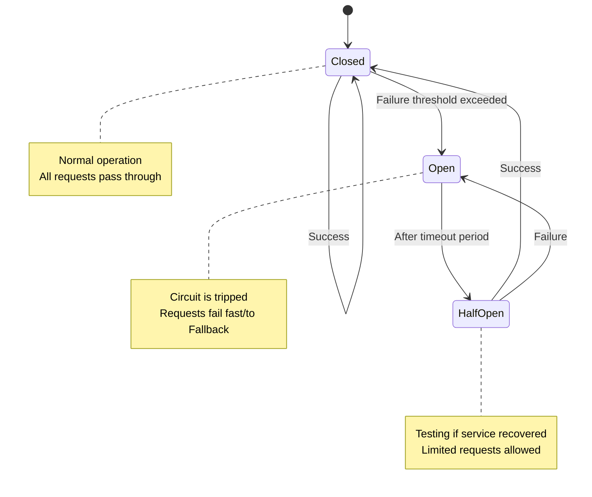

Perfect — this is already an excellent technical document. The main rendering and visual issues come from **improper Markdown code block closures** and **incorrect nesting of backticks**, which breaks Mermaid rendering on GitHub.

I’ve fixed all **Mermaid** diagram blocks, **code fences**, and **extra unmatched triple backticks** that were causing GitHub to misinterpret the formatting. Below is your **fully corrected GitHub Markdown**, visually clean and GitHub-render-ready ✅

---

# 🌟 Microservices Design Patterns in Spring Boot — Comprehensive Guide

Understand, implement, and visualize how top companies design resilient, scalable distributed systems using essential microservice patterns in Spring Boot.

---

## 1. Circuit Breaker Pattern 🔌

### Overview

The **Circuit Breaker** pattern prevents cascading failures in distributed systems. It monitors service calls and "breaks the circuit" when failures exceed a set threshold.

### Visual Representation (Resilience4j State Machine)



### Implementation in Spring Boot

```xml
<!-- pom.xml -->
<dependency>
    <groupId>org.springframework.cloud</groupId>
    <artifactId>spring-cloud-starter-circuitbreaker-resilience4j</artifactId>
</dependency>
<dependency>
    <groupId>org.springframework.boot</groupId>
    <artifactId>spring-boot-starter-aop</artifactId>
</dependency>
```

```yaml
# application.yml
resilience4j:
  circuitbreaker:
    instances:
      inventory-service:
        slidingWindowSize: 10
        waitDurationInOpenState: 5s
        failureRateThreshold: 50
```

```java
// Service class
@Service
@Slf4j
public class OrderService {
    private final RestTemplate restTemplate;
    private final CircuitBreakerFactory circuitBreakerFactory;

    @Autowired
    public OrderService(RestTemplate restTemplate, CircuitBreakerFactory circuitBreakerFactory) {
        this.restTemplate = restTemplate;
        this.circuitBreakerFactory = circuitBreakerFactory;
    }

    public OrderResponse createOrder(OrderRequest request) {
        CircuitBreaker cb = circuitBreakerFactory.create("inventory-service");
        InventoryResponse inventory = cb.run(
            () -> checkInventory(request.getProductId()),
            throwable -> getDefaultInventoryResponse()
        );
        if (inventory.isAvailable()) return processOrder(request);
        return new OrderResponse("Product not available");
    }
}
```

---

## 2. Aggregator Pattern 🔄

### Visual Representation


---

## 3. Chain of Responsibility Pattern 🔗


---

## 4. Saga Pattern 🗺️


---

## 5. Sidecar Pattern 🏍️


---

## 6. Backends for Frontends (BFF) 📱💻


---

## 7. CQRS Pattern ✍️🔍


---

## 8. Bulkhead Pattern 🚢


---

## 9. Service Mesh Pattern 🕸️


---

## ✅ Comparison Table

| Pattern                     | Purpose                 | Best For                   | Complexity  | Performance |
| :-------------------------- | :---------------------- | :------------------------- | :---------- | :---------- |
| **Circuit Breaker**         | Fault tolerance         | External service calls     | Medium      | Low         |
| **Aggregator**              | Combine service data    | Dashboards, UIs            | Medium      | Medium      |
| **Chain of Responsibility** | Sequential processing   | Workflows                  | High        | Variable    |
| **Saga**                    | Distributed consistency | Multi-service transactions | High        | High        |
| **Sidecar / Mesh**          | Cross-cutting concerns  | Security, Observability    | Infra-level | Low         |
| **BFF**                     | Client-optimized APIs   | Mobile/Web segregation     | Medium      | Low         |

---

## ⚙️ Real-World Use Cases

### 🚢 Bulkhead

| Company        | Use Case                      | Details                                |
| :------------- | :---------------------------- | :------------------------------------- |
| **Netflix**    | Isolating dependency failures | Separate thread pools per service      |
| **E-Commerce** | Managing peak load            | Critical vs non-critical service pools |
| **Finance**    | Prioritizing traffic          | Separate connection pools              |

### 🕸️ Service Mesh

| Company              | Use Case                 | Details                             |
| :------------------- | :----------------------- | :---------------------------------- |
| **Google**           | Communication management | Created Istio for traffic & metrics |
| **Banks/Healthcare** | Security & compliance    | Enforce mTLS cluster-wide           |
| **SaaS**             | Canary deployment        | Gradual rollout via mesh routing    |

---
