# Comprehensive Guide to Distributed System Design Patterns

## 1. Circuit Breaker Pattern 🔌

### Visual Flow Representation

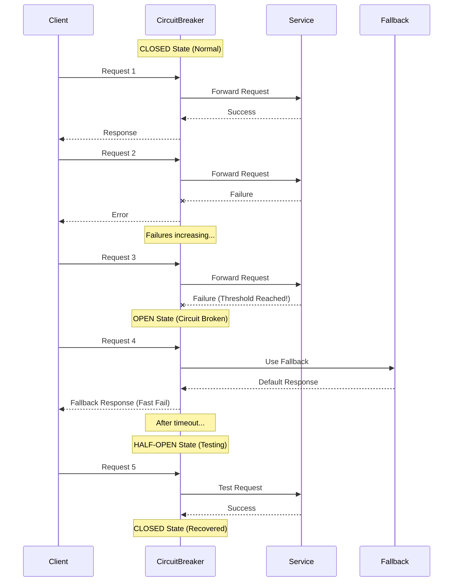

### State Machine Visualization

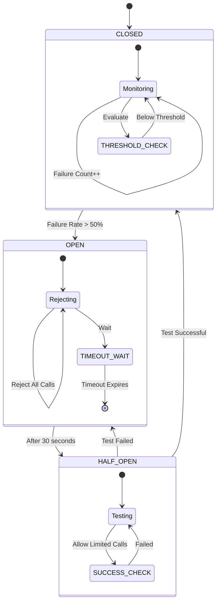

### Real-Time Metrics Dashboard

```
┌─────────────────────────────────────────────────────────────┐
│                 Circuit Breaker Metrics                      │
├─────────────────────────────────────────────────────────────┤
│ Service: Payment-Gateway                                     │
│ Current State: [OPEN]                                        │
│                                                              │
│ Last 60 seconds:                                            │
│ ████████████████░░░░░░░░░░░░  Success: 64%                │
│ ░░░░░░░░░░░░████████████████  Failure: 36%                │
│                                                              │
│ Response Times:                                             │
│ P50: 45ms  │ P95: 230ms  │ P99: 1200ms                    │
│                                                              │
│ State Transitions (Last Hour):                              │
│ CLOSED → OPEN:  3 times                                     │
│ OPEN → HALF_OPEN: 3 times                                   │
│ HALF_OPEN → CLOSED: 2 times                                 │
│                                                              │
│ Fallback Invocations: 847                                   │
│ Requests Rejected: 2,341                                    │
└─────────────────────────────────────────────────────────────┘
```

---

## 2. Aggregator Pattern 📊

### Visual Request Flow

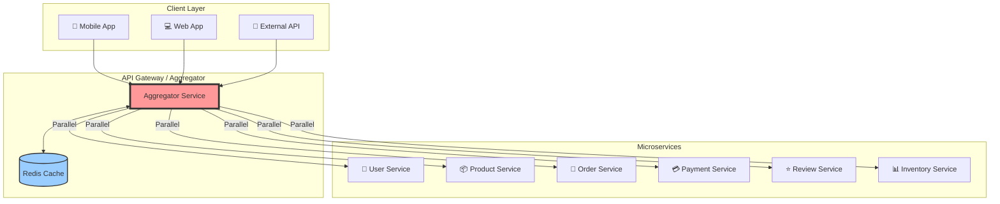

### Aggregation Timeline

```mermaid
gantt
    title Aggregator Pattern - Parallel Execution Timeline
    dateFormat SSS
    axisFormat %L ms
    
    section Client
    Request Sent          :done, client1, 000, 10ms
    Waiting              :active, client2, after client1, 190ms
    Response Received    :done, client3, after client2, 10ms
    
    section Aggregator
    Request Processing   :done, agg1, 010, 10ms
    Parallel Calls      :active, agg2, after agg1, 150ms
    Data Combination    :done, agg3, after agg2, 20ms
    Response Building   :done, agg4, after agg3, 10ms
    
    section User Service
    Processing          :done, user, 020, 80ms
    
    section Order Service
    Processing          :done, order, 020, 120ms
    
    section Product Service
    Processing          :done, product, 020, 150ms
    
    section Review Service
    Processing          :done, review, 020, 100ms
```

### Data Aggregation Example

```
┌─────────────────────────────────────────────────────────────┐
│                    E-Commerce Dashboard                      │
├─────────────────────────────────────────────────────────────┤
│  Request: GET /api/dashboard/user/12345                     │
├─────────────────────────────────────────────────────────────┤
│                                                              │
│  Aggregator Collects From:                                  │
│                                                              │
│  ┌──────────────┐  ┌──────────────┐  ┌──────────────┐     │
│  │ USER SERVICE │  │ORDER SERVICE │  │PRODUCT SERVICE│     │
│  ├──────────────┤  ├──────────────┤  ├──────────────┤     │
│  │ Name: John   │  │ Orders: 15   │  │ Viewed: 45    │     │
│  │ Level: Gold  │  │ Total: $2,340│  │ Cart: 3 items │     │
│  │ Since: 2020  │  │ Pending: 2   │  │ Wishlist: 12  │     │
│  └──────────────┘  └──────────────┘  └──────────────┘     │
│                                                              │
│  ┌──────────────┐  ┌──────────────┐  ┌──────────────┐     │
│  │REVIEW SERVICE│  │REWARD SERVICE│  │ NOTIFICATION  │     │
│  ├──────────────┤  ├──────────────┤  ├──────────────┤     │
│  │ Written: 8   │  │ Points: 2,450│  │ Unread: 5     │     │
│  │ Avg Rate: 4.2│  │ Tier: Gold   │  │ Promotions: 3 │     │
│  │ Helpful: 23  │  │ Expires: 500 │  │ Updates: 2    │     │
│  └──────────────┘  └──────────────┘  └──────────────┘     │
│                                                              │
│  Combined Response Time: 152ms (Parallel)                   │
│  Sequential Time Would Be: 580ms                            │
│  Performance Gain: 73.8%                                    │
└─────────────────────────────────────────────────────────────┘
```

---

## 3. Saga Pattern 🔄

### Choreography-Based Saga

```mermaid
sequenceDiagram
    participant Order as Order Service
    participant Payment as Payment Service
    participant Inventory as Inventory Service
    participant Shipping as Shipping Service
    participant Email as Email Service
    
    Note over Order: Start Transaction
    
    Order->>Order: Create Order (PENDING)
    Order->>+Payment: Process Payment Event
    
    alt Payment Success
        Payment->>Payment: Charge Card
        Payment->>-Order: Payment Success Event
        Payment->>+Inventory: Reserve Stock Event
        
        alt Stock Available
            Inventory->>Inventory: Reserve Items
            Inventory->>-Order: Stock Reserved Event
            Inventory->>+Shipping: Create Shipment Event
            
            Shipping->>Shipping: Schedule Delivery
            Shipping->>-Order: Shipment Created Event
            Shipping->>Email: Send Confirmation Event
            
            Email->>Email: Send Email
            Order->>Order: Update Status (COMPLETED)
            Note over Order: Transaction Success ✓
            
        else Stock Unavailable
            Inventory->>-Payment: Stock Failed Event
            Payment->>Payment: Refund Payment
            Payment->>Order: Refund Completed Event
            Order->>Order: Update Status (CANCELLED)
            Note over Order: Compensation Complete ✗
        end
        
    else Payment Failed
        Payment->>-Order: Payment Failed Event
        Order->>Order: Update Status (FAILED)
        Note over Order: Transaction Failed ✗
    end
```

### Orchestration-Based Saga

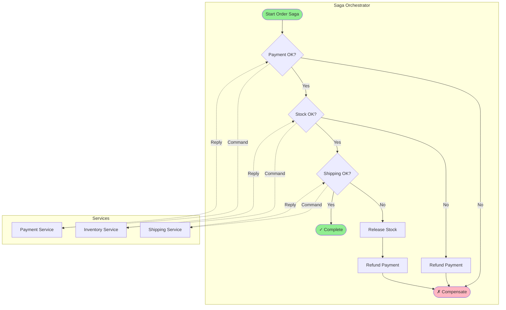

### Saga State Machine

```
┌─────────────────────────────────────────────────────────────┐
│                    Order Saga State Machine                  │
├─────────────────────────────────────────────────────────────┤
│                                                              │
│  ┌─────────┐     Success      ┌─────────┐                 │
│  │ STARTED │──────────────────>│ PAYMENT │                 │
│  └─────────┘                   │ PENDING │                 │
│                                └─────────┘                  │
│                                     │                        │
│                    Success          │         Failure        │
│                  ┌──────────────────┼──────────────────┐   │
│                  ▼                                     ▼    │
│           ┌─────────┐                          ┌─────────┐  │
│           │INVENTORY│                          │ PAYMENT │  │
│           │ PENDING │                          │  FAILED │  │
│           └─────────┘                          └─────────┘  │
│                  │                                     │     │
│     Success      │      Failure                       │     │
│  ┌───────────────┼───────────────┐                   │     │
│  ▼                               ▼                    ▼     │
│ ┌─────────┐              ┌──────────────┐     ┌─────────┐  │
│ │SHIPPING │              │  COMPENSATING │     │ FAILED  │  │
│ │ PENDING │              │   PAYMENT     │     │         │  │
│ └─────────┘              └──────────────┘     └─────────┘  │
│      │                           │                          │
│      │Success                    │Complete                  │
│      ▼                           ▼                          │
│ ┌─────────┐              ┌──────────────┐                 │
│ │COMPLETED│              │  COMPENSATED  │                 │
│ └─────────┘              └──────────────┘                 │
│                                                              │
│ Legend: ● Pending  ✓ Success  ✗ Failed  ⟲ Compensating    │
└─────────────────────────────────────────────────────────────┘
```

---

## 4. Sidecar Pattern 🚗

### Architecture Visualization

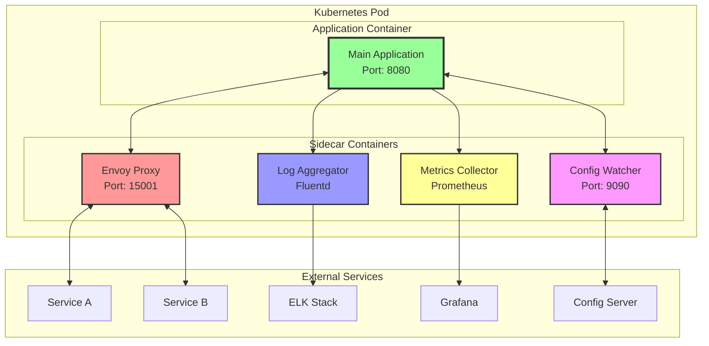

### Sidecar Communication Flow

```
┌─────────────────────────────────────────────────────────────┐
│                     Pod Namespace                            │
├─────────────────────────────────────────────────────────────┤
│                                                              │
│  ┌──────────────────────┐      ┌──────────────────────┐   │
│  │   MAIN APPLICATION   │      │    SIDECAR PROXY     │   │
│  ├──────────────────────┤      ├──────────────────────┤   │
│  │                      │      │                      │   │
│  │  Business Logic      │◄────►│  • Authentication    │   │
│  │  Core Features       │      │  • Rate Limiting     │   │
│  │  API Endpoints       │      │  • Circuit Breaking  │   │
│  │                      │      │  • Load Balancing    │   │
│  │  localhost:8080      │      │  • SSL Termination   │   │
│  └──────────────────────┘      └──────────────────────┘   │
│           │                              │                  │
│           │                              │                  │
│  ┌──────────────────────┐      ┌──────────────────────┐   │
│  │   LOGGING SIDECAR    │      │   METRICS SIDECAR    │   │
│  ├──────────────────────┤      ├──────────────────────┤   │
│  │                      │      │                      │   │
│  │  • Log Collection    │      │  • Metrics Scraping  │   │
│  │  • Log Formatting    │      │  • Health Checks     │   │
│  │  • Log Shipping      │      │  • Custom Metrics    │   │
│  │  • Log Filtering     │      │  • Aggregation       │   │
│  │                      │      │                      │   │
│  └──────────────────────┘      └──────────────────────┘   │
│                                                              │
│  Shared Resources: Volume Mounts, Network Namespace         │
└─────────────────────────────────────────────────────────────┘
```

---

## 5. Event Sourcing Pattern 📝

### Event Flow Architecture

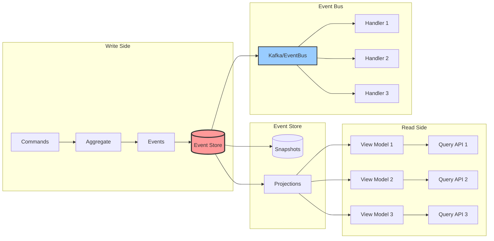

### Event Store Timeline

```
┌─────────────────────────────────────────────────────────────┐
│                  Bank Account Event Stream                   │
├─────────────────────────────────────────────────────────────┤
│ Account ID: ACC-12345                                       │
├─────────────────────────────────────────────────────────────┤
│                                                              │
│ Event #1  [2024-01-01 09:00:00]                            │
│ ├─ Type: AccountCreated                                     │
│ ├─ Data: { initialBalance: 0, currency: "USD" }            │
│ └─ Version: 1                                               │
│                                                              │
│ Event #2  [2024-01-01 09:15:00]                            │
│ ├─ Type: MoneyDeposited                                     │
│ ├─ Data: { amount: 1000, balance: 1000 }                   │
│ └─ Version: 2                                               │
│                                                              │
│ Event #3  [2024-01-02 14:30:00]                            │
│ ├─ Type: MoneyWithdrawn                                     │
│ ├─ Data: { amount: 200, balance: 800 }                     │
│ └─ Version: 3                                               │
│                                                              │
│ Event #4  [2024-01-03 10:00:00]                            │
│ ├─ Type: MoneyTransferred                                   │
│ ├─ Data: { amount: 300, toAccount: "ACC-67890",            │
│ │         balance: 500 }                                    │
│ └─ Version: 4                                               │
│                                                              │
│ ════ SNAPSHOT [Version 4] ════                              │
│ State: { balance: 500, transactions: 4 }                   │
│                                                              │
│ Event #5  [2024-01-04 11:00:00]                            │
│ ├─ Type: InterestCredited                                   │
│ ├─ Data: { amount: 5, balance: 505, rate: 1% }            │
│ └─ Version: 5                                               │
│                                                              │
│ Current State: Replay Events 1-5 or Load Snapshot + Event 5 │
└─────────────────────────────────────────────────────────────┘
```

---

## 6. Additional Important Distributed Patterns

### 6.1 CQRS (Command Query Responsibility Segregation) Pattern

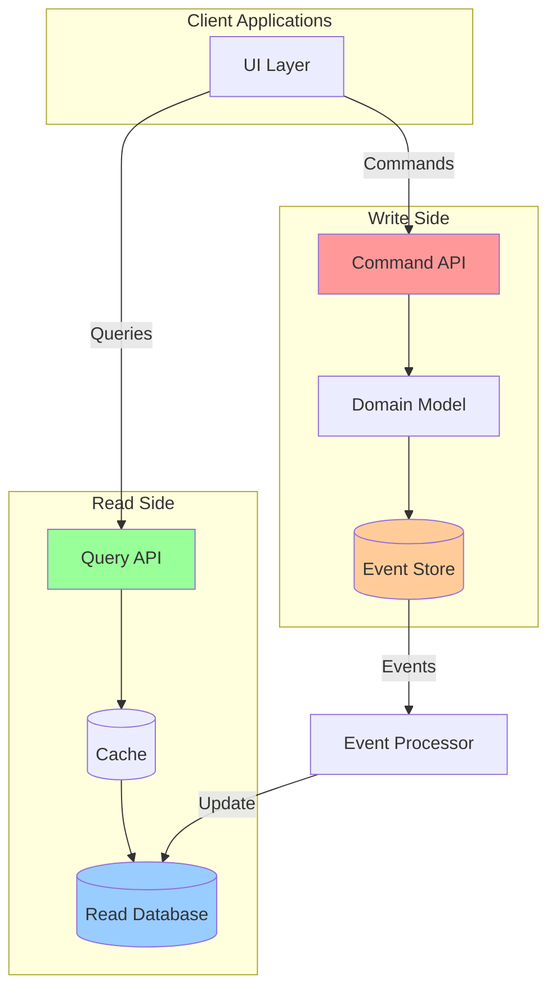

### 6.2 Bulkhead Pattern

```
┌─────────────────────────────────────────────────────────────┐
│                      Bulkhead Pattern                        │
├─────────────────────────────────────────────────────────────┤
│                                                              │
│  Thread Pool Isolation:                                      │
│                                                              │
│  ┌─────────────────────────────────────────────────────┐   │
│  │            Application Thread Pool (50)              │   │
│  ├────────────┬────────────┬────────────┬─────────────┤   │
│  │            │            │            │             │   │
│  │  Service A │  Service B │  Service C │   Service D │   │
│  │  Pool (10) │  Pool (15) │  Pool (10) │   Pool (15) │   │
│  │            │            │            │             │   │
│  │  ████████  │  ████████  │  ████      │   ██       │   │
│  │  ████████  │  ████████  │  ████      │   ██       │   │
│  │  ██        │  ████████  │  ████      │   ██       │   │
│  │            │  ████      │            │             │   │
│  │  80% Used  │  66% Used  │  40% Used  │   20% Used  │   │
│  └────────────┴────────────┴────────────┴─────────────┘   │
│                                                              │
│  If Service A fails, only its pool is affected              │
│  Other services continue normally                           │
└─────────────────────────────────────────────────────────────┘
```

### 6.3 Retry Pattern with Exponential Backoff

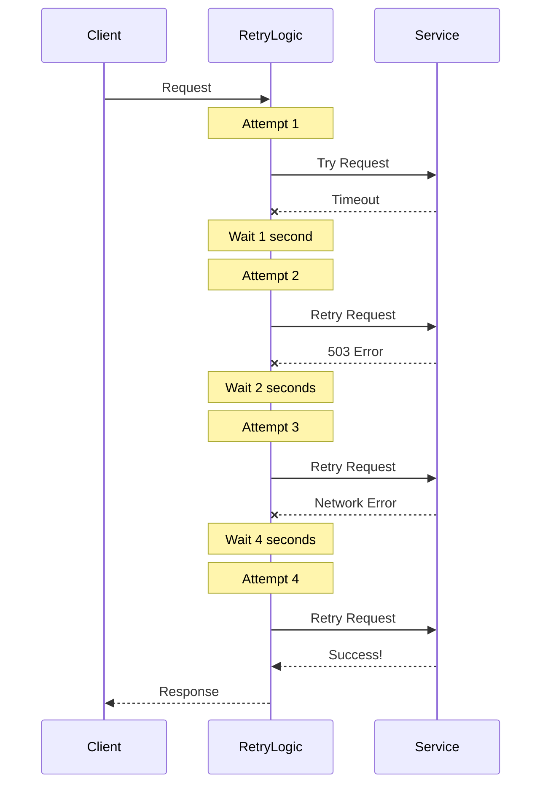

### 6.4 Service Mesh Pattern

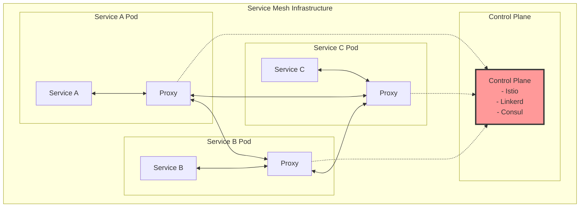

---

## Pattern Selection Decision Matrix

```
┌────────────────────────────────────────────────────────────────┐
│                  Pattern Selection Guide                       │
├────────────────────────────────────────────────────────────────┤
│                                                                │
│ Scenario                    │ Recommended Pattern             │
│ ───────────────────────────┼─────────────────────────────── │
│ External Service Failures   │ Circuit Breaker                │
│ Multiple Data Sources       │ Aggregator                     │
│ Distributed Transactions    │ Saga                           │
│ Cross-cutting Concerns      │ Sidecar                        │
│ Audit Trail Required        │ Event Sourcing                 │
│ Read/Write Optimization     │ CQRS                           │
│ Resource Isolation          │ Bulkhead                       │
│ Service Communication       │ Service Mesh                   │
│ Temporary Failures          │ Retry Pattern                  │
│ Rate Limiting               │ Throttling Pattern             │
│ Data Consistency            │ Eventual Consistency           │
│ Service Discovery           │ Registry Pattern               │
│                                                                │
└────────────────────────────────────────────────────────────────┘
```

## Implementation Priority Matrix

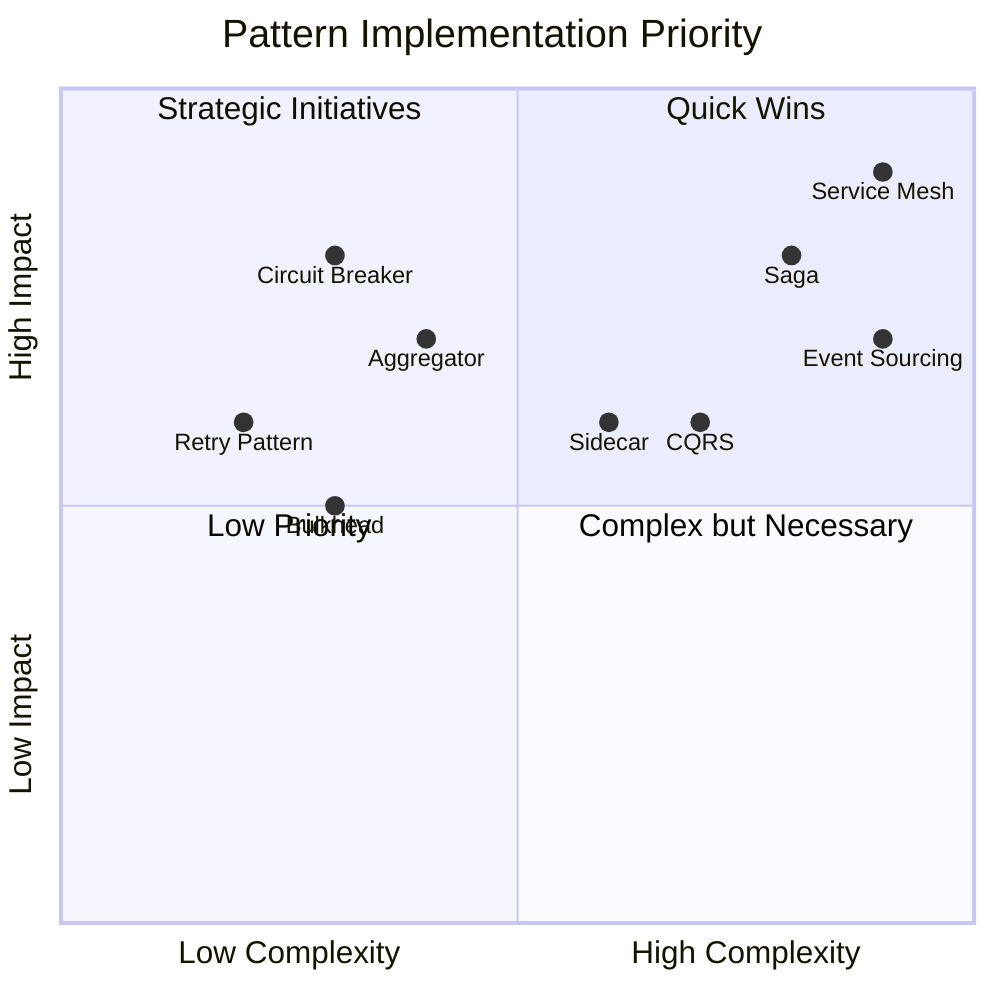

## Key Takeaways

### Essential Patterns for Microservices
1. **Circuit Breaker** - Prevents cascade failures
2. **Aggregator** - Simplifies client interactions
3. **Saga** - Manages distributed transactions
4. **Sidecar** - Handles cross-cutting concerns
5. **Event Sourcing** - Provides audit trail and temporal queries

### Patterns by Problem Domain

| Problem | Primary Pattern | Secondary Pattern |
|---------|----------------|-------------------|
| **Resilience** | Circuit Breaker | Retry, Bulkhead |
| **Data Management** | Event Sourcing | CQRS, Saga |
| **Service Communication** | Service Mesh | API Gateway |
| **Observability** | Sidecar | Distributed Tracing |
| **Scalability** | Bulkhead | Cache-aside |

### Implementation Checklist