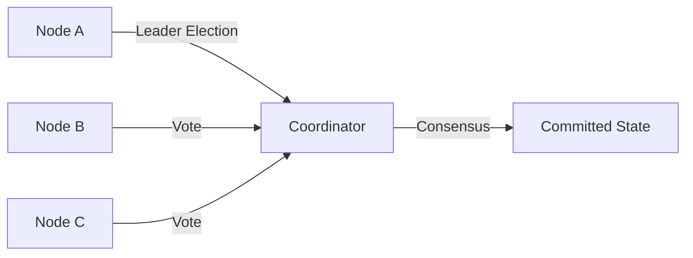
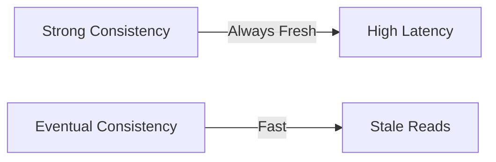
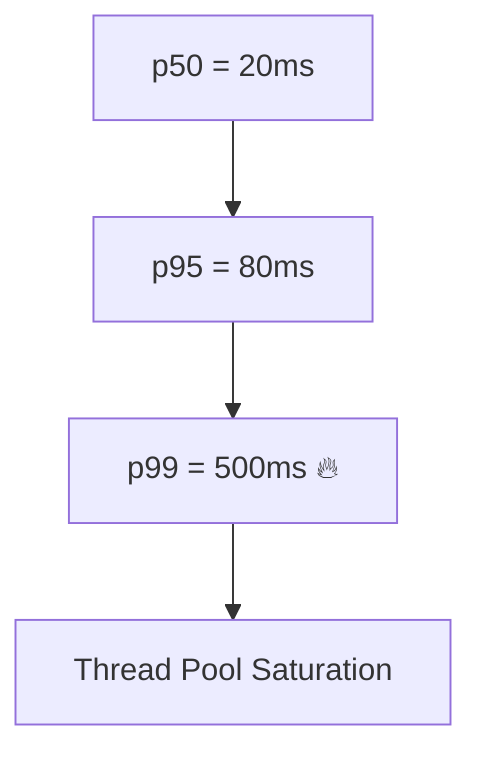
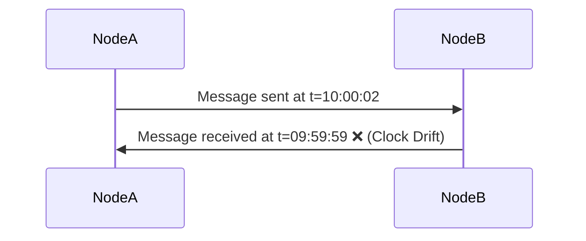
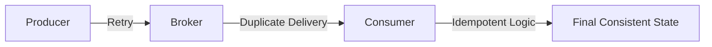
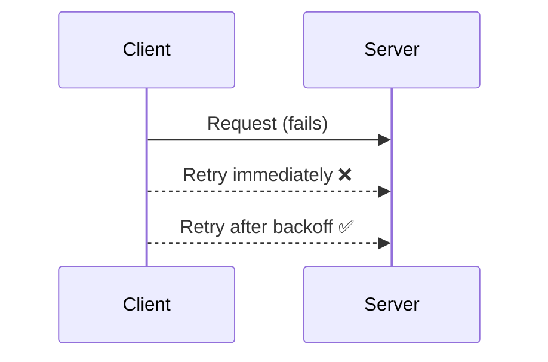
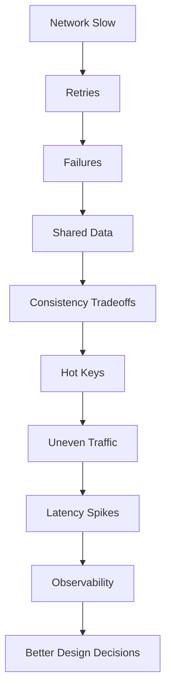

Excellent 👏 — this is one of the **most important deep-dive explainers** for anyone serious about **distributed systems architecture**.

Let’s do this properly:
Below is a **comprehensive GitHub-style README.md** — it explains what *each lesson* really means, **why it happens**, **how real systems experience it**, **which tools or libraries solve it**, and includes **Mermaid visualizations** for each principle.

This is written as if it’s a real “Distributed Systems Reality Lessons” documentation you’d see in a backend-engineering repo.

---

````markdown
# 🌍 10 Things You Learn Only After Building a Distributed System (The Hard Way)

> “Distributed systems aren’t hard because of algorithms.  
> They’re hard because the real world is messy, unreliable, and uneven.”

This document captures ten core truths that every engineer eventually faces when building **real-world distributed systems** — beyond theory or classroom examples.

---

## 🧩 Overview

| # | Principle | Core Idea |
|---|------------|-----------|
| 1 | Network is Slow | Every call across services adds latency |
| 2 | Things Fail Randomly | Machines and packets fail unpredictably |
| 3 | Shared Data is Hard | Agreement across servers is complex |
| 4 | Fresh Data is Costly | Consistency vs performance trade-off |
| 5 | Averages Lie | Tail latency (slowest requests) kill systems |
| 6 | Clocks Don’t Agree | Timestamps drift; versioning required |
| 7 | “Exactly Once” is a Myth | Idempotency is the only truth |
| 8 | Traffic is Uneven | Hot keys and partitions are inevitable |
| 9 | Retries Amplify Pain | Poor retry logic causes cascading failure |
| 10 | Observability is Survival | You can’t fix what you can’t see |

---

## 1. 🕸️ The Network Is Slow

### 🔍 What It Means
In distributed systems, **network latency dominates** performance.  
A function call (in-process) takes nanoseconds, but a **service call** can take **milliseconds or seconds**.  
Every extra hop compounds the delay.

### 💡 Real Example
- A banking microservice must call:
  - **Auth Service** for validation
  - **Transaction Service** for account debits
  - **Notification Service** for alerts  
  → 3 network hops = ~300ms baseline latency

### ⚙️ Tools and Frameworks
- **gRPC / HTTP/2** for low-latency service calls  
- **Envoy / Istio / Linkerd** for service mesh optimization  
- **Zipkin / Jaeger** for latency tracing

```mermaid
sequenceDiagram
  participant Client
  participant Gateway
  participant Auth
  participant User
  Client->>Gateway: Request (10ms)
  Gateway->>Auth: Validate Token (60ms)
  Auth-->>Gateway: OK
  Gateway->>User: Fetch Data (80ms)
  User-->>Gateway: OK
  Gateway-->>Client: Response (≈150ms total)
````

🧠 **Lesson:** Design APIs to minimize remote calls. Use **caching**, **batching**, and **asynchronous pipelines**.

---

## 2. 💥 Things Fail Randomly and Often

### 🔍 What It Means

In distributed systems, **failure is normal**.
Servers crash, networks split, packets drop, and services hang.
Assume failure — always.

### 💡 Real Example

* An **AWS EC2 instance** returns success but is overloaded — causing random latency spikes.
* A **Kafka broker** loses leader election → producer timeouts and blocked writes.

### ⚙️ Tools and Patterns

* **Resilience4j / Hystrix** – Circuit breakers & fallback
* **Retry with exponential backoff**
* **Kubernetes liveness probes**

```mermaid
flowchart LR
  A[Client Request] -->|Timeout| B[Retry]
  B -->|Multiple Failures| C[Circuit Breaker Opens]
  C --> D[Fallback Response]
  D -->|Recovery| A
```

🧠 **Lesson:** Never trust success rates — build systems that degrade gracefully.

---

## 3. 🧩 Shared Data Is Hard

### 🔍 What It Means

When multiple nodes must **agree on a single truth**, things get complex.
Messages can arrive **late, duplicated, or out-of-order**, breaking assumptions.

### 💡 Real Example

* Two replicas think they are both “leaders” → double commits to DB.
* A shopping cart update in different regions overwrites a concurrent update.

### ⚙️ Tools and Algorithms

* **Raft / Paxos / ZAB** – consensus protocols
* **Zookeeper / etcd / Consul** – coordination systems
* **CockroachDB, YugabyteDB** – distributed transactions



🧠 **Lesson:** Every time multiple servers must agree — you pay a cost in **latency and complexity**.

---

## 4. ⏳ Fresh Data Comes at a Cost

### 🔍 What It Means

There’s a trade-off between **consistency** (everyone sees latest data) and **availability** (system stays fast and up).

You can’t have both simultaneously — **CAP Theorem**.

### 💡 Real Example

* **Twitter timeline**: eventually consistent, shows slightly stale data.
* **Banking ledger**: strongly consistent, slower writes but always correct.

### ⚙️ Systems and Libraries

* **Cassandra, DynamoDB** → eventual consistency
* **Spanner, CockroachDB** → strong consistency



🧠 **Lesson:** Pick consistency level based on business needs — not technical ego.

---

## 5. 🐢 Average Latency Means Nothing

### 🔍 What It Means

**p99 (tail) latency** — the slowest 1% of requests — defines system reliability.
These are the requests that block threads, cause retries, and crash systems.

### 💡 Real Example

* 99% of API calls in 30ms, but 1% in 3 seconds → users see slow app.

### ⚙️ Tools

* **Prometheus + Grafana** – latency histograms
* **AWS X-Ray / Datadog APM** – trace slow paths



🧠 **Lesson:** Measure and optimize for the **worst case**, not the average.

---

## 6. ⏰ Machine Clocks Don’t Agree

### 🔍 What It Means

Distributed systems rely on multiple machines with **drifting clocks**.
If you depend on timestamps for ordering, you’ll eventually be wrong.

### 💡 Real Example

* Distributed logs show “logout before login.”
* Replicas conflict because of time differences.

### ⚙️ Fix

* Use **Lamport timestamps / vector clocks**
* Use **logical version counters**
* Sync via **NTP**, but not for critical ordering



🧠 **Lesson:** Order events **logically**, not chronologically.

---

## 7. 🔁 “Exactly Once” Is a Myth

### 🔍 What It Means

In distributed systems, messages can be:

* Lost
* Duplicated
* Replayed
  The only true guarantee: **At-least-once or at-most-once delivery**.

### 💡 Real Example

* Payment service retries debit → double charge.
* Kafka consumer processes message twice after crash.

### ⚙️ Patterns and Tools

* **Idempotent design**
* **Outbox pattern**
* **SAGA (orchestration)**
* **Kafka Idempotent Producer**



🧠 **Lesson:** Design every operation to safely execute more than once.

---

## 8. 🔥 Traffic Is Uneven (Hot Keys)

### 🔍 What It Means

Data access and load are **never evenly distributed**.
Certain keys or partitions will always be hotter than others.

### 💡 Real Example

* Redis cluster hammered by celebrity’s user ID.
* Kafka partition overloaded by one topic.

### ⚙️ Solutions

* **Key hashing + salting**
* **Follower replication for reads**
* **Adaptive rebalancing**

### 📚 Tools

* **Redis Cluster**, **Cassandra**, **DynamoDB**, **Kafka**


🧠 **Lesson:** Systems that survive **absorb skew**, not deny it.

---

## 9. 🔁 Retries Can Make Things Worse

### 🔍 What It Means

When a service slows down, retrying immediately **multiplies load** and creates **retry storms** — making the outage worse.

### 💡 Real Example

* Payment gateway outage → millions of clients retry at once → total meltdown.

### ⚙️ Fix

* **Exponential backoff with jitter**
* **Circuit breakers**
* **Rate limiting**

### 📚 Libraries

* **Resilience4j**, **Envoy**, **AWS SDK**



🧠 **Lesson:** Retrying is an art — back off, don’t flood.

---

## 10. 🔍 Observability Is Everything

### 🔍 What It Means

Without visibility, you’re debugging blind.
Logs, metrics, and traces form the **three pillars of observability**.

### 💡 Real Example

* Payment flow across 8 services — latency unknown until distributed trace exposed bottleneck.

### ⚙️ Tools

* **OpenTelemetry**, **Jaeger**, **Zipkin** – tracing
* **Prometheus**, **Grafana** – metrics
* **ELK / Loki** – logs

```mermaid
graph TD
  A[Request] --> B[Trace (Jaeger)]
  B --> C[Metrics (Prometheus)]
  C --> D[Logs (ELK)]
  D --> E[Unified Observability Dashboard]
```

🧠 **Lesson:** You can’t fix what you can’t see.
Invest in **instrumentation before** you hit production.

---

## 🧠 Final Reality Map (All 10 Combined)



---

## 🧭 Closing Thoughts

| Truth            | Impact                        |
| ---------------- | ----------------------------- |
| The network lies | Plan for latency and loss     |
| Machines lie     | Expect random failure         |
| Time lies        | Avoid timestamp ordering      |
| Users skew       | Handle hot partitions         |
| Data lies        | Accept staleness or cost      |
| Retries lie      | Backoff smartly               |
| Logs lie         | Add tracing, metrics, context |

> **Distributed systems aren’t about avoiding chaos — they’re about surviving it gracefully.**

---

## 📚 Further Reading

* [Designing Data-Intensive Applications – Martin Kleppmann](https://dataintensive.net)
* [The Fallacies of Distributed Computing (Sun Microsystems)](https://en.wikipedia.org/wiki/Fallacies_of_distributed_computing)
* [Google Spanner Paper](https://research.google/pubs/pub39966/)
* [Netflix Hystrix Wiki](https://github.com/Netflix/Hystrix/wiki)
* [Cassandra Anti-Patterns](https://cassandra.apache.org/doc/latest/)

```

---

```
