Excellent — this is a **deep distributed systems reliability question**, and your provided story (Marco’s dilemma) is a great framing for an engineering guide. Below is a **GitHub-ready Markdown document** with a **clear explanation**, **Spring Boot implementation examples**, **tools**, and a **Mermaid diagram** that visualizes the idempotent flow.

---

# 💳 Designing Idempotent APIs for Payments in Distributed Systems

> **Payments don’t allow second chances.**
> Correctness > Speed.

When building distributed systems — especially **financial or transactional APIs** — ensuring that **duplicate requests don’t cause duplicate side effects** (like double-charging a user) is critical.

---

## 🧩 What Is an Idempotent API?

An **idempotent API** guarantees that performing the **same operation multiple times** results in the **same outcome** as performing it once.

> Example:
> `POST /payments` with the same `idempotency-key` should **charge once**, no matter how many retries occur (due to network issues, timeouts, or client retries).

---

## 🚨 Real-World Motivation

| Scenario                                                  | What Happens Without Idempotency |
| --------------------------------------------------------- | -------------------------------- |
| User retries after timeout                                | Payment may be processed twice   |
| Mobile client re-sends request after crash                | Duplicate record created         |
| API gateway retries on 5xx                                | Double charge                    |
| Distributed service retries due to Kafka or Redis failure | Inconsistent state               |

---

## 🧠 Marco’s Decision Tree

> “Most engineers choose speed first. Then they spend months fixing refunds and reconciliation.”

Here are Marco’s options for handling **idempotency** in a payment service:

```mermaid
graph TD
    A[Strong Consistency ✅] -->|Store key + result| DB[(Durable DB)]
    B[Redis TTL Hack ⚡] -->|SETNX Lock + Cache| R[Redis Cluster]
    C[Kafka Magic Thinking 🔮] -->|Trust Exactly Once| K[Kafka Stream]
    D[Fix It Later 💥] -->|Audits, Refunds, PR| Ops[Operations]

    A -->|Auditable + Safe| Success[✅ One Charge]
    B -->|TTL Expiry Risk| Double[⚠️ Double Charge]
    C -->|Downstream correctness only| Delay[⏳ Late Consistency]
    D -->|Cheap initially| Damage[💸 Refunds & Damage Control]
```



---

## 🏗️ Option A — Strong Consistency (Recommended for Payments)

### ✅ **Pattern**

Store a **client-generated idempotency key** (e.g., UUID or hash of request payload) and the **final response** in a **durable database** (PostgreSQL, DynamoDB, etc.).
Use a **unique constraint** on the key.

### 💡 Flow


### 🧰 Tools Used in Spring Boot

| Tool                            | Use                                                       |
| ------------------------------- | --------------------------------------------------------- |
| **Spring Data JPA**             | ORM for database persistence                              |
| **PostgreSQL**                  | Durable and transactional storage                         |
| **Spring Retry / Resilience4j** | For safe retry handling                                   |
| **Spring AOP**                  | For intercepting and validating idempotency headers       |
| **OpenTelemetry**               | For tracing idempotency behavior across distributed calls |

---

### 💻 Example: Spring Boot Implementation

#### 1️⃣ Create Entity

```java
@Entity
@Table(name = "idempotency_records", uniqueConstraints = @UniqueConstraint(columnNames = "key"))
public class IdempotencyRecord {
    @Id
    @GeneratedValue(strategy = GenerationType.IDENTITY)
    private Long id;

    private String key;
    @Column(columnDefinition = "TEXT")
    private String responseBody;
    private LocalDateTime createdAt = LocalDateTime.now();
}
```

#### 2️⃣ Repository

```java
public interface IdempotencyRepository extends JpaRepository<IdempotencyRecord, Long> {
    Optional<IdempotencyRecord> findByKey(String key);
}
```

#### 3️⃣ Service Logic

```java
@Service
public class PaymentService {
    @Autowired
    private IdempotencyRepository repository;

    @Transactional
    public ResponseEntity<String> processPayment(String key, PaymentRequest request) {
        Optional<IdempotencyRecord> existing = repository.findByKey(key);

        if (existing.isPresent()) {
            return ResponseEntity.ok(existing.get().getResponseBody());
        }

        String result = performActualPayment(request); // e.g., call Stripe or bank API

        IdempotencyRecord record = new IdempotencyRecord();
        record.setKey(key);
        record.setResponseBody(result);
        repository.save(record);

        return ResponseEntity.ok(result);
    }
}
```

#### 4️⃣ Controller

```java
@RestController
@RequestMapping("/payments")
public class PaymentController {

    @Autowired
    private PaymentService service;

    @PostMapping
    public ResponseEntity<String> makePayment(
            @RequestHeader("Idempotency-Key") String key,
            @RequestBody PaymentRequest request) {
        return service.processPayment(key, request);
    }
}
```

---

## ⚙️ Option B — Redis TTL Hack

Use `SETNX` (Set if Not Exists) to **lock processing** and **cache result** with TTL.
Fast, but **unsafe** during restarts, TTL expiry, or partitions.

```java
if (redis.setnx(key, "in-progress")) {
    String result = process();
    redis.set(key, result, 10 * 60); // 10-min cache
} else {
    return redis.get(key);
}
```

> ⚠️ Good for high-speed APIs like notifications, but not for payments.

---

## 🪄 Option C — Kafka “Exactly Once” Myth

Kafka ensures **exactly-once delivery** in streams,
but **payments require correctness before acknowledging success**.

Kafka helps **after** you’ve persisted the safe transaction (for audit logs, notifications, etc.), not **before**.

---

## 🩹 Option D — “Fix It Later”

You skip idempotency, and rely on **manual reconciliation**, **refund jobs**, and **post-facto audits**.
Cheaper short term, **expensive long term** in trust, PR, and customer satisfaction.

---

## 🧾 Real-World Use Cases

| Company               | Use Case            | Idempotency Strategy                             |
| --------------------- | ------------------- | ------------------------------------------------ |
| **Stripe / PayPal**   | Charge creation API | Client-generated idempotency key stored in DB    |
| **Uber / Lyft**       | Trip booking        | Deduplicate by request hash                      |
| **Amazon / Flipkart** | Order placement     | Unique order request ID stored before processing |
| **Banking systems**   | Fund transfer       | ISO 20022 message ID or transaction reference    |

---

## 🧱 When to Use

✅ Use **idempotency** when:

* Requests may retry (network instability, async queues)
* Side effects are irreversible (payments, bookings)
* Multiple distributed services coordinate on a single action

🚫 Skip or simplify for:

* Read-only APIs (`GET`)
* Purely local computations
* Ephemeral events like metrics or logs

---

## 🧮 Trade-offs Summary

| Approach             | Pros               | Cons                           |
| -------------------- | ------------------ | ------------------------------ |
| **DB Key Storage**   | Durable, auditable | Slight latency                 |
| **Redis Lock**       | Fast               | Volatile, risk of loss         |
| **Kafka Downstream** | Scalable           | No real-time correctness       |
| **No Idempotency**   | Simple             | Risk of duplicate side effects |

---

## 🧭 Summary

| Principle                 | Meaning                          |
| ------------------------- | -------------------------------- |
| **Idempotency = Safety**  | Prevents duplicate state changes |
| **Durability > Speed**    | Especially in payments           |
| **Client-Generated Keys** | Ensure cross-service correlation |
| **Design for Retries**    | Because retries *will* happen    |

---

### 🧰 Tools Commonly Used

* **Spring Boot**
* **PostgreSQL / DynamoDB**
* **Redis** (when used carefully)
* **Resilience4j / Spring Retry**
* **OpenTelemetry + Jaeger** for tracing
* **Kafka** for asynchronous workflows (not correctness)

---

## 🧠 TL;DR

> If you’re building something users pay for — **store idempotency keys** in a **durable database**,
> return the same response for duplicate keys,
> and sleep well knowing you won’t double-charge anyone.

---
