# Rate Limiting Design Patterns - Complete Guide

## Table of Contents
1. [Overview](#overview)
2. [Rate Limiting Algorithms](#rate-limiting-algorithms)
3. [Implementation Patterns](#implementation-patterns)
4. [Producer Side Implementation](#producer-side-implementation)
5. [Consumer Side Patterns](#consumer-side-patterns)
6. [Spring Boot Implementation](#spring-boot-implementation)
7. [Best Practices](#best-practices)
8. [Real-World Examples](#real-world-examples)

## Overview

Rate limiting is a crucial pattern for protecting APIs from abuse, ensuring fair usage, and maintaining system stability. It controls the rate at which clients can make requests to a service.

### Why Rate Limiting?

```mermaid
graph TB
    subgraph "Without Rate Limiting"
        C1[Client 1] -->|1000 req/s| API1[API Server]
        C2[Client 2] -->|5000 req/s| API1
        C3[Client 3] -->|10000 req/s| API1
        API1 -->|OVERLOAD| CRASH[💥 Server Crash]
    end
    
    subgraph "With Rate Limiting"
        C4[Client 1] -->|100 req/s ✓| API2[API Server]
        C5[Client 2] -->|100 req/s ✓| API2
        C6[Client 3] -->|Throttled ⚠️| API2
        API2 -->|Stable| SUCCESS[✅ Healthy System]
    end
    
    style CRASH fill:#ff6666
    style SUCCESS fill:#66ff66
```



## Rate Limiting Algorithms

### 1. Token Bucket Algorithm

```
┌─────────────────────────────────────────────────────────────┐
│                    Token Bucket Algorithm                    │
├─────────────────────────────────────────────────────────────┤
│                                                              │
│  Token Bucket (Capacity: 10)                                │
│  Refill Rate: 5 tokens/second                               │
│                                                              │
│  Time T=0s:  [🪙🪙🪙🪙🪙🪙🪙🪙🪙🪙] 10/10 tokens        │
│              Request → Success (consume 1 token)            │
│                                                              │
│  Time T=0.2s:[🪙🪙🪙🪙🪙🪙🪙🪙🪙 ] 9/10 tokens          │
│              Request → Success (consume 1 token)            │
│                                                              │
│  Time T=0.4s:[🪙🪙🪙🪙🪙🪙🪙🪙  ] 8/10 tokens           │
│              5 Requests → Success (consume 5 tokens)        │
│                                                              │
│  Time T=0.6s:[🪙🪙🪙      ] 3/10 tokens                     │
│              4 Requests → 3 Success, 1 Rejected             │
│                                                              │
│  Time T=1s:  [🪙🪙🪙🪙🪙   ] 5/10 tokens (refilled)       │
│              Request → Success                              │
│                                                              │
│  Characteristics:                                           │
│  ✅ Allows burst traffic                                    │
│  ✅ Smooth rate limiting                                    │
│  ✅ Memory efficient                                        │
└─────────────────────────────────────────────────────────────┘
```

### 2. Leaky Bucket Algorithm


### 3. Fixed Window Counter

```
┌─────────────────────────────────────────────────────────────┐
│                  Fixed Window Counter                        │
├─────────────────────────────────────────────────────────────┤
│                                                              │
│  Window Size: 1 minute, Limit: 100 requests                 │
│                                                              │
│  12:00:00 - 12:00:59                                       │
│  ┌──────────────────────────────────────────────────┐      │
│  │ ████████████████████████░░░░░░░ 75/100          │      │
│  └──────────────────────────────────────────────────┘      │
│  ✅ All requests accepted                                   │
│                                                              │
│  12:01:00 - 12:01:59 (New Window)                          │
│  ┌──────────────────────────────────────────────────┐      │
│  │ ████████████████████████████████ 100/100        │      │
│  └──────────────────────────────────────────────────┘      │
│  ❌ Additional requests rejected                            │
│                                                              │
│  Problem: Boundary Issue                                    │
│  12:00:59: 50 requests ✅                                   │
│  12:01:00: 50 requests ✅                                   │
│  Total: 100 requests in 2 seconds! 😱                      │
└─────────────────────────────────────────────────────────────┘
```

### 4. Sliding Window Log


### 5. Sliding Window Counter (Hybrid)

```
┌─────────────────────────────────────────────────────────────┐
│              Sliding Window Counter Algorithm                │
├─────────────────────────────────────────────────────────────┤
│                                                              │
│  Current time: 12:01:30 (30 seconds into current window)    │
│  Window size: 1 minute, Limit: 100 requests                 │
│                                                              │
│  Previous Window (12:00:00-12:00:59): 80 requests          │
│  Current Window (12:01:00-12:01:59): 45 requests           │
│                                                              │
│  Calculation:                                               │
│  ┌────────────────────────────────────────────────────┐    │
│  │ Previous Window Weight = 30/60 = 0.5               │    │
│  │ Current Window Weight = 30/60 = 0.5                │    │
│  │                                                     │    │
│  │ Estimated Count = (80 × 0.5) + (45 × 1.0)         │    │
│  │                 = 40 + 45 = 85                     │    │
│  │                                                     │    │
│  │ Result: 85 < 100 ✅ Request Allowed                │    │
│  └────────────────────────────────────────────────────┘    │
└─────────────────────────────────────────────────────────────┘
```

## Implementation Patterns

### Architecture Overview


## Producer Side Implementation

### 1. Spring Boot with Bucket4j

#### Dependencies (pom.xml)
```xml
<dependencies>
    <!-- Bucket4j Core -->
    <dependency>
        <groupId>com.github.vladimir-bukhtoyarov</groupId>
        <artifactId>bucket4j-core</artifactId>
        <version>7.6.0</version>
    </dependency>
    
    <!-- Bucket4j with Redis -->
    <dependency>
        <groupId>com.github.vladimir-bukhtoyarov</groupId>
        <artifactId>bucket4j-redis</artifactId>
        <version>7.6.0</version>
    </dependency>
    
    <!-- Spring Boot Starter -->
    <dependency>
        <groupId>org.springframework.boot</groupId>
        <artifactId>spring-boot-starter-web</artifactId>
    </dependency>
    
    <!-- Redis -->
    <dependency>
        <groupId>org.springframework.boot</groupId>
        <artifactId>spring-boot-starter-data-redis</artifactId>
    </dependency>
    
    <!-- Resilience4j -->
    <dependency>
        <groupId>io.github.resilience4j</groupId>
        <artifactId>resilience4j-ratelimiter</artifactId>
        <version>2.1.0</version>
    </dependency>
</dependencies>
```

### 2. Rate Limiter Configuration

```java
@Configuration
@EnableConfigurationProperties(RateLimitProperties.class)
public class RateLimiterConfiguration {
    
    @Bean
    public RateLimiterRegistry rateLimiterRegistry(RateLimitProperties properties) {
        return RateLimiterRegistry.of(
            RateLimiterConfig.custom()
                .limitRefreshPeriod(Duration.ofSeconds(properties.getRefreshPeriod()))
                .limitForPeriod(properties.getLimit())
                .timeoutDuration(Duration.ofMillis(properties.getTimeout()))
                .build()
        );
    }
    
    @Bean
    public RedissonClient redissonClient() {
        Config config = new Config();
        config.useSingleServer()
            .setAddress("redis://localhost:6379")
            .setConnectionPoolSize(10)
            .setConnectionMinimumIdleSize(5);
        return Redisson.create(config);
    }
}
```

### 3. Rate Limiting Service

```java
@Service
@Slf4j
public class RateLimitService {
    
    private final Map<String, Bucket> bucketCache = new ConcurrentHashMap<>();
    private final RedissonClient redissonClient;
    private final RateLimitProperties properties;
    
    @Autowired
    public RateLimitService(RedissonClient redissonClient, 
                           RateLimitProperties properties) {
        this.redissonClient = redissonClient;
        this.properties = properties;
    }
    
    public Bucket resolveBucket(String key) {
        return bucketCache.computeIfAbsent(key, this::newBucket);
    }
    
    private Bucket newBucket(String key) {
        // Token Bucket configuration
        Bandwidth bandwidth = Bandwidth.classic(
            properties.getCapacity(),
            Refill.intervally(
                properties.getTokens(),
                Duration.ofSeconds(properties.getPeriod())
            )
        );
        
        // For distributed rate limiting with Redis
        if (properties.isDistributed()) {
            return BucketProxy.builder()
                .bucket4j()
                .withKey(key)
                .withRedisClient(redissonClient)
                .withBandwidth(bandwidth)
                .build();
        }
        
        // For local rate limiting
        return Bucket.builder()
            .addLimit(bandwidth)
            .build();
    }
    
    public boolean allowRequest(String clientId) {
        Bucket bucket = resolveBucket(clientId);
        return bucket.tryConsume(1);
    }
    
    public RateLimitStatus checkLimit(String clientId) {
        Bucket bucket = resolveBucket(clientId);
        ConsumptionProbe probe = bucket.tryConsumeAndReturnRemaining(1);
        
        return RateLimitStatus.builder()
            .allowed(probe.isConsumed())
            .remainingTokens(probe.getRemainingTokens())
            .waitTimeNanos(probe.getNanosToWaitForRefill())
            .build();
    }
}
```

### 4. Rate Limiting Interceptor

```java
@Component
@Slf4j
public class RateLimitInterceptor implements HandlerInterceptor {
    
    private final RateLimitService rateLimitService;
    
    @Autowired
    public RateLimitInterceptor(RateLimitService rateLimitService) {
        this.rateLimitService = rateLimitService;
    }
    
    @Override
    public boolean preHandle(HttpServletRequest request, 
                           HttpServletResponse response, 
                           Object handler) throws Exception {
        
        String clientId = extractClientId(request);
        RateLimitStatus status = rateLimitService.checkLimit(clientId);
        
        // Add rate limit headers
        response.setHeader("X-Rate-Limit-Remaining", 
                          String.valueOf(status.getRemainingTokens()));
        response.setHeader("X-Rate-Limit-Retry-After", 
                          String.valueOf(status.getWaitTimeSeconds()));
        
        if (!status.isAllowed()) {
            response.setStatus(HttpStatus.TOO_MANY_REQUESTS.value());
            response.setContentType(MediaType.APPLICATION_JSON_VALUE);
            
            ErrorResponse error = ErrorResponse.builder()
                .status(429)
                .error("Too Many Requests")
                .message("Rate limit exceeded. Please retry after " 
                        + status.getWaitTimeSeconds() + " seconds")
                .timestamp(LocalDateTime.now())
                .build();
            
            response.getWriter().write(
                new ObjectMapper().writeValueAsString(error)
            );
            
            log.warn("Rate limit exceeded for client: {}", clientId);
            return false;
        }
        
        return true;
    }
    
    private String extractClientId(HttpServletRequest request) {
        // Strategy 1: API Key
        String apiKey = request.getHeader("X-API-Key");
        if (apiKey != null) {
            return "api_key:" + apiKey;
        }
        
        // Strategy 2: JWT Subject
        String authHeader = request.getHeader("Authorization");
        if (authHeader != null && authHeader.startsWith("Bearer ")) {
            String subject = extractSubjectFromJwt(authHeader.substring(7));
            if (subject != null) {
                return "user:" + subject;
            }
        }
        
        // Strategy 3: IP Address
        String ipAddress = getClientIpAddress(request);
        return "ip:" + ipAddress;
    }
    
    private String getClientIpAddress(HttpServletRequest request) {
        String xForwardedFor = request.getHeader("X-Forwarded-For");
        if (xForwardedFor != null) {
            return xForwardedFor.split(",")[0].trim();
        }
        
        String xRealIp = request.getHeader("X-Real-IP");
        if (xRealIp != null) {
            return xRealIp;
        }
        
        return request.getRemoteAddr();
    }
}
```

### 5. Custom Annotation for Method-Level Rate Limiting

```java
@Target({ElementType.METHOD})
@Retention(RetentionPolicy.RUNTIME)
@Documented
public @interface RateLimit {
    int value() default 10;  // requests per period
    int period() default 60; // period in seconds
    String key() default ""; // custom key
}

@Aspect
@Component
@Slf4j
public class RateLimitAspect {
    
    private final RateLimitService rateLimitService;
    
    @Autowired
    public RateLimitAspect(RateLimitService rateLimitService) {
        this.rateLimitService = rateLimitService;
    }
    
    @Around("@annotation(rateLimit)")
    public Object enforceRateLimit(ProceedingJoinPoint joinPoint, 
                                   RateLimit rateLimit) throws Throwable {
        
        String key = resolveKey(joinPoint, rateLimit);
        
        if (!rateLimitService.allowRequest(key)) {
            throw new RateLimitException(
                "Rate limit exceeded for key: " + key
            );
        }
        
        return joinPoint.proceed();
    }
    
    private String resolveKey(ProceedingJoinPoint joinPoint, 
                              RateLimit rateLimit) {
        if (!rateLimit.key().isEmpty()) {
            return rateLimit.key();
        }
        
        // Generate key from method signature
        return joinPoint.getSignature().toShortString();
    }
}
```

### 6. Controller Implementation

```java
@RestController
@RequestMapping("/api/v1")
@Slf4j
public class SampleController {
    
    @GetMapping("/public/data")
    @RateLimit(value = 100, period = 60) // 100 requests per minute
    public ResponseEntity<DataResponse> getPublicData() {
        return ResponseEntity.ok(
            DataResponse.builder()
                .data("Public data accessible with rate limiting")
                .timestamp(LocalDateTime.now())
                .build()
        );
    }
    
    @GetMapping("/premium/data")
    @RateLimit(value = 1000, period = 60) // 1000 requests per minute
    public ResponseEntity<DataResponse> getPremiumData() {
        return ResponseEntity.ok(
            DataResponse.builder()
                .data("Premium data with higher rate limits")
                .timestamp(LocalDateTime.now())
                .build()
        );
    }
}
```

## Consumer Side Patterns

### 1. Exponential Backoff with Jitter

```java
@Component
@Slf4j
public class RateLimitAwareRestClient {
    
    private final RestTemplate restTemplate;
    private final Random random = new Random();
    
    @Autowired
    public RateLimitAwareRestClient(RestTemplate restTemplate) {
        this.restTemplate = restTemplate;
    }
    
    public <T> T executeWithRetry(String url, 
                                  Class<T> responseType, 
                                  int maxRetries) {
        int attempt = 0;
        long waitTime = 1000; // Initial wait time in ms
        
        while (attempt < maxRetries) {
            try {
                ResponseEntity<T> response = restTemplate.getForEntity(
                    url, responseType
                );
                
                // Check rate limit headers
                handleRateLimitHeaders(response.getHeaders());
                
                return response.getBody();
                
            } catch (HttpClientErrorException e) {
                if (e.getStatusCode() == HttpStatus.TOO_MANY_REQUESTS) {
                    attempt++;
                    
                    // Extract retry-after header if available
                    String retryAfter = e.getResponseHeaders()
                        .getFirst("Retry-After");
                    
                    if (retryAfter != null) {
                        waitTime = Long.parseLong(retryAfter) * 1000;
                    } else {
                        // Exponential backoff with jitter
                        waitTime = calculateBackoff(attempt, waitTime);
                    }
                    
                    log.warn("Rate limited. Attempt {}/{}. Waiting {}ms", 
                            attempt, maxRetries, waitTime);
                    
                    try {
                        Thread.sleep(waitTime);
                    } catch (InterruptedException ie) {
                        Thread.currentThread().interrupt();
                        throw new RuntimeException("Retry interrupted", ie);
                    }
                } else {
                    throw e;
                }
            }
        }
        
        throw new RuntimeException("Max retries exceeded for URL: " + url);
    }
    
    private long calculateBackoff(int attempt, long baseWait) {
        // Exponential backoff: 2^attempt * baseWait
        long exponentialWait = (long) Math.pow(2, attempt) * baseWait;
        
        // Add jitter (0-25% of exponential wait)
        long jitter = (long) (random.nextDouble() * exponentialWait * 0.25);
        
        // Cap at 60 seconds
        return Math.min(exponentialWait + jitter, 60000);
    }
    
    private void handleRateLimitHeaders(HttpHeaders headers) {
        String remaining = headers.getFirst("X-Rate-Limit-Remaining");
        String reset = headers.getFirst("X-Rate-Limit-Reset");
        
        if (remaining != null && Integer.parseInt(remaining) < 10) {
            log.warn("Low rate limit remaining: {}", remaining);
            // Implement proactive throttling
            throttleRequests();
        }
    }
    
    private void throttleRequests() {
        try {
            Thread.sleep(100); // Add small delay
        } catch (InterruptedException e) {
            Thread.currentThread().interrupt();
        }
    }
}
```

### 2. Circuit Breaker Pattern for Rate Limits

```java
@Service
@Slf4j
public class ResilientApiClient {
    
    private final WebClient webClient;
    private final CircuitBreaker circuitBreaker;
    private final RateLimiter rateLimiter;
    private final Retry retry;
    
    public ResilientApiClient() {
        this.webClient = WebClient.create();
        
        // Circuit Breaker configuration
        this.circuitBreaker = CircuitBreaker.ofDefaults("api-client");
        circuitBreaker.getEventPublisher()
            .onStateTransition(event -> 
                log.info("Circuit breaker state transition: {}", event)
            );
        
        // Rate Limiter configuration (client-side)
        this.rateLimiter = RateLimiter.of("api-client", 
            RateLimiterConfig.custom()
                .limitRefreshPeriod(Duration.ofSeconds(1))
                .limitForPeriod(10)
                .timeoutDuration(Duration.ofSeconds(5))
                .build()
        );
        
        // Retry configuration
        this.retry = Retry.of("api-client", 
            RetryConfig.custom()
                .maxAttempts(3)
                .waitDuration(Duration.ofMillis(500))
                .retryOnException(e -> e instanceof RateLimitException)
                .build()
        );
    }
    
    public Mono<ApiResponse> callApi(String endpoint) {
        return Mono.fromSupplier(() -> 
            Decorators.ofSupplier(() -> makeApiCall(endpoint))
                .withCircuitBreaker(circuitBreaker)
                .withRateLimiter(rateLimiter)
                .withRetry(retry)
                .decorate()
                .get()
        );
    }
    
    private ApiResponse makeApiCall(String endpoint) {
        return webClient
            .get()
            .uri(endpoint)
            .retrieve()
            .onStatus(
                status -> status == HttpStatus.TOO_MANY_REQUESTS,
                response -> Mono.error(new RateLimitException("Rate limited"))
            )
            .bodyToMono(ApiResponse.class)
            .block();
    }
}
```

### 3. Token Bucket Client Implementation

```java
@Component
@Slf4j
public class TokenBucketClient {
    
    private final Semaphore semaphore;
    private final ScheduledExecutorService scheduler;
    private final int capacity;
    private final int refillRate;
    
    public TokenBucketClient(
            @Value("${client.rate.capacity:10}") int capacity,
            @Value("${client.rate.refill:5}") int refillRate) {
        
        this.capacity = capacity;
        this.refillRate = refillRate;
        this.semaphore = new Semaphore(capacity);
        this.scheduler = Executors.newScheduledThreadPool(1);
        
        // Refill tokens periodically
        scheduler.scheduleAtFixedRate(
            this::refillTokens,
            0, 1, TimeUnit.SECONDS
        );
    }
    
    private void refillTokens() {
        int tokensToAdd = Math.min(
            refillRate,
            capacity - semaphore.availablePermits()
        );
        
        if (tokensToAdd > 0) {
            semaphore.release(tokensToAdd);
            log.debug("Refilled {} tokens. Available: {}", 
                     tokensToAdd, semaphore.availablePermits());
        }
    }
    
    public <T> CompletableFuture<T> executeWithRateLimit(
            Supplier<T> operation) {
        
        return CompletableFuture.supplyAsync(() -> {
            try {
                // Wait for token
                semaphore.acquire();
                log.debug("Token acquired. Remaining: {}", 
                         semaphore.availablePermits());
                
                return operation.get();
                
            } catch (InterruptedException e) {
                Thread.currentThread().interrupt();
                throw new RuntimeException("Rate limit interrupted", e);
            }
        });
    }
    
    @PreDestroy
    public void shutdown() {
        scheduler.shutdown();
    }
}
```

## Monitoring and Metrics

### Rate Limit Dashboard

```
┌─────────────────────────────────────────────────────────────┐
│                  Rate Limit Monitoring Dashboard             │
├─────────────────────────────────────────────────────────────┤
│                                                              │
│  Service: API Gateway                                       │
│  Time Window: Last 5 minutes                                │
│                                                              │
│  ┌─────────────────────────────────────────────────────┐   │
│  │ Request Rate (per second)                           │   │
│  │                                                     │   │
│  │ 150│    ╱╲                                         │   │
│  │ 125│   ╱  ╲    ╱╲                                 │   │
│  │ 100│__╱____╲__╱__╲_____________ Limit             │   │
│  │  75│            ╲                                  │   │
│  │  50│             ╲  ╱╲  ╱╲                       │   │
│  │  25│              ╲╱  ╲╱  ╲                      │   │
│  │   0└────┴────┴────┴────┴────┴────                 │   │
│  │     -5m  -4m  -3m  -2m  -1m  Now                 │   │
│  └─────────────────────────────────────────────────────┘   │
│                                                              │
│  ┌──────────────────┬────────────────────────────────┐    │
│  │ Metric           │ Value                          │    │
│  ├──────────────────┼────────────────────────────────┤    │
│  │ Total Requests   │ 42,358                         │    │
│  │ Allowed          │ 41,892 (98.9%)                 │    │
│  │ Rate Limited     │ 466 (1.1%)                     │    │
│  │ Unique Clients   │ 1,247                          │    │
│  │ Avg Response Time │ 45ms                           │    │
│  │ P95 Response Time │ 120ms                          │    │
│  └──────────────────┴────────────────────────────────┘    │
│                                                              │
│  Top Rate Limited Clients:                                  │
│  1. Client_429: 234 requests (50.2% of limited)            │
│  2. Client_187: 89 requests (19.1% of limited)             │
│  3. Client_923: 45 requests (9.7% of limited)              │
└─────────────────────────────────────────────────────────────┘
```

### Metrics Collection

```java
@Component
@Slf4j
public class RateLimitMetrics {
    
    private final MeterRegistry meterRegistry;
    private final Counter allowedCounter;
    private final Counter rejectedCounter;
    private final Gauge remainingTokensGauge;
    
    @Autowired
    public RateLimitMetrics(MeterRegistry meterRegistry) {
        this.meterRegistry = meterRegistry;
        
        this.allowedCounter = Counter.builder("rate_limit_allowed")
            .description("Number of allowed requests")
            .register(meterRegistry);
        
        this.rejectedCounter = Counter.builder("rate_limit_rejected")
            .description("Number of rejected requests")
            .register(meterRegistry);
        
        this.remainingTokensGauge = Gauge.builder(
                "rate_limit_remaining_tokens",
                this::getRemainingTokens)
            .description("Remaining tokens in bucket")
            .register(meterRegistry);
    }
    
    public void recordAllowed() {
        allowedCounter.increment();
    }
    
    public void recordRejected() {
        rejectedCounter.increment();
    }
    
    private double getRemainingTokens() {
        // Implementation to get remaining tokens
        return 0.0;
    }
}
```

## Best Practices

### 1. Rate Limit Strategy Decision Tree


### 2. Response Headers Best Practices

```
HTTP/1.1 429 Too Many Requests
Content-Type: application/json
X-Rate-Limit-Limit: 100
X-Rate-Limit-Remaining: 0
X-Rate-Limit-Reset: 1640995200
X-Rate-Limit-Reset-After: 3600
Retry-After: 3600

{
    "error": {
        "code": "RATE_LIMIT_EXCEEDED",
        "message": "API rate limit exceeded",
        "details": {
            "limit": 100,
            "period": "1h",
            "remaining": 0,
            "reset_at": "2024-01-01T12:00:00Z"
        }
    }
}
```

### 3. Configuration Properties

```yaml
# application.yml
rate-limit:
  enabled: true
  
  # Algorithm configuration
  algorithm: token-bucket # token-bucket, fixed-window, sliding-window
  
  # Token bucket settings
  bucket:
    capacity: 100
    refill-rate: 10
    refill-period: 1 # seconds
  
  # Storage configuration
  storage:
    type: redis # in-memory, redis, hazelcast
    redis:
      host: localhost
      port: 6379
      timeout: 2000
      pool-size: 10
  
  # Client identification
  client-id:
    strategy: header # header, jwt, ip
    header-name: X-API-Key
  
  # Rate limit tiers
  tiers:
    default:
      requests: 100
      period: 3600 # seconds
    premium:
      requests: 1000
      period: 3600
    enterprise:
      requests: 10000
      period: 3600
  
  # Monitoring
  monitoring:
    enabled: true
    metrics-enabled: true
    logging-enabled: true
```

## Real-World Examples

### Major API Rate Limits

| Service | Rate Limit | Strategy | Headers |
|---------|------------|----------|---------|
| **GitHub API** | 5,000 req/hour (authenticated)<br/>60 req/hour (unauthenticated) | Token Bucket | X-RateLimit-* |
| **Twitter API** | 300 req/15min (user)<br/>900 req/15min (app) | Fixed Window | x-rate-limit-* |
| **Stripe API** | 100 req/sec | Token Bucket | Stripe-Rate-Limit |
| **AWS API** | Varies by service | Token Bucket | Retry-After |
| **Google Maps** | 50 req/sec | Token Bucket | X-Rate-Limit-* |

### Implementation Comparison

```
┌────────────────────────────────────────────────────────────┐
│              Rate Limiting Implementation Comparison        │
├────────────────────────────────────────────────────────────┤
│                                                            │
│ Algorithm     │ Pros              │ Cons                  │
│ ─────────────┼──────────────────┼────────────────────── │
│ Token Bucket  │ • Handles bursts  │ • Complex             │
│               │ • Smooth limiting │ • More memory         │
│                                                            │
│ Fixed Window  │ • Simple          │ • Boundary issues     │
│               │ • Low memory      │ • Uneven distribution │
│                                                            │
│ Sliding Log   │ • Most accurate   │ • High memory         │
│               │ • No boundary     │ • Complex             │
│                                                            │
│ Sliding       │ • Good balance    │ • Approximate         │
│ Window        │ • Memory efficient│ • Moderate complexity │
│                                                            │
│ Leaky Bucket  │ • Smooth output   │ • No burst handling   │
│               │ • Simple          │ • Can lose requests   │
└────────────────────────────────────────────────────────────┘
```

## Testing Rate Limits

### Load Testing Script

```bash
#!/bin/bash

# Test rate limiting behavior
echo "Testing Rate Limit Implementation"

API_ENDPOINT="http://localhost:8080/api/v1/data"
API_KEY="test-key-123"
REQUESTS=150
CONCURRENCY=10

# Function to make API call
make_request() {
    response=$(curl -s -w "\n%{http_code}" -H "X-API-Key: $API_KEY" $API_ENDPOINT)
    http_code=$(echo "$response" | tail -n 1)
    body=$(echo "$response" | head -n -1)
    
    if [ "$http_code" == "200" ]; then
        echo "✅ Request succeeded"
    elif [ "$http_code" == "429" ]; then
        echo "⚠️ Rate limited"
    else
        echo "❌ Failed with code: $http_code"
    fi
}

# Parallel requests
echo "Sending $REQUESTS requests with concurrency $CONCURRENCY"
export -f make_request
export API_ENDPOINT API_KEY

seq $REQUESTS | xargs -P $CONCURRENCY -I {} bash -c 'make_request'

# Check headers
echo -e "\nChecking rate limit headers:"
curl -s -I -H "X-API-Key: $API_KEY" $API_ENDPOINT | grep -i "x-rate-limit"
```

## Summary

### Key Takeaways

1. **Choose the Right Algorithm**: Token Bucket for burst traffic, Fixed Window for simplicity
2. **Implement Both Sides**: Producer-side for protection, Consumer-side for resilience
3. **Use Distributed Storage**: Redis/Hazelcast for multi-instance deployments
4. **Provide Clear Feedback**: Include rate limit headers and meaningful error messages
5. **Monitor and Alert**: Track metrics and set up alerts for unusual patterns
6. **Test Thoroughly**: Load test your rate limiting implementation
7. **Document Limits**: Clearly communicate rate limits to API consumers

### Quick Reference

| Pattern | Use Case | Implementation |
|---------|----------|----------------|
| **Token Bucket** | APIs with burst traffic | Bucket4j, Resilience4j |
| **Fixed Window** | Simple rate limiting | Spring @Scheduled |
| **Sliding Window** | Accurate rate limiting | Redis sorted sets |
| **Circuit Breaker** | Cascade failure prevention | Hystrix, Resilience4j |
| **Retry + Backoff** | Consumer resilience | Spring Retry |

Rate limiting is essential for building robust, scalable APIs. Implement it thoughtfully on both producer and consumer sides for the best results!