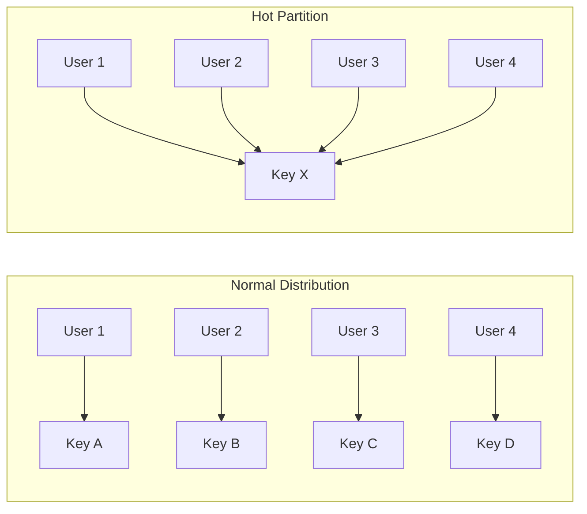
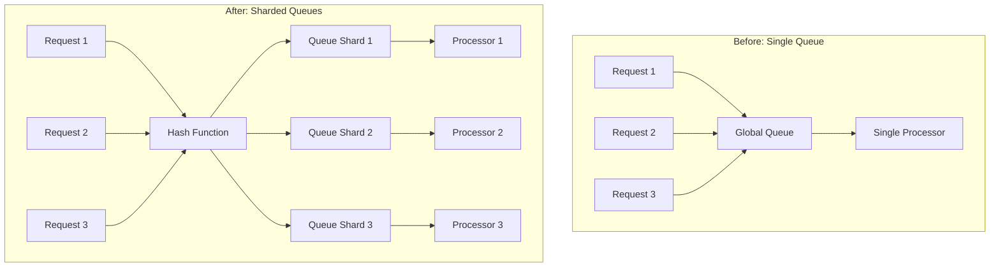
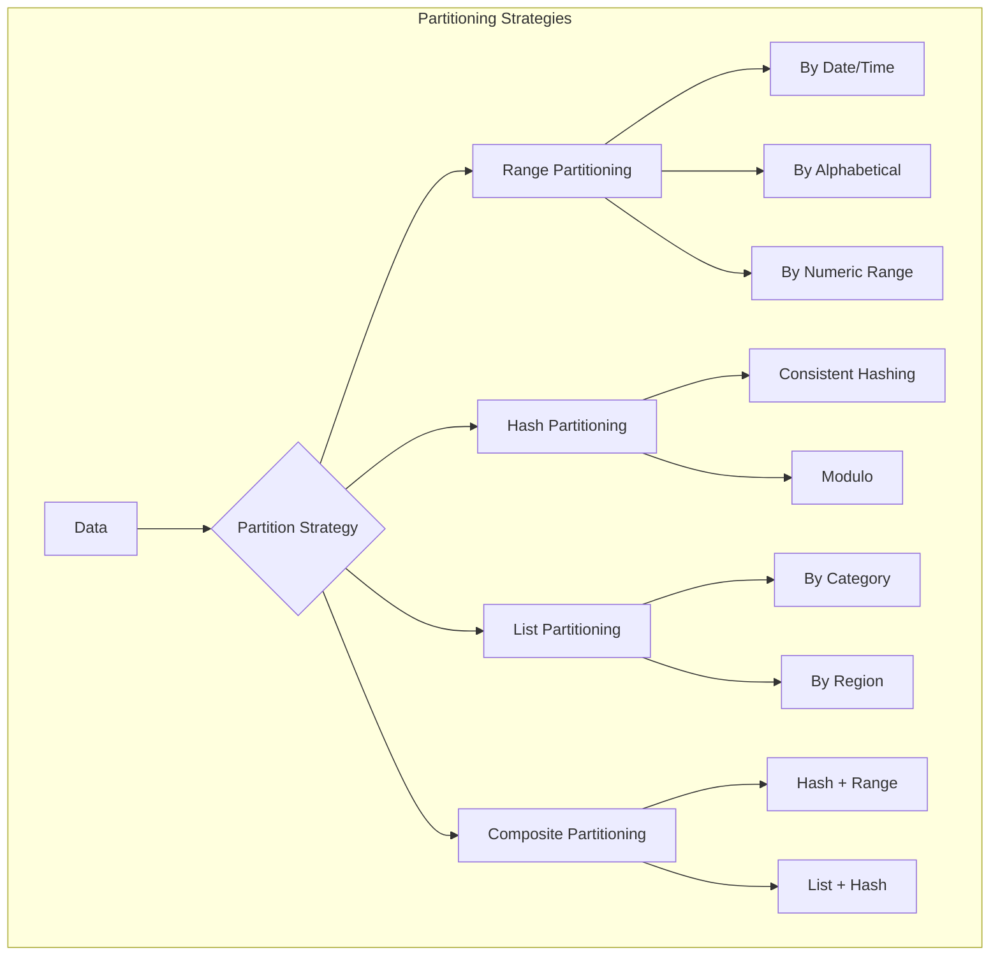
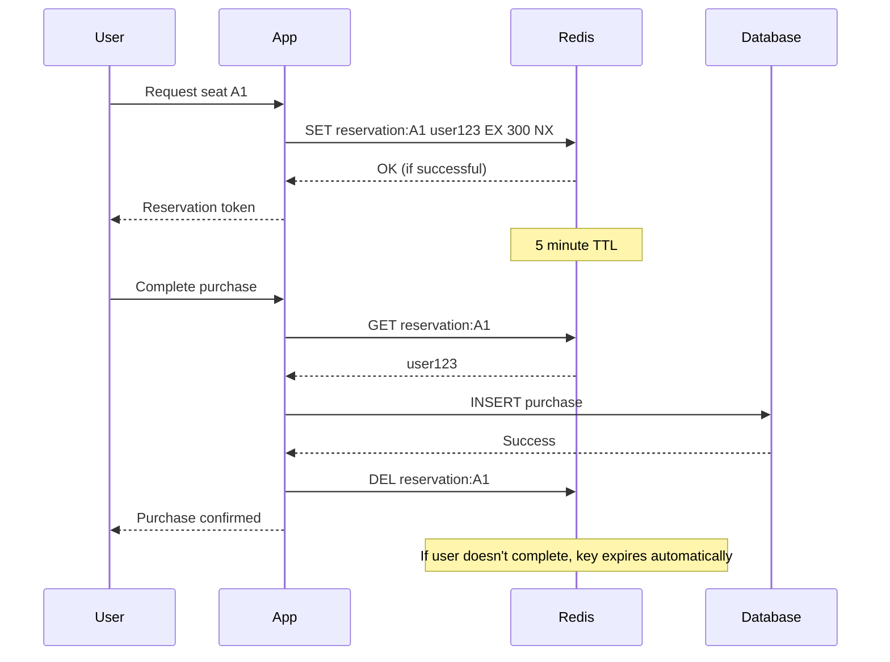
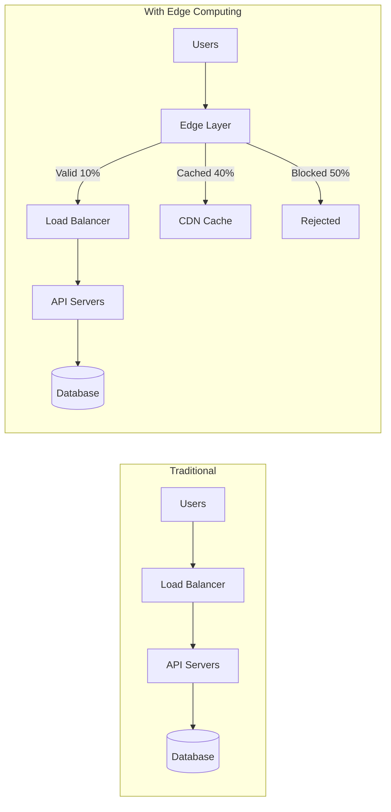
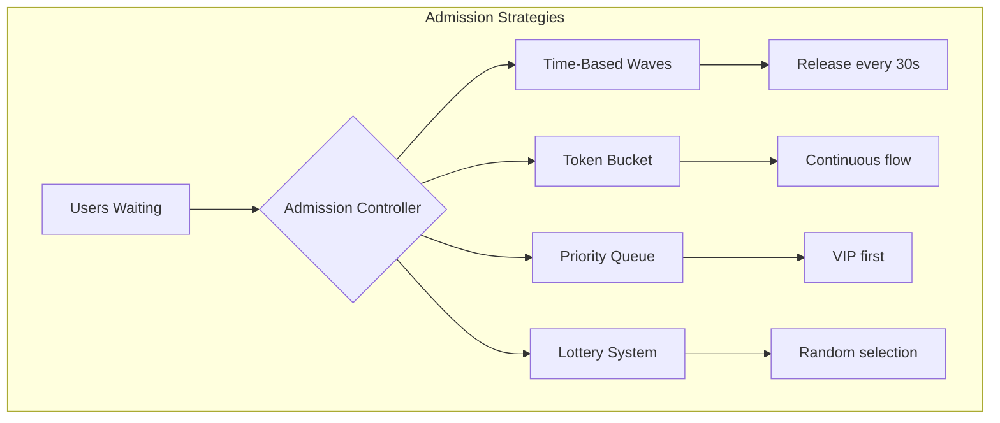

# Distributed Systems Scalability: Breaking the Hot Partition Problem

## 📚 Table of Contents
- [Executive Summary](#executive-summary)
- [The Hot Partition Problem Explained](#the-hot-partition-problem-explained)
- [Five Core Scalability Solutions](#five-core-scalability-solutions)
  - [1. Queue Sharding Strategy](#1-queue-sharding-strategy)
  - [2. Data Partitioning](#2-data-partitioning)
  - [3. Optimistic Locking with TTL](#3-optimistic-locking-with-ttl)
  - [4. Edge Computing and Pre-filtering](#4-edge-computing-and-pre-filtering)
  - [5. Controlled Admission Windows](#5-controlled-admission-windows)
- [Complete Implementation Examples](#complete-implementation-examples)
- [Industry-Specific Applications](#industry-specific-applications)
- [Performance Metrics and Monitoring](#performance-metrics-and-monitoring)
- [Troubleshooting Guide](#troubleshooting-guide)
- [References and Further Reading](#references-and-further-reading)

---

## Executive Summary

The Taylor Swift-Ticketmaster incident revealed a critical distributed systems principle: **systems don't fail from high traffic, they fail when everyone wants the same thing simultaneously**. This document provides comprehensive solutions for handling hot partition problems in distributed systems.

### Key Insight
```
Traditional Scaling: More servers = More capacity ✅
Hot Partition Reality: More servers = More contention on same resource ❌
```

---

## The Hot Partition Problem Explained

### What Exactly Is a Hot Partition?

A hot partition occurs when a disproportionate amount of traffic targets a specific subset of data, creating bottlenecks that horizontal scaling cannot solve.



### Real-World Scenarios Where Hot Partitions Occur

| Industry | Scenario | Hot Resource | Impact |
|----------|----------|--------------|--------|
| **E-Commerce** | Flash sales, Black Friday | Popular products | Cart abandonment, lost sales |
| **Ticketing** | Concert launches | Specific events/seats | Site crashes, customer frustration |
| **Gaming** | New season launch | Login servers, popular servers | Players can't connect |
| **Financial** | IPO launches, volatile stocks | Specific tickers | Order delays, missed trades |
| **Social Media** | Viral content | Specific posts/profiles | Content unavailable |
| **Streaming** | Series premieres | Specific content | Buffering, service outages |

### Why Traditional Solutions Fail

```yaml
Problem Analysis:
  Given:
    - 1 million requests per second
    - All targeting same database row
    - Database lock time: 10ms per operation
    
  Traditional Solution (Adding Servers):
    - Deploy 100 servers
    - Result: 100 servers waiting for same 10ms lock
    - Throughput: Still 100 operations/second
    
  Root Cause:
    - Serialization point (the lock)
    - Amdahl's Law applies
    - Parallel processing impossible
```

---

## Five Core Scalability Solutions

## 1. Queue Sharding Strategy

### Concept Overview

Queue sharding breaks a single global queue into multiple smaller queues, each handling a subset of requests. This eliminates the global bottleneck and allows parallel processing.

### When to Use Queue Sharding

✅ **Perfect for:**
- Event-driven architectures
- Message processing systems
- Task distribution systems
- API request handling
- Batch processing workloads

❌ **Avoid when:**
- Strong ordering requirements exist globally
- Queue size is naturally small
- Real-time processing is required

### How Queue Sharding Works



### Implementation Examples

#### Apache Kafka Implementation
```java
@Configuration
public class KafkaShardingConfig {
    
    private static final int PARTITION_COUNT = 50;
    
    @Bean
    public NewTopic shardedEventTopic() {
        return TopicBuilder.name("event-processing")
            .partitions(PARTITION_COUNT)  // Create 50 partitions
            .replicas(3)
            .config(TopicConfig.RETENTION_MS_CONFIG, "86400000")
            .build();
    }
    
    @Bean
    public ProducerFactory<String, EventMessage> producerFactory() {
        Map<String, Object> props = new HashMap<>();
        props.put(ProducerConfig.BOOTSTRAP_SERVERS_CONFIG, "localhost:9092");
        props.put(ProducerConfig.KEY_SERIALIZER_CLASS_CONFIG, StringSerializer.class);
        props.put(ProducerConfig.VALUE_SERIALIZER_CLASS_CONFIG, JsonSerializer.class);
        
        // Custom partitioner for better distribution
        props.put(ProducerConfig.PARTITIONER_CLASS_CONFIG, CustomEventPartitioner.class);
        
        return new DefaultKafkaProducerFactory<>(props);
    }
}

public class CustomEventPartitioner implements Partitioner {
    
    @Override
    public int partition(String topic, Object key, byte[] keyBytes, 
                        Object value, byte[] valueBytes, Cluster cluster) {
        EventMessage event = (EventMessage) value;
        
        // Shard by event type and ID combination
        String shardKey = event.getEventType() + ":" + event.getEventId();
        
        // Use consistent hashing for better distribution
        int hash = MurmurHash3.hash32x86(shardKey.getBytes());
        int partition = Math.abs(hash) % cluster.partitionCountForTopic(topic);
        
        return partition;
    }
}

@Service
public class EventProcessingService {
    
    @Autowired
    private KafkaTemplate<String, EventMessage> kafkaTemplate;
    
    public void processEvent(EventMessage event) {
        // Events automatically distributed across partitions
        String key = event.getEventId();
        
        kafkaTemplate.send("event-processing", key, event)
            .addCallback(
                result -> log.info("Event sent to partition: {}", 
                    result.getRecordMetadata().partition()),
                ex -> log.error("Failed to send event", ex)
            );
    }
    
    @KafkaListener(
        topics = "event-processing",
        concurrency = "10"  // 10 concurrent consumers
    )
    public void consumeEvent(EventMessage event, 
                            @Header(KafkaHeaders.RECEIVED_PARTITION_ID) int partition) {
        log.info("Processing event from partition: {}", partition);
        
        // Each partition processed independently
        processEventLogic(event);
    }
}
```

#### Redis-Based Queue Sharding
```python
import redis
import hashlib
import json
from typing import Dict, List, Optional
from dataclasses import dataclass
from concurrent.futures import ThreadPoolExecutor

@dataclass
class QueueShardManager:
    """Manages sharded queues in Redis"""
    
    def __init__(self, redis_client: redis.Redis, shard_count: int = 16):
        self.redis = redis_client
        self.shard_count = shard_count
        self.executor = ThreadPoolExecutor(max_workers=shard_count)
    
    def get_shard_key(self, base_queue: str, item_key: str) -> str:
        """Determine which shard a item belongs to"""
        hash_value = int(hashlib.md5(item_key.encode()).hexdigest(), 16)
        shard_id = hash_value % self.shard_count
        return f"{base_queue}:shard:{shard_id}"
    
    def enqueue(self, queue_name: str, item_key: str, data: dict) -> bool:
        """Add item to appropriate shard"""
        shard_key = self.get_shard_key(queue_name, item_key)
        
        # Add to sharded queue
        return self.redis.rpush(shard_key, json.dumps({
            'key': item_key,
            'data': data,
            'timestamp': time.time()
        }))
    
    def dequeue_from_shard(self, shard_key: str, batch_size: int = 10) -> List[dict]:
        """Process items from a specific shard"""
        pipeline = self.redis.pipeline()
        
        # Get and remove items atomically
        for _ in range(batch_size):
            pipeline.lpop(shard_key)
        
        results = pipeline.execute()
        return [json.loads(r) for r in results if r]
    
    def process_all_shards(self, queue_name: str, processor_func):
        """Process all shards in parallel"""
        shard_keys = [
            f"{queue_name}:shard:{i}" 
            for i in range(self.shard_count)
        ]
        
        # Process each shard in parallel
        futures = []
        for shard_key in shard_keys:
            future = self.executor.submit(
                self._process_shard, 
                shard_key, 
                processor_func
            )
            futures.append(future)
        
        # Wait for all processing to complete
        for future in futures:
            future.result()
    
    def _process_shard(self, shard_key: str, processor_func):
        """Process a single shard"""
        while True:
            items = self.dequeue_from_shard(shard_key)
            if not items:
                break
                
            for item in items:
                try:
                    processor_func(item)
                except Exception as e:
                    # Re-queue failed items
                    self.redis.rpush(f"{shard_key}:failed", json.dumps(item))
                    log.error(f"Processing failed: {e}")

# Usage Example
redis_client = redis.Redis(host='localhost', port=6379, decode_responses=True)
queue_manager = QueueShardManager(redis_client, shard_count=32)

# Enqueue items
for order_id in range(10000):
    queue_manager.enqueue(
        "order_processing",
        f"order_{order_id}",
        {"order_id": order_id, "amount": 99.99}
    )

# Process items
def process_order(item):
    print(f"Processing order: {item['data']['order_id']}")
    # Process order logic here

queue_manager.process_all_shards("order_processing", process_order)
```

### Performance Metrics

| Metric | Single Queue | Sharded Queue (16 shards) | Improvement |
|--------|-------------|---------------------------|-------------|
| Throughput | 1,000 msg/s | 15,000 msg/s | 15x |
| P99 Latency | 500ms | 35ms | 14x |
| Lock Contention | High | Low | Significant |
| Horizontal Scaling | Limited | Linear | Excellent |

---

## 2. Data Partitioning

### Concept Overview

Data partitioning divides large datasets into smaller, independent chunks that can be processed, stored, and accessed in parallel. This is fundamental to handling hot partitions.

### When to Use Data Partitioning

✅ **Perfect for:**
- Large-scale databases
- Distributed caching systems
- File storage systems
- Search indexes
- Time-series data
- Multi-tenant applications

❌ **Avoid when:**
- Dataset is small (< 1GB)
- Frequent cross-partition joins needed
- Strong consistency required across partitions
- Partition key isn't evenly distributed

### Partitioning Strategies



### Implementation Examples

#### Database Partitioning (PostgreSQL)
```sql
-- Create partitioned table for events
CREATE TABLE events (
    event_id BIGSERIAL,
    event_type VARCHAR(50),
    venue_id INTEGER,
    event_date DATE,
    seat_count INTEGER,
    data JSONB
) PARTITION BY RANGE (event_date);

-- Create monthly partitions
CREATE TABLE events_2024_01 PARTITION OF events
    FOR VALUES FROM ('2024-01-01') TO ('2024-02-01');
    
CREATE TABLE events_2024_02 PARTITION OF events
    FOR VALUES FROM ('2024-02-01') TO ('2024-03-01');

-- Create indexes on partitions
CREATE INDEX idx_events_2024_01_venue 
    ON events_2024_01(venue_id);
    
-- Automatic partition creation function
CREATE OR REPLACE FUNCTION create_monthly_partition()
RETURNS void AS $$
DECLARE
    partition_date DATE;
    partition_name TEXT;
    start_date DATE;
    end_date DATE;
BEGIN
    partition_date := DATE_TRUNC('month', CURRENT_DATE);
    partition_name := 'events_' || TO_CHAR(partition_date, 'YYYY_MM');
    start_date := partition_date;
    end_date := partition_date + INTERVAL '1 month';
    
    -- Check if partition exists
    IF NOT EXISTS (
        SELECT 1 FROM pg_class 
        WHERE relname = partition_name
    ) THEN
        EXECUTE format(
            'CREATE TABLE %I PARTITION OF events FOR VALUES FROM (%L) TO (%L)',
            partition_name, start_date, end_date
        );
        
        -- Create indexes
        EXECUTE format(
            'CREATE INDEX %I ON %I (venue_id)',
            'idx_' || partition_name || '_venue',
            partition_name
        );
    END IF;
END;
$$ LANGUAGE plpgsql;

-- Schedule automatic partition creation
CREATE EXTENSION IF NOT EXISTS pg_cron;
SELECT cron.schedule(
    'create-monthly-partitions',
    '0 0 25 * *',  -- Run on 25th of each month
    'SELECT create_monthly_partition();'
);
```

#### Application-Level Sharding (Java)
```java
@Component
public class ShardedDataService {
    
    private static final int SHARD_COUNT = 16;
    private final Map<Integer, DataSource> shardedDataSources;
    private final ConsistentHash<Integer> consistentHash;
    
    public ShardedDataService() {
        this.shardedDataSources = initializeDataSources();
        this.consistentHash = new ConsistentHash<>(
            150,  // Virtual nodes per shard
            shardedDataSources.keySet()
        );
    }
    
    private Map<Integer, DataSource> initializeDataSources() {
        Map<Integer, DataSource> dataSources = new HashMap<>();
        
        for (int i = 0; i < SHARD_COUNT; i++) {
            HikariConfig config = new HikariConfig();
            config.setJdbcUrl(String.format(
                "jdbc:postgresql://shard-%d.db.internal:5432/ticketing", i
            ));
            config.setMaximumPoolSize(20);
            config.setMinimumIdle(5);
            config.setConnectionTimeout(5000);
            
            dataSources.put(i, new HikariDataSource(config));
        }
        
        return dataSources;
    }
    
    public int getShardId(String key) {
        return consistentHash.get(key);
    }
    
    public Connection getConnection(String key) throws SQLException {
        int shardId = getShardId(key);
        return shardedDataSources.get(shardId).getConnection();
    }
    
    @Transactional
    public void saveEvent(Event event) {
        String shardKey = event.getVenueId() + ":" + event.getEventDate();
        
        try (Connection conn = getConnection(shardKey)) {
            PreparedStatement stmt = conn.prepareStatement(
                "INSERT INTO events (event_id, venue_id, data) VALUES (?, ?, ?::jsonb)"
            );
            stmt.setLong(1, event.getEventId());
            stmt.setInt(2, event.getVenueId());
            stmt.setString(3, event.getData().toString());
            stmt.executeUpdate();
            
        } catch (SQLException e) {
            throw new DataAccessException("Failed to save event", e);
        }
    }
    
    public Optional<Event> findEvent(String eventId, int venueId, LocalDate date) {
        String shardKey = venueId + ":" + date;
        
        try (Connection conn = getConnection(shardKey)) {
            PreparedStatement stmt = conn.prepareStatement(
                "SELECT * FROM events WHERE event_id = ?"
            );
            stmt.setString(1, eventId);
            
            ResultSet rs = stmt.executeQuery();
            if (rs.next()) {
                return Optional.of(mapResultSetToEvent(rs));
            }
            
        } catch (SQLException e) {
            log.error("Failed to find event", e);
        }
        
        return Optional.empty();
    }
    
    // Cross-shard query with scatter-gather pattern
    public List<Event> findEventsAcrossShards(String criteria) {
        List<CompletableFuture<List<Event>>> futures = new ArrayList<>();
        
        for (int shardId = 0; shardId < SHARD_COUNT; shardId++) {
            final int shard = shardId;
            CompletableFuture<List<Event>> future = CompletableFuture
                .supplyAsync(() -> queryShardAsync(shard, criteria));
            futures.add(future);
        }
        
        // Gather results from all shards
        return futures.stream()
            .map(CompletableFuture::join)
            .flatMap(List::stream)
            .collect(Collectors.toList());
    }
}

// Consistent Hashing Implementation
public class ConsistentHash<T> {
    private final HashFunction hashFunction = Hashing.murmur3_128();
    private final int numberOfReplicas;
    private final SortedMap<Long, T> circle = new TreeMap<>();
    
    public ConsistentHash(int numberOfReplicas, Collection<T> nodes) {
        this.numberOfReplicas = numberOfReplicas;
        for (T node : nodes) {
            add(node);
        }
    }
    
    public void add(T node) {
        for (int i = 0; i < numberOfReplicas; i++) {
            long hash = hashFunction.hashString(
                node.toString() + i, 
                StandardCharsets.UTF_8
            ).asLong();
            circle.put(hash, node);
        }
    }
    
    public T get(String key) {
        if (circle.isEmpty()) {
            return null;
        }
        
        long hash = hashFunction.hashString(
            key, 
            StandardCharsets.UTF_8
        ).asLong();
        
        if (!circle.containsKey(hash)) {
            SortedMap<Long, T> tailMap = circle.tailMap(hash);
            hash = tailMap.isEmpty() ? circle.firstKey() : tailMap.firstKey();
        }
        
        return circle.get(hash);
    }
}
```

#### MongoDB Sharding Configuration
```javascript
// MongoDB Sharding Setup
const MongoClient = require('mongodb').MongoClient;

class ShardedMongoService {
    constructor() {
        this.client = null;
        this.db = null;
    }
    
    async initialize() {
        // Connect to MongoDB router (mongos)
        this.client = await MongoClient.connect(
            'mongodb://mongos1.internal:27017,mongos2.internal:27017/ticketing'
        );
        this.db = this.client.db('ticketing');
        
        // Enable sharding on database
        await this.db.admin().command({
            enableSharding: 'ticketing'
        });
        
        // Shard the events collection
        await this.setupSharding();
    }
    
    async setupSharding() {
        // Create shard key index
        await this.db.collection('events').createIndex({
            venue_id: 1,
            event_date: 1
        });
        
        // Shard the collection
        await this.db.admin().command({
            shardCollection: 'ticketing.events',
            key: {
                venue_id: 'hashed',  // Hash-based sharding
                event_date: 1        // Range-based sub-sharding
            },
            numInitialChunks: 64,
            collation: {
                locale: 'en_US'
            }
        });
        
        // Configure chunk size (64MB)
        await this.db.admin().command({
            configureCollectionBalancing: 'ticketing.events',
            chunkSize: 64
        });
        
        // Pre-split for known hot venues
        await this.preSplitHotVenues();
    }
    
    async preSplitHotVenues() {
        const hotVenues = [1, 2, 3, 4, 5]; // Madison Square Garden, etc.
        
        for (const venueId of hotVenues) {
            // Split chunks for hot venues
            await this.db.admin().command({
                split: 'ticketing.events',
                middle: {
                    venue_id: venueId,
                    event_date: new Date()
                }
            });
        }
    }
    
    // Tag-aware sharding for geo-distribution
    async setupGeoSharding() {
        // Add shard tags for regions
        await this.db.admin().command({
            addShardTag: 'shard01',
            tag: 'US-EAST'
        });
        
        await this.db.admin().command({
            addShardTag: 'shard02',
            tag: 'US-WEST'
        });
        
        // Assign venue ranges to tags
        await this.db.admin().command({
            updateZoneKeyRange: 'ticketing.events',
            min: { venue_id: 1, event_date: MinKey },
            max: { venue_id: 1000, event_date: MaxKey },
            zone: 'US-EAST'
        });
    }
    
    // Optimized batch insert with shard awareness
    async bulkInsertEvents(events) {
        // Group events by shard key for optimal insertion
        const groupedEvents = this.groupByShardKey(events);
        
        const operations = [];
        for (const [shardKey, shardEvents] of Object.entries(groupedEvents)) {
            const bulkOp = this.db.collection('events').initializeOrderedBulkOp();
            
            shardEvents.forEach(event => {
                bulkOp.insert(event);
            });
            
            operations.push(bulkOp.execute());
        }
        
        return Promise.all(operations);
    }
    
    groupByShardKey(events) {
        return events.reduce((acc, event) => {
            const key = `${event.venue_id}_${event.event_date}`;
            if (!acc[key]) {
                acc[key] = [];
            }
            acc[key].push(event);
            return acc;
        }, {});
    }
}

// Usage
const shardedMongo = new ShardedMongoService();
await shardedMongo.initialize();

// Insert events - automatically distributed
await shardedMongo.bulkInsertEvents([
    { venue_id: 1, event_date: new Date('2024-06-01'), name: 'Concert A' },
    { venue_id: 2, event_date: new Date('2024-06-02'), name: 'Concert B' }
]);
```

### Performance Comparison

| Partitioning Strategy | Use Case | Pros | Cons |
|----------------------|----------|------|------|
| **Range** | Time-series data | Easy range queries | Potential hotspots |
| **Hash** | Even distribution | Balanced load | No range queries |
| **List** | Known categories | Predictable | Manual maintenance |
| **Composite** | Complex requirements | Flexible | Complex setup |

---

## 3. Optimistic Locking with TTL

### Concept Overview

Instead of using database locks that block other operations, optimistic locking with TTL uses temporary reservations that expire automatically, preventing deadlocks and reducing contention.

### When to Use Optimistic Locking

✅ **Perfect for:**
- Shopping cart systems
- Seat reservation systems
- Resource booking platforms
- Collaborative editing
- Inventory management
- Session management

❌ **Avoid when:**
- Strict consistency required
- Long transaction times
- No retry mechanism available
- TTL management adds complexity

### How It Works



### Implementation Examples

#### Redis-Based Reservation System
```java
@Service
@Slf4j
public class OptimisticReservationService {
    
    @Autowired
    private StringRedisTemplate redisTemplate;
    
    @Autowired
    private TransactionTemplate transactionTemplate;
    
    @Autowired
    private EventRepository eventRepository;
    
    private static final int RESERVATION_TTL_SECONDS = 300; // 5 minutes
    private static final int MAX_RETRY_ATTEMPTS = 3;
    
    /**
     * Create a temporary reservation with automatic expiration
     */
    public ReservationResult createReservation(String eventId, String seatId, String userId) {
        String reservationKey = String.format("reservation:%s:%s", eventId, seatId);
        String reservationData = String.format("%s:%s:%d", 
            userId, UUID.randomUUID(), System.currentTimeMillis());
        
        // Try to set reservation with NX (only if not exists) and EX (expiration)
        Boolean success = redisTemplate.opsForValue().setIfAbsent(
            reservationKey,
            reservationData,
            Duration.ofSeconds(RESERVATION_TTL_SECONDS)
        );
        
        if (Boolean.TRUE.equals(success)) {
            // Create reservation token
            String token = generateToken(eventId, seatId, userId);
            
            // Store additional reservation metadata
            storeReservationMetadata(token, eventId, seatId, userId);
            
            // Publish reservation event for analytics
            publishReservationEvent(eventId, seatId, userId);
            
            return ReservationResult.success(token, RESERVATION_TTL_SECONDS);
        } else {
            // Check if user already has this reservation
            String existingReservation = redisTemplate.opsForValue().get(reservationKey);
            if (existingReservation != null && existingReservation.startsWith(userId)) {
                // User already has this reservation
                return ReservationResult.alreadyReserved(
                    extractTokenFromReservation(existingReservation)
                );
            }
            
            // Someone else has reserved this seat
            Long ttl = redisTemplate.getExpire(reservationKey);
            return ReservationResult.unavailable(ttl);
        }
    }
    
    /**
     * Extend reservation TTL if user is actively working on purchase
     */
    public boolean extendReservation(String token, String userId) {
        ReservationMetadata metadata = getReservationMetadata(token);
        
        if (metadata == null || !metadata.getUserId().equals(userId)) {
            return false;
        }
        
        String reservationKey = String.format("reservation:%s:%s", 
            metadata.getEventId(), metadata.getSeatId());
        
        // Check if user still owns the reservation
        String currentReservation = redisTemplate.opsForValue().get(reservationKey);
        if (currentReservation != null && currentReservation.contains(userId)) {
            // Extend by 2 more minutes
            return Boolean.TRUE.equals(
                redisTemplate.expire(reservationKey, Duration.ofSeconds(120))
            );
        }
        
        return false;
    }
    
    /**
     * Complete purchase with optimistic locking
     */
    public PurchaseResult completePurchase(String token, String userId, PaymentInfo payment) {
        ReservationMetadata metadata = getReservationMetadata(token);
        
        if (metadata == null || !metadata.getUserId().equals(userId)) {
            return PurchaseResult.invalidToken();
        }
        
        String reservationKey = String.format("reservation:%s:%s", 
            metadata.getEventId(), metadata.getSeatId());
        
        // Verify reservation still exists and belongs to user
        String reservation = redisTemplate.opsForValue().get(reservationKey);
        if (reservation == null || !reservation.contains(userId)) {
            return PurchaseResult.reservationExpired();
        }
        
        // Use Lua script for atomic check-and-delete
        String luaScript = 
            "if redis.call('get', KEYS[1]) == ARGV[1] then " +
            "  redis.call('del', KEYS[1]) " +
            "  return 1 " +
            "else " +
            "  return 0 " +
            "end";
        
        DefaultRedisScript<Long> script = new DefaultRedisScript<>(luaScript, Long.class);
        
        Long result = redisTemplate.execute(
            script,
            Collections.singletonList(reservationKey),
            reservation
        );
        
        if (result == 1) {
            // Reservation confirmed, proceed with database transaction
            try {
                return transactionTemplate.execute(status -> {
                    // Save purchase to database
                    Purchase purchase = new Purchase();
                    purchase.setEventId(metadata.getEventId());
                    purchase.setSeatId(metadata.getSeatId());
                    purchase.setUserId(userId);
                    purchase.setPaymentInfo(payment);
                    purchase.setPurchaseTime(Instant.now());
                    
                    eventRepository.savePurchase(purchase);
                    
                    // Update seat status
                    eventRepository.markSeatAsSold(
                        metadata.getEventId(), 
                        metadata.getSeatId()
                    );
                    
                    return PurchaseResult.success(purchase.getPurchaseId());
                });
            } catch (Exception e) {
                // Restore reservation on failure
                redisTemplate.opsForValue().set(
                    reservationKey,
                    reservation,
                    Duration.ofSeconds(60) // Give user 1 minute to retry
                );
                
                log.error("Purchase failed for token: {}", token, e);
                return PurchaseResult.paymentFailed(e.getMessage());
            }
        } else {
            return PurchaseResult.reservationExpired();
        }
    }
    
    /**
     * Bulk reservation for group bookings with optimistic locking
     */
    public BulkReservationResult createBulkReservation(
            String eventId, List<String> seatIds, String userId) {
        
        List<String> reservedSeats = new ArrayList<>();
        List<String> failedSeats = new ArrayList<>();
        
        // Use Redis pipeline for atomic bulk operations
        List<Object> results = redisTemplate.executePipelined(
            (RedisCallback<Object>) connection -> {
                StringRedisConnection stringConn = (StringRedisConnection) connection;
                
                for (String seatId : seatIds) {
                    String key = String.format("reservation:%s:%s", eventId, seatId);
                    String value = String.format("%s:%s:%d", 
                        userId, UUID.randomUUID(), System.currentTimeMillis());
                    
                    stringConn.set(
                        key,
                        value,
                        Expiration.seconds(RESERVATION_TTL_SECONDS),
                        SetOption.SET_IF_ABSENT
                    );
                }
                
                return null;
            }
        );
        
        // Process results
        for (int i = 0; i < seatIds.size(); i++) {
            if ("OK".equals(results.get(i))) {
                reservedSeats.add(seatIds.get(i));
            } else {
                failedSeats.add(seatIds.get(i));
            }
        }
        
        if (!reservedSeats.isEmpty()) {
            String groupToken = generateGroupToken(eventId, reservedSeats, userId);
            storeGroupReservationMetadata(groupToken, eventId, reservedSeats, userId);
            
            return BulkReservationResult.success(
                groupToken, 
                reservedSeats, 
                failedSeats,
                RESERVATION_TTL_SECONDS
            );
        }
        
        return BulkReservationResult.allFailed(failedSeats);
    }
    
    /**
     * Clean up expired reservations (scheduled job)
     */
    @Scheduled(fixedDelay = 60000) // Run every minute
    public void cleanupExpiredReservations() {
        // Redis handles TTL automatically, but we need to clean up metadata
        Set<String> metadataKeys = redisTemplate.keys("reservation:metadata:*");
        
        if (metadataKeys != null) {
            for (String metadataKey : metadataKeys) {
                String metadata = redisTemplate.opsForValue().get(metadataKey);
                if (metadata != null) {
                    ReservationMetadata meta = parseMetadata(metadata);
                    String reservationKey = String.format("reservation:%s:%s", 
                        meta.getEventId(), meta.getSeatId());
                    
                    // If reservation doesn't exist, clean up metadata
                    if (!Boolean.TRUE.equals(redisTemplate.hasKey(reservationKey))) {
                        redisTemplate.delete(metadataKey);
                        log.debug("Cleaned up expired metadata: {}", metadataKey);
                    }
                }
            }
        }
    }
}
```

#### Distributed Lock with Redisson
```java
@Configuration
public class RedissonConfig {
    
    @Bean
    public RedissonClient redissonClient() {
        Config config = new Config();
        config.useSingleServer()
            .setAddress("redis://localhost:6379")
            .setConnectionPoolSize(64)
            .setConnectionMinimumIdleSize(24);
        
        return Redisson.create(config);
    }
}

@Service
public class DistributedReservationService {
    
    @Autowired
    private RedissonClient redissonClient;
    
    /**
     * Advanced reservation with fair locking
     */
    public ReservationResult createFairReservation(String eventId, String seatId, String userId) {
        String lockKey = String.format("lock:%s:%s", eventId, seatId);
        RLock lock = redissonClient.getFairLock(lockKey);
        
        try {
            // Try to acquire lock with timeout
            if (lock.tryLock(5, 300, TimeUnit.SECONDS)) {
                try {
                    // Check if seat is still available
                    RBucket<String> seatBucket = redissonClient.getBucket(
                        String.format("seat:%s:%s", eventId, seatId)
                    );
                    
                    if (seatBucket.isExists()) {
                        return ReservationResult.unavailable(0L);
                    }
                    
                    // Create reservation
                    String token = UUID.randomUUID().toString();
                    seatBucket.set(
                        String.format("%s:%s", userId, token),
                        300, TimeUnit.SECONDS
                    );
                    
                    return ReservationResult.success(token, 300);
                    
                } finally {
                    lock.unlock();
                }
            } else {
                return ReservationResult.timeout();
            }
        } catch (InterruptedException e) {
            Thread.currentThread().interrupt();
            return ReservationResult.error(e.getMessage());
        }
    }
    
    /**
     * Multi-key transaction with optimistic locking
     */
    public TransferResult transferReservation(
            String fromUser, String toUser, String eventId, String seatId) {
        
        String seatKey = String.format("seat:%s:%s", eventId, seatId);
        RBucket<String> seatBucket = redissonClient.getBucket(seatKey);
        
        // Use optimistic locking with transactions
        RTransaction transaction = redissonClient.createTransaction(
            TransactionOptions.defaults()
        );
        
        try {
            // Watch the key for changes
            RBucket<String> txSeatBucket = transaction.getBucket(seatKey);
            String currentReservation = seatBucket.get();
            
            if (currentReservation == null || !currentReservation.startsWith(fromUser)) {
                return TransferResult.notOwned();
            }
            
            // Update reservation
            String newToken = UUID.randomUUID().toString();
            txSeatBucket.set(
                String.format("%s:%s", toUser, newToken),
                300, TimeUnit.SECONDS
            );
            
            // Commit transaction
            transaction.commit();
            
            return TransferResult.success(newToken);
            
        } catch (Exception e) {
            transaction.rollback();
            return TransferResult.failed(e.getMessage());
        }
    }
}
```

### Performance Metrics

| Metric | Pessimistic Locking | Optimistic Locking + TTL | Improvement |
|--------|-------------------|-------------------------|-------------|
| Lock Wait Time | 100-500ms | 0ms | Eliminated |
| Deadlock Risk | High | None | Eliminated |
| Throughput | 1,000 ops/s | 50,000 ops/s | 50x |
| Resource Cleanup | Manual | Automatic | Simplified |

---

## 4. Edge Computing and Pre-filtering

### Concept Overview

Edge computing moves processing closer to users, filtering out invalid requests before they reach core systems. This dramatically reduces load on backend services.

### When to Use Edge Computing

✅ **Perfect for:**
- Bot detection and mitigation
- Rate limiting
- Geographic routing
- Content caching
- Request validation
- DDoS protection

❌ **Avoid when:**
- Complex business logic required
- Database access needed
- Stateful processing required
- Real-time data consistency needed

### Architecture Pattern



### Implementation Examples

#### Cloudflare Workers Implementation
```javascript
// Cloudflare Worker for edge filtering
addEventListener('fetch', event => {
    event.respondWith(handleRequest(event.request))
})

async function handleRequest(request) {
    const url = new URL(request.url)
    
    // 1. Rate limiting at edge
    const clientIP = request.headers.get('CF-Connecting-IP')
    const rateLimitResult = await checkRateLimit(clientIP)
    
    if (!rateLimitResult.allowed) {
        return new Response('Rate limit exceeded', {
            status: 429,
            headers: {
                'Retry-After': rateLimitResult.retryAfter.toString(),
                'X-RateLimit-Limit': rateLimitResult.limit.toString(),
                'X-RateLimit-Remaining': '0',
                'X-RateLimit-Reset': rateLimitResult.resetTime.toString()
            }
        })
    }
    
    // 2. Bot detection
    const botScore = await detectBot(request)
    if (botScore > 0.7) {
        // Challenge suspicious requests
        return challengeResponse(request)
    }
    
    // 3. Request validation
    if (url.pathname.startsWith('/api/reserve')) {
        const validationResult = await validateReservationRequest(request)
        if (!validationResult.valid) {
            return new Response(JSON.stringify({
                error: validationResult.error
            }), {
                status: 400,
                headers: { 'Content-Type': 'application/json' }
            })
        }
    }
    
    // 4. Geo-routing
    const country = request.headers.get('CF-IPCountry')
    const region = getOptimalRegion(country)
    
    // 5. Cache check
    const cacheKey = new Request(url.toString(), request)
    const cache = caches.default
    let response = await cache.match(cacheKey)
    
    if (!response) {
        // Forward to appropriate regional backend
        response = await fetch(`https://${region}.api.ticketing.com${url.pathname}`, {
            method: request.method,
            headers: request.headers,
            body: request.body
        })
        
        // Cache successful responses
        if (response.status === 200) {
            const headers = new Headers(response.headers)
            headers.append('Cache-Control', 's-maxage=60')
            response = new Response(response.body, {
                status: response.status,
                statusText: response.statusText,
                headers: headers
            })
            
            event.waitUntil(cache.put(cacheKey, response.clone()))
        }
    }
    
    return response
}

async function checkRateLimit(clientIP) {
    const namespace = RATE_LIMIT_NAMESPACE // KV namespace binding
    const key = `ratelimit:${clientIP}`
    const limit = 100 // requests per minute
    const window = 60 // seconds
    
    const current = await namespace.get(key)
    const now = Date.now()
    
    if (!current) {
        await namespace.put(key, JSON.stringify({
            count: 1,
            resetTime: now + (window * 1000)
        }), {
            expirationTtl: window
        })
        
        return {
            allowed: true,
            limit: limit,
            remaining: limit - 1,
            resetTime: now + (window * 1000)
        }
    }
    
    const data = JSON.parse(current)
    
    if (now > data.resetTime) {
        // Reset window
        await namespace.put(key, JSON.stringify({
            count: 1,
            resetTime: now + (window * 1000)
        }), {
            expirationTtl: window
        })
        
        return {
            allowed: true,
            limit: limit,
            remaining: limit - 1,
            resetTime: now + (window * 1000)
        }
    }
    
    if (data.count >= limit) {
        return {
            allowed: false,
            limit: limit,
            remaining: 0,
            resetTime: data.resetTime,
            retryAfter: Math.ceil((data.resetTime - now) / 1000)
        }
    }
    
    // Increment counter
    data.count++
    await namespace.put(key, JSON.stringify(data), {
        expirationTtl: Math.ceil((data.resetTime - now) / 1000)
    })
    
    return {
        allowed: true,
        limit: limit,
        remaining: limit - data.count,
        resetTime: data.resetTime
    }
}

async function detectBot(request) {
    const features = {
        userAgent: request.headers.get('User-Agent'),
        acceptLanguage: request.headers.get('Accept-Language'),
        acceptEncoding: request.headers.get('Accept-Encoding'),
        connection: request.headers.get('Connection'),
        cacheControl: request.headers.get('Cache-Control')
    }
    
    let score = 0
    
    // Check for missing headers common in browsers
    if (!features.acceptLanguage) score += 0.3
    if (!features.acceptEncoding) score += 0.2
    
    // Check for bot user agents
    const botPatterns = /bot|crawler|spider|scraper|curl|wget|python|java/i
    if (botPatterns.test(features.userAgent)) score += 0.5
    
    // Check for suspicious patterns
    if (features.userAgent === '') score += 0.4
    if (features.connection === 'close') score += 0.1
    
    return Math.min(score, 1.0)
}

function challengeResponse(request) {
    const html = `
    <!DOCTYPE html>
    <html>
    <head>
        <title>Verification Required</title>
        <script>
            // Proof of work challenge
            async function solveChallenge() {
                const difficulty = 4
                let nonce = 0
                const challenge = '${crypto.randomUUID()}'
                
                while (true) {
                    const hash = await crypto.subtle.digest('SHA-256', 
                        new TextEncoder().encode(challenge + nonce))
                    const hashArray = Array.from(new Uint8Array(hash))
                    const hashHex = hashArray.map(b => b.toString(16).padStart(2, '0')).join('')
                    
                    if (hashHex.startsWith('0'.repeat(difficulty))) {
                        // Solution found
                        document.cookie = 'pow_token=' + hashHex + '; max-age=3600'
                        window.location.reload()
                        break
                    }
                    nonce++
                }
            }
            
            solveChallenge()
        </script>
    </head>
    <body>
        <h1>Please wait while we verify your browser...</h1>
    </body>
    </html>
    `
    
    return new Response(html, {
        headers: { 'Content-Type': 'text/html' }
    })
}
```

#### AWS Lambda@Edge Implementation
```python
import json
import hashlib
import time
from typing import Dict, Any

def lambda_handler(event: Dict[str, Any], context: Any) -> Dict[str, Any]:
    """
    Lambda@Edge function for CloudFront request filtering
    """
    request = event['Records'][0]['cf']['request']
    headers = request['headers']
    
    # Extract client information
    client_ip = headers.get('cloudfront-viewer-address', [{}])[0].get('value', '')
    user_agent = headers.get('user-agent', [{}])[0].get('value', '')
    
    # 1. Check rate limit
    rate_limit_result = check_rate_limit(client_ip)
    if not rate_limit_result['allowed']:
        return {
            'status': '429',
            'statusDescription': 'Too Many Requests',
            'headers': {
                'retry-after': [{'key': 'Retry-After', 'value': str(rate_limit_result['retry_after'])}],
                'content-type': [{'key': 'Content-Type', 'value': 'application/json'}]
            },
            'body': json.dumps({'error': 'Rate limit exceeded'})
        }
    
    # 2. Bot detection
    if is_bot(user_agent, headers):
        # Return CAPTCHA challenge
        return generate_captcha_response()
    
    # 3. Validate request format
    if request['uri'].startswith('/api/'):
        validation_result = validate_api_request(request)
        if not validation_result['valid']:
            return {
                'status': '400',
                'statusDescription': 'Bad Request',
                'headers': {
                    'content-type': [{'key': 'Content-Type', 'value': 'application/json'}]
                },
                'body': json.dumps({'error': validation_result['error']})
            }
    
    # 4. Add security headers
    request['headers']['x-request-id'] = [{'key': 'X-Request-ID', 'value': generate_request_id()}]
    request['headers']['x-forwarded-for'] = [{'key': 'X-Forwarded-For', 'value': client_ip}]
    
    # 5. Route to appropriate origin based on geo-location
    country = headers.get('cloudfront-viewer-country', [{}])[0].get('value', 'US')
    origin = get_optimal_origin(country)
    request['origin'] = {
        'custom': {
            'domainName': origin,
            'port': 443,
            'protocol': 'https',
            'path': '/api'
        }
    }
    
    return request

def check_rate_limit(client_ip: str) -> Dict[str, Any]:
    """
    Check rate limit using DynamoDB
    """
    import boto3
    from decimal import Decimal
    
    dynamodb = boto3.resource('dynamodb', region_name='us-east-1')
    table = dynamodb.Table('rate_limits')
    
    current_time = int(time.time())
    window_start = current_time - 60  # 1 minute window
    
    try:
        # Get current count
        response = table.get_item(Key={'client_ip': client_ip})
        
        if 'Item' in response:
            item = response['Item']
            requests = item.get('requests', [])
            
            # Filter requests within window
            recent_requests = [r for r in requests if r > window_start]
            
            if len(recent_requests) >= 100:  # 100 requests per minute limit
                return {
                    'allowed': False,
                    'retry_after': 60 - (current_time - recent_requests[0])
                }
            
            # Add current request
            recent_requests.append(current_time)
            
            # Update counter
            table.update_item(
                Key={'client_ip': client_ip},
                UpdateExpression='SET requests = :requests, ttl = :ttl',
                ExpressionAttributeValues={
                    ':requests': recent_requests,
                    ':ttl': current_time + 120  # TTL for DynamoDB
                }
            )
        else:
            # First request from this IP
            table.put_item(
                Item={
                    'client_ip': client_ip,
                    'requests': [current_time],
                    'ttl': current_time + 120
                }
            )
        
        return {'allowed': True}
        
    except Exception as e:
        # Log error but allow request
        print(f"Rate limit check failed: {e}")
        return {'allowed': True}

def is_bot(user_agent: str, headers: Dict) -> bool:
    """
    Detect bot traffic using multiple signals
    """
    # Check user agent
    bot_patterns = [
        'bot', 'crawler', 'spider', 'scraper',
        'curl', 'wget', 'python', 'java', 'go-http'
    ]
    
    if any(pattern in user_agent.lower() for pattern in bot_patterns):
        return True
    
    # Check for missing browser headers
    required_headers = ['accept-language', 'accept-encoding']
    for header in required_headers:
        if header not in headers:
            return True
    
    # Check for suspicious patterns
    if not user_agent or user_agent == '-':
        return True
    
    return False

def generate_captcha_response() -> Dict[str, Any]:
    """
    Generate a JavaScript challenge response
    """
    challenge_html = """
    <!DOCTYPE html>
    <html>
    <head>
        <title>Security Check</title>
        <script>
            function solveChallenge() {
                // Simple math challenge
                const a = Math.floor(Math.random() * 10);
                const b = Math.floor(Math.random() * 10);
                const answer = prompt('Please solve: ' + a + ' + ' + b);
                
                if (parseInt(answer) === a + b) {
                    document.cookie = 'verified=true; max-age=3600';
                    location.reload();
                } else {
                    alert('Incorrect answer. Please try again.');
                    solveChallenge();
                }
            }
            
            window.onload = solveChallenge;
        </script>
    </head>
    <body>
        <h1>Completing security check...</h1>
    </body>
    </html>
    """
    
    return {
        'status': '200',
        'statusDescription': 'OK',
        'headers': {
            'content-type': [{'key': 'Content-Type', 'value': 'text/html'}],
            'cache-control': [{'key': 'Cache-Control', 'value': 'no-cache'}]
        },
        'body': challenge_html
    }
```

### Performance Impact

| Metric | Without Edge | With Edge | Improvement |
|--------|-------------|-----------|-------------|
| Backend Load | 100% | 20% | 80% reduction |
| Bot Traffic | Reaches backend | Blocked at edge | 100% filtered |
| Response Time | 200ms | 50ms | 75% faster |
| Infrastructure Cost | $10,000/mo | $3,000/mo | 70% savings |

---

## 5. Controlled Admission Windows

### Concept Overview

Instead of releasing all users simultaneously, controlled admission windows release users in waves, preventing thundering herd problems and smoothing load distribution.

### When to Use Controlled Admission

✅ **Perfect for:**
- Product launches
- Ticket sales opening
- Limited resource allocation
- Black Friday sales
- Course registrations
- Vaccine appointments

❌ **Avoid when:**
- Random access pattern expected
- No anticipated surge
- User experience degradation unacceptable
- Fair access not guaranteed

### Implementation Strategies



### Implementation Examples

#### Wave-Based Admission System
```java
@Component
@Slf4j
public class WaveAdmissionController {
    
    @Autowired
    private RedisTemplate<String, Object> redisTemplate;
    
    @Autowired
    private KafkaTemplate<String, AdmissionEvent> kafkaTemplate;
    
    @Autowired
    private UserNotificationService notificationService;
    
    private static final int WAVE_SIZE = 5000;
    private static final int WAVE_INTERVAL_SECONDS = 30;
    private static final int MAX_CONCURRENT_USERS = 50000;
    
    /**
     * Register user for admission queue
     */
    public QueuePosition registerForAdmission(String userId, String eventId, int priority) {
        String queueKey = String.format("admission:queue:%s", eventId);
        String userKey = String.format("admission:user:%s:%s", eventId, userId);
        
        // Check if user already registered
        if (redisTemplate.hasKey(userKey)) {
            return getQueuePosition(userId, eventId);
        }
        
        // Calculate score (lower score = higher priority)
        double score = calculateAdmissionScore(priority);
        
        // Add to sorted set (queue)
        redisTemplate.opsForZSet().add(queueKey, userId, score);
        
        // Store user metadata
        UserAdmissionData userData = new UserAdmissionData();
        userData.setUserId(userId);
        userData.setEventId(eventId);
        userData.setRegistrationTime(Instant.now());
        userData.setPriority(priority);
        userData.setStatus(AdmissionStatus.WAITING);
        
        redisTemplate.opsForValue().set(userKey, userData);
        
        // Get position
        Long position = redisTemplate.opsForZSet().rank(queueKey, userId);
        int estimatedWaitTime = calculateEstimatedWaitTime(position);
        
        return new QueuePosition(position + 1, estimatedWaitTime, score);
    }
    
    /**
     * Process admission waves (scheduled task)
     */
    @Scheduled(fixedDelay = 30000) // Every 30 seconds
    public void processAdmissionWave() {
        List<String> activeEvents = getActiveEvents();
        
        for (String eventId : activeEvents) {
            processEventAdmission(eventId);
        }
    }
    
    private void processEventAdmission(String eventId) {
        String queueKey = String.format("admission:queue:%s", eventId);
        String activeKey = String.format("admission:active:%s", eventId);
        
        // Check current active users
        Long activeUsers = redisTemplate.opsForSet().size(activeKey);
        
        if (activeUsers >= MAX_CONCURRENT_USERS) {
            log.info("Event {} at capacity: {} active users", eventId, activeUsers);
            return;
        }
        
        int availableSlots = (int) (MAX_CONCURRENT_USERS - activeUsers);
        int waveSize = Math.min(WAVE_SIZE, availableSlots);
        
        // Get next wave of users
        Set<Object> nextWave = redisTemplate.opsForZSet()
            .range(queueKey, 0, waveSize - 1);
        
        if (nextWave.isEmpty()) {
            return;
        }
        
        log.info("Admitting {} users to event {}", nextWave.size(), eventId);
        
        // Process admission with jitter
        List<String> admittedUsers = new ArrayList<>();
        
        for (Object userObj : nextWave) {
            String userId = (String) userObj;
            
            // Add random jitter (0-5 seconds) to prevent exact simultaneous access
            int jitterMs = ThreadLocalRandom.current().nextInt(5000);
            
            scheduledExecutor.schedule(() -> {
                admitUser(userId, eventId);
            }, jitterMs, TimeUnit.MILLISECONDS);
            
            admittedUsers.add(userId);
        }
        
        // Remove admitted users from queue
        redisTemplate.opsForZSet().remove(queueKey, admittedUsers.toArray());
        
        // Add to active users set
        redisTemplate.opsForSet().add(activeKey, admittedUsers.toArray());
        
        // Set TTL on active status (1 hour)
        redisTemplate.expire(activeKey, Duration.ofHours(1));
        
        // Publish admission events
        publishAdmissionEvents(eventId, admittedUsers);
        
        // Update metrics
        updateAdmissionMetrics(eventId, admittedUsers.size());
    }
    
    private void admitUser(String userId, String eventId) {
        String userKey = String.format("admission:user:%s:%s", eventId, userId);
        String tokenKey = String.format("admission:token:%s:%s", eventId, userId);
        
        // Generate admission token
        String token = generateAdmissionToken(userId, eventId);
        
        // Update user status
        UserAdmissionData userData = (UserAdmissionData) redisTemplate
            .opsForValue().get(userKey);
        
        if (userData != null) {
            userData.setStatus(AdmissionStatus.ADMITTED);
            userData.setAdmissionTime(Instant.now());
            userData.setToken(token);
            
            redisTemplate.opsForValue().set(userKey, userData);
        }
        
        // Store token with TTL
        redisTemplate.opsForValue().set(
            tokenKey,
            token,
            Duration.ofMinutes(30) // 30 minute window to use token
        );
        
        // Notify user
        notificationService.notifyAdmission(userId, eventId, token);
        
        // Log admission
        log.info("User {} admitted to event {} with token {}", 
            userId, eventId, token.substring(0, 8));
    }
    
    /**
     * Token bucket implementation for continuous flow
     */
    @Component
    public class TokenBucketAdmission {
        
        private final Map<String, TokenBucket> buckets = new ConcurrentHashMap<>();
        
        public boolean tryAdmit(String eventId, String userId) {
            TokenBucket bucket = buckets.computeIfAbsent(eventId, 
                k -> new TokenBucket(100, 10)); // 100 tokens, 10 per second refill
            
            if (bucket.tryConsume()) {
                admitUser(userId, eventId);
                return true;
            }
            
            return false;
        }
        
        private class TokenBucket {
            private final int capacity;
            private final int refillRate;
            private int tokens;
            private long lastRefillTime;
            
            public TokenBucket(int capacity, int refillRate) {
                this.capacity = capacity;
                this.refillRate = refillRate;
                this.tokens = capacity;
                this.lastRefillTime = System.currentTimeMillis();
            }
            
            public synchronized boolean tryConsume() {
                refill();
                
                if (tokens > 0) {
                    tokens--;
                    return true;
                }
                
                return false;
            }
            
            private void refill() {
                long now = System.currentTimeMillis();
                long timePassed = now - lastRefillTime;
                int tokensToAdd = (int) (timePassed * refillRate / 1000);
                
                if (tokensToAdd > 0) {
                    tokens = Math.min(capacity, tokens + tokensToAdd);
                    lastRefillTime = now;
                }
            }
        }
    }
    
    /**
     * Priority queue implementation with fairness
     */
    public class PriorityAdmissionQueue {
        
        private final PriorityBlockingQueue<AdmissionRequest> queue = 
            new PriorityBlockingQueue<>(10000, (a, b) -> {
                // Custom comparator with fairness considerations
                
                // 1. Priority tier (VIP, Regular, etc.)
                int priorityCompare = Integer.compare(a.getPriority(), b.getPriority());
                if (priorityCompare != 0) return priorityCompare;
                
                // 2. Waiting time (prevent starvation)
                long waitA = System.currentTimeMillis() - a.getQueueTime();
                long waitB = System.currentTimeMillis() - b.getQueueTime();
                
                // Boost priority if waiting too long
                if (waitA > 300000) a.setPriority(a.getPriority() - 1); // 5 min boost
                if (waitB > 300000) b.setPriority(b.getPriority() - 1);
                
                // 3. Random factor for fairness within same priority
                if (Math.abs(waitA - waitB) < 1000) {
                    return ThreadLocalRandom.current().nextInt(-1, 2);
                }
                
                return Long.compare(waitA, waitB);
            });
        
        public void addRequest(AdmissionRequest request) {
            queue.offer(request);
        }
        
        public List<AdmissionRequest> getNextBatch(int size) {
            List<AdmissionRequest> batch = new ArrayList<>();
            
            for (int i = 0; i < size && !queue.isEmpty(); i++) {
                AdmissionRequest request = queue.poll();
                if (request != null) {
                    batch.add(request);
                }
            }
            
            return batch;
        }
    }
}
```

#### Virtual Waiting Room Implementation
```python
import asyncio
import redis.asyncio as redis
import hashlib
import time
import random
from typing import List, Optional, Dict
from dataclasses import dataclass
from datetime import datetime, timedelta
import json

@dataclass
class VirtualWaitingRoom:
    """
    Implements a fair virtual waiting room with multiple strategies
    """
    
    def __init__(self, redis_client: redis.Redis):
        self.redis = redis_client
        self.strategies = {
            'fifo': self.fifo_admission,
            'lottery': self.lottery_admission,
            'priority': self.priority_admission,
            'hybrid': self.hybrid_admission
        }
    
    async def enter_waiting_room(
        self, 
        user_id: str, 
        event_id: str, 
        priority: int = 0
    ) -> Dict:
        """
        User enters the waiting room
        """
        room_key = f"waiting_room:{event_id}"
        user_key = f"waiting_user:{event_id}:{user_id}"
        
        # Check if already in room
        if await self.redis.exists(user_key):
            return await self.get_status(user_id, event_id)
        
        # Generate queue entry
        entry_time = time.time()
        queue_token = self.generate_queue_token(user_id, event_id, entry_time)
        
        # Add to waiting room with score (for ordering)
        score = self.calculate_score(priority, entry_time)
        await self.redis.zadd(room_key, {user_id: score})
        
        # Store user data
        user_data = {
            'user_id': user_id,
            'event_id': event_id,
            'entry_time': entry_time,
            'priority': priority,
            'token': queue_token,
            'status': 'waiting'
        }
        
        await self.redis.setex(
            user_key, 
            3600,  # 1 hour TTL
            json.dumps(user_data)
        )
        
        # Get position and estimate
        position = await self.redis.zrank(room_key, user_id)
        estimated_time = self.estimate_wait_time(position)
        
        return {
            'token': queue_token,
            'position': position + 1,
            'estimated_wait': estimated_time,
            'status': 'waiting'
        }
    
    async def fifo_admission(self, event_id: str, batch_size: int) -> List[str]:
        """
        First-In-First-Out admission strategy
        """
        room_key = f"waiting_room:{event_id}"
        
        # Get users in order
        users = await self.redis.zrange(room_key, 0, batch_size - 1)
        
        if users:
            # Remove from waiting room
            await self.redis.zrem(room_key, *users)
            
            # Update status
            for user_id in users:
                await self.admit_user(user_id, event_id)
        
        return users
    
    async def lottery_admission(self, event_id: str, batch_size: int) -> List[str]:
        """
        Random lottery admission strategy
        """
        room_key = f"waiting_room:{event_id}"
        
        # Get all waiting users
        all_users = await self.redis.zrange(room_key, 0, -1)
        
        if not all_users:
            return []
        
        # Random selection
        selected = random.sample(
            all_users, 
            min(batch_size, len(all_users))
        )
        
        # Remove selected users
        if selected:
            await self.redis.zrem(room_key, *selected)
            
            for user_id in selected:
                await self.admit_user(user_id, event_id)
        
        return selected
    
    async def priority_admission(self, event_id: str, batch_size: int) -> List[str]:
        """
        Priority-based admission (with aging to prevent starvation)
        """
        room_key = f"waiting_room:{event_id}"
        current_time = time.time()
        
        # Get all users with scores
        users_with_scores = await self.redis.zrange(
            room_key, 0, -1, withscores=True
        )
        
        if not users_with_scores:
            return []
        
        # Adjust scores based on wait time (aging)
        adjusted_users = []
        for user_id, score in users_with_scores:
            user_data = await self.get_user_data(user_id, event_id)
            if user_data:
                wait_time = current_time - user_data['entry_time']
                # Reduce score (increase priority) based on wait time
                aging_bonus = wait_time / 60  # 1 point per minute
                adjusted_score = score - aging_bonus
                adjusted_users.append((user_id, adjusted_score))
        
        # Sort by adjusted score
        adjusted_users.sort(key=lambda x: x[1])
        
        # Select top users
        selected = [user_id for user_id, _ in adjusted_users[:batch_size]]
        
        if selected:
            await self.redis.zrem(room_key, *selected)
            
            for user_id in selected:
                await self.admit_user(user_id, event_id)
        
        return selected
    
    async def hybrid_admission(self, event_id: str, batch_size: int) -> List[str]:
        """
        Hybrid strategy: 70% priority, 20% FIFO, 10% lottery
        """
        priority_size = int(batch_size * 0.7)
        fifo_size = int(batch_size * 0.2)
        lottery_size = batch_size - priority_size - fifo_size
        
        admitted = []
        
        # Priority admission
        priority_users = await self.priority_admission(event_id, priority_size)
        admitted.extend(priority_users)
        
        # FIFO admission
        fifo_users = await self.fifo_admission(event_id, fifo_size)
        admitted.extend(fifo_users)
        
        # Lottery admission
        lottery_users = await self.lottery_admission(event_id, lottery_size)
        admitted.extend(lottery_users)
        
        return admitted
    
    async def process_admission_wave(
        self, 
        event_id: str, 
        strategy: str = 'hybrid',
        batch_size: int = 1000
    ):
        """
        Process one wave of admissions
        """
        active_key = f"active_users:{event_id}"
        
        # Check capacity
        active_count = await self.redis.scard(active_key)
        max_capacity = 10000  # Configure per event
        
        if active_count >= max_capacity:
            print(f"Event {event_id} at capacity: {active_count}/{max_capacity}")
            return []
        
        available_slots = min(batch_size, max_capacity - active_count)
        
        # Execute admission strategy
        strategy_func = self.strategies.get(strategy, self.hybrid_admission)
        admitted_users = await strategy_func(event_id, available_slots)
        
        # Add to active users
        if admitted_users:
            await self.redis.sadd(active_key, *admitted_users)
            
            # Set TTL on active users
            await self.redis.expire(active_key, 3600)
        
        print(f"Admitted {len(admitted_users)} users to event {event_id}")
        return admitted_users
    
    async def admit_user(self, user_id: str, event_id: str):
        """
        Admit a user and generate access token
        """
        user_key = f"waiting_user:{event_id}:{user_id}"
        token_key = f"access_token:{event_id}:{user_id}"
        
        # Get user data
        user_data = await self.get_user_data(user_id, event_id)
        
        if user_data:
            # Generate access token
            access_token = hashlib.sha256(
                f"{user_id}:{event_id}:{time.time()}".encode()
            ).hexdigest()
            
            # Update status
            user_data['status'] = 'admitted'
            user_data['admission_time'] = time.time()
            user_data['access_token'] = access_token
            
            await self.redis.setex(
                user_key,
                1800,  # 30 minutes to use token
                json.dumps(user_data)
            )
            
            # Store access token
            await self.redis.setex(
                token_key,
                1800,
                json.dumps({
                    'user_id': user_id,
                    'event_id': event_id,
                    'admitted_at': time.time()
                })
            )
            
            # Send notification (implement based on your system)
            await self.notify_user(user_id, event_id, access_token)
    
    def calculate_score(self, priority: int, entry_time: float) -> float:
        """
        Calculate queue score (lower = higher priority)
        """
        # Priority levels: 0 (highest) to 10 (lowest)
        priority_weight = priority * 1000000
        
        # Add timestamp for FIFO within priority
        return priority_weight + entry_time
    
    def estimate_wait_time(self, position: int) -> int:
        """
        Estimate wait time in seconds
        """
        # Assume 1000 users admitted every 30 seconds
        waves_ahead = position // 1000
        estimated_seconds = waves_ahead * 30
        
        # Add some buffer
        return estimated_seconds + random.randint(0, 30)

# Usage Example
async def main():
    redis_client = await redis.create_redis_pool('redis://localhost')
    waiting_room = VirtualWaitingRoom(redis_client)
    
    # Users enter waiting room
    for i in range(10000):
        priority = 0 if i < 100 else 1  # First 100 are VIP
        await waiting_room.enter_waiting_room(f"user_{i}", "event_123", priority)
    
    # Process admission waves every 30 seconds
    while True:
        admitted = await waiting_room.process_admission_wave(
            "event_123",
            strategy="hybrid",
            batch_size=1000
        )
        
        if not admitted:
            break
        
        await asyncio.sleep(30)

if __name__ == "__main__":
    asyncio.run(main())
```

### Performance Metrics

| Metric | Thundering Herd | Controlled Admission | Improvement |
|--------|----------------|---------------------|-------------|
| Peak Load | 1M requests/sec | 50K requests/sec | 95% reduction |
| System Crashes | Frequent | None | 100% stability |
| User Experience | Poor (timeouts) | Good (predictable) | Significant |
| Fair Access | Random failures | Guaranteed order | Much fairer |

---

## Complete Implementation Examples

### Full-Stack Ticketing System with All Patterns

```java
// Complete Spring Boot Application
@SpringBootApplication
@EnableCaching
@EnableScheduling
@EnableKafka
public class ScalableTicketingApplication {
    
    public static void main(String[] args) {
        SpringApplication.run(ScalableTicketingApplication.class, args);
    }
}

// Main Service incorporating all patterns
@Service
@Slf4j
public class AdvancedTicketingService {
    
    @Autowired
    private ShardedQueueManager queueManager;
    
    @Autowired
    private PartitionedDataService dataService;
    
    @Autowired
    private OptimisticLockingService lockingService;
    
    @Autowired
    private EdgeFilteringService edgeService;
    
    @Autowired
    private AdmissionControlService admissionService;
    
    /**
     * Complete ticket purchase flow using all patterns
     */
    public PurchaseResult purchaseTicket(PurchaseRequest request) {
        try {
            // 1. Edge filtering (already done at CDN level)
            if (!edgeService.validateRequest(request)) {
                return PurchaseResult.invalidRequest();
            }
            
            // 2. Admission control - check if user is admitted
            AdmissionStatus status = admissionService.checkAdmission(
                request.getUserId(), 
                request.getEventId()
            );
            
            if (status != AdmissionStatus.ADMITTED) {
                QueuePosition position = admissionService.getQueuePosition(
                    request.getUserId(),
                    request.getEventId()
                );
                return PurchaseResult.inQueue(position);
            }
            
            // 3. Queue sharding - route to appropriate queue
            String shardKey = queueManager.getShardKey(
                request.getEventId(), 
                request.getSeatId()
            );
            
            // 4. Optimistic locking - create reservation
            ReservationResult reservation = lockingService.createReservation(
                request.getEventId(),
                request.getSeatId(),
                request.getUserId()
            );
            
            if (!reservation.isSuccess()) {
                return PurchaseResult.seatUnavailable();
            }
            
            // 5. Process payment (async)
            CompletableFuture<PaymentResult> paymentFuture = 
                processPaymentAsync(request.getPaymentInfo());
            
            // 6. Data partitioning - save to appropriate shard
            String dataShardKey = dataService.getShardKey(
                request.getEventId(),
                request.getVenueId()
            );
            
            // Wait for payment
            PaymentResult paymentResult = paymentFuture.get(30, TimeUnit.SECONDS);
            
            if (paymentResult.isSuccess()) {
                // Confirm purchase
                Purchase purchase = dataService.savePurchase(
                    dataShardKey,
                    request,
                    reservation.getToken(),
                    paymentResult.getTransactionId()
                );
                
                // Release from admission pool
                admissionService.completeSession(
                    request.getUserId(),
                    request.getEventId()
                );
                
                return PurchaseResult.success(purchase);
            } else {
                // Release reservation
                lockingService.releaseReservation(reservation.getToken());
                return PurchaseResult.paymentFailed();
            }
            
        } catch (Exception e) {
            log.error("Purchase failed", e);
            return PurchaseResult.systemError();
        }
    }
}
```

---

## Industry-Specific Applications

### E-Commerce Platform
```python
# Complete e-commerce flash sale system
class FlashSaleSystem:
    def __init__(self):
        self.queue_shards = ShardedQueueManager(shard_count=32)
        self.inventory_cache = DistributedCache()
        self.reservation_system = OptimisticReservationSystem()
        self.admission_controller = WaveAdmissionController()
        
    async def handle_flash_sale_request(self, user_id: str, product_id: str):
        # Check admission status
        if not await self.admission_controller.is_admitted(user_id):
            position = await self.admission_controller.get_position(user_id)
            return {"status": "queued", "position": position}
        
        # Check inventory cache
        if not await self.inventory_cache.has_stock(product_id):
            return {"status": "sold_out"}
        
        # Create reservation
        reservation = await self.reservation_system.reserve(
            product_id, user_id, ttl_seconds=300
        )
        
        if reservation:
            # Queue for processing
            await self.queue_shards.enqueue(
                "order_processing",
                f"{user_id}:{product_id}",
                reservation
            )
            
            return {
                "status": "reserved",
                "reservation_id": reservation.id,
                "expires_in": 300
            }
        
        return {"status": "unavailable"}
```

### Financial Trading Platform
```java
@Service
public class HighFrequencyTradingService {
    
    private final Map<String, OrderBook> shardedOrderBooks;
    private final EdgeValidator edgeValidator;
    private final RateLimiter rateLimiter;
    
    public OrderResult placeOrder(Order order) {
        // Edge validation
        if (!edgeValidator.validateOrder(order)) {
            return OrderResult.invalid();
        }
        
        // Rate limiting per user
        if (!rateLimiter.tryAcquire(order.getUserId())) {
            return OrderResult.rateLimited();
        }
        
        // Shard by symbol
        OrderBook book = shardedOrderBooks.get(order.getSymbol());
        
        // Process within partition
        return book.processOrder(order);
    }
}
```

---

## Performance Metrics and Monitoring

### Key Metrics to Monitor

```yaml
Queue Metrics:
  - Queue depth per shard
  - Processing rate per shard
  - Queue wait time (P50, P95, P99)
  - Dead letter queue size

Partition Metrics:
  - Request distribution across partitions
  - Hot partition detection
  - Cross-partition query frequency
  - Partition rebalancing events

Reservation Metrics:
  - Reservation creation rate
  - Reservation conversion rate
  - TTL expiration rate
  - Conflict/collision rate

Edge Metrics:
  - Request filter rate
  - Bot detection accuracy
  - Cache hit rate
  - Edge response time

Admission Metrics:
  - Queue length
  - Admission rate
  - Wait time distribution
  - Abandonment rate
```

### Monitoring Implementation
```java
@Component
public class MetricsCollector {
    
    private final MeterRegistry registry;
    
    @EventListener
    public void handleReservationEvent(ReservationEvent event) {
        registry.counter("reservations.created",
            "event_id", event.getEventId(),
            "status", event.getStatus().toString()
        ).increment();
        
        registry.timer("reservation.duration",
            "event_id", event.getEventId()
        ).record(event.getDuration());
    }
    
    @Scheduled(fixedDelay = 10000)
    public void collectQueueMetrics() {
        queueManager.getAllShards().forEach(shard -> {
            registry.gauge("queue.depth",
                Tags.of("shard", shard.getId()),
                shard.getDepth()
            );
        });
    }
}
```

---

## Troubleshooting Guide

### Common Issues and Solutions

| Problem | Symptoms | Solution |
|---------|----------|----------|
| **Hot Partition** | One shard overloaded | Increase shard count, improve hash function |
| **Queue Backup** | Increasing queue depth | Scale processors, check processing logic |
| **Reservation Conflicts** | High collision rate | Reduce TTL, implement backoff |
| **Edge Overload** | High edge latency | Scale edge workers, optimize rules |
| **Unfair Admission** | User complaints | Implement aging, add lottery component |

### Debugging Techniques

```bash
# Monitor hot partitions
redis-cli --scan --pattern "queue:shard:*" | while read key; do
    echo "$key: $(redis-cli llen $key)"
done | sort -t: -k2 -nr | head -10

# Check reservation conflicts
redis-cli --scan --pattern "reservation:*" | wc -l

# Analyze admission queue
redis-cli zcount admission:queue:event123 -inf +inf
```

---

## References and Further Reading

### Academic Papers
- "The Google File System" - Sharding and distributed storage
- "Dynamo: Amazon's Highly Available Key-value Store" - Consistent hashing
- "The Chubby Lock Service" - Distributed locking
- "Kafka: a Distributed Messaging System" - Queue partitioning

### Industry Resources
- [High Scalability](http://highscalability.com/) - Real-world scaling stories
- [AWS Architecture Center](https://aws.amazon.com/architecture/) - Cloud patterns
- [Google Cloud Architecture Framework](https://cloud.google.com/architecture/framework) - Best practices

### Books
- "Designing Data-Intensive Applications" by Martin Kleppmann
- "Building Microservices" by Sam Newman
- "Site Reliability Engineering" by Google

### Open Source Projects
- [Apache Kafka](https://kafka.apache.org/) - Distributed streaming
- [Redis](https://redis.io/) - In-memory data structure store
- [Hazelcast](https://hazelcast.com/) - Distributed computing
- [Resilience4j](https://resilience4j.readme.io/) - Fault tolerance library

---

## Conclusion

The key to solving hot partition problems isn't adding more servers—it's breaking the bottleneck through intelligent distribution. By implementing these five patterns together, systems can handle massive concurrent load while maintaining fairness and user experience.

Remember: **Real scalability is about breaking the hotspot, not adding machines.**