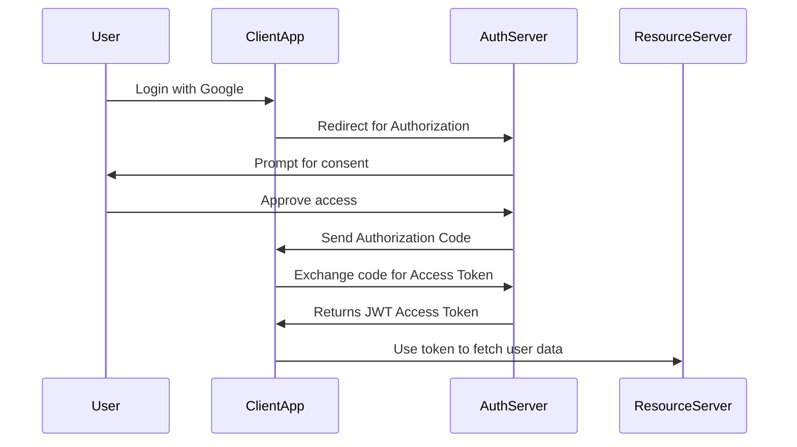
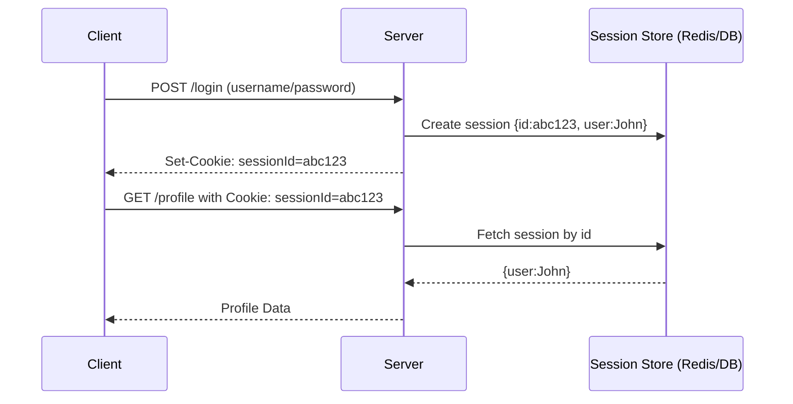
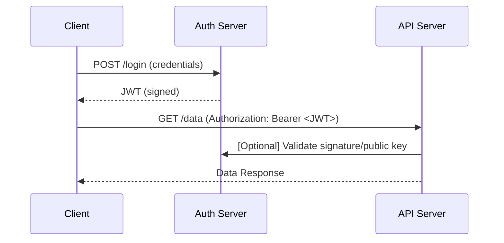
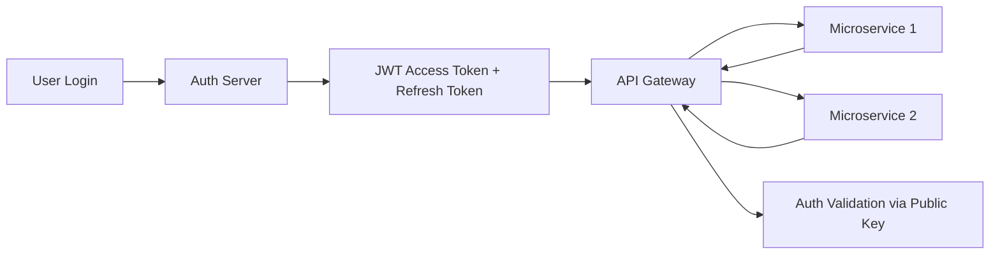

Excellent 👏 — this is one of the **most important security and authentication topics** in system design, backend, and microservice interviews.

Let’s go step-by-step and make it crystal clear 👇

---

# 🔐 Authentication & Authorization Protocols: JWT vs OAuth2 vs SSO

---

## 🧩 1. Core Concepts Overview

| Concept                  | Purpose                                                                                                 | Category                 |
| ------------------------ | ------------------------------------------------------------------------------------------------------- | ------------------------ |
| **JWT (JSON Web Token)** | A **token format** used to securely transmit user identity & claims.                                    | Token format             |
| **OAuth 2.0**            | A **delegated authorization framework** (allowing app A to access app B’s resources on behalf of user). | Authorization protocol   |
| **SSO (Single Sign-On)** | A **login mechanism** allowing users to log in once and access multiple apps.                           | Authentication mechanism |

They often **work together**:

> SSO uses OAuth2 or SAML → which in turn may use **JWT tokens** for authentication/authorization.

---

## ⚙️ 2. JWT (JSON Web Token)

### 📘 What It Is

A **compact, signed token** that encodes user information (claims) in JSON format.
Used to prove the identity of the user between client and server.

### 🔹 Structure

JWT has **three parts** separated by dots (`.`):

```
xxxxx.yyyyy.zzzzz
```

| Part      | Meaning                                     |
| --------- | ------------------------------------------- |
| Header    | Algorithm & token type                      |
| Payload   | Claims (user info, roles, expiration)       |
| Signature | Digital signature to verify token integrity |

### 🔹 Example

```json
Header:
{
  "alg": "HS256",
  "typ": "JWT"
}

Payload:
{
  "sub": "123456",
  "name": "Sathish",
  "role": "admin",
  "exp": 1735584000
}
```

Encoded JWT (Base64 + signed):

```
eyJhbGciOiJIUzI1NiIsInR5cCI6IkpXVCJ9...
```

---

### 🔹 How JWT Works

```text
+----------+        1️⃣ Login Request
|  Client  | ----------------------> | Auth Server |
+----------+                         +-------------+
                                         |
                                         | 2️⃣ Validate user (e.g., via DB)
                                         |
                                         v
                                   3️⃣ Issue JWT Token
                                         |
                                         |
                                         v
+----------+        4️⃣ Send token        +-------------+
|  Client  | <--------------------------- | Auth Server |
+----------+                              +-------------+

Then for every API call:
Client → sends JWT in `Authorization: Bearer <token>` header
```

### ✅ Pros

* Stateless (no server session)
* Easy to scale horizontally
* Widely used (Spring Boot, Node, Django, etc.)

### ❌ Cons

* Can’t be revoked easily (unless stored in a blacklist)
* Large tokens → bandwidth overhead

---

## 🧭 3. OAuth 2.0 — Delegated Authorization Framework

### 📘 What It Is

OAuth2 allows a **third-party application** to access **user resources** without sharing credentials.

Example:
You log in to “Canva” using **your Google account** → Canva never gets your password, only a token.

---

### 🔹 Actors in OAuth2

| Role                     | Description                                          |
| ------------------------ | ---------------------------------------------------- |
| **Resource Owner**       | The user (you)                                       |
| **Client**               | The app that wants to access your data (e.g., Canva) |
| **Authorization Server** | Issues tokens (e.g., Google OAuth Server)            |
| **Resource Server**      | API that hosts protected data (e.g., Google Photos)  |

---

### 🔹 OAuth2 Flow (Authorization Code Grant)



---

### 🔹 Token Types

| Token             | Purpose                                        |
| ----------------- | ---------------------------------------------- |
| **Access Token**  | Used to access APIs                            |
| **Refresh Token** | Used to get new access tokens without re-login |
| **ID Token**      | Contains user identity info (usually a JWT)    |

---

### ✅ Pros

* Standardized authorization method
* Scalable and secure
* Supports token expiry and refresh flow

### ❌ Cons

* Implementation complexity (especially in microservices)
* Requires an Authorization Server (Keycloak, Auth0, etc.)

---

## 🔐 4. SSO (Single Sign-On)

### 📘 What It Is

A system that allows a **user to authenticate once** and then access **multiple independent systems** without re-entering credentials.

Example:
When you log in to **Gmail**, you can access **YouTube, Drive, Docs** — all authenticated via the same session (Google Identity).

---

### 🔹 How SSO Works Conceptually

```text
+-------------+         +---------------+
|  User       |         |  App 1        |
|  Logs in →  |-------->|  (Google Docs)|
+-------------+         +---------------+
       |                         |
       | (SSO Token / Cookie)    |
       v                         v
+---------------------+    +----------------+
|   SSO Auth Server   |--->|   App 2 (Drive)|
+---------------------+    +----------------+
```

SSO can use different protocols:

* **SAML** (XML-based, older)
* **OAuth2 + OpenID Connect (OIDC)** (modern)
* **Kerberos (for enterprise)**

---

### ✅ Pros

* One login for all apps
* Improved user experience
* Centralized authentication control
* Easier account deactivation

### ❌ Cons

* If SSO fails, access to all apps fails
* Single point of compromise risk

---

## ⚙️ 5. How They Work Together (Big Picture)

```text
                ┌────────────────────────┐
                │   Identity Provider    │
                │ (SSO / OAuth2 Server)  │
                └──────────┬─────────────┘
                           │ Issues JWT (Access + ID tokens)
                           │
       ┌──────────────┬────┴──────┬──────────────┐
       │              │           │              │
+-------------+ +-------------+ +-------------+ +-------------+
| App 1 (API) | | App 2 (UI)  | | App 3 (Mobile)| | App 4 (Admin)|
+-------------+ +-------------+ +-------------+ +-------------+
        ^             ^               ^               ^
        |             |               |               |
        └─────────────┴───── Auth via JWT ─────────────┘
```

* **SSO** manages single identity & session
* **OAuth2** provides access tokens for authorization
* **JWT** is the actual token format used to transmit that information

---

## 🧰 6. Popular Software / Tools

| Tool / Library             | Category          | Description                                 |
| -------------------------- | ----------------- | ------------------------------------------- |
| **Keycloak**               | OAuth2, SSO, OIDC | Open-source Identity & Access Management    |
| **Auth0**                  | OAuth2, SSO       | Cloud-based authentication provider         |
| **Okta**                   | OAuth2, SSO       | Enterprise identity management              |
| **Firebase Auth**          | OAuth2, JWT       | Google’s authentication for mobile/web apps |
| **Spring Security + JWT**  | JWT Auth          | Java-based security library                 |
| **Azure AD / AWS Cognito** | OAuth2, SSO       | Cloud identity solutions                    |
| **Ping Identity**          | SSO, OAuth2       | Enterprise-grade identity federation        |
| **Dex**                    | OIDC, SSO         | Lightweight OIDC server for Kubernetes      |

---

## 🧾 7. Summary Comparison Table

| Feature             | JWT                            | OAuth2                   | SSO                          |
| ------------------- | ------------------------------ | ------------------------ | ---------------------------- |
| **Purpose**         | Token format                   | Authorization protocol   | Authentication mechanism     |
| **Scope**           | Single app                     | Multiple apps / services | Multiple systems             |
| **Authentication?** | ❌ No (just proof)              | ✅ Via OIDC extension     | ✅ Yes                        |
| **Authorization?**  | ✅ Yes                          | ✅ Yes                    | ✅ Yes (delegated)            |
| **Used For**        | API auth between client-server | Delegated access to APIs | Logging into multiple apps   |
| **Example Tool**    | Spring JWT                     | Keycloak, Auth0          | Okta, Azure AD               |
| **Token Format**    | JSON (signed)                  | JWT, opaque              | Cookie, JWT, SAML            |
| **Session State**   | Stateless                      | Usually stateless        | Can be stateful or stateless |

---

## 🧭 8. Real-World Example (FAANG-Style Integration)

When you log in to **Netflix** using your **Google account**:

1. **SSO** is triggered → Google login page appears.
2. **OAuth2 flow** exchanges Google auth code for a **JWT token**.
3. **JWT** is used by Netflix APIs to validate your identity & permissions.
4. All Netflix microservices validate the same JWT using **public key (RSA)** signature.

---

## ✅ 9. Summary (In One Line)

> **JWT** = Token Format
> **OAuth2** = Delegated Authorization Protocol
> **SSO** = Single Sign-On Mechanism (often built using OAuth2 or SAML)
> Together → They provide **secure, scalable, stateless authentication** for distributed systems.

---

Excellent question 👏 — understanding **cookies**, **sessions**, and **JWT tokens** is crucial for designing **secure, scalable authentication systems** in modern web and microservice architectures.

Let’s break this down step-by-step with a **GitHub-style Markdown explanation**, including diagrams, examples, and when to use each.

---

# 🍪 Cookie vs Session vs JWT Token

## 🔹 1. Cookies

### 🧠 What it is:

* A **small piece of data** stored on the **client browser**.
* Used to remember information like login state or preferences.
* Automatically sent by the browser to the same domain on each request.

### ⚙️ How it works:

1. Server sets a cookie in HTTP Response Header:

   ```
   Set-Cookie: sessionId=abc123; HttpOnly; Secure
   ```
2. Browser stores it.
3. For subsequent requests, browser sends:

   ```
   Cookie: sessionId=abc123
   ```

### ✅ Best for:

* Maintaining **state** in traditional web apps.
* When using **server-side session management**.

### ⚠️ Issues:

* Not ideal for **scaling horizontally** — session data is often stored in memory or DB.
* Vulnerable if not secured (XSS/CSRF).

---

## 🔹 2. Session

### 🧠 What it is:

* A **server-side mechanism** that stores user information temporarily between HTTP requests.
* Typically uses **session IDs**, stored in a cookie.

### ⚙️ How it works:



### ✅ Best for:

* Web apps where **server maintains state**.
* Easier to **invalidate** sessions on logout.

### ⚠️ Issues:

* **Not stateless**, so less suited for **microservices**.
* Requires **shared session store** (like Redis) in distributed systems.

---

## 🔹 3. JWT (JSON Web Token)

### 🧠 What it is:

* A **stateless**, **digitally signed** token format (typically JWT = JSON Web Token).
* Encodes user identity and claims in a **Base64 JSON object**.

Example:

```json
{
  "alg": "HS256",
  "typ": "JWT"
}
.
{
  "user": "john_doe",
  "role": "admin",
  "exp": 1735579200
}
.
signature
```

### ⚙️ How it works:



### ✅ Benefits:

* **Stateless** — No session storage required.
* Works perfectly in **microservices** and **distributed systems**.
* Portable across domains and APIs.

### ⚠️ Issues:

* Hard to **invalidate** once issued (token remains valid until expiry).
* Token theft can be dangerous if not protected properly.

---

# 🔐 Comparison Table

| Feature      | Cookie           | Session                     | JWT                              |
| ------------ | ---------------- | --------------------------- | -------------------------------- |
| Storage      | Client           | Server                      | Client                           |
| Scalability  | Low              | Medium (needs shared store) | High                             |
| Stateless    | ❌                | ❌                           | ✅                                |
| Security     | Depends on flags | Good (server controlled)    | Good (signature-based)           |
| Invalidation | Easy             | Easy                        | Hard (requires token revocation) |
| Use Case     | Small web apps   | Traditional web             | Modern APIs & microservices      |

---

# 🧰 Common Tools / Frameworks

| Category      | Tool / Library                                                               | Description                                |
| ------------- | ---------------------------------------------------------------------------- | ------------------------------------------ |
| Session Store | **Redis**, **Memcached**                                                     | Used for shared session management         |
| JWT Auth      | **Spring Security JWT**, **Auth0**, **Keycloak**, **jsonwebtoken (Node.js)** | Issue and verify JWT tokens                |
| Cookie Mgmt   | **Express-session**, **Flask-session**                                       | Manage cookie-based sessions               |
| OAuth2 / SSO  | **Keycloak**, **Okta**, **Auth0**, **Azure AD**                              | Handle identity federation with JWT/OAuth2 |

---

# 🏗️ Recommended Pattern in Microservices

For distributed systems:

* Use **JWT tokens** (OAuth2 Bearer tokens) for **stateless communication** between services.
* Each microservice validates token signature using a **public key (RSA)**.
* For user-facing sessions, issue **short-lived access tokens** and **refresh tokens**.



---

# 🧩 TL;DR

| Scenario                           | Best Choice                        |
| ---------------------------------- | ---------------------------------- |
| Small monolithic web app           | Cookie + Session                   |
| Scalable REST APIs / Microservices | JWT (stateless)                    |
| Enterprise with multiple apps      | OAuth2 + SSO (uses JWT internally) |

---
