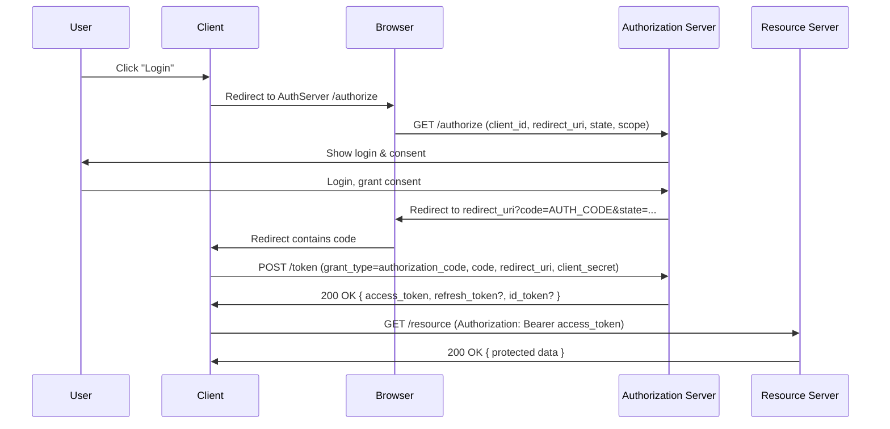
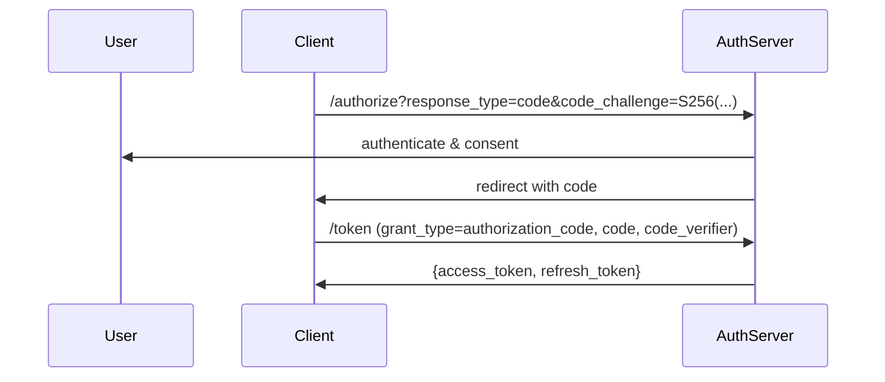
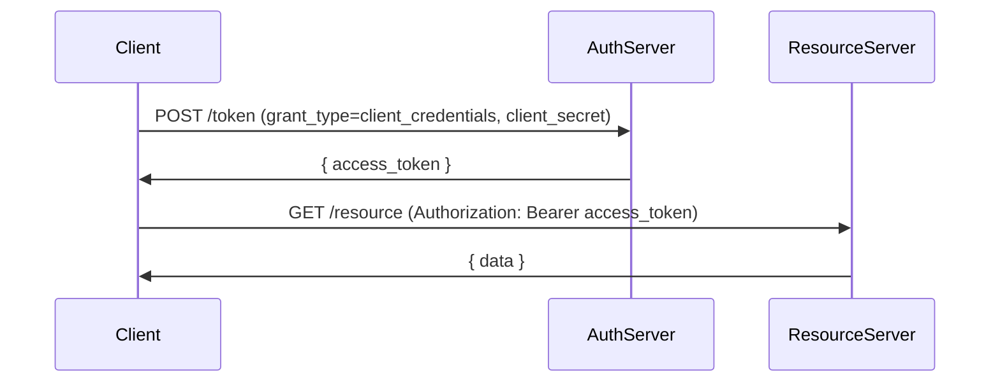

# OAuth 2.0 — Deep Dive

> A comprehensive GitHub-style Markdown reference covering how OAuth2 works, internal flows (diagrams), JWT tokens, token types, claims, best practices, and maintenance guidance.

---

## Table of Contents

1. [Introduction & Goals](#introduction--goals)
2. [Actors / Components](#actors--components)
3. [Core Concepts](#core-concepts)
4. [OAuth2 Grant Types (Flows)](#oauth2-grant-types-flows)

   * [Authorization Code (with PKCE)](#authorization-code-with-pkce)
   * [Client Credentials](#client-credentials)
   * [Refresh Token Flow](#refresh-token-flow)
   * [Device Authorization Flow](#device-authorization-flow)
   * [Resource Owner Password Credentials (deprecated)](#resource-owner-password-credentials-deprecated)
   * [Implicit Flow (deprecated)](#implicit-flow-deprecated)
5. [Sequence Diagrams (Mermaid)](#sequence-diagrams-mermaid)
6. [Access Tokens: Opaque vs JWT (JSON Web Token)](#access-tokens-opaque-vs-jwt-json-web-token)

   * [JWT Anatomy and Example](#jwt-anatomy-and-example)
   * [Why JWT with OAuth2?](#why-jwt-with-oauth2)
   * [Alternatives and Hybrid Approaches](#alternatives-and-hybrid-approaches)
7. [Claims vs Scopes](#claims-vs-scopes)
8. [Security Considerations & Best Practices](#security-considerations--best-practices)
9. [Maintenance & Operational Guidance](#maintenance--operational-guidance)
10. [OpenID Connect (OIDC) — short note](#openid-connect-oidc--short-note)
11. [Useful Endpoints & RFCs to know](#useful-endpoints--rfcs-to-know)
12. [Checklist for design & audits](#checklist-for-design--audits)
13. [Appendix: Example Requests & Responses](#appendix-example-requests--responses)

---

## Introduction & Goals

OAuth 2.0 is an authorization framework that allows an application ("client") to obtain limited access to a protected resource (APIs) on behalf of a resource owner (user) or the client itself. OAuth separates authentication (who you are) from authorization (what you can do).

Goals of this document:

* Explain OAuth2 flows and internal workings.
* Show sequence diagrams for the main flows.
* Explain JWT, why it's used with OAuth2 and alternatives.
* Provide operational best practices for secure long-term maintenance.

## Actors / Components

* **Resource Owner** — Usually the end-user.
* **Client** — Application wanting access (web app, SPA, mobile app, server app).
* **Authorization Server (AS)** — Issues tokens after authenticating the resource owner and obtaining consent.
* **Resource Server (RS) / API** — Hosts protected resources and validates access tokens.

Optional but important:

* **Identity Provider (IdP)** — Often co-located with the AS; handles user authentication and identity (e.g., user database, MFA).
* **Consent UI** — Where user grants scopes/permissions.
* **Client Registry** — Stores client metadata: redirect URIs, client type, secrets, allowed grant types.

## Core Concepts

* **Authorization Grants** — Credentials representing the resource owner’s authorization (authorization code, refresh token, etc.).
* **Access Token** — Used by client to access resource server.
* **Refresh Token** — Used to obtain new access tokens without re-prompting the user.
* **Scopes** — Strings representing permissions (e.g., `read:messages`).
* **Claims** — Structured information inside a token (e.g., `sub`, `iss`, `exp`).
* **Client Types**

  * **Confidential**: can keep credentials secret (server-side apps).
  * **Public**: cannot keep credentials secret (native apps, SPA).

## OAuth2 Grant Types (Flows)

### Authorization Code (with PKCE)

* Most secure flow for server-side web apps and mobile/SPA when combined with PKCE.
* Steps:

  1. Client redirects user to AS `/authorize` with `response_type=code`, `client_id`, `redirect_uri`, `state`, `scope`, and (for PKCE) `code_challenge` and `code_challenge_method`.
  2. User authenticates at AS and consents.
  3. AS redirects back to `redirect_uri` with `code` and `state`.
  4. Client exchanges `code` at AS `/token` endpoint, providing `code_verifier` (PKCE) and client credentials if confidential.
  5. AS returns `access_token`, (optional) `id_token`, `refresh_token` and `expires_in`.

Use PKCE for public and native clients to mitigate authorization code interception attacks.

### Client Credentials

* For machine-to-machine (M2M) where no user is present.
* Client authenticates with `client_id` + `client_secret` (or mTLS / private_key_jwt) to `/token` with `grant_type=client_credentials` and requested scopes.
* AS returns access token representing the client.

### Refresh Token Flow

* Client sends `grant_type=refresh_token` + `refresh_token` to `/token` to obtain a new access token (and optionally a new refresh token).
* Refresh token rotation and revocation strategies are critical for security.

### Device Authorization Flow

* For devices with limited input (TVs, consoles).
* Client asks `/device_authorization`, receives `device_code`, `user_code`, `verification_uri`.
* User opens `verification_uri` on another device, enters `user_code` and authenticates.
* Client polls `/token` until the user completes.

### Resource Owner Password Credentials (Deprecated / Not Recommended)

* Client collects username & password and sends to `/token` with `grant_type=password`.
* Avoid unless you fully control and trust the client; prefer Authorization Code + PKCE.

### Implicit Flow (Deprecated)

* Used by older SPAs where tokens are returned in browser. Not recommended due to security issues; use Authorization Code + PKCE instead.

## Sequence Diagrams (Mermaid)

### Authorization Code (classic)



### Authorization Code + PKCE (for public clients)



### Client Credentials (M2M)



## Access Tokens: Opaque vs JWT (JSON Web Token)

### Opaque tokens

* Random strings understood only by Authorization Server.
* Resource server must call token introspection endpoint (`/introspect`) to validate.
* Pros: easy to revoke centrally; short-lived opaque tokens plus server-side session management is straightforward.
* Cons: requires network call (introspection) unless introspection caching is used.

### JWT (JSON Web Token)

* Self-contained token carrying claims in three parts: `header.payload.signature` (base64url).
* Resource server can validate token signature locally (via public key from AS `/.well-known/jwks.json`) without contacting AS per request.
* Typically contains claims like `iss`, `sub`, `aud`, `exp`, `nbf`, `iat`, `jti`, and custom claims.

### JWT Anatomy and Example

**Header (base64url)** — algorithm + typ

```json
{ "alg": "RS256", "typ": "JWT" }
```

**Payload (claims)**

```json
{
  "iss": "https://auth.example.com",
  "sub": "248289761001",
  "aud": "api://default",
  "exp": 1711881600,
  "iat": 1711878000,
  "scope": "read:messages write:messages",
  "client_id": "my-client-id",
  "azp": "my-client-id"
}
```

Signed using AS private key producing `header.payload.signature`.

### Why JWT with OAuth2?

* **Stateless validation** — resource servers verify signature and check standard claims (exp, aud, iss) locally.
* **Performance** — avoids per-request introspection network calls.
* **Rich claims** — embed identity and authorization metadata directly in token.

Tradeoffs:

* **Revocation difficulty** — JWTs are self-contained; revoking requires token blacklists, short lifetimes, or use of reference tokens + introspection.
* **Size** — JWTs can be larger than opaque tokens.

### Alternatives and Hybrid Approaches

* **Reference / opaque tokens** + **introspection**: easier revocation.
* **Short-lived JWTs** + **refresh tokens**: combine stateless performance with limited exposure.
* **Hybrid**: issue short JWT access token and keep state for refresh/revocation checks.

## Claims vs Scopes

* **Scopes**

  * High-level permissions the client requests (strings).
  * Examples: `openid`, `profile`, `email`, `read:orders`, `write:orders`.
* **Claims**

  * Concrete attributes about an entity (user or client) placed inside tokens (e.g., `email`, `role`, `is_admin`).
  * Claims can be delivered in `id_token`, `access_token` (if JWT), or via the UserInfo endpoint (OIDC).

Scopes often control which claims are released.

## Security Considerations & Best Practices

* **Always use Authorization Code + PKCE** for public clients and SPAs.
* **Do not store access tokens in browser localStorage** if avoidable; prefer secure, short-lived cookies (with `SameSite=strict`, `Secure`, `HttpOnly`) for web apps.
* **Use short-lived access tokens** (minutes) and rotate refresh tokens.
* **Implement refresh token rotation**: issue new refresh token on use and invalidate old one.
* **Protect endpoints**: validate `iss`, `aud`, `exp`, `nbf`, `iat`, `jti`, and token signature.
* **Use asymmetric signing (RS256 / ES256)** for tokens so RS can validate with public keys.
* **Publish JWKS (`/.well-known/jwks.json`)** and support key rotation (kid header).
* **Rate-limit / harden token endpoints** and secure client secrets (store in vault, not code).
* **Use `state` parameter`** in `/authorize` to prevent CSRF and link response to request.
* **Use `nonce`** in OIDC flows to mitigate token replay when id_token is issued.
* **Use `aud` claim** to ensure token is intended for your resource server.
* **Revoke sessions on critical account events** (password change, logout everywhere, suspicious activity).
* **Consider introspection cache TTL** for opaque tokens to reduce load while supporting near-realtime revocation.

## Maintenance & Operational Guidance

**Key management**

* Rotate signing keys regularly; keep previous keys available until tokens signed by them expire.
* Use short rotation windows for symmetric secrets.

**Token lifetime strategy**

* Access tokens: short (e.g., 5–15 minutes) for high-value APIs.
* Refresh tokens: longer but rotate and tie to client session and device context.
* Use sliding sessions carefully — rotating refresh tokens reduces replay risk.

**Revocation and logout**

* Support `/revocation` endpoint to invalidate refresh tokens or access tokens (RFC 7009).
* Consider token revocation lists (short-lived cache) for JWTs when immediate revocation required.

**Monitoring & Observability**

* Log token issuance, revocation, failed token validations, and suspicious token usage.
* Monitor token endpoint errors, spikes in token issuance, and high failed-introspection rates.
* Audit key usage and rotation events.

**High availability & scaling**

* Authorization server must be HA (stateless where possible). Use shared DB for client registry and token state if necessary.
* Cache JWKs and introspection results in RS with TTL.

**Testing & CI**

* Automated tests for all flows (auth code, PKCE, client credentials, device flow).
* Fuzz token endpoint inputs and test error paths.
* Test key rotation and ensure old tokens validate until expiry.

## OpenID Connect (OIDC) — short note

* OIDC is an identity layer on top of OAuth2. It introduces `id_token`, `userinfo` endpoint, and standardized scopes like `openid`.
* If you need authentication (who the user is) plus claims, prefer OIDC.

## Useful Endpoints & RFCs to know

* **Endpoints** (typical):

  * `/authorize` — begin authorization code flow.
  * `/token` — exchange grants for tokens.
  * `/introspect` — validate opaque token.
  * `/revoke` — revoke tokens.
  * `/.well-known/openid-configuration` — discovery endpoint (OIDC).
  * `/userinfo` — retrieve user claims (OIDC).
  * `/.well-known/jwks.json` — public keys for JWT verification.

* **Spec / RFCs** (read these when implementing):

  * RFC 6749 — OAuth 2.0 (core spec)
  * RFC 6750 — Bearer Token Usage
  * RFC 7662 — OAuth 2.0 Token Introspection
  * RFC 7009 — Token Revocation
  * JWT: RFC 7519
  * JWK: RFC 7517, JWS: RFC 7515
  * PKCE: RFC 7636
  * OpenID Connect Core 1.0

## Checklist for design & audits

* [ ] Use Authorization Code + PKCE for any public client.
* [ ] Validate `aud`, `iss`, `exp`, `nbf`, `iat` on RS.
* [ ] Use asymmetric signing and host `jwks.json`.
* [ ] Implement `/revoke` and rotate refresh tokens.
* [ ] Keep access token lifetimes short.
* [ ] Implement rate limiting and strong logging on `/token` endpoints.
* [ ] Protect client secrets in secure vaults.
* [ ] Ensure CORS and cookie flags are correct for web apps.
* [ ] Add monitoring and alerting for suspicious token behavior.

## Appendix: Example Requests & Responses

### Authorization Request (Authorization Code)

```
GET /authorize?response_type=code&client_id=client123&redirect_uri=https%3A%2F%2Fclient.example.com%2Fcb&scope=openid%20profile%20email&state=xyz
```

### Token Exchange (Authorization Code)

```
POST /token
Content-Type: application/x-www-form-urlencoded

grant_type=authorization_code&code=AUTH_CODE&redirect_uri=https%3A%2F%2Fclient.example.com%2Fcb&client_id=client123&code_verifier=CODE_VERIFIER
```

Response (example with JWT access token):

```json
{
  "access_token": "eyJhbGciOiJSUzI1NiIsInR5cCI6IkpXVCJ9...",
  "token_type": "Bearer",
  "expires_in": 600,
  "refresh_token": "GEbRxBN...",
  "scope": "openid profile email"
}
```

### Introspection (opaque token validation)

```
POST /introspect
Authorization: Basic base64(client_id:client_secret)
Content-Type: application/x-www-form-urlencoded

token=opaque_token_here
```

Response:

```json
{
  "active": true,
  "scope": "read:orders",
  "client_id": "client123",
  "username": "alice",
  "exp": 1711881600,
  "sub": "248289761001"
}
```

---

## Further Reading

Of course! This is a great question that covers the entire lifecycle of OAuth 2.0 and OpenID Connect (OIDC) implementation. Let's break it down.

### Part 1: Available OAuth 2.0 Frameworks & Libraries

OAuth 2.0 is a framework, not a strict protocol, which is why many libraries and frameworks exist to implement it. They can be broadly categorized into those for **Authorization Servers** (the entity that issues tokens) and **Clients/Resource Servers** (the apps that consume tokens).

Here are some of the most popular and well-supported options:

#### A. For Building an Authorization Server

These are full-fledged systems you can deploy to become your own identity provider (like a custom Google or Facebook login).

| Framework / Library | Primary Language | Key Features & Benefits |
| :--- | :--- | :--- |
| **Keycloak** | Java | **The open-source heavyweight.** Provides a full, out-of-the-box solution with admin UI, user management, social logins, and fine-grained authorization. Excellent for enterprise. |
| **ORY Hydra** | Go | **API-first and cloud-native.** Hydra *only* does the OAuth 2.0/OpenID Connect flows. You bring your own user management and UI. Extremely flexible and scalable. |
| **IdentityServer4** (.NET) | C# | **The de facto standard for the .NET ecosystem.** Feature-rich, highly extensible, and well-documented. (Note: IdentityServer4 is feature-complete; its successor is **Duende IdentityServer**). |
| **Ory Hydra / Kratos** | Go | While Hydra handles OAuth/OIDC, **Ory Kratos** is a separate, complementary project for user identity management (login, registration, profiles). Using them together is a powerful combo. |
| **Dex** | Go | **A federated identity provider.** Dex acts as a portal to other identity providers (like LDAP, SAML, GitHub, Google). It's a "connector" and is very popular in Kubernetes ecosystems. |
| **Spring Authorization Server** | Java | **The new official from Spring.** After the demise of Spring Security OAuth, this is the successor. It's a framework to build your own, not an out-of-the-box product. |

#### B. For Client Applications & Resource Servers (API Protection)

These libraries help you integrate OAuth 2.0/OIDC into your applications, either to log users in (client) or to protect your APIs (resource server).

| Framework / Library | Language/Ecosystem | Key Features & Benefits |
| :--- | :--- | :--- |
| **Spring Security** | Java (Spring) | The standard for Spring Boot apps. Provides extensive, auto-configurable support for OAuth 2.0 Login and Resource Server setup. |
| **Passport.js** | Node.js | The dominant authentication middleware for Express.js. Has a massive collection of "strategies" (500+) for every OAuth 2.0 provider imaginable. |
| **authlib** | Python | A versatile library for both building OAuth servers and clients. Popular with Flask and Django projects. |
| **AppAuth** | Android, iOS, macOS | **The mobile standard.** A set of native SDKs that follow best practices for secure OAuth and OIDC on mobile and desktop apps. |
| **MSAL (Microsoft Authentication Library)** | .NET, JS, Python, Java | The official library for integrating with the Microsoft Identity Platform (Azure AD). Excellent for enterprise/Microsoft-heavy environments. |
| **google-auth / oauthlib** | Python | Google's client libraries for Python provide robust support for OAuth 2.0 flows, especially for accessing Google APIs. |

---

### Part 2: Benefits of Using an OAuth 2.0 Framework

Even though you *could* implement OAuth 2.0 from scratch, it's strongly discouraged. Using a established framework provides immense benefits:

1.  **Security:** This is the biggest reason. OAuth 2.0 is complex and easy to get wrong. Frameworks are built by security experts and are continuously tested and audited for common vulnerabilities (CSRF, token leakage, etc.).
2.  **Speed of Development:** Frameworks handle the boilerplate code (token generation, crypto, redirects, state parameter management), allowing you to focus on your core application logic.
3.  **Standards Compliance:** Good frameworks are compliant with the OAuth 2.0 RFCs and related specifications (like OpenID Connect 1.0 and PKCE), ensuring interoperability with other systems.
4.  **Built-in Best Practices:** They enforce secure defaults, such as short-lived access tokens, secure token storage, and correct flow usage for different client types (e.g., PKCE for public clients).
5.  **Maintainability:** The OAuth landscape evolves. Framework maintainers handle updates for new security recommendations and specification changes.
6.  **Features:** Most frameworks come with essential extras out-of-the-box: admin UIs, consent screens, scope management, and logging.

---

### Part 3: Ways to Manage an OAuth 2.0 Framework

Once you've chosen a framework, you need to manage its lifecycle. Here are the primary models, from most to least operational overhead.

#### 1. Self-Hosted & Self-Managed
You install, configure, secure, scale, and maintain the entire stack on your own infrastructure (VMs, Kubernetes).

*   **Pros:**
    *   **Full Control & Customization:** You can modify anything to fit your exact needs.
    *   **Data Sovereignty:** All user data stays within your infrastructure.
    *   **No Vendor Lock-in:** You are not tied to a specific SaaS provider.
*   **Cons:**
    *   **High Operational Overhead:** Requires expertise in security, deployment, scaling, and monitoring.
    *   **Responsibility for Uptime & Security:** Any breach or downtime is your responsibility.
*   **Best for:** Large enterprises with dedicated security and platform teams, or organizations with strict regulatory requirements.

#### 2. Identity-as-a-Service (IDaaS) / SaaS
You use a cloud service like Auth0, Okta, Ping Identity, or Amazon Cognito. They provide the Authorization Server as a service.

*   **Pros:**
    *   **Rapid Time-to-Market:** Get up and running in hours, not weeks.
    *   **Reduced Operational Burden:** The vendor handles security, scaling, and maintenance.
    *   **Built-in Features:** Often include advanced features like MFA, anomaly detection, breach alerts, and pre-built UI components.
    *   **Expert Support:** Access to the vendor's support and security teams.
*   **Cons:**
    *   **Cost:** Can become expensive at high scale.
    *   **Vendor Lock-in:** Migrating away can be complex.
    *   **Less Customization:** You are limited to the features and customization options the vendor provides.
*   **Best for:** Most companies, especially startups and SMBs that want to focus on their core product without becoming security experts.

#### 3. Managed Open Source (e.g., on Kubernetes)
A middle ground. You use an open-source framework like Keycloak or Hydra, but you deploy it on a managed Kubernetes service (like EKS, AKS, GKE) and use cloud-native tools for management.

*   **Pros:**
    *   **Balances Control and Overhead:** You retain the control of open-source, but the cloud provider manages the underlying Kubernetes cluster.
    *   **Cloud-Native Scalability:** Leverages Kubernetes' auto-scaling and self-healing capabilities.
    *   **Use of Familiar Tools:** Managed with Helm charts, GitOps (ArgoCD/Flux), and standard Kubernetes monitoring.
*   **Cons:**
    *   **You still manage the application:** You are responsible for upgrading, backing up, and securing the Keycloak/Hydra application itself.
*   **Best for:** Teams already proficient in Kubernetes that want the features of a specific open-source solution without managing the entire server infrastructure.

### Summary and Recommendation

| Management Model | Operational Overhead | Control | Best For |
| :--- | :--- | :--- | :--- |
| **Self-Hosted** | High | Maximum | Large enterprises, regulated industries |
| **Managed Open Source** | Medium | High | Kubernetes-proficient teams |
| **SaaS (IDaaS)** | Low | Medium | Startups, SMBs, teams wanting speed |

**General Recommendation:**
*   **Start with a SaaS solution (like Auth0 or Okta)** if your priority is speed, security, and reducing operational complexity.
*   **Consider a self-hosted or managed open-source solution (like Keycloak)** if you have specific regulatory requirements, need deep customization, or have the in-house expertise to manage it securely.

---

*End of file.*
