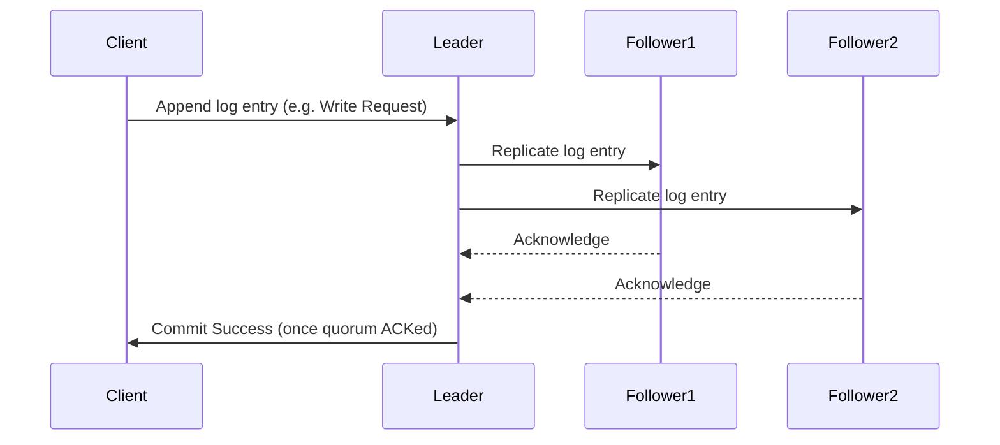

Perfect — this is a core **distributed systems** concept 👍. Let’s go step-by-step and I’ll give you a **complete GitHub-ready `Consensus_Protocols_in_Distributed_Systems.md`** style explanation — with **diagrammatic Markdown**, **Kafka KRaft example**, and **benefits** clearly outlined.

---

# 🧠 Consensus Protocols in Distributed Systems

## 🏗️ What is a Consensus Protocol?

In **distributed systems** (like Kafka, etcd, or Kubernetes), there are **multiple nodes** working together.
The **consensus protocol** ensures that **all nodes agree on a single, consistent state**, even if some nodes fail or messages are delayed.

### 🔍 Simple Definition:

> A **consensus protocol** is an algorithm used by distributed nodes to **agree on shared data or decisions**, despite failures (crashes, network partitions).

---

## ⚙️ 1. Why Consensus Is Needed

In distributed architecture:

* Nodes may crash, restart, or get partitioned from the network.
* Each node might have **different views of data**.
* We need all nodes to **agree on "who is the leader"** and **what the correct log/state is**.

Without consensus → systems can go inconsistent (data loss, conflicts).

---

## 🧩 2. Common Consensus Protocols

| Protocol  | Used In                      | Type                           | Core Idea                        |
| --------- | ---------------------------- | ------------------------------ | -------------------------------- |
| **Paxos** | Google Chubby, older systems | Complex but strong consistency | Quorum-based leader agreement    |
| **Raft**  | etcd, Consul, Kafka (KRaft)  | Simpler, easier to understand  | Leader election + replicated log |
| **Zab**   | ZooKeeper                    | Similar to Paxos               | Total order broadcast of updates |

---

## 🧭 3. Raft Consensus — Simplified Diagram

Here’s how **Raft** (and Kafka’s KRaft) works conceptually:

```text
+---------------------+
|      Leader         |
| (Handles writes)    |
+----------+----------+
           |
           | Replicates log entries
           v
   +---------------+       +---------------+
   |   Follower 1  | <---> |   Follower 2  |
   +---------------+       +---------------+

If Leader fails:
  -> Followers hold elections
  -> Majority votes (quorum) elects new Leader
  -> Log entries are kept consistent across nodes
```

---

## 🧮 4. Consensus Protocol Flow (Raft / KRaft)



* **Leader handles writes**
* **Followers replicate logs**
* Once **majority (quorum)** acknowledges → data is considered **committed**

If the **leader fails**, election starts → a **new leader** is chosen via voting.

---

## 🧩 5. Consensus in Kafka’s KRaft (Kafka Raft Metadata Mode)

### Before KRaft

Kafka relied on **ZooKeeper** (which used the Zab protocol) to:

* Manage cluster metadata
* Elect controller nodes
* Keep state consistent

### Now (KRaft mode)

Kafka replaced ZooKeeper with **KRaft (Kafka + Raft)** consensus:

* Uses **Raft algorithm** for metadata quorum.
* Stores metadata in internal **metadata log**.
* Handles **leader election, replication, and metadata updates** internally.

---

### 🗺️ KRaft Architecture Diagram

```text
               +------------------------+
               |     Controller (Leader)|
               |   Runs Raft Consensus   |
               +-----------+-------------+
                           |
           Replicates metadata log entries
                           |
        +------------------+------------------+
        |                                     |
+---------------+                     +---------------+
|  Broker Node 1|                     |  Broker Node 2|
| (Follower)    |                     | (Follower)    |
+---------------+                     +---------------+
```

✅ Leader handles metadata updates
✅ Follower brokers replicate metadata
✅ Raft ensures **strong consistency** among controller quorum

---

## ⚙️ 6. How KRaft Uses Raft Internally

| Step                        | Description                                                                               |
| --------------------------- | ----------------------------------------------------------------------------------------- |
| **1. Leader Election**      | Raft elects a metadata leader controller from quorum nodes.                               |
| **2. Log Replication**      | Metadata updates (topic creation, partition movement) are appended to log and replicated. |
| **3. Commit & Acknowledge** | Once quorum acknowledges, update is committed.                                            |
| **4. Follower Sync**        | Follower nodes catch up to leader’s log if they fall behind.                              |

---

## 🧾 7. Benefits of Consensus Protocols

| Benefit                   | Description                                                               |
| ------------------------- | ------------------------------------------------------------------------- |
| **Consistency**           | Ensures all nodes have the same committed state.                          |
| **Fault Tolerance**       | System keeps working even if some nodes fail (as long as majority alive). |
| **No Split-Brain**        | Only one leader at a time due to quorum-based election.                   |
| **Self-Healing**          | Automatically elects a new leader on failures.                            |
| **Simplified Management** | In KRaft, removes ZooKeeper dependency (less ops overhead).               |

---

## 🔍 8. Summary Comparison

| Feature           | Paxos                 | Raft                           | Zab (ZooKeeper)        |
| ----------------- | --------------------- | ------------------------------ | ---------------------- |
| **Complexity**    | High                  | Low                            | Medium                 |
| **Used By**       | Google systems        | etcd, Consul, Kafka            | ZooKeeper              |
| **Leader-Based?** | Yes                   | Yes                            | Yes                    |
| **Focus**         | Agreement correctness | Understandability, reliability | Broadcast order        |
| **In Kafka**      | ❌                     | ✅ (KRaft)                      | ✅ (old ZooKeeper mode) |

---

## 🧩 9. When to Use Consensus Protocols

Use when you need:

* A **single source of truth** across distributed nodes
* **Leader election** and **metadata consistency**
* **Strong consistency guarantees**
* **Automatic fault recovery**

Examples:

* Kafka Controller (KRaft)
* etcd (for Kubernetes state)
* Consul
* Zookeeper

---

## ✅ 10. Summary (In One Line)

> Consensus Protocols like **Raft (KRaft in Kafka)** ensure that **all nodes in a distributed system agree on the same state**, guaranteeing **consistency, fault tolerance, and reliability** even under failures.

---