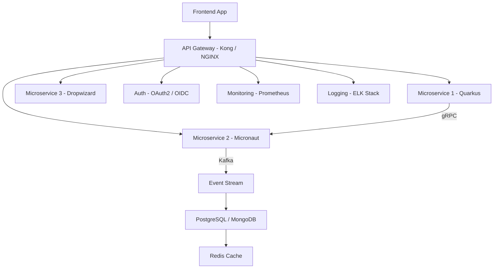

Absolutely ✅ — here’s a **complete, production-grade `README.md`** file written in **GitHub Markdown format**, covering the **differences, use cases, and deep explanations** of all the technologies you mentioned:
Micronaut, Quarkus, Dropwizard, REST vs gRPC, Kafka vs RabbitMQ, IaC tools (Terraform, Ansible, CloudFormation), CI/CD tools (Jenkins, GitHub Actions), Reverse Proxies (HAProxy, NGINX), Auth (OAuth2, OpenID Connect, API Gateways), Observability (ELK, Prometheus, Grafana), Databases (SQL, NoSQL, Redis), and Architectural Concepts (2PC, DDD, TDD, BDD).

---

# 🧩 Modern Distributed System Tech Stack & Design Patterns

> A comprehensive guide comparing major frameworks, communication protocols, DevOps tools, and architectural patterns for building modern **distributed, secure, and scalable systems**.

---

## 🏗️ 1. Backend Frameworks: **Micronaut vs Quarkus vs Dropwizard**

| Feature                   | **Micronaut**                                                          | **Quarkus**                                                                    | **Dropwizard**                                           |
| ------------------------- | ---------------------------------------------------------------------- | ------------------------------------------------------------------------------ | -------------------------------------------------------- |
| **Purpose**               | Next-gen Java microservices framework with DI and AOP at compile time. | Supersonic Java framework designed for GraalVM and containerized environments. | Lightweight framework to build RESTful services quickly. |
| **Startup Time**          | Very Fast (no reflection, precompiled DI)                              | Extremely Fast (optimized for GraalVM native images)                           | Moderate (traditional startup model)                     |
| **Memory Footprint**      | Low                                                                    | Very Low                                                                       | Medium                                                   |
| **Hot Reload**            | Supported via `micronaut-cli`                                          | Excellent via `Quarkus Dev Mode`                                               | Not natively supported                                   |
| **Cloud Native Features** | Service discovery, client load balancing, config client                | Reactive model, Kubernetes-native, cloud events                                | Simple HTTP server with Dropwizard metrics               |
| **Use Case**              | Serverless, microservices, low-latency APIs                            | Cloud-native apps, container-first architectures                               | Small-scale REST APIs, internal tools                    |

**💡 Example Use Cases:**

* **Micronaut** → Fintech microservices that need low cold-starts (AWS Lambda).
* **Quarkus** → Banking systems deploying on Kubernetes/GraalVM for fast scaling.
* **Dropwizard** → Simple internal REST tools or metrics-heavy dashboards.

---

## 🔗 2. Communication Protocols

### **RESTful APIs vs gRPC**

| Feature               | **REST**                        | **gRPC**                                        |
| --------------------- | ------------------------------- | ----------------------------------------------- |
| **Protocol**          | HTTP/1.1                        | HTTP/2                                          |
| **Data Format**       | JSON                            | Protocol Buffers (binary)                       |
| **Performance**       | Moderate                        | Very High (smaller payloads)                    |
| **Streaming Support** | Limited                         | Full duplex streaming                           |
| **Use Case**          | Public APIs, mobile/web clients | Microservices internal comms, real-time systems |

**💡 Example:**

* REST → Exposing APIs to frontend/mobile.
* gRPC → Internal communication between services for high throughput.

---

### **Kafka vs RabbitMQ**

| Feature                | **Apache Kafka**                    | **RabbitMQ**                     |
| ---------------------- | ----------------------------------- | -------------------------------- |
| **Model**              | Distributed log (publish-subscribe) | Message broker (queue-based)     |
| **Delivery Guarantee** | At least once / Exactly once        | At least once                    |
| **Ordering**           | Guaranteed per partition            | Optional                         |
| **Use Case**           | Event sourcing, stream processing   | Command queueing, job scheduling |

**💡 Example:**

* **Kafka** → Audit logs, order events in e-commerce.
* **RabbitMQ** → Async job queues like email notifications.

---

## ☁️ 3. Infrastructure as Code (IaC)

| Tool                 | **Terraform**                        | **Ansible**                         | **AWS CloudFormation**  |
| -------------------- | ------------------------------------ | ----------------------------------- | ----------------------- |
| **Language**         | HCL (Declarative)                    | YAML (Procedural)                   | JSON/YAML (Declarative) |
| **Cloud Support**    | Multi-cloud                          | Multi-cloud + Config Mgmt           | AWS Only                |
| **State Management** | Uses state file                      | Stateless                           | AWS manages state       |
| **Use Case**         | Provision infra (VMs, DBs, networks) | Configure servers, install software | AWS-only deployments    |

**💡 Example:**

* **Terraform** → Creating AWS EC2 + RDS + VPC.
* **Ansible** → Setting up Jenkins on EC2.
* **CloudFormation** → AWS infrastructure templates.

---

## ⚙️ 4. CI/CD Tools

| Tool              | **Jenkins**                  | **GitHub Actions**       |
| ----------------- | ---------------------------- | ------------------------ |
| **Hosting**       | Self-hosted                  | Cloud-native             |
| **Config Format** | Groovy / Jenkinsfile         | YAML                     |
| **Integration**   | Plugins, flexible            | Tight GitHub integration |
| **Scalability**   | Manual scaling               | Auto scaling             |
| **Use Case**      | Complex enterprise pipelines | Lightweight cloud CI/CD  |

**💡 Example:**

* **Jenkins** → Banking org with on-prem servers.
* **GitHub Actions** → Startups deploying to AWS/K8s quickly.

---

## 🌐 5. Reverse Proxies & Load Balancers

| Tool              | **HAProxy**                  | **NGINX**                  |
| ----------------- | ---------------------------- | -------------------------- |
| **Type**          | TCP/HTTP Load Balancer       | Reverse Proxy + Web Server |
| **Performance**   | High-performance             | Extremely versatile        |
| **Configuration** | Text config                  | Simpler config + modules   |
| **Use Case**      | Load balancing large traffic | API gateway, static assets |

**💡 Example:**

* **HAProxy** → High-load trading systems.
* **NGINX** → API Gateway for microservices.

---

## 🔐 6. Authentication & API Gateways

| Concept             | **OAuth2**              | **OpenID Connect**              | **API Gateways (Zuul, Spring Cloud Gateway, Kong)** |
| ------------------- | ----------------------- | ------------------------------- | --------------------------------------------------- |
| **Purpose**         | Authorization           | Authentication + Authorization  | Routing + Security + Observability                  |
| **Usage**           | Grant access via tokens | Extend OAuth2 for user identity | Manage and secure APIs                              |
| **Example Tooling** | Keycloak, Okta          | Auth0, AWS Cognito              | Zuul, SCG, Kong                                     |

**💡 Example:**

* **OAuth2** → Third-party app access (Google Login).
* **OIDC** → User login with identity claims.
* **Kong Gateway** → Central gateway for all services with rate limiting & JWT validation.

---

## 📊 7. Logging & Monitoring

| Layer        | **Centralized Logging**                             | **Monitoring / Metrics**              |
| ------------ | --------------------------------------------------- | ------------------------------------- |
| **Tools**    | ELK Stack (Elasticsearch, Logstash, Kibana), Splunk | Prometheus, Grafana                   |
| **Purpose**  | Aggregation and search of logs                      | Alerting and visualization of metrics |
| **Use Case** | Debugging and audit                                 | SLO/SLI dashboards                    |

**💡 Example:**

* ELK → Search all microservices’ logs.
* Prometheus + Grafana → CPU, memory, and latency dashboards.

---

## 🗄️ 8. Databases & Caching

| Type          | **SQL**             | **NoSQL**                  | **Cache**        |
| ------------- | ------------------- | -------------------------- | ---------------- |
| **Examples**  | PostgreSQL, MySQL   | MongoDB, Cassandra         | Redis, Memcached |
| **Structure** | Schema-based tables | Flexible JSON, wide-column | Key-Value store  |
| **Use Case**  | ACID transactions   | High scalability           | Reduce DB reads  |

**💡 Example:**

* PostgreSQL → Core banking data.
* MongoDB → Product catalog.
* Redis → Session and token caching.

---

## 🔁 9. Distributed Transactions: **2PC (Two-Phase Commit)**

| Phase                  | Description                                       |
| ---------------------- | ------------------------------------------------- |
| **Prepare**            | Coordinator asks participants if they can commit. |
| **Commit**             | If all agree → commit; else rollback.             |
| **Problem**            | Blocking, not fault-tolerant across partitions.   |
| **Modern Alternative** | Saga pattern (compensating transactions).         |

**💡 Example:**

* 2PC → Banking systems where atomicity is critical.
* Saga → E-commerce order + payment across microservices.

---

## 🧱 10. Architectural Practices

### 🧩 **DDD (Domain-Driven Design)**

* Focus on **business domains** and **ubiquitous language**.
* Split monolith into **bounded contexts** (Sales, Payments, Shipping).
* Encourages **clean separation** between core logic and infrastructure.

**💡 Example:**
Banking: Account domain, Transaction domain, Loan domain.

---

### 🧪 **TDD (Test-Driven Development)**

1. Write a **failing test**.
2. Write code to **make it pass**.
3. **Refactor**.

**Goal:** High test coverage, less regression.

---

### 🎭 **BDD (Behavior-Driven Development)**

* Describes system **behavior** using natural language (Gherkin).
* Example:

  ```gherkin
  Given user logs in
  When they transfer funds
  Then balance should decrease
  ```

**Goal:** Collaboration between Dev, QA, and BA teams.

---

## 🧠 11. Putting It All Together (Architecture Overview)



---

## 🧰 12. Real-World Use Cases by Industry

| Industry               | Example Tech Stack                             |
| ---------------------- | ---------------------------------------------- |
| **Banking**            | Quarkus + Kafka + PostgreSQL + Keycloak + Kong |
| **E-commerce**         | Micronaut + gRPC + Redis + ELK + Terraform     |
| **Fintech / Payments** | Dropwizard + RabbitMQ + DDD + Prometheus       |
| **SaaS / Cloud Apps**  | Quarkus + GitHub Actions + CloudFormation      |

---

## ✅ Summary

| Category     | Recommended Choice       | Why                                         |
| ------------ | ------------------------ | ------------------------------------------- |
| Framework    | **Quarkus**              | Fast, cloud-native, ideal for microservices |
| Protocol     | **gRPC**                 | Efficient internal service communication    |
| Messaging    | **Kafka**                | High-throughput event streaming             |
| IaC          | **Terraform**            | Multi-cloud and modular                     |
| CI/CD        | **GitHub Actions**       | Simpler setup for modern teams              |
| Gateway      | **Kong**                 | Feature-rich API management                 |
| Monitoring   | **Prometheus + Grafana** | Scalable observability                      |
| Database     | **PostgreSQL + Redis**   | Reliability + speed                         |
| Architecture | **DDD + TDD + Saga**     | Clean, testable, resilient design           |

---