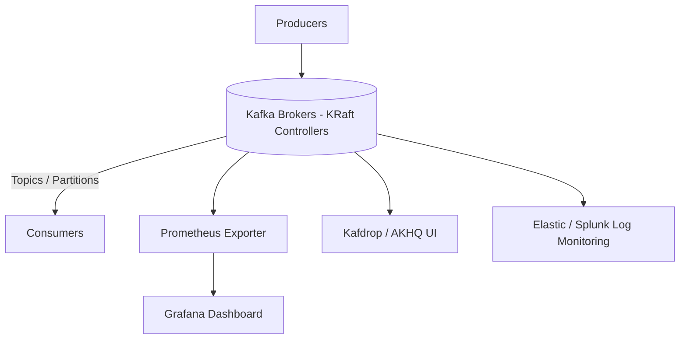
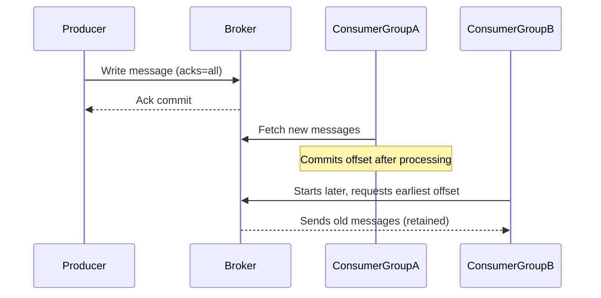

Here’s a structured **README / `kafka.md`** documentation you can place in your GitHub repo — it’s based on the essence of Apache Kafka (drawing from the “Learn Kafka in 10 Mins” article by Rocky Bhatia) plus a set of interview questions. You can customize further (add diagrams, links, code snippets) as per your project.

---

# Apache Kafka — Quick Reference & Interview Prep

*Version: 1.0*

## 1. What is Kafka?

Apache Kafka is a distributed event-streaming platform. It enables you to publish and subscribe to streams of records (messages), store them durably, and process them — all in real time. ([DataCamp][1])
Its key strengths: high throughput, low latency, fault-tolerance, horizontal scalability. ([GeeksforGeeks][2])

---

## 2. Core Concepts & Architecture

### Topics, Partitions & Offsets

* A **Topic** is a named stream of records to which data is written by producers and read by consumers. ([GeeksforGeeks][2])
* Each topic is split into one or more **Partitions**. Partitions allow parallelism (multiple consumers reading in parallel) and scaling. ([Rocky Bhatia][3])
* Within a partition, each message is assigned an **Offset**: a unique sequential ID for that partition. Consumers use offsets to track reading position. ([Simplilearn.com][4])

### Producers, Consumers & Consumer Groups

* **Producer**: application that writes/sends records to Kafka topics (to a specified topic/partition).
* **Consumer**: application that subscribes to one or more topics and reads records.
* **Consumer Group**: a group of consumers working together: each message in a partition is delivered to only one consumer within the group. This allows scale-out of processing. ([InterviewBit][5])

### Brokers, Cluster & Replication

* A **Broker** is a Kafka server/instance, storing data and serving clients (producers/consumers). A Kafka cluster is one or more brokers working together.
* **Replication**: Each partition has one **leader** replica and multiple **follower** replicas (according to the replication factor). Followers replicate the leader to provide fault tolerance. ([Terminal][6])
* **In-Sync Replicas (ISR)**: Followers that have caught up to the leader and thus are eligible to be promoted in case of leader failure. ([Simplilearn.com][4])

### Message Ordering, Retention & Delivery Semantics

* Ordering is guaranteed **within a partition** (because messages are appended with offsets). Ordering across partitions is *not* guaranteed unless you design accordingly. ([Hello Interview][7])
* Kafka retains messages for a configured retention period (or size) regardless of whether they are consumed. This supports replay, late-consumers etc. ([DataCamp][1])
* Delivery semantics: Kafka supports at-most-once, at-least-once, and exactly-once (with extra configuration) semantics — using producer acks, transactions, etc. ([GeeksforGeeks][2])

### High-Level Architecture (Simplified)

1. Producers send messages → topic → partition (via key/partitioner)
2. Brokers store the messages (in partition logs), replicate to followers
3. Consumers (in groups) pull messages from partitions; track offsets
4. Broker failures handled via leader election among ISR, etc

---

## 3. Use Cases / Why Kafka?

Some common scenarios where Kafka is used:

* Real-time data pipelines: moving data between systems reliably and in real time
* Event sourcing / stream processing: capturing events (user actions, logs, metrics) and processing them downstream
* Log aggregation, metrics collection, operational monitoring
* Decoupling microservices: using Kafka as the event backbone

Kafka excels when you need high throughput, horizontal scalability, durability, and ability to handle event streams rather than simple point-to-point messaging.

---

## 4. Setting Up Kafka (Very High Level)

> Note: This is a quick pointer. Detailed installation/configuration is out of scope here.

* Install/get running Kafka broker(s) and (in older versions) ZooKeeper.
* Create one or more topics (with partitions and replication factor).
* Configure producers and consumers: brokers list, serializers/deserializers, key/values, partitions or keys.
* Configure retention, replication factors, acks, etc.
* Monitor and tune: broker health, consumer lag, offsets, partitions distribution.

---

## 5. Best Practices & Tips

* Choose appropriate number of partitions: more partitions = more parallelism but also more overhead.
* Use keys for messages if you need ordering by key across partitions.
* Monitor consumer lag: large lag may mean consumer is slower than producer or mis-configured.
* Set appropriate retention policies: too short retention may cause data loss (if consumers are offline).
* Use replication factor > 1 for production to avoid single-broker failure causing data loss.
* Graceful version upgrades: rolling upgrades of brokers, avoid downtime.
* Security: enable SSL/TLS, authentication, ACLs if required.
* For exactly-once semantics: use idempotent producer, transactions in Kafka 0.11+.
* Use the newer KRaft mode (Kafka’s own metadata management) instead of ZooKeeper if you’re on modern Kafka versions.

---

## 6. Top Interview Questions on Kafka

Here are **10 solid interview questions** (with brief hints of answers) you might encounter. Use them to test and deepen your understanding.

| #  | Question                                                                               | Hint / Key Points                                                                                                                                                            |
| -- | -------------------------------------------------------------------------------------- | ---------------------------------------------------------------------------------------------------------------------------------------------------------------------------- |
| 1  | What are the core components of Kafka and how do they interact?                        | Topic, partition, producer, consumer, broker, replication, ISR.                                                                                                              |
| 2  | Explain how Kafka achieves fault tolerance.                                            | Replica sets, leader/follower, ISR, replication factor, acknowledgments.                                                                                                     |
| 3  | How does Kafka ensure message ordering?                                                | Ordering guaranteed within a partition. Use keys to route related messages to same partition.                                                                                |
| 4  | What is a Consumer Group? How do partitions get assigned?                              | Consumers in a group share partitions; each partition is consumed by only one consumer in the group.                                                                         |
| 5  | What is offset? How do consumers manage it?                                            | Offset is a sequential ID in partition. Consumers commit offsets (auto or manual) to track what has been read.                                                               |
| 6  | What delivery semantics can Kafka support — at-most-once, at-least-once, exactly-once? | Depends on producer acks, retries, idempotence, transactions.                                                                                                                |
| 7  | When should you increase number of partitions vs number of brokers?                    | Partitions increase parallelism; more brokers distribute partitions; both affect scalability and throughput.                                                                 |
| 8  | What are some key tuning/configuration parameters for producer/consumer/broker?        | E.g., `acks`, `linger.ms`, `batch.size`, `max.in.flight.requests.per.connection` for producer; `enable.auto.commit`, `max.poll.records` for consumer.                        |
| 9  | How would you handle a slow consumer or consumer lag in Kafka?                         | Monitor lag, increase consumer throughput (more threads/consumers), tune fetch/min-bytes, partitions, backpressure handling.                                                 |
| 10 | What use cases is Kafka *not* suitable for?                                            | Lightweight point-to-point messaging with very low throughput, transactional workflows requiring complex queries, very small simple queues maybe better with simpler broker. |

Excellent question — this is **one of the most misunderstood yet crucial** parts of Apache Kafka. Let’s break it down clearly and visually.

---

## 🧠 **How Kafka Handles Multiple Consumer Groups**

Kafka’s message delivery model is based on **topics, partitions, and consumer groups**.

---

### ⚙️ **Case 1: One Consumer Group (Load Balancing Mode)**

Let’s say you have:

* Topic: `orders`
* Partitions: 3 (`P0`, `P1`, `P2`)
* Consumer Group: `order-service`
* Consumers: `C1`, `C2`, `C3` (in the same group)

🧩 **Behavior:**

* Kafka ensures **each partition is consumed by exactly one consumer within a group**.
* So the partitions are divided among the consumers, like:

| Partition | Assigned Consumer |
| --------- | ----------------- |
| P0        | C1                |
| P1        | C2                |
| P2        | C3                |

✅ Each message goes to **one consumer only** within the group — this is **load balancing**.

📊 **Effect:**

* In a single consumer group → messages are split.
* No duplication — each consumer processes a unique subset of data.

---

### ⚙️ **Case 2: Multiple Consumer Groups (Fan-Out Mode)**

Now, imagine two consumer groups subscribe to the same topic:

* Group 1 → `order-service`
* Group 2 → `analytics-service`

Both groups subscribe to the same topic `orders`.

🧩 **Behavior:**

* Kafka delivers **a full copy of the topic’s data to each group independently.**
* Each group maintains its own **offsets** in the `__consumer_offsets` internal topic.

| Partition | Group 1 Consumer | Group 2 Consumer |
| --------- | ---------------- | ---------------- |
| P0        | C1 (in group1)   | C1' (in group2)  |
| P1        | C2 (in group1)   | C2' (in group2)  |

✅ **Result:**
Each group processes *all* messages independently — this is **publish/subscribe fan-out** behavior.

---

### 🧩 **Offsets: How Kafka Tracks Progress**

* Each group maintains offsets **per topic-partition**.
* Offsets are stored in the internal Kafka topic: `__consumer_offsets`.
* Example:

| Group             | Topic  | Partition | Last Committed Offset |
| ----------------- | ------ | --------- | --------------------- |
| order-service     | orders | P0        | 120                   |
| analytics-service | orders | P0        | 95                    |

That means:

* `order-service` has read up to message 120
* `analytics-service` has read up to message 95

So both can move **independently**, even though they read from the same topic.

---

### 🔄 **In Summary**

| Scenario            | Behavior                | Delivery to Consumers                            |
| ------------------- | ----------------------- | ------------------------------------------------ |
| **Single Group**    | Load balancing          | Each message → exactly one consumer in the group |
| **Multiple Groups** | Fan-out (Pub/Sub)       | Each message → delivered once per group          |
| **Offset Tracking** | Per group per partition | Independent reading positions maintained         |

---

### 🧭 **Analogy**

Think of **Kafka as a newsletter publisher**:

* A *topic* = newsletter.
* Each *consumer group* = a company subscribed to the newsletter.
* Each *consumer* = an employee reading a copy in that company.

📰
If **Company A** subscribes with 3 employees, each one gets a *different section* of the newsletter (load-balanced).
If **Company B** also subscribes, it gets its *own full copy* of the newsletter.

So both companies read the same news — but each handles its reading independently.

---

### 💡 **Example Use Case**

| Consumer Group      | Purpose                             | Behavior                               |
| ------------------- | ----------------------------------- | -------------------------------------- |
| `payment-service`   | Process payment events in real time | Each instance reads subset of messages |
| `analytics-service` | Generate BI metrics                 | Gets full copy of topic stream         |
| `fraud-detector`    | Detect suspicious transactions      | Gets full copy, independent offsets    |

---

Perfect — this is a great deep-dive question that often comes up in **Kafka architecture and DevOps interviews**. Let’s break this into three clear sections for your GitHub documentation (`kafka.md`):

---

# 🧩 Kafka Monitoring Tools, Cluster Management, and KRaft vs ZooKeeper

---

## 🧠 1. Kafka Monitoring & Management Tools

Monitoring Kafka is crucial because it’s a distributed system — brokers, producers, consumers, topics, partitions, offsets, and lags all interact dynamically.
Below are the **most widely used tools** to monitor Kafka clusters, message flow, and consumer health.

| Tool                                | Type                               | Key Features                                                                | Notes                                              |
| ----------------------------------- | ---------------------------------- | --------------------------------------------------------------------------- | -------------------------------------------------- |
| **Confluent Control Center**        | Enterprise UI (Confluent Platform) | Graphical monitoring for brokers, topics, lags, throughput, schema registry | Commercial; part of Confluent Stack                |
| **Kafka Manager (Yahoo / CMAK)**    | Open-source UI                     | Create/delete topics, view brokers, partitions, ISR, consumer groups        | Legacy but still used in many self-hosted clusters |
| **Kafdrop**                         | Open-source Web UI                 | Browse topics, partitions, view messages, offsets, lag                      | Very popular and lightweight                       |
| **Kafka Tool (Desktop App)**        | GUI                                | Browse brokers/topics, view messages                                        | Java-based desktop client                          |
| **AKHQ** (formerly Kafka HQ)        | Open-source Web UI                 | Visualize topics, consumers, ACLs, schemas                                  | Supports both ZooKeeper and KRaft                  |
| **Burrow**                          | LinkedIn’s Monitoring Service      | Lag checking for consumer groups, no UI (REST API)                          | Often integrated into alerting dashboards          |
| **Prometheus + Grafana**            | Metrics & Visualization            | Use Kafka JMX metrics and visualize throughput, lag, latency, broker status | Industry standard combo for production             |
| **Datadog / Dynatrace / New Relic** | Cloud Monitoring                   | Kafka integration plugins for metrics, lag, partition health, alerts        | Enterprise-level observability                     |
| **Elastic Stack (ELK)**             | Logging and Visualization          | Collect Kafka logs via Filebeat/Logstash, visualize in Kibana               | Common for central logging setups                  |

---

### 🔍 Common Metrics to Monitor

| Metric Category             | Key Metrics                                              | Why Important                    |
| --------------------------- | -------------------------------------------------------- | -------------------------------- |
| **Broker Health**           | Active Controller, Under-Replicated Partitions, ISR size | Detect leader election/failures  |
| **Producer Metrics**        | Record send rate, request latency, retry count           | Diagnose publishing bottlenecks  |
| **Consumer Metrics**        | Lag, commit offsets, fetch latency                       | Detect slow or stuck consumers   |
| **Topic/Partition Metrics** | Bytes in/out per second, partition skew                  | Helps with scaling and rebalance |
| **System Metrics**          | JVM heap usage, disk I/O, network                        | Detect resource bottlenecks      |

---

## ⚙️ 2. How Kafka KRaft Mode Works (Kafka without ZooKeeper)

KRaft = **Kafka Raft Metadata Mode**
It’s a newer metadata management system that **removes ZooKeeper** dependency starting from **Kafka 2.8** and **default in 3.3+**.

---

### 🧩 Why ZooKeeper Was Used Before

Originally, ZooKeeper managed **cluster metadata** and coordination tasks like:

* Storing broker metadata (IDs, configs)
* Managing topics, partitions, replication assignments
* Electing controller brokers
* Maintaining ISR lists (In-Sync Replicas)
* Configuration changes, ACLs, etc.

📉 **Problems with ZooKeeper setup:**

* Harder to operate and scale separately from brokers
* Latency between Kafka ↔ ZooKeeper communication
* Inconsistent state if ZooKeeper is overloaded or down
* Hard to support atomic metadata operations
* Deployment and version management overhead

---

### ⚙️ Enter KRaft Mode (Kafka Raft Metadata Mode)

KRaft integrates **metadata quorum and consensus directly into Kafka brokers** using the **Raft consensus protocol**.

#### 🔑 Core Components in KRaft

| Component                               | Description                                                                                       |
| --------------------------------------- | ------------------------------------------------------------------------------------------------- |
| **Controller Quorum**                   | A small set of brokers act as metadata controllers (usually 3 or 5 for quorum).                   |
| **Raft Log**                            | Internal replicated log that stores metadata updates (topic creation, broker registration, etc.). |
| **Controller Leader**                   | The active broker that applies metadata updates and propagates to followers.                      |
| **Metadata Snapshot**                   | Periodically stored state for fast recovery (similar to Raft snapshot).                           |
| **Metadata Log (`__cluster_metadata`)** | Stores all cluster metadata changes.                                                              |

---

### 🔄 How KRaft Differs from ZooKeeper

| Feature                   | ZooKeeper Mode                         | KRaft Mode                                   |
| ------------------------- | -------------------------------------- | -------------------------------------------- |
| **Coordination Layer**    | External (ZooKeeper)                   | Internal (Raft quorum)                       |
| **Metadata Storage**      | ZooKeeper znodes                       | Kafka internal Raft log                      |
| **Leader Election**       | Managed by ZooKeeper                   | Managed by Raft protocol                     |
| **Deployment Complexity** | Requires separate ZooKeeper ensemble   | All-in-one Kafka cluster                     |
| **Performance**           | Additional network hops                | Lower latency, faster metadata operations    |
| **Fault Tolerance**       | Depends on ZooKeeper quorum            | Integrated Raft consensus                    |
| **Upgrade Path**          | ZooKeeper  → KRaft migration supported | Fully ZooKeeper-free                         |
| **Scalability**           | Limited by ZooKeeper throughput        | Scales better with Raft metadata replication |

---

### 🧮 How Metadata Updates Work in KRaft

1. Client (Admin API or internal operation) sends metadata change request (e.g., create topic).
2. Controller leader appends the request to **metadata log** (Raft log).
3. Followers replicate the log entry (via Raft protocol).
4. Once a quorum acknowledges, entry is **committed**.
5. Controller applies the change to in-memory metadata and sends updated metadata to brokers.

✅ **Strong consistency, no external dependency, single commit path.**

---

### 📈 Benefits of KRaft Mode

* Simpler deployment (no ZooKeeper setup)
* Faster metadata propagation (no network indirection)
* Easier scaling and automation (controller quorum inside brokers)
* More predictable failover and election handling
* Better integration with Kubernetes and managed Kafka services

---

### ⚠️ Migration Tips

* Kafka versions **2.8–3.3** support hybrid modes for gradual migration.
* Once migrated, ZooKeeper is **completely eliminated**.
* Tools like **AKHQ**, **Prometheus**, and **Kafdrop** support both modes transparently.

---

## 🧭 3. Recommended Architecture for Production Monitoring

A typical **modern Kafka (KRaft mode)** setup includes:



**Workflow**

* Brokers emit metrics via JMX → Prometheus scrapes them → Grafana visualizes.
* Kafdrop or AKHQ is used for browsing topics, partitions, offsets.
* Burrow or Control Center monitors **consumer lag** and health.
* Alerts are triggered based on thresholds (e.g., lag > 1000, under-replicated partitions).

---

## 🚀 Summary

| Area                 | Key Takeaway                                                                   |
| -------------------- | ------------------------------------------------------------------------------ |
| **Monitoring Tools** | Use Prometheus + Grafana (metrics), Kafdrop/AKHQ (UI), Burrow (lag monitoring) |
| **ZooKeeper Mode**   | Uses external ZooKeeper ensemble for metadata and coordination                 |
| **KRaft Mode**       | Kafka-native Raft-based metadata quorum, no ZooKeeper needed                   |
| **KRaft Benefits**   | Simplified operations, faster failover, improved performance                   |
| **Migration**        | Supported from 2.8+, fully stable in 3.3+                                      |

---

Excellent — you’ve just hit the **core of Kafka’s durability and delivery model** — this is something that differentiates Kafka from traditional messaging systems like RabbitMQ or ActiveMQ.
Let’s create a detailed GitHub-ready section for your `kafka.md` covering **message recovery**, **retention**, **new consumer replay**, **Pub/Sub vs Fan-Out**, and **additional mechanisms** (like compaction, acknowledgments, and exactly-once semantics).

---

# 🧱 Kafka Message Recovery, Retention, and Delivery Mechanisms

---

## 🧩 1. How Kafka Recovers Messages

Kafka is designed as a **durable, immutable, append-only log**.
Each topic is divided into **partitions**, and messages are written sequentially to disk.
Because of this design:

✅ Kafka **never deletes a message immediately after consumption**
✅ Messages can be **re-read (replayed)** by any consumer group at any time
✅ Crash recovery is simple — replay logs from disk

Kafka achieves recovery by combining:

* **Commit log persistence** (messages stored on disk)
* **Replication** (to other brokers)
* **Offset tracking** (to resume consumers)

---

### ⚙️ Example – How a New Consumer Gets Old Messages

1. You create a **topic**: `orders` (with retention of 7 days).

2. Messages are written: `M1`, `M2`, `M3`, …

3. You start **Consumer Group A** → it reads messages starting from the **latest offset** (default) or **earliest offset** (configurable).

4. After a few days, you start **Consumer Group B** (new).

   * Kafka sees no committed offset for this group.
   * If configured with `auto.offset.reset=earliest`,
     → Kafka will deliver **all retained messages** from the start of each partition.

✅ **Result:** New consumers can replay entire history if messages are still within the **retention period**.

---

### ⚙️ Offset Storage and Recovery

| Where Offsets Are Stored       | Description                                                                    |
| ------------------------------ | ------------------------------------------------------------------------------ |
| **`__consumer_offsets`** topic | Internal compacted topic storing committed offsets per consumer group          |
| **Per group, per partition**   | Each group tracks offsets independently                                        |
| **Commit Mode**                | Manual (`commitSync`/`commitAsync`) or auto commit (`enable.auto.commit=true`) |

If a consumer crashes:

* On restart, it **reads last committed offsets**.
* Kafka resumes reading from that offset onward.
* No messages are lost (assuming `acks=all` and proper commits).

---

## 🧠 2. Kafka Retention Policy

Kafka’s retention is **time- or size-based** — it decides how long or how much data to keep in a topic.

| Parameter            | Description                                         | Default        |
| -------------------- | --------------------------------------------------- | -------------- |
| `retention.ms`       | How long to retain messages (e.g., `168h = 7 days`) | 7 days         |
| `retention.bytes`    | How much data per partition to retain               | -1 (unlimited) |
| `log.segment.bytes`  | Log segment file size before a new one is created   | 1 GB           |
| `log.cleanup.policy` | Can be `delete` or `compact`                        | `delete`       |

---

### 🧾 Retention in Action

* Kafka deletes *old segments* (not individual messages) when:

  * Segment end offset < earliest needed offset, and
  * Segment is older than `retention.ms` or exceeds `retention.bytes`.

* If consumers are **slow** or **offline**, and retention expires,
  → older data may be gone, so replay isn’t possible.

🧠 **Important:** Retention is independent of consumption — Kafka doesn’t care if you read or not.

---

### 🔁 Log Compaction (Cleanup Policy = `compact`)

Instead of deleting old records purely by time, **compaction** keeps only the **latest record for each key**.

| Feature                  | Behavior                                                           |
| ------------------------ | ------------------------------------------------------------------ |
| `cleanup.policy=compact` | Kafka retains only last message per key                            |
| Use case                 | Change-log topics, materialized view updates, database replication |

Example:

```
Key: user123 → v1, v2, v3
After compaction → only v3 retained
```

You can also **combine** `compact,delete` for hybrid retention (retain for 7 days, then compact).

---

## 📬 3. Pub/Sub vs Fan-Out Model

These two are often confused — let’s differentiate clearly.

| Model                           | Who Receives Messages                                                         | Kafka Equivalent            |
| ------------------------------- | ----------------------------------------------------------------------------- | --------------------------- |
| **Pub/Sub (Publish–Subscribe)** | Each **subscriber (group)** gets a full copy of the stream                    | Multiple Consumer Groups    |
| **Fan-Out (Load Balanced)**     | Each message goes to **one consumer instance** among many (within same group) | Consumers within same group |

### 🧩 Example

**Topic:** `orders`
**Producer:** sends 100 messages

| Group               | Consumers           | Messages Delivered                                         |
| ------------------- | ------------------- | ---------------------------------------------------------- |
| `order-service`     | 3 consumers (C1–C3) | Each gets ~33 messages (load-balanced)                     |
| `analytics-service` | 2 consumers         | Each gets full 100 messages (shared across the 2 in group) |
| `fraud-service`     | 1 consumer          | Gets all 100 messages                                      |

✅ Each **consumer group** acts as an **independent subscriber**
✅ Each group maintains its own **offsets**
✅ This is **Kafka’s native pub/sub + fan-out hybrid model**

---

## ⚙️ 4. Delivery Mechanisms & Semantics

Kafka provides configurable **delivery guarantees** depending on producer & consumer setup.

| Guarantee         | Description                               | Configuration                                                              |
| ----------------- | ----------------------------------------- | -------------------------------------------------------------------------- |
| **At most once**  | Message may be lost but never redelivered | Commit offsets before processing                                           |
| **At least once** | Message may be redelivered but never lost | Commit offsets after processing                                            |
| **Exactly once**  | No duplication or loss                    | Use idempotent producer (`enable.idempotence=true`) + transactional writes |

---

### 🧩 Example: Exactly Once in Action

1. Producer starts a **transaction** (`initTransactions()`).
2. Sends messages to multiple partitions.
3. Commits the transaction (`commitTransaction()`) — all messages written atomically.
4. Consumer reads and commits offsets as part of transaction.
   ✅ Guarantees atomicity, consistency, and no duplication.

---

## 🧰 5. Kafka Mechanisms Supporting Reliability

| Mechanism                    | Purpose                                       |
| ---------------------------- | --------------------------------------------- |
| **Replication (factor > 1)** | Prevents data loss if a broker fails          |
| **ACKs** (`acks=0,1,all`)    | Control producer acknowledgment level         |
| **ISR (In-Sync Replicas)**   | Tracks replicas caught up to leader           |
| **Idempotent Producer**      | Avoid duplicate messages during retries       |
| **Transactions**             | Support exactly-once semantics                |
| **Retention & Compaction**   | Define how long and what data to retain       |
| **Offset Commit**            | Allows restart/resume at last processed point |

---

## 📊 6. Recovery Flow Summary



✅ Broker persists messages to disk
✅ Replicates to other brokers
✅ Consumers re-read using offsets
✅ Retention defines how long history is available

---

## 🧭 7. Summary Table

| Concept                | Description                          | Key Configs                               |
| ---------------------- | ------------------------------------ | ----------------------------------------- |
| **Message Recovery**   | Consumers replay from stored offsets | `auto.offset.reset`, `enable.auto.commit` |
| **Retention**          | Time/size-based data cleanup         | `retention.ms`, `retention.bytes`         |
| **Compaction**         | Retain last value per key            | `cleanup.policy=compact`                  |
| **Pub/Sub Model**      | Each group gets full copy            | Multiple groups                           |
| **Fan-Out Model**      | Load balance within group            | Single group, multiple consumers          |
| **Delivery Semantics** | At-most, At-least, Exactly once      | `acks`, `idempotence`, transactions       |
| **Durability**         | Persistent log + replication         | `replication.factor`, `acks=all`          |

---

---

