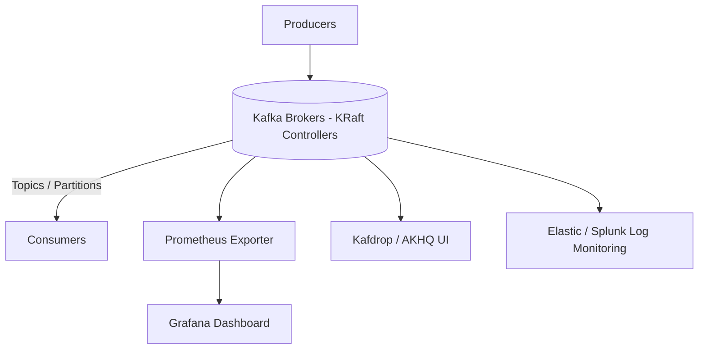
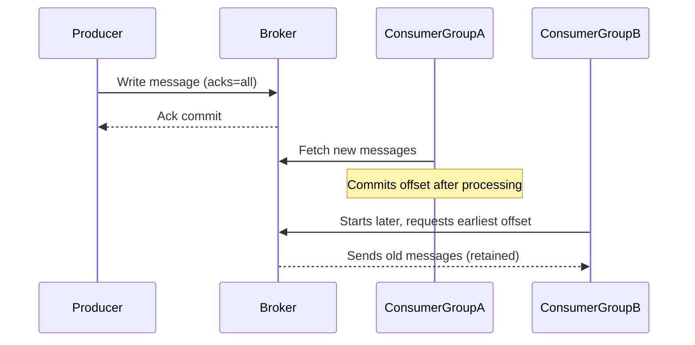

Here’s a structured **README / `kafka.md`** documentation you can place in your GitHub repo — it’s based on the essence of Apache Kafka (drawing from the “Learn Kafka in 10 Mins” article by Rocky Bhatia) plus a set of interview questions. You can customize further (add diagrams, links, code snippets) as per your project.

---

# Apache Kafka — Quick Reference & Interview Prep

*Version: 1.0*

## 1. What is Kafka?

Apache Kafka is a distributed event-streaming platform. It enables you to publish and subscribe to streams of records (messages), store them durably, and process them — all in real time. ([DataCamp][1])
Its key strengths: high throughput, low latency, fault-tolerance, horizontal scalability. ([GeeksforGeeks][2])

---

## 2. Core Concepts & Architecture

### Topics, Partitions & Offsets

* A **Topic** is a named stream of records to which data is written by producers and read by consumers. ([GeeksforGeeks][2])
* Each topic is split into one or more **Partitions**. Partitions allow parallelism (multiple consumers reading in parallel) and scaling. ([Rocky Bhatia][3])
* Within a partition, each message is assigned an **Offset**: a unique sequential ID for that partition. Consumers use offsets to track reading position. ([Simplilearn.com][4])

### Producers, Consumers & Consumer Groups

* **Producer**: application that writes/sends records to Kafka topics (to a specified topic/partition).
* **Consumer**: application that subscribes to one or more topics and reads records.
* **Consumer Group**: a group of consumers working together: each message in a partition is delivered to only one consumer within the group. This allows scale-out of processing. ([InterviewBit][5])

### Brokers, Cluster & Replication

* A **Broker** is a Kafka server/instance, storing data and serving clients (producers/consumers). A Kafka cluster is one or more brokers working together.
* **Replication**: Each partition has one **leader** replica and multiple **follower** replicas (according to the replication factor). Followers replicate the leader to provide fault tolerance. ([Terminal][6])
* **In-Sync Replicas (ISR)**: Followers that have caught up to the leader and thus are eligible to be promoted in case of leader failure. ([Simplilearn.com][4])

### Message Ordering, Retention & Delivery Semantics

* Ordering is guaranteed **within a partition** (because messages are appended with offsets). Ordering across partitions is *not* guaranteed unless you design accordingly. ([Hello Interview][7])
* Kafka retains messages for a configured retention period (or size) regardless of whether they are consumed. This supports replay, late-consumers etc. ([DataCamp][1])
* Delivery semantics: Kafka supports at-most-once, at-least-once, and exactly-once (with extra configuration) semantics — using producer acks, transactions, etc. ([GeeksforGeeks][2])

### High-Level Architecture (Simplified)

1. Producers send messages → topic → partition (via key/partitioner)
2. Brokers store the messages (in partition logs), replicate to followers
3. Consumers (in groups) pull messages from partitions; track offsets
4. Broker failures handled via leader election among ISR, etc

---

## 3. Use Cases / Why Kafka?

Some common scenarios where Kafka is used:

* Real-time data pipelines: moving data between systems reliably and in real time
* Event sourcing / stream processing: capturing events (user actions, logs, metrics) and processing them downstream
* Log aggregation, metrics collection, operational monitoring
* Decoupling microservices: using Kafka as the event backbone

Kafka excels when you need high throughput, horizontal scalability, durability, and ability to handle event streams rather than simple point-to-point messaging.

---

## 4. Setting Up Kafka (Very High Level)

> Note: This is a quick pointer. Detailed installation/configuration is out of scope here.

* Install/get running Kafka broker(s) and (in older versions) ZooKeeper.
* Create one or more topics (with partitions and replication factor).
* Configure producers and consumers: brokers list, serializers/deserializers, key/values, partitions or keys.
* Configure retention, replication factors, acks, etc.
* Monitor and tune: broker health, consumer lag, offsets, partitions distribution.

---

## 5. Best Practices & Tips

* Choose appropriate number of partitions: more partitions = more parallelism but also more overhead.
* Use keys for messages if you need ordering by key across partitions.
* Monitor consumer lag: large lag may mean consumer is slower than producer or mis-configured.
* Set appropriate retention policies: too short retention may cause data loss (if consumers are offline).
* Use replication factor > 1 for production to avoid single-broker failure causing data loss.
* Graceful version upgrades: rolling upgrades of brokers, avoid downtime.
* Security: enable SSL/TLS, authentication, ACLs if required.
* For exactly-once semantics: use idempotent producer, transactions in Kafka 0.11+.
* Use the newer KRaft mode (Kafka’s own metadata management) instead of ZooKeeper if you’re on modern Kafka versions.

---

## 6. Top Interview Questions on Kafka

Here are **10 solid interview questions** (with brief hints of answers) you might encounter. Use them to test and deepen your understanding.

| #  | Question                                                                               | Hint / Key Points                                                                                                                                                            |
| -- | -------------------------------------------------------------------------------------- | ---------------------------------------------------------------------------------------------------------------------------------------------------------------------------- |
| 1  | What are the core components of Kafka and how do they interact?                        | Topic, partition, producer, consumer, broker, replication, ISR.                                                                                                              |
| 2  | Explain how Kafka achieves fault tolerance.                                            | Replica sets, leader/follower, ISR, replication factor, acknowledgments.                                                                                                     |
| 3  | How does Kafka ensure message ordering?                                                | Ordering guaranteed within a partition. Use keys to route related messages to same partition.                                                                                |
| 4  | What is a Consumer Group? How do partitions get assigned?                              | Consumers in a group share partitions; each partition is consumed by only one consumer in the group.                                                                         |
| 5  | What is offset? How do consumers manage it?                                            | Offset is a sequential ID in partition. Consumers commit offsets (auto or manual) to track what has been read.                                                               |
| 6  | What delivery semantics can Kafka support — at-most-once, at-least-once, exactly-once? | Depends on producer acks, retries, idempotence, transactions.                                                                                                                |
| 7  | When should you increase number of partitions vs number of brokers?                    | Partitions increase parallelism; more brokers distribute partitions; both affect scalability and throughput.                                                                 |
| 8  | What are some key tuning/configuration parameters for producer/consumer/broker?        | E.g., `acks`, `linger.ms`, `batch.size`, `max.in.flight.requests.per.connection` for producer; `enable.auto.commit`, `max.poll.records` for consumer.                        |
| 9  | How would you handle a slow consumer or consumer lag in Kafka?                         | Monitor lag, increase consumer throughput (more threads/consumers), tune fetch/min-bytes, partitions, backpressure handling.                                                 |
| 10 | What use cases is Kafka *not* suitable for?                                            | Lightweight point-to-point messaging with very low throughput, transactional workflows requiring complex queries, very small simple queues maybe better with simpler broker. |

Excellent question — this is **one of the most misunderstood yet crucial** parts of Apache Kafka. Let’s break it down clearly and visually.

---

## 🧠 **How Kafka Handles Multiple Consumer Groups**

Kafka’s message delivery model is based on **topics, partitions, and consumer groups**.

---

### ⚙️ **Case 1: One Consumer Group (Load Balancing Mode)**

Let’s say you have:

* Topic: `orders`
* Partitions: 3 (`P0`, `P1`, `P2`)
* Consumer Group: `order-service`
* Consumers: `C1`, `C2`, `C3` (in the same group)

🧩 **Behavior:**

* Kafka ensures **each partition is consumed by exactly one consumer within a group**.
* So the partitions are divided among the consumers, like:

| Partition | Assigned Consumer |
| --------- | ----------------- |
| P0        | C1                |
| P1        | C2                |
| P2        | C3                |

✅ Each message goes to **one consumer only** within the group — this is **load balancing**.

📊 **Effect:**

* In a single consumer group → messages are split.
* No duplication — each consumer processes a unique subset of data.

---

### ⚙️ **Case 2: Multiple Consumer Groups (Fan-Out Mode)**

Now, imagine two consumer groups subscribe to the same topic:

* Group 1 → `order-service`
* Group 2 → `analytics-service`

Both groups subscribe to the same topic `orders`.

🧩 **Behavior:**

* Kafka delivers **a full copy of the topic’s data to each group independently.**
* Each group maintains its own **offsets** in the `__consumer_offsets` internal topic.

| Partition | Group 1 Consumer | Group 2 Consumer |
| --------- | ---------------- | ---------------- |
| P0        | C1 (in group1)   | C1' (in group2)  |
| P1        | C2 (in group1)   | C2' (in group2)  |

✅ **Result:**
Each group processes *all* messages independently — this is **publish/subscribe fan-out** behavior.

---

### 🧩 **Offsets: How Kafka Tracks Progress**

* Each group maintains offsets **per topic-partition**.
* Offsets are stored in the internal Kafka topic: `__consumer_offsets`.
* Example:

| Group             | Topic  | Partition | Last Committed Offset |
| ----------------- | ------ | --------- | --------------------- |
| order-service     | orders | P0        | 120                   |
| analytics-service | orders | P0        | 95                    |

That means:

* `order-service` has read up to message 120
* `analytics-service` has read up to message 95

So both can move **independently**, even though they read from the same topic.

---

### 🔄 **In Summary**

| Scenario            | Behavior                | Delivery to Consumers                            |
| ------------------- | ----------------------- | ------------------------------------------------ |
| **Single Group**    | Load balancing          | Each message → exactly one consumer in the group |
| **Multiple Groups** | Fan-out (Pub/Sub)       | Each message → delivered once per group          |
| **Offset Tracking** | Per group per partition | Independent reading positions maintained         |

---

### 🧭 **Analogy**

Think of **Kafka as a newsletter publisher**:

* A *topic* = newsletter.
* Each *consumer group* = a company subscribed to the newsletter.
* Each *consumer* = an employee reading a copy in that company.

📰
If **Company A** subscribes with 3 employees, each one gets a *different section* of the newsletter (load-balanced).
If **Company B** also subscribes, it gets its *own full copy* of the newsletter.

So both companies read the same news — but each handles its reading independently.

---

### 💡 **Example Use Case**

| Consumer Group      | Purpose                             | Behavior                               |
| ------------------- | ----------------------------------- | -------------------------------------- |
| `payment-service`   | Process payment events in real time | Each instance reads subset of messages |
| `analytics-service` | Generate BI metrics                 | Gets full copy of topic stream         |
| `fraud-detector`    | Detect suspicious transactions      | Gets full copy, independent offsets    |

---

Perfect — this is a great deep-dive question that often comes up in **Kafka architecture and DevOps interviews**. Let’s break this into three clear sections for your GitHub documentation (`kafka.md`):

---

# 🧩 Kafka Monitoring Tools, Cluster Management, and KRaft vs ZooKeeper

---

## 🧠 1. Kafka Monitoring & Management Tools

Monitoring Kafka is crucial because it’s a distributed system — brokers, producers, consumers, topics, partitions, offsets, and lags all interact dynamically.
Below are the **most widely used tools** to monitor Kafka clusters, message flow, and consumer health.

| Tool                                | Type                               | Key Features                                                                | Notes                                              |
| ----------------------------------- | ---------------------------------- | --------------------------------------------------------------------------- | -------------------------------------------------- |
| **Confluent Control Center**        | Enterprise UI (Confluent Platform) | Graphical monitoring for brokers, topics, lags, throughput, schema registry | Commercial; part of Confluent Stack                |
| **Kafka Manager (Yahoo / CMAK)**    | Open-source UI                     | Create/delete topics, view brokers, partitions, ISR, consumer groups        | Legacy but still used in many self-hosted clusters |
| **Kafdrop**                         | Open-source Web UI                 | Browse topics, partitions, view messages, offsets, lag                      | Very popular and lightweight                       |
| **Kafka Tool (Desktop App)**        | GUI                                | Browse brokers/topics, view messages                                        | Java-based desktop client                          |
| **AKHQ** (formerly Kafka HQ)        | Open-source Web UI                 | Visualize topics, consumers, ACLs, schemas                                  | Supports both ZooKeeper and KRaft                  |
| **Burrow**                          | LinkedIn’s Monitoring Service      | Lag checking for consumer groups, no UI (REST API)                          | Often integrated into alerting dashboards          |
| **Prometheus + Grafana**            | Metrics & Visualization            | Use Kafka JMX metrics and visualize throughput, lag, latency, broker status | Industry standard combo for production             |
| **Datadog / Dynatrace / New Relic** | Cloud Monitoring                   | Kafka integration plugins for metrics, lag, partition health, alerts        | Enterprise-level observability                     |
| **Elastic Stack (ELK)**             | Logging and Visualization          | Collect Kafka logs via Filebeat/Logstash, visualize in Kibana               | Common for central logging setups                  |

---

### 🔍 Common Metrics to Monitor

| Metric Category             | Key Metrics                                              | Why Important                    |
| --------------------------- | -------------------------------------------------------- | -------------------------------- |
| **Broker Health**           | Active Controller, Under-Replicated Partitions, ISR size | Detect leader election/failures  |
| **Producer Metrics**        | Record send rate, request latency, retry count           | Diagnose publishing bottlenecks  |
| **Consumer Metrics**        | Lag, commit offsets, fetch latency                       | Detect slow or stuck consumers   |
| **Topic/Partition Metrics** | Bytes in/out per second, partition skew                  | Helps with scaling and rebalance |
| **System Metrics**          | JVM heap usage, disk I/O, network                        | Detect resource bottlenecks      |

---

## ⚙️ 2. How Kafka KRaft Mode Works (Kafka without ZooKeeper)

KRaft = **Kafka Raft Metadata Mode**
It’s a newer metadata management system that **removes ZooKeeper** dependency starting from **Kafka 2.8** and **default in 3.3+**.

---

### 🧩 Why ZooKeeper Was Used Before

Originally, ZooKeeper managed **cluster metadata** and coordination tasks like:

* Storing broker metadata (IDs, configs)
* Managing topics, partitions, replication assignments
* Electing controller brokers
* Maintaining ISR lists (In-Sync Replicas)
* Configuration changes, ACLs, etc.

📉 **Problems with ZooKeeper setup:**

* Harder to operate and scale separately from brokers
* Latency between Kafka ↔ ZooKeeper communication
* Inconsistent state if ZooKeeper is overloaded or down
* Hard to support atomic metadata operations
* Deployment and version management overhead

---

### ⚙️ Enter KRaft Mode (Kafka Raft Metadata Mode)

KRaft integrates **metadata quorum and consensus directly into Kafka brokers** using the **Raft consensus protocol**.

#### 🔑 Core Components in KRaft

| Component                               | Description                                                                                       |
| --------------------------------------- | ------------------------------------------------------------------------------------------------- |
| **Controller Quorum**                   | A small set of brokers act as metadata controllers (usually 3 or 5 for quorum).                   |
| **Raft Log**                            | Internal replicated log that stores metadata updates (topic creation, broker registration, etc.). |
| **Controller Leader**                   | The active broker that applies metadata updates and propagates to followers.                      |
| **Metadata Snapshot**                   | Periodically stored state for fast recovery (similar to Raft snapshot).                           |
| **Metadata Log (`__cluster_metadata`)** | Stores all cluster metadata changes.                                                              |

---

### 🔄 How KRaft Differs from ZooKeeper

| Feature                   | ZooKeeper Mode                         | KRaft Mode                                   |
| ------------------------- | -------------------------------------- | -------------------------------------------- |
| **Coordination Layer**    | External (ZooKeeper)                   | Internal (Raft quorum)                       |
| **Metadata Storage**      | ZooKeeper znodes                       | Kafka internal Raft log                      |
| **Leader Election**       | Managed by ZooKeeper                   | Managed by Raft protocol                     |
| **Deployment Complexity** | Requires separate ZooKeeper ensemble   | All-in-one Kafka cluster                     |
| **Performance**           | Additional network hops                | Lower latency, faster metadata operations    |
| **Fault Tolerance**       | Depends on ZooKeeper quorum            | Integrated Raft consensus                    |
| **Upgrade Path**          | ZooKeeper  → KRaft migration supported | Fully ZooKeeper-free                         |
| **Scalability**           | Limited by ZooKeeper throughput        | Scales better with Raft metadata replication |

---

### 🧮 How Metadata Updates Work in KRaft

1. Client (Admin API or internal operation) sends metadata change request (e.g., create topic).
2. Controller leader appends the request to **metadata log** (Raft log).
3. Followers replicate the log entry (via Raft protocol).
4. Once a quorum acknowledges, entry is **committed**.
5. Controller applies the change to in-memory metadata and sends updated metadata to brokers.

✅ **Strong consistency, no external dependency, single commit path.**

---

### 📈 Benefits of KRaft Mode

* Simpler deployment (no ZooKeeper setup)
* Faster metadata propagation (no network indirection)
* Easier scaling and automation (controller quorum inside brokers)
* More predictable failover and election handling
* Better integration with Kubernetes and managed Kafka services

---

### ⚠️ Migration Tips

* Kafka versions **2.8–3.3** support hybrid modes for gradual migration.
* Once migrated, ZooKeeper is **completely eliminated**.
* Tools like **AKHQ**, **Prometheus**, and **Kafdrop** support both modes transparently.

---

## 🧭 3. Recommended Architecture for Production Monitoring

A typical **modern Kafka (KRaft mode)** setup includes:



**Workflow**

* Brokers emit metrics via JMX → Prometheus scrapes them → Grafana visualizes.
* Kafdrop or AKHQ is used for browsing topics, partitions, offsets.
* Burrow or Control Center monitors **consumer lag** and health.
* Alerts are triggered based on thresholds (e.g., lag > 1000, under-replicated partitions).

---

## 🚀 Summary

| Area                 | Key Takeaway                                                                   |
| -------------------- | ------------------------------------------------------------------------------ |
| **Monitoring Tools** | Use Prometheus + Grafana (metrics), Kafdrop/AKHQ (UI), Burrow (lag monitoring) |
| **ZooKeeper Mode**   | Uses external ZooKeeper ensemble for metadata and coordination                 |
| **KRaft Mode**       | Kafka-native Raft-based metadata quorum, no ZooKeeper needed                   |
| **KRaft Benefits**   | Simplified operations, faster failover, improved performance                   |
| **Migration**        | Supported from 2.8+, fully stable in 3.3+                                      |

---

Excellent — you’ve just hit the **core of Kafka’s durability and delivery model** — this is something that differentiates Kafka from traditional messaging systems like RabbitMQ or ActiveMQ.
Let’s create a detailed GitHub-ready section for your `kafka.md` covering **message recovery**, **retention**, **new consumer replay**, **Pub/Sub vs Fan-Out**, and **additional mechanisms** (like compaction, acknowledgments, and exactly-once semantics).

---

# 🧱 Kafka Message Recovery, Retention, and Delivery Mechanisms

---

## 🧩 1. How Kafka Recovers Messages

Kafka is designed as a **durable, immutable, append-only log**.
Each topic is divided into **partitions**, and messages are written sequentially to disk.
Because of this design:

✅ Kafka **never deletes a message immediately after consumption**
✅ Messages can be **re-read (replayed)** by any consumer group at any time
✅ Crash recovery is simple — replay logs from disk

Kafka achieves recovery by combining:

* **Commit log persistence** (messages stored on disk)
* **Replication** (to other brokers)
* **Offset tracking** (to resume consumers)

---

### ⚙️ Example – How a New Consumer Gets Old Messages

1. You create a **topic**: `orders` (with retention of 7 days).

2. Messages are written: `M1`, `M2`, `M3`, …

3. You start **Consumer Group A** → it reads messages starting from the **latest offset** (default) or **earliest offset** (configurable).

4. After a few days, you start **Consumer Group B** (new).

   * Kafka sees no committed offset for this group.
   * If configured with `auto.offset.reset=earliest`,
     → Kafka will deliver **all retained messages** from the start of each partition.

✅ **Result:** New consumers can replay entire history if messages are still within the **retention period**.

---

### ⚙️ Offset Storage and Recovery

| Where Offsets Are Stored       | Description                                                                    |
| ------------------------------ | ------------------------------------------------------------------------------ |
| **`__consumer_offsets`** topic | Internal compacted topic storing committed offsets per consumer group          |
| **Per group, per partition**   | Each group tracks offsets independently                                        |
| **Commit Mode**                | Manual (`commitSync`/`commitAsync`) or auto commit (`enable.auto.commit=true`) |

If a consumer crashes:

* On restart, it **reads last committed offsets**.
* Kafka resumes reading from that offset onward.
* No messages are lost (assuming `acks=all` and proper commits).

---

## 🧠 2. Kafka Retention Policy

Kafka’s retention is **time- or size-based** — it decides how long or how much data to keep in a topic.

| Parameter            | Description                                         | Default        |
| -------------------- | --------------------------------------------------- | -------------- |
| `retention.ms`       | How long to retain messages (e.g., `168h = 7 days`) | 7 days         |
| `retention.bytes`    | How much data per partition to retain               | -1 (unlimited) |
| `log.segment.bytes`  | Log segment file size before a new one is created   | 1 GB           |
| `log.cleanup.policy` | Can be `delete` or `compact`                        | `delete`       |

---

### 🧾 Retention in Action

* Kafka deletes *old segments* (not individual messages) when:

  * Segment end offset < earliest needed offset, and
  * Segment is older than `retention.ms` or exceeds `retention.bytes`.

* If consumers are **slow** or **offline**, and retention expires,
  → older data may be gone, so replay isn’t possible.

🧠 **Important:** Retention is independent of consumption — Kafka doesn’t care if you read or not.

---

### 🔁 Log Compaction (Cleanup Policy = `compact`)

Instead of deleting old records purely by time, **compaction** keeps only the **latest record for each key**.

| Feature                  | Behavior                                                           |
| ------------------------ | ------------------------------------------------------------------ |
| `cleanup.policy=compact` | Kafka retains only last message per key                            |
| Use case                 | Change-log topics, materialized view updates, database replication |

Example:

```
Key: user123 → v1, v2, v3
After compaction → only v3 retained
```

You can also **combine** `compact,delete` for hybrid retention (retain for 7 days, then compact).

---

## 📬 3. Pub/Sub vs Fan-Out Model

These two are often confused — let’s differentiate clearly.

| Model                           | Who Receives Messages                                                         | Kafka Equivalent            |
| ------------------------------- | ----------------------------------------------------------------------------- | --------------------------- |
| **Pub/Sub (Publish–Subscribe)** | Each **subscriber (group)** gets a full copy of the stream                    | Multiple Consumer Groups    |
| **Fan-Out (Load Balanced)**     | Each message goes to **one consumer instance** among many (within same group) | Consumers within same group |

### 🧩 Example

**Topic:** `orders`
**Producer:** sends 100 messages

| Group               | Consumers           | Messages Delivered                                         |
| ------------------- | ------------------- | ---------------------------------------------------------- |
| `order-service`     | 3 consumers (C1–C3) | Each gets ~33 messages (load-balanced)                     |
| `analytics-service` | 2 consumers         | Each gets full 100 messages (shared across the 2 in group) |
| `fraud-service`     | 1 consumer          | Gets all 100 messages                                      |

✅ Each **consumer group** acts as an **independent subscriber**
✅ Each group maintains its own **offsets**
✅ This is **Kafka’s native pub/sub + fan-out hybrid model**

---

## ⚙️ 4. Delivery Mechanisms & Semantics

Kafka provides configurable **delivery guarantees** depending on producer & consumer setup.

| Guarantee         | Description                               | Configuration                                                              |
| ----------------- | ----------------------------------------- | -------------------------------------------------------------------------- |
| **At most once**  | Message may be lost but never redelivered | Commit offsets before processing                                           |
| **At least once** | Message may be redelivered but never lost | Commit offsets after processing                                            |
| **Exactly once**  | No duplication or loss                    | Use idempotent producer (`enable.idempotence=true`) + transactional writes |

---

### 🧩 Example: Exactly Once in Action

1. Producer starts a **transaction** (`initTransactions()`).
2. Sends messages to multiple partitions.
3. Commits the transaction (`commitTransaction()`) — all messages written atomically.
4. Consumer reads and commits offsets as part of transaction.
   ✅ Guarantees atomicity, consistency, and no duplication.

---

## 🧰 5. Kafka Mechanisms Supporting Reliability

| Mechanism                    | Purpose                                       |
| ---------------------------- | --------------------------------------------- |
| **Replication (factor > 1)** | Prevents data loss if a broker fails          |
| **ACKs** (`acks=0,1,all`)    | Control producer acknowledgment level         |
| **ISR (In-Sync Replicas)**   | Tracks replicas caught up to leader           |
| **Idempotent Producer**      | Avoid duplicate messages during retries       |
| **Transactions**             | Support exactly-once semantics                |
| **Retention & Compaction**   | Define how long and what data to retain       |
| **Offset Commit**            | Allows restart/resume at last processed point |

---

## 📊 6. Recovery Flow Summary



✅ Broker persists messages to disk
✅ Replicates to other brokers
✅ Consumers re-read using offsets
✅ Retention defines how long history is available

---

## 🧭 7. Summary Table

| Concept                | Description                          | Key Configs                               |
| ---------------------- | ------------------------------------ | ----------------------------------------- |
| **Message Recovery**   | Consumers replay from stored offsets | `auto.offset.reset`, `enable.auto.commit` |
| **Retention**          | Time/size-based data cleanup         | `retention.ms`, `retention.bytes`         |
| **Compaction**         | Retain last value per key            | `cleanup.policy=compact`                  |
| **Pub/Sub Model**      | Each group gets full copy            | Multiple groups                           |
| **Fan-Out Model**      | Load balance within group            | Single group, multiple consumers          |
| **Delivery Semantics** | At-most, At-least, Exactly once      | `acks`, `idempotence`, transactions       |
| **Durability**         | Persistent log + replication         | `replication.factor`, `acks=all`          |


Here is your full content **cleanly formatted in Markdown**, ready to paste into Confluence, GitHub, Notion, or your documentation 👇

---

# ⚡ Kafka Throughput Tuning — Complete Practical Guide

Kafka provides many tunable parameters on the **producer**, **broker**, and **consumer** sides to optimize throughput.
Below is the **complete, practical list used in real production systems**.

---

## 🚀 1. Producer Parameters to Increase Throughput

These settings have the **maximum impact** on producer performance.

### ✅ 1.1 `batch.size`

* Max size of a batch per partition.
* Larger batch → more efficient network usage.
* **Default:** 16 KB
* **High throughput:** 64 KB – 512 KB

### ✅ 1.2 `linger.ms`

* Time producer waits before sending a batch.
* Higher value allows more messages to accumulate → bigger batches.
* **Default:** 0 ms
* **High throughput:** 5–20 ms

### ✅ 1.3 `compression.type`

* Compress messages to reduce network traffic.
* **Recommended:** `lz4` or `zstd` (fast & highly compressed)

### ✅ 1.4 `buffer.memory`

* Total producer buffer memory.
* **Default:** 32 MB
* **High throughput:** 256–1024 MB

### ✅ 1.5 `max.in.flight.requests.per.connection`

Controls parallel requests:

| Requirement                       | Setting                                                   |
| --------------------------------- | --------------------------------------------------------- |
| Max throughput + reordering ok    | `max.in.flight.requests.per.connection = 5`               |
| Strict ordering + high throughput | `acks = all`, `max.in.flight.requests.per.connection = 1` |

### ✅ 1.6 `acks`

Controls durability vs throughput.

| acks | Meaning                    | Throughput        |
| ---- | -------------------------- | ----------------- |
| 0    | Fire-and-forget            | 🔥 Highest        |
| 1    | Leader acknowledgment only | High              |
| all  | All replicas acknowledged  | Lower, but safest |

**High throughput recommendation:** `acks = 1`

### ✅ 1.7 `retries`, `delivery.timeout.ms`, `request.timeout.ms`

* Allow retries without blocking the producer too long.

---

## 🧱 2. Broker Parameters for High Throughput

These parameters affect **disk, network, replication**, and **batching**.

### ✅ 2.1 `num.network.threads` / `num.io.threads`

Increase to handle many incoming connections & IO.

Example:

```
num.network.threads = 8
num.io.threads = 16
```

### ✅ 2.2 `socket.send.buffer.bytes` / `socket.receive.buffer.bytes`

Increase TCP buffer size for high throughput.

### ✅ 2.3 `log.flush.interval.messages` / `log.flush.interval.ms`

Do **NOT** flush logs frequently → kills throughput.
Defaults are optimal because Kafka relies on OS page cache.

### ✅ 2.4 `num.replica.fetchers`

More fetcher threads → faster replication.

### ✅ 2.5 `replication.factor`

Higher replication = more network writes → lower throughput.

* **Throughput optimized:** `replication.factor = 2`
* For non-critical pipelines: `replication.factor = 1`

### ✅ 2.6 `message.max.bytes` / `replica.fetch.max.bytes`

Increase for pipelines with larger messages.

---

## 📦 3. Topic-Level Parameters

### ✅ 3.1 Partitions

Most important throughput factor.
More partitions → more parallelism.

Guidelines:

* High throughput topics: **6–50 partitions**
* Very heavy workloads: **100+ partitions**

### ✅ 3.2 `min.insync.replicas`

If using `acks=all`, lower MISR increases throughput.

Examples:

```
min.insync.replicas = 1
min.insync.replicas = 2
```

---

## 🔄 4. Consumer Parameters to Increase Throughput

### ✅ 4.1 `fetch.min.bytes`

Minimum size of data broker sends per fetch.

* **Recommended:** `1 MB` for batching.

### ✅ 4.2 `fetch.max.wait.ms`

Consumer waits longer to accumulate more data.

* **High throughput:** `50 ms`

### ✅ 4.3 `max.partition.fetch.bytes`

* **Default:** 1 MB
* Increase for large messages: **10–50 MB**

### ✅ 4.4 `max.poll.records`

Higher values improve batch processing.

* **Recommended:** `500–2000`

---

## 🔧 5. OS / Hardware Settings (Very Important)

* ✔ Use **SSD**, not HDD
* ✔ Increase **Linux page cache memory**
* ✔ Use **10GbE or higher network**
* ✔ Tune **JVM heap** properly (avoid GC pauses)

---

## 💡 Recommended Kafka Throughput Tuning Profile (Copy & Use)

### **Producer**

```properties
acks=1
compression.type=lz4
batch.size=256000
linger.ms=10
buffer.memory=512000000
max.in.flight.requests.per.connection=5
```

### **Broker**

```properties
num.network.threads=8
num.io.threads=16
num.replica.fetchers=4
socket.send.buffer.bytes=1024000
socket.receive.buffer.bytes=1024000
replication.factor=2
```

### **Consumer**

```properties
fetch.min.bytes=1048576
fetch.max.wait.ms=50
max.poll.records=1000
max.partition.fetch.bytes=10485760
```

---
# How Kafka manages ordering — and how to get ordering *across* partitions

Short answer up front:

* **Kafka guarantees ordering only within a single partition.** Messages written to the same partition are strictly ordered (by offset).
* **There is *no* built-in global ordering across partitions.** If you need global ordering you must design for it: route related messages to the same partition (same key or custom partitioner), use a single-partition topic, or implement an external sequencing/coordination layer or consumer-side re-ordering.

Below I explain the guarantees, strategies to obtain ordering across partitions, trade-offs, and provide code examples (Java) showing:

1. Key-based partitioning (the usual and simplest approach)
2. Custom partitioner (route by business key)
3. Transactional producer (atomic writes across partitions, but not global ordering)
4. Consumer-side reordering using sequence numbers (when you must write to multiple partitions)

---

## 🧭 Kafka ordering guarantees (quick)

* **Within a partition**: ordering = **strictly guaranteed**. Offsets are increasing and consumers read in offset order.
* **Across partitions**: ordering = **not guaranteed**. Different partitions have separate logs and independent offsets; writes to different partitions can interleave in any order.
* **Producer retries / acks / max.in.flight** can affect perceived ordering within a partition if `max.in.flight.requests.per.connection > 1` and `acks != all` (producer may re-order on retry). To keep ordering within a partition: use `max.in.flight.requests.per.connection = 1` or enable idempotence (`enable.idempotence=true`) and prefer `acks=all`.

---

## ✅ Strategy summary: how to get ordering across partitions

1. **Route related messages to the same partition** (same message key or a custom partitioner).

   * Use a business key (customerId, accountId) as the partition key so all messages for that key go to the *same* partition — ordering preserved for that key.
2. **Single-partition topic** — trivial and absolute guarantee, but limits throughput (single writer/reader).
3. **Custom partitioner with deterministic mapping** — chunk by hash-range so some groups share a partition.
4. **External sequencer/ordering service** — all producers ask sequencer for global sequence numbers; write sequence with message. Higher complexity.
5. **Consumer-side reordering** — let producers publish across partitions, but consumers buffer & reorder messages using sequence numbers per key. Good if you must preserve throughput but can buffer/hold until missing seq arrives.
6. **Kafka Transactions** (`initTransactions` / `beginTransaction`) — ensure atomic writes across partitions (all or none), and with `isolation.level=read_committed` consumers won’t see partial transactions. **Transactions do not provide cross-partition ordering** — only atomicity.

---

## Example 1 — Java Producer: use the message key (preferred)

This sends messages with the same `businessKey` as the Kafka key so they hash to the same partition:

```java
// Maven deps: org.apache.kafka:kafka-clients

import org.apache.kafka.clients.producer.*;
import org.apache.kafka.common.serialization.StringSerializer;
import java.util.Properties;

public class KeyedProducer {
    public static void main(String[] args) {
        Properties props = new Properties();
        props.put(ProducerConfig.BOOTSTRAP_SERVERS_CONFIG, "localhost:9092");
        props.put(ProducerConfig.KEY_SERIALIZER_CLASS_CONFIG, StringSerializer.class.getName());
        props.put(ProducerConfig.VALUE_SERIALIZER_CLASS_CONFIG, StringSerializer.class.getName());

        // For ordering durability:
        props.put(ProducerConfig.ACKS_CONFIG, "all");
        props.put(ProducerConfig.ENABLE_IDEMPOTENCE_CONFIG, "true"); // recommended
        props.put(ProducerConfig.MAX_IN_FLIGHT_REQUESTS_PER_CONNECTION, "1"); // strict ordering

        try (Producer<String, String> producer = new KafkaProducer<>(props)) {
            String topic = "orders";
            String businessKey = "customer-123"; // all events for this customer go to same partition

            for (int i = 0; i < 10; i++) {
                String value = "order-event-" + i;
                ProducerRecord<String, String> record = new ProducerRecord<>(topic, businessKey, value);
                producer.send(record, (metadata, exception) -> {
                    if (exception != null) {
                        exception.printStackTrace();
                    } else {
                        System.out.println("Sent to partition " + metadata.partition() + " offset " + metadata.offset());
                    }
                });
            }
            producer.flush();
        }
    }
}
```

**Why this works:** Kafka's default partitioner hashes the key to a partition deterministically, so all messages with the same key go to the same partition and their order is preserved.

---

## Example 2 — Custom Partitioner (route by business key → partition deterministically)

If your keys are hierarchical and you want to distribute keys but keep ordering for groups, implement a custom partitioner:

```java
import org.apache.kafka.clients.producer.Partitioner;
import org.apache.kafka.common.Cluster;
import java.util.Map;

public class GroupPartitioner implements Partitioner {
    // Example: map businessKey prefix to partition range deterministically
    @Override
    public int partition(String topic, Object keyObj, byte[] keyBytes, Object value, byte[] valueBytes, Cluster cluster) {
        String key = (String) keyObj;
        int partitions = cluster.partitionCountForTopic(topic);

        // simple mapping: use prefix number if present; else fallback to hash
        if (key != null && key.contains(":")) {
            String prefix = key.split(":")[0]; // e.g. "tenant42:1234"
            int groupId = Math.abs(prefix.hashCode());
            return groupId % partitions;
        }
        return Math.abs(key.hashCode()) % partitions;
    }

    @Override public void close() {}
    @Override public void configure(Map<String, ?> configs) {}
}
```

To use it, set `partitioner.class` in producer props:

```properties
producer.props:
    partitioner.class=com.example.GroupPartitioner
```

**Trade-off:** deterministic grouping preserves ordering for each group while allowing parallelism between groups.

---

## Example 3 — Transactions across partitions (atomic writes) — Java

Transactions let you atomically write multiple records (possibly to different partitions and topics) and commit them together. This prevents consumers from seeing partial state, but **does not give a global ordering guarantee**.

```java
import org.apache.kafka.clients.producer.*;
import org.apache.kafka.common.serialization.StringSerializer;
import java.util.Properties;

public class TransactionalProducer {
    public static void main(String[] args) {
        Properties props = new Properties();
        props.put(ProducerConfig.BOOTSTRAP_SERVERS_CONFIG, "localhost:9092");
        props.put(ProducerConfig.KEY_SERIALIZER_CLASS_CONFIG, StringSerializer.class.getName());
        props.put(ProducerConfig.VALUE_SERIALIZER_CLASS_CONFIG, StringSerializer.class.getName());
        props.put(ProducerConfig.ENABLE_IDEMPOTENCE_CONFIG, "true");
        props.put(ProducerConfig.ACKS_CONFIG, "all");
        props.put(ProducerConfig.TRANSACTIONAL_ID_CONFIG, "txn-producer-1");

        try (KafkaProducer<String, String> producer = new KafkaProducer<>(props)) {
            producer.initTransactions();
            try {
                producer.beginTransaction();

                // Write to two partitions/topics as a single atomic transaction
                producer.send(new ProducerRecord<>("topic-A", "key1", "valueA1"));
                producer.send(new ProducerRecord<>("topic-B", "key2", "valueB1"));

                producer.commitTransaction();
                System.out.println("Transaction committed");
            } catch (Exception ex) {
                producer.abortTransaction();
                ex.printStackTrace();
            }
        }
    }
}
```

**Note:** transactions ensure atomic visibility; they **do not** order messages across partitions relative to other producers.

---

## Example 4 — Consumer-side reordering using sequence numbers

If producers must write to different partitions but you still require ordering per business key, add a sequence number (incremented by the producer per key). Consumers buffer per-key and release messages in sequence order.

This example is **conceptual** (single-threaded) showing consumer buffering and ordering logic:

```java
// pseudo-java-ish for clarity
class ReorderingConsumer {
    // Map<businessKey, nextExpectedSeq>
    private Map<String, Long> nextExpected = new ConcurrentHashMap<>();
    // Map<businessKey, PriorityQueue<MsgBySeq>>
    private Map<String, PriorityQueue<Message>> buffer = new ConcurrentHashMap<>();

    void onMessage(Message msg) {
        String key = msg.getBusinessKey();
        long seq = msg.getSeq();

        nextExpected.putIfAbsent(key, 0L);
        buffer.putIfAbsent(key, new PriorityQueue<>(Comparator.comparingLong(Message::getSeq)));

        PriorityQueue<Message> q = buffer.get(key);
        q.add(msg);

        // Try to flush in-order messages for this key
        long expected = nextExpected.get(key);
        while (!q.isEmpty() && q.peek().getSeq() == expected) {
            Message ready = q.poll();
            process(ready);              // process in strict order
            expected++;
            nextExpected.put(key, expected);
        }
    }
}
```

**Important points:**

* You must include `businessKey` and `seq` in the message. The producer must generate sequence numbers per businessKey (atomic increment).
* You need bounded buffer sizes and timeouts (what if a message is lost?). Consider a policy: wait X ms then skip or request replay.
* This approach increases consumer complexity and latency.

---

## Practical patterns & recommendations

* **Default & best**: use a **business key** so related events map to the same partition. This is the simplest and most common approach.
* **If you need absolute global ordering**: use a **single partition** topic (but throughput and parallelism are limited).
* **If you want per-key ordering and still high throughput**: use many partitions but route by key so each key's events land in exactly one partition.
* **If producers must write to multiple partitions**: add per-key sequence numbers and implement **consumer-side buffering/reordering** with timeouts and backpressure.
* **Use `enable.idempotence=true` and `acks=all`** to avoid duplicates and help maintain ordering when retries occur. For strict ordering, set `max.in.flight.requests.per.connection=1`.
* **Transactions** help ensure atomic group writes (useful for exactly-once semantics) but do not replace partitioning for ordering.

---

## Full example: producer writes sequences per key + consumer reorders

### Producer (Java — per-key seq)

Simplified sketch — producer must maintain a per-key counter (e.g. in memory or an external store) and include `seq` in the message JSON.

```java
// produce message with sequence number field in JSON
String businessKey = "acct-1";
long seq = nextSequenceForKey(businessKey); // implement atomic increment
String payload = "{\"seq\":" + seq + ", \"key\":\"" + businessKey + "\", \"data\":\"...\" }";
ProducerRecord<String,String> r = new ProducerRecord<>("events", businessKey, payload);
producer.send(r);
```

(Important: `nextSequenceForKey` must be atomic. If multiple producer instances produce for same key, you'd need a centralized sequencer or partition ownership.)

### Consumer (Java — reordering)

Sketch of buffered consumer behavior (simplified):

```java
// When parsing messages, extract businessKey and seq from payload
// Use data structures from Example 4 to buffer and flush
```

**Downside:** seq generator coordination and complexity is significant.

---

## TL;DR / Cheat sheet

* Want ordering per entity (customer/account) + high throughput → **give each entity a key** (same key → same partition).
* Want global ordering → **single partition** topic (sacrifices throughput).
* Want atomic multi-partition writes → **transactions**, but they **don’t** provide global ordering.
* Producers should enable idempotence & acks=all and control inflight requests for *safer ordering*.
* If you cannot avoid multi-partition writes, implement **sequence numbers + consumer reordering**, and accept more complexity and latency.

---

Below is a **clear Markdown explanation** of how Kafka manages **partitions**, **consumer assignment**, and what happens when **new consumers or new consumer groups** join a topic.
I also included diagrams (ASCII), real-world examples, and rules that Kafka follows internally.

---

# 🧠 How Kafka Manages Partitions & Consumer Assignment

Kafka ensures **scalability + fault-tolerance + ordering** through partitions and consumer groups.

---

## ✅ 1. How Kafka Partitions Work

A Kafka topic is split into **N partitions**. Example:

```
topic: orders
partitions: 0, 1, 2, 3
```

Each partition is a **totally ordered, append-only log**.

* Ordering is *guaranteed only within a partition*.
* Kafka distributes partitions **across brokers**.
* Consumers read partitions **sequentially** (offset by offset).

---

## 🎯 2. How Kafka Ensures “Same Consumer Reads Same Partition”

A Kafka **consumer group** has the rule:

> **Each partition is consumed by only one consumer in a group at a time.**

This means:

* If you have 4 partitions and 4 consumers → each consumer gets **1 partition**.
* If you have 4 partitions and 2 consumers → each consumer gets **2 partitions**.
* If you have more consumers than partitions → some consumers stay **idle**.

Kafka assigns partitions using a **Partition Assignment Strategy** (CooperativeSticky, Range, or RoundRobin).

### Example (4 partitions, 2 consumers):

```
C1 → P0, P1
C2 → P2, P3
```

### Example (4 partitions, 4 consumers):

```
C1 → P0
C2 → P1
C3 → P2
C4 → P3
```

---

## 🔄 3. What Happens When a New Consumer Joins a Group?

This triggers a **rebalance**.

### Example:

Topic partitions: `P0, P1, P2, P3`
Consumer group currently:

```
C1 → P0, P1
C2 → P2, P3
```

Now **C3 joins**.

Kafka rebalances:

```
C1 → P0
C2 → P1
C3 → P2, P3
```

**Key points:**

* Assignment changes dynamically.
* Messages are NOT lost (offsets stored in Kafka).
* Consumers must STOP, RE-JOIN, and RESUME reading.

---

## 🔄 4. What Happens When a Consumer Leaves (Crashes / Stops)?

Rebalance again:

Example before crash:

```
C1 → P0
C2 → P1
C3 → P2, P3
```

If **C3 crashes**, Kafka reassigns:

```
C1 → P0, P2
C2 → P1, P3
```

---

## 👥 5. How Do Multiple Consumer Groups Work?

This is a **critical** concept.

### ✨ Key Rule:

> **Each consumer group gets its own independent copy of data.**

If you have 3 consumer groups:

* groupA
* groupB
* groupC

All reading from topic `orders`, each group gets **all partitions** assigned **independently**.

```
groupA → its own consumers
groupB → its own consumers
groupC → its own consumers
```

**They do NOT affect each other.**

### Example:

```
Topic: orders (4 partitions)

groupA = microservice A
groupB = microservice B
groupC = audit system
```

All 3 get **all messages**, but partition assignment happens **inside each group only**.

---

## 🧠 6. Summary: How Consumer Groups & Partitions Work

### ✔ Ordering:

* Guaranteed **within a partition**.
* NOT guaranteed across partitions.

### ✔ Assignment logic:

* 1 partition → 1 consumer **inside a consumer group**.
* More consumers than partitions → extra consumers are **idle**.

### ✔ Adding new consumers:

* Causes group **rebalance**.
* Helps scale consumption (up to number of partitions).

### ✔ Adding new consumer groups:

* No rebalance in other groups.
* Each group gets **full independent consumption**.

### ✔ Persistence:

* Offsets stored in Kafka → consumers resume where they left off.

---

# 📌 Example Visual Summary

### One topic + one group (G1)

```
Topic: T (P0, P1, P2)

Group G1:
C1 → P0
C2 → P1
C3 → P2
```

### Add a new consumer group (G2):

```
Group G2:
D1 → P0
D2 → P1
D3 → P2
```

Group G1 and G2 operate **independently**.

---

# 🏁 Final Answer in One Line

✔ Kafka ensures same consumer reads the same partition **inside a consumer group** using rebalance rules.
✔ When new consumers join the group, partitions are redistributed.
✔ When new **consumer groups** join the topic, they get their own full independent consumption — no conflict with others.

---
Below is a **clear Markdown explanation** of **offsets**, **Kafka’s internal message management**, and **what happens when message delivery fails**.
This will make you fully understand how Kafka guarantees reliability without losing or skipping messages.

---

# 🧠 What Is an Offset in Kafka?

An **offset** is a **sequential number** assigned to every message in a partition.

Example (Partition 0):

```
Offset: 0   1   2   3   4   5
Message: M0  M1  M2  M3  M4  M5
```

### ✔ Offsets are:

* Immutable
* Strictly increasing
* Assigned **by Kafka broker** (not by producer)
* Unique **within a partition**, not across the topic

### ✔ Offsets track **where the consumer has read**

Kafka stores consumer progress via:

* `__consumer_offsets` topic
* Or manually by your application

---

# 🏗️ How Kafka Internally Manages Messages

Inside each partition:

1. Messages are appended to a **commit log** on disk.
2. Broker assigns offsets sequentially.
3. Messages stay on disk based on **retention policy** (time or size).
4. Consumers read messages **in order** by offset.

Kafka does **not** delete a message after a consumer reads it.

---

# 🔄 What Happens When Message Delivery Fails?

Kafka has **two different failure scenarios**:

---

# 🧩 1. Producer → Kafka Broker Delivery Failure

Producer sends message
→ Broker fails to acknowledge (due to network, leader down, timeout)

Kafka behavior depends on **producer settings**:

### ✔ Case A – `acks=all`, `retries > 0`, idempotence enabled

Kafka will **retry and ensure no duplicates**.
Message is not considered delivered unless broker commits it.

### ✔ Case B – `acks=1`

If leader gets the message, it succeeds even if replicas fail.

### ✔ Case C – `acks=0`

Producer does not wait for confirmation. Message can be lost.

---

# 🧩 2. Kafka Broker → Consumer Delivery Failure

Consumers pull messages from Kafka. They may fail to process due to:

* Exception in code
* Service crash
* Timeout
* System failure

Here’s the most important Kafka guarantee 👇

---

# ⚠️ Kafka NEVER skips a message

If a consumer fails to process message at offset **N**, Kafka will keep delivering it again and again **until you commit offset N**.

Example:

```
P0 Offsets: 10   11   12   13
            M10  M11  M12  M13
```

Consumer reads offset 10 and fails.

### What happens?

* Offset 11 will **NOT** be committed.
* Consumer restarts → Kafka delivers offset 10 again.
* Kafka avoids skipping to keep **at-least-once delivery semantics**.

---

# 🎯 Offset Commit Logic

Offsets are committed in **two ways**:

## ✔ 1. Auto-commit (not recommended for critical systems)

```properties
enable.auto.commit=true
auto.commit.interval.ms=5000
```

Every 5 seconds Kafka commits last-read offset.

### Problem:

If your consumer crashes after reading but before processing → message is **lost**.

---

## ✔ 2. Manual Commit (best practice)

```java
consumer.commitSync();
```

You commit offset **only after successful processing**.

### If processing fails:

* You **do not commit the offset**.
* Kafka **re-delivers the message** on restart.
* No skipping happens.

---

# 🔥 Will Kafka Skip Failed Messages?

❌ **No. Kafka will never skip a failed message.**

Kafka only delivers the **next message** when the consumer commits the current offset.

If offset is *not* committed:

* Kafka keeps the pointer before the failed message
* Consumer will retry same message after restart or rebalance

---

# 🧠 But Does Kafka Block All Messages Behind a Failed One?

YES — In a given partition.

Because Kafka guarantees **strict ordering**, it cannot deliver offset 11 until 10 is processed.

This is why:

* **One bad message can block the partition**
* Use **dead-letter queues (DLQ)** for production systems

---

# 🧰 How to Skip a Bad Message Safely (DLQ Pattern)

If message at offset 10 keeps failing:

You move message to a separate DLQ topic:

```
orders.DLQ
```

Then commit offset 10 manually → consumer can continue to 11.

Example code:

```java
try {
    process(message);
    consumer.commitSync();
} catch (Exception e) {
    dlqProducer.send(new ProducerRecord<>("orders.DLQ", message.key(), message.value()));
    consumer.commitSync(); // skip this bad message
}
```

---

# 🧠 Summary (Very Important)

### ✔ Offset = consumer pointer in each partition

### ✔ Kafka **never skips messages**

### ✔ Consumer must process or DLQ the message to move forward

### ✔ Failed messages → consumer reprocesses until offset is committed

### ✔ Producer failures depend on ACK settings

### ✔ Ordering is preserved because Kafka does not allow skipping in a partition

---

# 🎯 Final Short Answer

**What is offset?**
→ A sequential ID for each message inside a partition that tracks consumer progress.

**How does Kafka manage internally?**
→ Messages stored immutably with offsets, consumers read sequentially, broker does not delete after consumption.

**If message delivery fails?**
❌ Kafka will not skip.
✔ Consumer will retry until offset is committed.
✔ Only DLQ or manual commit allows skipping.

---
Below is a **deep-dive Markdown explanation** of the advanced Kafka internals you requested.
This covers **how partitions store offsets**, **how `__consumer_offsets` works**, **how retries behave**, and **delivery semantics** (at-least-once, at-most-once, exactly-once).

---

# 🧠 1. How Partitions Store Offsets on Disk (Internal Architecture)

Every Kafka partition is stored like a **directory** on disk:

```
/var/lib/kafka/data/orders-0/
```

Inside each partition directory, Kafka stores:

```
00000000000000000000.log
00000000000000000000.index
00000000000000000000.timeindex
00000000000000010000.log
...
```

Kafka splits logs into **segments** (default: 1GB each).

## ✔ Message Offset = Byte Position Within the Log Stream

Offsets are **not stored in memory**, not stored in metadata — they are simply:

> A sequential numeric pointer assigned by Kafka as messages are appended.

### 🎯 Internally:

Kafka appends messages in batches:

Example (Partition-0):

```
Offset 50 → stored at byte position ~200MB
Offset 51 → stored at byte position ~200.2MB
Offset 52 → stored at byte position ~200.4MB
```

Kafka maintains:

* **.log** → actual messages
* **.index** → maps offset → physical position in log
* **.timeindex** → maps timestamp → offset

### When consumer seeks offset 51:

Kafka does:

1. Look up offset 51 → find segment & byte position
2. Jump to that position (zero-copy—very fast)
3. Start sending data sequentially

### Why this is powerful?

* Kafka uses **sequential disk writes** (fast)
* OS page cache accelerates read/write
* Appending avoids fragmentation

**Offset is a sequential ID; real location is derived from the index.**

---

# 🧠 2. How `__consumer_offsets` Topic Works Internally

Kafka stores consumer group progress in a **special internal topic**:

```
__consumer_offsets
```

It is a **compacted topic** (only latest value per key is retained).

## ✔ What does it store?

Each record represents:

```
(group.id, topic, partition) → committed offset
```

Example entry inside `__consumer_offsets`:

```
Key:
{
  group.id: "report-service",
  topic: "orders",
  partition: 2
}

Value:
{
  offset: 12045,
  metadata: ""
}
```

### ✔ How consumer commits work internally

When you call:

```java
consumer.commitSync();
```

Kafka simply writes a message to `__consumer_offsets` topic.

### ✔ Why compaction?

Since offsets update frequently (e.g., every message):

Kafka keeps only **latest** committed offset per group+partition key.

---

# 🔧 2.1 How Offset Lookup Happens

When a consumer joins:

1. Consumer sends **OffsetFetchRequest** to Kafka
2. Broker looks up the key in `__consumer_offsets`
3. It finds *last committed offset*
4. Consumer starts from **last committed offset + 1**

---

# 🌀 3. How Many Times Kafka Retries Failed Messages?

### Very important:

## ✔ Kafka DOES NOT retry messages for the consumer.

Kafka is passive:
Consumers pull messages and decide what to do.

If consumer crashes or fails:

### Does Kafka resend the message?

✔ Yes, if offset was NOT committed
❌ No, if offset was committed

Kafka doesn’t retry delivery; consumer re-reads by starting at the last committed offset.

---

# 🔁 4. Producer-Side Retries (Not Consumer Retries)

Producers have retries:

```properties
retries=2147483647  # unlimited retry
acks=all
enable.idempotence=true
```

Producer retries happen when:

* leader is down
* timeout
* network issues

Kafka ensures:

* No duplicates with `enable.idempotence=true`
* Ordered delivery with `max.in.flight=1`

---

# 📦 5. Delivery Semantics: At-least-once, At-most-once, Exactly-once

Kafka offers **three delivery semantics** depending on offset commit timing and producer configuration.

---

# ✅ 5.1 At-Least-Once (default in most systems)

**Message is processed at least one time, maybe more than once.**

Flow:

```
(1) Consumer receives message
(2) Processes message
(3) Commits offset
```

If consumer crashes **after processing but before commit**, Kafka re-delivers.

### ✔ Pros:

* No data loss
* Guaranteed message processing

### ✔ Cons:

* Possible duplicates
* Consumers must handle idempotency

---

# ❌ 5.2 At-Most-Once

**Message processed 0 or 1 time, but never more.**

Flow:

```
(1) Commit offset
(2) Then process message
```

If consumer crashes after commit but before processing → message is lost permanently.

### ✔ Pros:

* No duplicates

### ❌ Cons:

* Message loss possible

Used rarely, usually for:

* Logging
* Metrics
* Non-critical analytics

---

# 🎯 5.3 Exactly-Once (EOS: Exactly Once Semantics)

This requires:

### On Producer:

```properties
enable.idempotence=true
acks=all
transactional.id=your-id
```

### On Consumer (Kafka Streams or transactional consumer):

Use read-process-write in a **transaction**:

```
beginTransaction()
consume → process → produce
sendOffsetsToTransaction()
commitTransaction()
```

### Guarantees:

✔ No duplicates
✔ No message loss
✔ Atomic writes across topics
✔ Offset commit + produce is a single transaction

This is used in:

* Kafka Streams
* Financial transaction processing
* ETL pipelines

---

# 🧠 Putting It All Together (Example)

### Example Failure Scenario:

Offset = 10
Message fails processing.

### What happens?

#### At-least-once:

Consumer does NOT commit → Kafka resends → **message retried**.

#### At-most-once:

Consumer commits BEFORE processing → Kafka skips → **message lost**.

#### Exactly-once:

Consumer processes within a transaction → produces results + commits offset atomically → **no duplication**.

---

# 🧨 Summary

### ✔ How partitions store offsets internally:

* Sequential append-only logs
* `.index` map offsets to byte positions
* Offsets are logical numbers; storage is physical segment files

### ✔ How `__consumer_offsets` works:

* Compacted topic
* Stores last committed offset per group-partition
* Consumers resume using this

### ✔ How many times Kafka retries failed messages?

* Kafka itself does NOT retry
* Consumers retry automatically because they re-read uncommitted offsets

### ✔ Delivery semantics:

| Mode          | Duplicates? | Loss?        | Use Case                |
| ------------- | ----------- | ----------   | ----------------------- |
| At-most-once  | ❌ Never     | ✔ Possible  | Metrics, Logs           |
| At-least-once | ✔ Possible  | ❌ Never     | Most apps               |
| Exactly-once  | ❌ Never     | ❌ Never    | Financial, Transactions |

---

Below is a **complete, clear Markdown explanation** of **Kafka acks**, how `acks=1` works, how producers & consumers acknowledge messages, and where to configure them.

---

# 🧠 1. What is `acks` in Kafka?

`acks` is a **producer configuration** that controls how many Kafka brokers must acknowledge a message before the producer considers the write successful.

`acks` affects:

* Message durability
* Message loss probability
* Latency
* Throughput

---

# 🚦 2. Types of Acknowledgements (`acks` values)

## ✅ `acks=0`

Producer **does not wait** for any acknowledgement.

```
Producer → (fire and forget) → Broker
```

✔ Fastest
✔ Highest throughput
❌ Messages may be LOST
❌ No delivery guarantee

Used only for:

* Metrics
* Logging
* Non-critical data

---

## ✅ `acks=1` (Leader Acknowledgement)

This is the **default**.

```
Producer --> Leader Broker (Partition Leader)
Leader writes to local log
Leader sends ACK → Producer
Replicas may still be syncing
```

### ✔ What does it guarantee?

* Message is stored on **leader**
* Producer gets success response **after leader writes**
* Followers/replicas may NOT have the message yet at the moment of ack

### ❌ Risk:

If the leader crashes **before replication**, the message can be lost.

---

## ✅ `acks=all` (Strongest Guarantee)

Producer waits for:

* Leader **and**
* All in-sync replicas (ISR)

to commit the message.

```
Producer → Leader → ISR Replicas (all)
                    ↑
                prepare commit
                    ↑
               ACK back to producer
```

✔ Highest durability
✔ Message not lost even if leader crashes
❌ Slightly slower
❌ Higher latency

Used in:

* Financial transactions
* Payment events
* Order processing
* Exactly-Once semantics (EOS)

---

# 📍 3. Where Do We Configure `acks`?

`acks` is configured **only on the Producer**, not on Consumers.

### ► Java Producer Example

```java
Properties props = new Properties();
props.put(ProducerConfig.BOOTSTRAP_SERVERS_CONFIG, "localhost:9092");
props.put(ProducerConfig.KEY_SERIALIZER_CLASS_CONFIG, StringSerializer.class.getName());
props.put(ProducerConfig.VALUE_SERIALIZER_CLASS_CONFIG, StringSerializer.class.getName());
props.put(ProducerConfig.ACKS_CONFIG, "all");  // or "1" or "0"
```

### ► Spring Boot Producer (application.yml)

```yaml
spring:
  kafka:
    producer:
      acks: all
```

### ► CLI Producer Example

```
--producer-property acks=all
```

---

# 🧩 4. How Does the Producer Acknowledge a Message?

### Simplified flow when sending a message:

```
Producer → Leader Broker → Replicas → Producer
```

Producer sends a batch → waits based on `acks`.

### What does producer do internally?

1. Sends record to Kafka broker
2. Broker writes record to log
3. If `acks=1`, leader replies immediately
4. If `acks=all`, leader waits for ISR replicas to sync, then replies
5. Producer receives the acknowledgment
6. Producer moves offset forward for that batch

If producer **does not receive ack**, it triggers:

* Retries (based on `retries`)
* Backoff
* Possible reordering (unless `max.in.flight=1`)

---

# 🔁 5. How Does the Consumer Acknowledge Messages?

### Important:

**Consumers do NOT acknowledge individual messages.**

Instead, consumers commit **offsets**.

```
Consumer processing → commit offset → Kafka stores it in __consumer_offsets
```

### ✔ Consumer Acknowledgement = Offset Commit

Two modes:

## 5.1 Auto Commit

```properties
enable.auto.commit=true
```

Consumer commits offsets at regular interval.

## 5.2 Manual Commit

```java
consumer.commitSync();
```

Consumer commits offset **after successfully processing a message**.

---

# 🧠 6. Acks Are NOT For Consumers

A common confusion:

| Component | Uses acks?           | What is used instead?                     |
| --------- | -------------------- | ----------------------------------------- |
| Producer  | ✔ Yes (acks=0,1,all) | Controls durability                       |
| Consumer  | ❌ No                 | Commits offsets to acknowledge processing |

Consumer **NEVER** sends ack for each message like RabbitMQ or ActiveMQ.

Kafka consumer workflow:

```
READ → PROCESS → COMMIT OFFSET
```

---

# 🎯 7. End-to-End Flow Summary

## 🔸 Producer Acknowledgement (acks)

Controls durability of write:

* `acks=0`: no durability
* `acks=1`: leader durability
* `acks=all`: leader + ISR durability

## 🔸 Consumer Acknowledgement (offset commit)

Controls delivery semantics:

* At-most-once: commit before processing
* At-least-once: commit after processing
* Exactly-once: transactional commit + idempotent writes

---

# 🧨 Quick Visual Summary

```
Producer → Kafka Broker → Consumer
      (acks)          (offset commit)
```

* Producer uses **acks**
* Consumer uses **offset commits**

Two completely different mechanisms.

---

# ✅ Final Summary

### ✔ `acks` controls **producer durability**, not consumer delivery

### ✔ `acks=1` means **leader-only acknowledgment**

### ✔ Configure acks **in producer properties**

### ✔ Producer gets an ack after write is guaranteed at the broker

### ✔ Consumers acknowledge processing by **committing offsets**

### ✔ Consumers cannot skip messages unless offset is manually changed

### ✔ Kafka never loses messages in acks=all, minISR=2 setups

---
✔ Producers NEVER resend messages because of consumer failures.
✔ Kafka brokers NEVER push/resend messages to consumers.
✔ Consumers themselves re-read messages from Kafka when they fail using offsets.
Kafka is pull-based, not push-based.

Producer retries happen only if the producer fails to deliver to Kafka broker, such as:
Network issue
Timeout
Leader not available
Replica not synchronized
Broker crash
Producer Retry Example
retries=5
retry.backoff.ms=100
acks=all
enable.idempotence=true
Producer retry flow:
Producer → Broker (fails)
Producer retries → Broker (success)

2. What Happens If the CONSUMER Fails?
This is the real question.
Example:
Offset 10 → Consumer reads
Processing fails (exception, crash)
Does Producer resend?
❌ NO
Producer is already done. Kafka stored the message at offset 10 long ago.
Does Broker resend?
❌ NO
Kafka broker does not push messages.
Who resends?
✔ Consumer itself will re-read the same message again because offset 10 was NOT committed.
🌀 3. How Consumers Automatically Re-Read Failed Messages
Consumer works like this:
1. Read message from partition at offset N  
2. Process message  
3. Commit offset N  
If the consumer fails before commit, then:
Consumer restarts → Kafka gives offset N again
✔ This is the “retry” mechanism in Kafka
Kafka doesn’t push or retry; the consumer simply pulls again.

5. Broker Does Not Do Any Resend Logic
Kafka broker is fully passive for consumption:
Does not track consumer failures
Does not track message delivery success
Does not push messages
Does not retry messages
Broker simply stores messages and sends them when consumer asks.
Consumer decides:
Where to read
How much to read
When to commit
Kafka broker just keeps the logs.


Below is a **deep, technical, and clear Markdown explanation** of the two advanced Kafka topics you asked for:

# 🔹 1. How Consumer Commits (Sync vs Async) Affect Retries

# 🔹 2. Exactly-Once Processing (EOS) Using Kafka Transactions

These two concepts define how safe and accurate your Kafka processing pipeline is.

---

# 🧩 1. How Consumer Commits Work — Sync vs Async

Kafka consumers do **not acknowledge individual messages**.
Instead, they **commit offsets** to the internal topic:

```
__consumer_offsets
```

Offset commit =
**“I have successfully processed everything up to this offset.”**

Kafka uses this to determine where to resume in case of crash.

---

# 🔥 1.1 `commitSync()` — Synchronous Commit (Safe, Slow)

```java
consumer.commitSync();
```

### ✔ Guarantees

* Only **returns when offset is successfully persisted** to Kafka
* Safe: if commitSync succeeds → offset is guaranteed stored
* If fail → consumer retries or crashes, ensuring message reprocessing

### ❌ Disadvantages

* Slow (blocking call)
* Can reduce throughput
* If Kafka is slow, consumer waits

### ✔ Use commitSync when:

* You need **reliable processing**
* You cannot lose messages
* Processing is **critical** (finance, orders, inventory updates)

---

# ⚡ 1.2 `commitAsync()` — Asynchronous Commit (Fast, Risky)

```java
consumer.commitAsync();
```

### ✔ Guarantees

* Does NOT block
* High throughput
* Fire-and-forget commit

### ❌ Risks

* If commitAsync is lost, **no retry**
* If commitAsync succeeds AFTER a rebalance,
  → wrong offsets might be committed
* Possible message loss

### Why risky?

```
Process Message → commitAsync() → consumer crashes → commitAsync ACK lost
```

On restart:

* Kafka uses the **old offset**
* Consumer reprocesses the same message

OR (worse):

If async commit for old offset comes late:

```
Consumer finished offset 20
commitAsync sent → delayed

Consumer rebalances, now offset should be 21

Then late commitAsync(20) overwrites new offset!

→ Consumers SKIP messages 21+
```

This is a known race condition.

---

# 🎯 Best Practice: **Hybrid Strategy**

Most real systems use:

```
Try commitSync()
If commitSync fails → fallback to commitAsync()
```

Or:

* Process in batch
* Use periodic commitSync
* Use commitAsync for non-critical, high-throughput tasks

---

# 🔥 Effect on Retries

### With commitSync:

If processing fails **before commit** → message is retried
If commitSync fails → no commit → message retried

### With commitAsync:

If commitAsync fails secretly → message will be retried or skipped depending on timing.

### Summary Table

| Commit Type | Blocks? | Risk        | Retry Behavior                     |
| ----------- | ------- | ----------- | ---------------------------------- |
| sync        | Yes     | Low         | Retries same message, safe         |
| async       | No      | Medium/High | Might skip or duplicate processing |
| none        | –       | High        | No tracking → unreliable           |

---

# 🧠 2. Exactly-Once Processing (EOS) Using Kafka Transactions

This is Kafka’s MOST powerful guarantee.

Exactly-once means:

> **A message is processed once, output is written once, and no duplicates occur — even during retries.**

Kafka achieves this via:

* **Idempotent Producer**
* **Transactions**
* **Read-Process-Write atomicity**

---

# 🏗️ 2.1 Requirements for EOS

### Producer must enable:

```properties
enable.idempotence=true
acks=all
transactional.id=my-tx-id
```

### Consumer must use:

```properties
isolation.level=read_committed
```

### Broker must support:

* Transaction log
* Idempotent sequence numbers

---

# 🔄 2.2 Transactional Flow: Read → Process → Write → Commit Offset Atomically

Here is how exactly-once works with Kafka Streams or transactional producer-consumer:

```
beginTransaction()

1. Read messages from topicA
2. Process business logic
3. Write results to topicB
4. Commit offsets of topicA (sendOffsetsToTransaction)

commitTransaction()
```

### ✔ Either **all four steps succeed**

OR

### ❌ None of them succeed

This prevents:

* Partial writes
* Duplicate writes
* Skipped events

---

# 🔥 2.3 Without Transactions

If your consumer:

```
process → write → commit offset
```

Fails between write & commit:

```
Writes data → offset not committed → consumer restarts → reprocess → writes duplicate
```

This produces **duplicate messages**.

---

# 🛡️ 2.4 With Transactions

Kafka guarantees:

```
Writes & offset commit happen together atomically.
```

If consumer restarts:

* It will see **neither partial writes nor duplicates**
* Only the final committed transaction

---

# 💻 Example: Java Transactional Producer + Consumer (Exactly Once)

### Producer

```java
props.put(ProducerConfig.ENABLE_IDEMPOTENCE_CONFIG, "true");
props.put(ProducerConfig.ACKS_CONFIG, "all");
props.put(ProducerConfig.TRANSACTIONAL_ID_CONFIG, "txn-1");

KafkaProducer<String,String> producer = new KafkaProducer<>(props);
producer.initTransactions();

while(true) {
    producer.beginTransaction();

    // produce output
    producer.send(new ProducerRecord<>("output-topic", key, value));

    // commit offsets of input topic atomically
    Map<TopicPartition, OffsetAndMetadata> offsets = consumerOffsets();
    producer.sendOffsetsToTransaction(offsets, "consumer-group-1");

    producer.commitTransaction();
}
```

### Consumer

```java
props.put(ConsumerConfig.ISOLATION_LEVEL_CONFIG, "read_committed");
```

---

# 🎯 2.5 Exactly-Once vs At-Least-Once vs At-Most-Once

| Mode              | How Offsets Committed     | Duplicates? | Loss? | Use Case           |
| ----------------- | ------------------------- | ----------- | ----- | ------------------ |
| **At-most-once**  | Commit before processing  | ❌ No        | ✔ Yes | Metrics            |
| **At-least-once** | Commit after processing   | ✔ Yes       | ❌ No  | Most apps          |
| **Exactly-once**  | Commit inside transaction | ❌ No        | ❌ No  | Financial, Banking |

---

# 🧨 Final Summary

## 🔹 How Consumer Commits Affect Retries

* `commitSync()` ensures reliable reprocessing on failure
* `commitAsync()` can cause duplicates or skips
* Retry behavior depends entirely on **offset commit success**

## 🔹 How Kafka Achieves Exactly-Once Processing

* Idempotent producers
* Transactions (begin → read → write → commit offsets → commit transaction)
* Consumers use `isolation.level=read_committed`
* Output messages and input offsets commit **atomically**

---
Below is a **clean, clear Markdown explanation** of **Kafka isolation levels**, why they exist, and how they affect consumer behavior—especially when using **transactions**.

---

# 🧠 Kafka Isolation Levels (Consumer-Side)

Kafka provides **two isolation levels**:

| Isolation Level    | Meaning                                                                             | Use Case                                  |
| ------------------ | ----------------------------------------------------------------------------------- | ----------------------------------------- |
| `read_uncommitted` | Consumer can read ALL messages (including transactional messages not yet committed) | Default (when not using transactions)     |
| `read_committed`   | Consumer reads ONLY committed transactional messages                                | Required for Exactly-Once Semantics (EOS) |

This setting affects **only consumers**, not producers.

---

# 🔹 1. `read_uncommitted` (Default)

### ✔ Consumer reads **everything**, including:

* Messages from non-transactional producers
* Messages from transactional producers that are **not yet committed**
* Messages that will later be **aborted**

### ❗ What is the risk?

If a transactional producer **aborts** a transaction:

```
Messages are visible → later discarded → consumer may read uncommitted data
```

This breaks exactly-once semantics.

### ✔ When to use?

* High-throughput systems where strict correctness not required
* You are not using Kafka Transactions
* You want lowest latency

---

# 🔹 2. `read_committed` (Transactional Isolation Level)

### ✔ Consumer reads ONLY:

* Committed messages
* Non-transactional messages that are fully written
* Messages from successful transactions

### ❌ Consumer will NOT read:

* Uncommitted transactional messages
* Messages from aborted transactions

### ✔ Required for:

* **Exactly-once processing (EOS)**
* Kafka Streams
* Transactional producer + consumer pipelines

### Example Configuration (Java Consumer)

```java
props.put(ConsumerConfig.ISOLATION_LEVEL_CONFIG, "read_committed");
```

---

# 🎯 Visual Representation

### Transaction (txn1) from producer:

```
M1
M2
M3
<commit>
```

### With `read_uncommitted`

Consumer sees:

```
M1 → M2 → M3 (even before commit)
```

If transaction is aborted, these messages were never supposed to be seen.

---

### With `read_committed`

Consumer sees:

```
(wait...)
(wait...)
(wait...)
M1 → M2 → M3 (only after commit marker)
```

If transaction is aborted, consumer sees **nothing**.

---

# 🧪 What Actually Happens Internally?

Kafka broker stores transactional writes with a **transaction marker**:

* `COMMIT`
* `ABORT`

Consumers with different isolation levels behave differently:

| Marker            | `read_uncommitted`               | `read_committed` |
| ----------------- | -------------------------------- | ---------------- |
| Write in-progress | Visible                          | Hidden           |
| Write committed   | Visible                          | Visible          |
| Write aborted     | Visible (but skipped by streams) | Hidden           |

---

# 📌 Summary Comparison Table

| Feature                                  | `read_uncommitted` | `read_committed` |
| ---------------------------------------- | ------------------ | ---------------- |
| Reads transactional writes before commit | ✔ Yes              | ❌ No             |
| Reads aborted messages                   | ✔ Yes              | ❌ No             |
| Guarantees exactly-once processing       | ❌ No               | ✔ Yes            |
| Latency                                  | Lowest             | Slightly higher  |
| Default                                  | ✔ Yes              | No               |
| Recommended for EOS                      | ❌ No               | ✔ Yes            |

---

# 🧨 When to Use Which?

### Use `read_uncommitted` when:

* You're NOT using transactions
* You're OK with potential duplicates
* You want fastest pipeline

### Use `read_committed` when:

* You’re using **transactional producer** (`transactional.id`)
* You need **exactly-once** semantics
* Data loss or duplication is not acceptable

---

# 🏁 Final Answer (In One Line)

> Kafka has two isolation levels — **read_uncommitted** (default) and **read_committed** — determining whether a consumer sees uncommitted or only committed transactional messages.

---

Great question — **this is one of the most confusing parts of Kafka transactions**, so let’s break it down very clearly with an exact explanation of what `read_uncommitted` really means and what a consumer actually sees.

---

# ✅ Short Answer

**Yes — with `read_uncommitted`, a consumer *can poll messages that belong to an uncommitted transaction* before they are committed.**

BUT…

* These messages **are not yet finalized**
* They might later be **ABORTED**
* Consumer may end up reading messages that should have been discarded

This is why `read_uncommitted` **does NOT guarantee correctness**.

---

# 🧠 What Exactly Happens Internally?

When a **transactional producer** writes messages:

```
Producer.beginTransaction();

send(M1)
send(M2)
send(M3)

Producer.commitTransaction();
```

Kafka stores them immediately in the partition log **with a “pending transaction” marker**.

### These messages have:

* Valid offsets
* Valid values
* But transaction status = **in-progress**

### With `read_uncommitted` Consumer:

The consumer will poll:

```
M1, M2, M3  ← even though transaction not committed yet
```

### With `read_committed` Consumer:

The consumer will skip them until Kafka writes a **COMMIT marker** at the end.

---

# 🧪 Visual Timeline

### Producer writing inside a transaction

```
Offset 100 → M1  (uncommitted)
Offset 101 → M2  (uncommitted)
Offset 102 → M3  (uncommitted)
Offset 103 → <COMMIT>
```

### `read_uncommitted` consumer sees:

```
100:M1
101:M2
102:M3   (right away)
103:<COMMIT>
```

### `read_committed` consumer sees:

It ignores offsets 100–102 until commit arrives.

Finally, after seeing COMMIT:

```
100:M1
101:M2
102:M3
```

---

# 🚫 What If the Transaction ABORTS?

Suppose producer does:

```
producer.abortTransaction();
```

Kafka writes an ABORT marker instead of COMMIT.

### `read_committed` consumer sees:

```
Nothing (M1, M2, M3 are hidden)
```

### `read_uncommitted` consumer will see:

```
M1
M2
M3
<ABORT>  ← tells streams library to skip them
```

This means the consumer read **messages that should not have been visible** in a fully correct processing pipeline.

---

# 📍 So Why Does Kafka Allow `read_uncommitted`?

Because:

* It is **faster**
* It avoids waiting for commit markers
* It works for non-transactional producers
* Legacy consumers expect immediate visibility

This is why `read_uncommitted` is DEFAULT.

---

# 🔥 So To Answer Your Exact Question:

### ❓ “Can a consumer poll messages before M1, M2, M3 are committed in the broker?”

✔ **YES**, if:

* Producer is using transactions
* Consumer isolation level = `read_uncommitted`

❌ **NO**, if:

* Consumer is configured with:

```properties
isolation.level=read_committed
```

---

# 🧨 Key Clarification

Kafka **does NOT hold messages in a buffer** waiting for commit.
Kafka **writes them immediately to the log**, then later writes a COMMIT or ABORT marker.

Consumers then decide how to interpret them.

---

# 🏁 Final Explanation (Simple Version)

| Isolation Level    | Consumer Sees Uncommitted Messages? | Safe?                            |
| ------------------ | ----------------------------------- | -------------------------------- |
| `read_uncommitted` | ✅ Yes                               | ❌ No (may read aborted messages) |
| `read_committed`   | ❌ No                                | ✔ Yes (only committed data)      |

---
Nice — transactions are one of Kafka’s most powerful (and often misunderstood) features. Below is a clear, practical Markdown guide showing **how Kafka transactions work**, **real-world use cases**, **how to enable them**, and **complete Java examples** (both a pure transactional producer and a read-process-write loop that atomically writes results *and* commits consumer offsets).

---

# 🧠 What Kafka Transactions Do (TL;DR)

Kafka transactions let you group a set of produce operations (to one or more partitions/topics) **and** the corresponding consumer offset commits into a single atomic unit. Either the entire transaction becomes visible to `read_committed` consumers, or none of it does.

This enables **Exactly-Once Semantics (EOS)** for Kafka-to-Kafka processing: no partial writes, no duplicates from retries, and atomic visibility of results + offset progress.

---

# 🔎 Real-world use cases

* **Stream processing / ETL**: read from input topic(s), transform, write to output topic(s), and atomically commit input offsets — no duplicates on restart.
* **Event-driven microservices**: produce events as part of processing and atomically mark the input event consumed.
* **Financial systems**: transfers, trades — avoid partially applied updates across topics.
* **Exactly-once sink connectors** (when writing to another Kafka topic).
* **Repair pipelines / deduplication flows** where duplicate side effects must be prevented.

**Not a universal distributed transaction**: transactional guarantees are limited to Kafka brokers and topics. They do not automatically wrap external databases — for DB writes use the *outbox pattern* or apply idempotent DB writes.

---

# ⚙️ How Kafka Transactions Work (high level)

1. Producer is configured with a `transactional.id`. That registers a transaction coordinator for that transactional id.
2. Producer calls `initTransactions()` to initialize/claim the transactional id. This establishes a ProducerId (PID) and epoch.
3. Application calls `beginTransaction()` → then `send()` messages to one or more topics/partitions.
4. Optionally, the producer can call `sendOffsetsToTransaction(...)` to include consumer offset commits inside the same transaction.
5. Application calls `commitTransaction()` to atomically commit everything — messages become visible to consumers with `isolation.level=read_committed`. If anything goes wrong call `abortTransaction()` to discard.
6. Broker-side Transaction Coordinator manages transaction state and writes COMMIT/ABORT markers to logs.

Key safety features:

* **Idempotent producer** (sequence numbers + ProducerId) prevents duplicates on retries.
* **Producer fencing**: if another process tries to initialize the same `transactional.id` concurrently, the old one is fenced (so you avoid split-brain producers).
* **Isolation**: consumers set `isolation.level=read_committed` to avoid seeing uncommitted or aborted transactional messages.

---

# ✅ Enabling Transactions (producer configuration)

Minimum important producer configs:

```properties
bootstrap.servers=localhost:9092
acks=all
enable.idempotence=true
transactional.id=my-transactional-id-1
```

Optional tuning:

* `transaction.timeout.ms` — maximum duration of a transaction before server times it out.
* Keep `max.in.flight.requests.per.connection` default (idempotence sets safe defaults).

---

# 🔧 Java Example 1 — Simple Transactional Producer

This shows producing a small atomic set of records (no consumer offsets involved).

```java
import org.apache.kafka.clients.producer.*;
import org.apache.kafka.common.serialization.StringSerializer;
import java.util.Properties;

public class SimpleTransactionalProducer {
    public static void main(String[] args) {
        Properties props = new Properties();
        props.put(ProducerConfig.BOOTSTRAP_SERVERS_CONFIG, "localhost:9092");
        props.put(ProducerConfig.KEY_SERIALIZER_CLASS_CONFIG, StringSerializer.class.getName());
        props.put(ProducerConfig.VALUE_SERIALIZER_CLASS_CONFIG, StringSerializer.class.getName());

        // Required for transactions & EOS
        props.put(ProducerConfig.ENABLE_IDEMPOTENCE_CONFIG, "true");
        props.put(ProducerConfig.ACKS_CONFIG, "all");
        props.put(ProducerConfig.TRANSACTIONAL_ID_CONFIG, "txn-producer-1");

        try (KafkaProducer<String, String> producer = new KafkaProducer<>(props)) {
            producer.initTransactions(); // claim the transactional.id

            try {
                producer.beginTransaction();

                // Produce a few messages across topics/partitions
                producer.send(new ProducerRecord<>("topic-A", "k1", "value-A1"));
                producer.send(new ProducerRecord<>("topic-B", "k2", "value-B1"));
                producer.send(new ProducerRecord<>("topic-A", "k3", "value-A2"));

                // Commit atomically
                producer.commitTransaction();
                System.out.println("Transaction committed");
            } catch (Exception e) {
                // Anything wrong? Abort the transaction so partial writes are not visible
                producer.abortTransaction();
                e.printStackTrace();
            }
        }
    }
}
```

---

# 🔧 Java Example 2 — Read → Process → Write : Exactly-Once (atomic write + offset commit)

This is the typical pattern: a consumer reads input, processes, writes results via a transactional producer, and atomically commits the consumer offsets as part of the same transaction.

Important points before the code:

* Consumer must **disable auto-commit** (`enable.auto.commit=false`).
* Consumer config `isolation.level` is usually `read_committed` **if downstream consumers should not see uncommitted work**.
* Use `producer.sendOffsetsToTransaction(offsets, consumer.groupMetadata())` to include offsets in the transaction.

```java
import org.apache.kafka.clients.consumer.*;
import org.apache.kafka.clients.producer.*;
import org.apache.kafka.common.TopicPartition;
import org.apache.kafka.common.serialization.StringDeserializer;
import org.apache.kafka.common.serialization.StringSerializer;

import java.time.Duration;
import java.util.*;

public class ExactlyOnceProcessor {
    public static void main(String[] args) {
        String groupId = "my-consumer-group";
        String transactionalId = "txn-processor-1";

        // Consumer props (input)
        Properties consumerProps = new Properties();
        consumerProps.put(ConsumerConfig.BOOTSTRAP_SERVERS_CONFIG, "localhost:9092");
        consumerProps.put(ConsumerConfig.GROUP_ID_CONFIG, groupId);
        consumerProps.put(ConsumerConfig.ENABLE_AUTO_COMMIT_CONFIG, "false"); // MUST be false
        consumerProps.put(ConsumerConfig.KEY_DESERIALIZER_CLASS_CONFIG, StringDeserializer.class.getName());
        consumerProps.put(ConsumerConfig.VALUE_DESERIALIZER_CLASS_CONFIG, StringDeserializer.class.getName());
        // read_committed on this consumer if you don't want to see uncommitted records from other transactions
        consumerProps.put(ConsumerConfig.ISOLATION_LEVEL_CONFIG, "read_committed");

        // Producer props (transactional)
        Properties producerProps = new Properties();
        producerProps.put(ProducerConfig.BOOTSTRAP_SERVERS_CONFIG, "localhost:9092");
        producerProps.put(ProducerConfig.KEY_SERIALIZER_CLASS_CONFIG, StringSerializer.class.getName());
        producerProps.put(ProducerConfig.VALUE_SERIALIZER_CLASS_CONFIG, StringSerializer.class.getName());
        producerProps.put(ProducerConfig.ENABLE_IDEMPOTENCE_CONFIG, "true");
        producerProps.put(ProducerConfig.ACKS_CONFIG, "all");
        producerProps.put(ProducerConfig.TRANSACTIONAL_ID_CONFIG, transactionalId);

        try (KafkaConsumer<String, String> consumer = new KafkaConsumer<>(consumerProps);
             KafkaProducer<String, String> producer = new KafkaProducer<>(producerProps)) {

            consumer.subscribe(Collections.singletonList("input-topic"));

            producer.initTransactions();

            while (true) {
                ConsumerRecords<String, String> records = consumer.poll(Duration.ofMillis(1000));
                if (records.isEmpty()) continue;

                try {
                    producer.beginTransaction();

                    // Process and produce outputs
                    for (ConsumerRecord<String, String> record : records) {
                        // Your processing logic here (transform, enrich, etc.)
                        String outputValue = process(record.value());

                        // Send to output topic(s)
                        producer.send(new ProducerRecord<>("output-topic", record.key(), outputValue));
                    }

                    // Prepare offsets to commit as part of the transaction
                    Map<TopicPartition, OffsetAndMetadata> offsets = new HashMap<>();
                    for (TopicPartition tp : records.partitions()) {
                        List<ConsumerRecord<String, String>> partRecords = records.records(tp);
                        long lastOffset = partRecords.get(partRecords.size() - 1).offset();
                        offsets.put(tp, new OffsetAndMetadata(lastOffset + 1));
                    }

                    // This ties the offsets to the transaction and the consumer group
                    producer.sendOffsetsToTransaction(offsets, consumer.groupMetadata());

                    // Commit transaction atomically (messages + offsets)
                    producer.commitTransaction();
                } catch (Exception e) {
                    // On any failure abort the transaction so nothing becomes visible
                    producer.abortTransaction();
                    e.printStackTrace();
                    // Optionally sleep/backoff or decide to break or alert
                }
            }
        }
    }

    private static String process(String val) {
        // dummy processing
        return val.toUpperCase();
    }
}
```

**Notes:**

* `sendOffsetsToTransaction(offsets, consumer.groupMetadata())` associates the committed offsets with the transaction and consumer group. When `commitTransaction()` is called, the offsets are stored in `__consumer_offsets` atomically with produced messages.
* Use `lastOffset + 1` in `OffsetAndMetadata` because offsets indicate the next record to be read.

---

# 🛑 Caveats & Practical Constraints

* **Transactional ID is unique per producer instance**. If two processes try same `transactional.id`, the older producer gets fenced. Use unique ids per instance (e.g., include hostname / instance id).
* **Transactions timeout**: `transaction.timeout.ms` controls how long a transaction can remain open. Long transactions hold resources (and block consumers if they rely on `read_committed`).
* **Performance**: transactions add overhead (commit markers, coordination) — slightly higher latency and reduced throughput vs non-transactional flows.
* **Not a distributed transaction across external systems**: for external DBs, use Outbox or idempotent operations; Kafka transactions do **not** coordinate with external DBs automatically.
* **Single producer concurrency**: typical pattern is one transactional producer per app instance. If multiple threads need to produce transactionally, coordinate usage (or use separate transactional ids).

---

# ✅ Quick checklist to enable EOS correctly

* Producer: `enable.idempotence=true`, `acks=all`, `transactional.id=...`, call `initTransactions()` once.
* Application: disable consumer auto-commit (`enable.auto.commit=false`).
* When doing read→process→write: call `producer.beginTransaction()`, produce results, call `sendOffsetsToTransaction(...)` with the offsets & `consumer.groupMetadata()`, then `producer.commitTransaction()`. On failure call `producer.abortTransaction()`.
* Consumers that must not see uncommitted data: set `isolation.level=read_committed`.

---

# 🧾 Spring Boot (Spring Kafka) quick config snippets

`application.yml` for producer:

```yaml
spring:
  kafka:
    producer:
      acks: all
      properties:
        enable.idempotence: true
        transactional.id: txn-svc-${spring.application.name}-${random.value}
```

Spring Kafka’s `KafkaTemplate` and `KafkaTransactionManager` make transactional handling easier in Spring apps (they coordinate `send()` and offsets). If you want, I can give a Spring example.

---

# ✅ Final summary

* Kafka transactions provide atomic **write + offset commit** for Kafka-only flows and are the building block for Exactly-Once semantics.
* Use them for critical pipelines where duplicates/partial writes are unacceptable.
* Implement by setting a `transactional.id`, calling `initTransactions()`, using `beginTransaction()` / `commitTransaction()` / `abortTransaction()`, and using `sendOffsetsToTransaction()` to include consumer progress.

---


---

