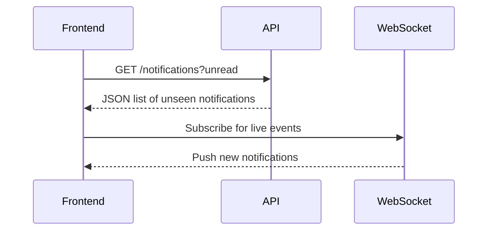
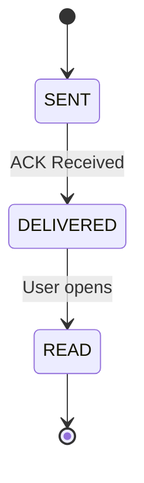

Absolutely 💪 Here's a **GitHub-ready README.md** version of your content — fully structured, professional, and developer-friendly — complete with architecture explanation, tech stack, and recommended libraries.

---

```markdown
# 🛠️ Building a Reliable Real-Time Notification System

> “Just build notifications” — sounds simple, right?  
> Until you realize you’re not just sending messages…  
> You’re building a **real-time, distributed delivery system** that must work even when the app is off.

---

## ⚡ Challenge 1: When the App is **ON** (Foreground)

When your app is open, **push notifications** alone aren’t enough.  
You need **instant, in-app updates** — without reloads.

### ✅ Solution
- Use **WebSockets** or **Server-Sent Events (SSE)** for real-time communication.
- Maintain a **notification channel per user**, e.g.:
```

ws://your-domain.com/notifications/<userId>

````
- When new notifications are created:
- Publish events to **Redis Pub/Sub** or **Kafka**.
- Your **WebSocket service** listens and pushes updates instantly to connected clients.
- The **frontend** listens to the stream and updates the local store (e.g., Redux, Zustand).

### 🧠 Tip
- Always send an **ACK (acknowledgement)** from the client to mark notifications as *delivered*.
- On disconnect, store the **last delivered notification ID**.
- On reconnection, use a **REST API fallback** to fetch missed notifications.

```mermaid
flowchart TD
A[Backend App] -->|Publish Event| B[Kafka/Redis PubSub]
B --> C[WebSocket Gateway]
C -->|Push Real-Time| D[Connected Clients]
D -->|ACK| C
````

---

## 💤 Challenge 2: When the App is **OFF** (Background or Closed)

If you only rely on WebSockets — users never see anything when the app is off.

### ✅ Solution

* Use **Push Notification Gateways**:

  * **Firebase Cloud Messaging (FCM)** for Android / Web
  * **Apple Push Notification Service (APNs)** for iOS
* When a new notification is generated:

  1. Check user’s **presence status**.
  2. If **offline →** send via **push provider (FCM/APNs)**.
  3. If **online →** send via **WebSocket** only.
  4. Store every notification in the database for later sync.

### 🧠 Tip

* FCM supports **data-only payloads**, allowing the app to sync notifications silently when reopened.
* For iOS, background refresh is **limited**, so keep payloads **small**.

```mermaid
flowchart LR
A[Server] --> B{Is user online?}
B -->|Yes| C[Send via WebSocket]
B -->|No| D[Send via Push Gateway (FCM/APNs)]
A --> E[Persist in Notifications Table]
```

---

## 🔄 Challenge 3: Synchronizing Real-Time and Stored Notifications

You may send via WebSocket instantly — but what if the user refreshes the page?
Notifications must be **persisted**, not just streamed.

### ✅ Solution

1. Every notification is first **written to the database** (or event store).
2. Frontend loads unseen notifications on mount:

   ```
   GET /api/notifications?status=unread
   ```
3. Then subscribes to WebSocket for **future ones**.

### 🧠 Tip

This hybrid model ensures:

* Notifications are never lost between reloads.
* Users always see historical + live updates.



---

## 📬 Challenge 4: Delivery Status and Retries

Push tokens expire. WebSockets disconnect.
You must **track** and **retry** deliveries.

### ✅ Solution

Track three states per notification:

| State     | Description                           |
| --------- | ------------------------------------- |
| SENT      | Message dispatched (WebSocket or FCM) |
| DELIVERED | Client acknowledged receipt           |
| READ      | User opened the notification          |

#### For WebSocket

* Server emits a message → Client sends back `ACK(notificationId)` → Mark as DELIVERED.

#### For Push Notifications

* Listen to provider callbacks:

  * FCM returns `InvalidRegistration` or `NotRegistered` → remove invalid tokens.
  * Retry with **fallback channel** (email, SMS, etc.).



---

## 🧩 Recommended Tech Stack

| Layer                    | Technology                         | Purpose                        |
| ------------------------ | ---------------------------------- | ------------------------------ |
| Database                 | **PostgreSQL**                     | Store persistent notifications |
| Broker                   | **Kafka** / **Redis Pub/Sub**      | Event streaming                |
| Real-Time Channel        | **WebSocket Gateway**              | Instant delivery               |
| Message Queue (optional) | **RabbitMQ**                       | Retry + fallback processing    |
| Push Service             | **FCM**, **APNs**                  | Offline delivery               |
| API Backend              | **Spring Boot / Node.js / NestJS** | Notification orchestration     |
| Frontend                 | **React / Vue / Angular**          | Real-time UI updates           |
| Presence Tracking        | **Redis**, **Socket.io adapter**   | Online/offline status          |

---

## 🧱 Recommended Libraries & Tools

| Area                    | Library / Tool                                   | Language           |
| ----------------------- | ------------------------------------------------ | ------------------ |
| WebSocket               | `socket.io`, `ws`, `Spring WebSocket`, `SignalR` | JS / Java / .NET   |
| SSE                     | `eventsource`, `Spring SseEmitter`               | JS / Java          |
| Message Broker          | `Kafka`, `Redis`, `RabbitMQ`                     | Multi-language     |
| Push Notifications      | `firebase-admin`, `apns2`, `OneSignal SDK`       | JS / Java / Python |
| Persistence             | `TypeORM`, `Hibernate`, `Spring Data JPA`        | JS / Java          |
| Acknowledgment Tracking | Custom DB table / Redis store                    | -                  |
| API Gateway             | `Kong`, `NGINX`, `Spring Cloud Gateway`          | -                  |
| Monitoring              | `Prometheus`, `Grafana`, `ELK Stack`             | -                  |

---

## 💡 The Takeaway

> “Just send a notification” sounds simple.
> But making it reliable is one of the **hardest distributed engineering problems** you’ll face.

Building this right means combining:

* **Event-driven architecture**
* **Real-time communication**
* **Reliable persistence**
* **Offline fallback delivery**

---

## 📖 Example Architecture (High-Level)

```mermaid
graph TD
A[Notification Producer] --> B[Kafka / Redis]
B --> C[WebSocket Service]
C --> D[Connected User (Online)]
B --> E[Push Gateway (FCM/APNs)]
E --> F[Mobile Device (Offline)]
B --> G[Notification DB]
G --> H[API for History & Sync]
```

---

## 🧠 Further Enhancements

* Add **retry queue** for failed notifications.
* Integrate **OpenTelemetry** for tracing notification latency.
* Use **Circuit Breakers (Resilience4j)** for push gateway failures.
* Apply **rate limiting** and **deduplication** for spam control.

---

### 🚀 TL;DR

Reliable notifications require:

1. Real-time delivery (WebSockets)
2. Offline fallback (Push)
3. Persistent storage
4. Acknowledgment tracking
5. Scalable event architecture

---

```

---


```
