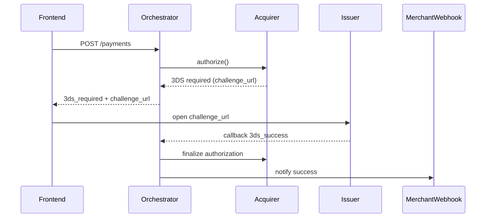

I'll help you understand payment processing system design by fetching information from the video and providing comprehensive insights about payment systems.Let me search for information about payment processing system design to provide you with comprehensive insights.Now let me search for information about specific payment providers and their architectures.Now let me search for information about Indian payment gateways and providers.Now let me search for Zoho payment system architecture.Let me search for information about money transfer mechanisms between accounts.Based on my research, I'll now provide you with a comprehensive guide on payment processing system design, including different approaches, examples, and how existing systems work.

## Payment Processing System Design: Complete Architecture Guide

### Core Components of Payment System Architecture

A payment system supports pay-in flow (receiving money from customers on behalf of sellers) and pay-out flow (sending money to sellers around the world), with reliability and fault tolerance as critical requirements. A reconciliation process between internal services and external services is required to verify that payment information across systems is consistent.

### Key System Components

1. **Payment Service**
   The payment service accepts payment events from users and coordinates the payment process. It performs risk checks, assessing for compliance with regulations such as AML/CFT and evidence of criminal activity. Only payments that pass this risk check are processed.

2. **Payment Executor**
   The payment executor executes a single payment order via a Payment Service Provider (PSP). A payment event may contain several payment orders.

3. **Payment Service Provider (PSP)**
   A PSP moves money from account A to account B. PSPs are responsible for transferring money from buyers' accounts to sellers' accounts.

4. **Ledger System**
   The double-entry principle is fundamental to any payment system and is key to accurate bookkeeping. It records every payment transaction into two separate ledger accounts with the same amount - one account is debited and the other is credited. The sum of all transaction entries must be 0.

### Different Approaches to Payment Gateway Design

#### 1. **Hosted Payment Gateways**
Customers are redirected to the Payment Service Provider page to enter their payment details. While offering simple setup, hosted payment gateways provide fewer options for customizing the checkout experience. Examples include PayPal and Amazon Pay.

#### 2. **API-Hosted Payment Gateways**
Customers enter payment details directly on the merchant's checkout page. Payments are processed using an API or HTTPS queries. This provides greater control and allows businesses to create a tailored checkout process but requires greater technical knowledge. Stripe is an example of this type.

#### 3. **Service-Oriented Architecture (SOA)**
The SOA model defines business functions as services communicating by exchanging messages. It ensures system interoperability and eliminates service dependency using Pub/Sub as a message distributor, enabling components to integrate and coordinate effectively.

### Payment Processing Flow

When a user clicks the "Buy" button, a payment event is generated and sent to the payment service. The payment service stores the event in the database and calls the payment executor for each payment order. The executor stores the order and calls an external PSP to finish the payment. After successful execution, the payment service updates the wallet to record how much money a given seller has.

### Scalability and Performance Considerations

Modern payment systems use databases that automatically handle data partitioning, load balancing, and routing. This approach reduces complexity while enhancing the application's ability to handle large volumes of transactions seamlessly, whether dealing with ten transactions a day or ten million.

High-performance payment systems require: high throughput (thousands of payments per second), extremely low latency (< 50 ms processing time), scalability for business expansion, security to protect sensitive financial information, and extensibility for future-proof architecture.

### How Existing Payment Systems Work

#### **Stripe**
Stripe supports most payment types including e-wallets, cross-border payments, cryptocurrency, and even PayPal. It supports local payment methods in 47 countries and offers both no-code and coding-required customizations. Stripe is well-known for its suite of payment security features, allowing businesses to fine-tune fraud monitoring and detection tools.

#### **PayPal**
PayPal offers both hosted checkout pages and API integration options. While it has a complicated fee schedule, it's widely recognized and trusted by consumers. PayPal charges 2.29% plus $0.09 for point-of-sale transactions.

#### **PhonePe (India)**
PhonePe PG supports over 120 payment methods including UPI, cards, and wallets. It features instant onboarding, AutoPay for recurring payments, and smart retries to reduce failed transactions. The platform helps businesses improve success rates and scale efficiently across India.

#### **Razorpay (India)**
Razorpay provides 100+ payment modes including cards, UPI, wallets, and netbanking. It offers single dashboard management for both online and in-person payments with customizable checkout options in multiple Indian languages. The platform charges 2% for domestic transactions plus 18% GST, with 3% for international payments.

#### **Zoho Payments**
Zoho Payment Processing integrates seamlessly with other Zoho applications like CRM and Books. It provides customizable payment workflows aligned with business processes and offers API access for custom applications. The system provides visibility into transactions, payouts, refunds, and payment failures through integrated dashboards.

### Payment Gateway Providers in India

The major payment gateway providers in India include:

1. **Razorpay** - Supports multiple currencies from over 100 countries with a three-day settlement period and real-time activation.

2. **Paytm** - One of India's most trusted payment gateways known for fast and secure transactions with 1.99% platform fees for standard transactions.

3. **PhonePe** - Charges 1.95% transaction fee with no setup fee, offers excellent support with personalized assistance, and provides features like dynamic QR code creation and autopay.

4. **Cashfree** - Offers fees starting at 1.50% for EMI and 1.95% for most other methods, though it comes with an annual fee.

5. **CCAvenue** - Supports multi-currency options for global customers with smart routing to increase success rates and white-label solutions for branding consistency.

6. **PayU** - Accepts over 150 payment methods with simple integration for websites and apps, customizable checkout options, and anti-fraud tools.

### How Money Transfers Between Bank Accounts

#### **ACH Transfers (Domestic US)**
ACH transfers occur between financial institutions on the ACH network, pushing or pulling money as needed. Each transaction is submitted as part of a batch, then re-bundled per receiving institution five times per business day. Processing typically takes 1-3 business days.

#### **Wire Transfers**
Wire transfers are direct transfers between financial institutions, processed through networks like SWIFT for international transfers or Fedwire for domestic US transfers. They're typically faster than ACH, often arriving within hours.

#### **SWIFT (International)**
The SWIFT payment system sends secure messages to authorize and complete international money transfers between banks. Each bank involved, including intermediary banks, processes the payment until it reaches the final recipient.

### Key Design Principles

1. **Reliability and Fault Tolerance**: Systems use infrastructure in Kubernetes ecosystem for high scalability, availability, and resiliency, with stream processing engines like Apache Flink for handling high workloads with low latency.

2. **Security**: Implementation of DevSecOps practices that automate security tools to identify vulnerabilities early in the development lifecycle.

3. **Compliance**: Payment platforms are designed to comply with standards like ISO 20022 that provide detailed transaction information and improve compliance with international anti-fraud and anti-money laundering regulations.

4. **Microservices Architecture**: Modern systems use microservices with queue-based communication for components like internal fraud scoring, external fraud scoring, storage, notifications, and payment processor integration.

This comprehensive approach to payment system design ensures secure, scalable, and reliable payment processing across different platforms and geographical regions. The choice of specific architecture depends on business requirements, transaction volumes, target markets, and regulatory compliance needs.

Nice — I pulled up the video **“System Design Global Payment Processing | Paypal”** and related writeups/transcripts and used them to build a complete, actionable, step-by-step system design for a production-grade payment processing platform (merchant + consumer flows). I’ll decode the video’s main architecture and then give you a practical design: components, data model notes, workflows (normal + failure paths), scaling & security, and a mermaid diagram you can paste into tools that render mermaid.

Sources I used while preparing this (important pieces / references): the YouTube video page summary, a blog-style summarizer of the same talk, a few complementary system-design resources about payments and payment-gateways, and official YouTube transcript instructions. ([YouTube][1])

---

# 1) High level goal — what we’re building

A **global payment processing platform** (like PayPal) that:

* Accepts payments from end users (card, wallets, UPI/ACH, etc.)
* Forwards/settles with banks/PSPs/acquirers
* Maintains merchant accounts, ledgers, and settlements
* Handles fraud detection, compliance (PCI/3DS/KYC), and retry/compensation logic
  This is what the video focuses on: reliable, secure high-throughput transaction processing that supports multi-currency and global settlement. ([YouTube][1])

---

# 2) Core components (architecture overview)

1. **Public API / API Gateway** — authentication, throttling, routing, rate limits, API keys / JWT.
2. **Ingress Load Balancers** — distribute traffic to stateless frontends.
3. **Frontend / Merchant API Service** — receives payment requests, validates payloads, returns fast ACKs for accepted work.
4. **Payment Orchestrator / Workflow Engine** — central state machine that executes steps (auth, capture, confirm, settlement) and tracks idempotency.
5. **Acquirer / PSP Connectors** — adapter layer to talk to external PSPs, card networks, banks, wallets (pluggable strategy).
6. **Transaction Ledger** — single source of truth (append-only ledger for financial accuracy). Often an event-sourced store with immutable transaction records.
7. **Settlement Service** — batching, reconciliation, sending settlement files to banks/merchant Payouts.
8. **Risk & Fraud Service** — real-time scoring and blocking, rules engine, ML model endpoints.
9. **KYC / Compliance Service** — identity checks, reporting (AML, OFAC checks).
10. **Webhook / Notifications** — for callbacks to merchants and to receive asynchronous responses from PSPs/banks.
11. **Observability & Monitoring** — metrics, tracing, audit logs, alerting.
12. **Data Warehouse / Reconciliation** — nightly reconciliation jobs, reporting.
13. **Admin / Operations UI** — manual interventions, dispute handling, refunds, chargebacks.
    (These are the same logical building blocks explained in the video and complementary posts.) ([YouTube][1])

---

# 3) End-to-end payment flow (step-by-step)

Below is a typical **card payment (auth → capture → settle)** flow with failure & async handling.

## Normal (happy) path

1. **Customer initiates payment** on merchant site → browser/mobile sends tokenized payment data to Merchant backend.
2. **Merchant calls our API Gateway** with payment request + merchant credentials. API Gateway enforces auth, rate limit.
3. **Frontend API service** validates the request, checks merchant state and returns immediate `202 Accepted` with a transaction id (so user flow stays snappy).
4. **Payment Orchestrator** picks up the job (or receives direct synchronous call) and:

   * Ensures **idempotency** (idempotency key) so retries don’t double charge.
   * Writes a **"payment_requested"** event to the ledger (append-only).
5. **Orchestrator** calls **Risk & Fraud** service with transaction data → score returned (allow/manual review/deny). If denied, record event and notify merchant.
6. If allowed → **Orchestrator** calls the selected **PSP/Acquirer Connector** (normalized adapter) to **authorize** with card network. That call may be synchronous or asynchronous (3DS redirect or 3DS server-to-server).
7. On **authorization success**, record authorization details (auth code, expiry) in ledger; optionally **capture** immediately or later (two-phase: auth then capture).
8. After capture succeeds, ledger records capture. Payment status moves to `captured`. Trigger merchant notification and create settlement entry.
9. **Settlement** service groups captured transactions into settlement batches (per acquirer/currency), generates settlement files, and initiates fund movement with banks. Ledger marks settlement status.
10. **Reconciliation**: daily/periodic jobs compare bank settlement reports vs ledger and mark any discrepancies for ops. ([YouTube][1])

## Asynchronous & 3DS / SCA flows

* If 3DS required, orchestrator returns an instructive response (redirect or client challenge) and waits for outcome webhook or callback. Continue orchestration after challenge result. Implement timeouts and fallback logic. ([YouTube][1])

## Failure / Retry / Idempotency

* Use **idempotency keys** at API layer (per merchant request).
* Orchestrator keeps state machine; on transient PSP failure, schedule retries with exponential backoff and circuit breakers. For terminal failures, emit failure events and notify merchant.
* All state transitions append events to ledger so you can reconstruct state and replay if needed. ([YouTube][2])

---

# 4) Data model (simplified)

* **Transaction** (transaction_id, merchant_id, amount, currency, status, created_at, updated_at, idempotency_key)
* **LedgerEntry** (entry_id, transaction_id, type: request|authorize|capture|refund|settle|chargeback, amount, currency, timestamp, metadata) — append-only.
* **MerchantAccount** (merchant_id, account_status, kyc_status, settlement_account, fees)
* **PaymentMethodToken** (token_id, customer_id, method_type, provider_token, expiry, last4)
* **SettlementBatch** (batch_id, acquirer_id, currency, total_amount, status, generated_at)
  Design note: Keep financial maths in integer cents/paise to avoid floating point errors.

---

# 5) Consistency, transactions & ledger design

* **Ledger = source of truth**. All money-moving actions must be recorded into the ledger before you claim they happened. Use append-only writes and idempotent inserts.
* For user-facing latency, use an asynchronous model: ack early, process in orchestrator, update client via webhooks / polling.
* For correctness: use **two-phase commits** only internally where necessary; prefer event-sourcing and compensating transactions instead of distributed DB transactions across third parties. ([newsletter.pragmaticengineer.com][3])

---

# 6) Scaling & performance

* **Make frontends stateless** (scale with LB + autoscaling).
* **Partition ledger** by merchant or by hashed transaction id to scale writes. Use partitioned databases (e.g., partitioned Postgres or distributed DB like CockroachDB / Spanner for strong consistency if you need it). Event store approach (Kafka + compacted topic + consumer groups) is common for high throughput.
* **Connector pool**: external PSPs may throttle you—use connector rate limiters and backpressure.
* **Batch settlement** reduces load on banks and reduces per-transaction cost. ([Galaxy.ai][4])

---

# 7) Security & Compliance (must-haves)

* **PCI DSS**: do not store raw card PAN unless you’re fully PCI compliant. Use tokenization / vaults or let PSP store card data (store tokens).
* **Encrypt** PII at rest; TLS in transit. HSMs / KMS for keys.
* **3DS / SCA**: integrate 3DS flows for required geographies.
* **Audit logging**: immutable audit logs for ops & regulators.
* **PCI scope reduction**: use client-side tokenization, hosted fields, or PSP SDKs to limit card data touching your servers. ([Google Help][5])

---

# 8) Risk, chargebacks, disputes

* **Real-time rules engine** + ML scoring for risk.
* **Manual review queue** for high-risk transactions.
* **Chargeback handling**: record disputes as ledger events, freeze relevant settlement amounts, store evidence, and support a human ops workflow for dispute resolution.
* **Reserve / rolling reserve** logic for merchant risk management (hold some funds temporarily). ([YouTube][1])

---

# 9) Observability, testing & reliability

* **Tracing** for the full payment flow (distributed tracing across orchestrator and connectors).
* **End-to-end tests** that hit a sandbox PSP environment; run negative tests (failed auth, declined card, network partition).
* **Chaos testing** for connector failures, delayed webhooks, and database partitions.
* **SLOs/SLA** for latency (authorizations) and availability (99.9%+ for critical path). ([YouTube][2])

---

# 10) Dev & infra considerations (concrete)

* **API Gateway**: handle TLS, WAF rules, rate limiting, and JWT verification.
* **Kubernetes** for stateless services + horizontal autoscaling. Stateful stores: managed Postgres for merchant DB, Kafka for event streams, object storage for logs/reports.
* **Secrets** in KMS, use HSM for signing settlement files.
* **CI/CD** pipelines for safe deploys; automated canary releases on orchestrator code. ([Galaxy.ai][4])

---

# 11) Example mermaid architecture (paste into any mermaid renderer)

```mermaid
flowchart LR
  subgraph Public
    Browser["Browser / Mobile"]
    MerchantBackend["Merchant Backend"]
  end

  Browser -->|tokenized payment| MerchantBackend
  MerchantBackend -->|HTTP(S)| APIGW[API Gateway]
  APIGW --> FrontendSvc[Frontend API Service]
  FrontendSvc --> Orchestrator[Payment Orchestrator / Workflow Engine]
  Orchestrator --> Ledger[(Transaction Ledger)]
  Orchestrator --> Risk[Risk & Fraud Service]
  Orchestrator -->|authorize/capture| PSP[PSP / Acquirer Connector]
  PSP -->|async webhook| Orchestrator
  Orchestrator --> Settlement[Settlement Service]
  Settlement --> Bank[Bank / Acquirer]
  Orchestrator --> Notifications["Webhook / Merchant Notifications"]
  Risk --> AdminUI["Ops/Admin UI"]
  Ledger --> Reconciliation[Reconciliation / Data Warehouse]
  Reconciliation --> AdminUI
```

---

# 12) Practical step-by-step plan you can implement (milestones)

1. **MVP (week 1–3)**

   * Public API + API key auth + basic payment request path that calls a single PSP sandbox (sync auth+capture). Implement idempotency keys. Use tokenization so you never store PAN.
2. **Core ledger & orchestration (week 3–6)**

   * Add append-only ledger and simple orchestrator state machine. Move capture/settlement logic into workflows. Add retry/backoff.
3. **Risk & 3DS (week 6–10)**

   * Integrate simple rules; plug in a 3DS flow for card auths. Implement webhook handlers.
4. **Settlements & reconciliation (week 10–14)**

   * Batch settlement generation, settlement status tracking, daily reconciliation jobs.
5. **Hardening & compliance (ongoing)**

   * PCI scope reduction, encryption, monitoring, load testing, chargeback flows, KYC flows.
6. **Scale & multi-PSP (quarter 2)**

   * Add multiple PSP connectors, routing rules (lowest fee / best success rate), per-country compliance. ([YouTube][1])

---

# 13) Quick checklist (operational)

* Idempotency keys implemented at API layer ✔
* Ledger append-only and immutable ✔
* Tokenization (no PAN storage) ✔
* 3DS support and webhook processing ✔
* Fraud rules + ML scoring pipeline ✔
* Settlement batches and reconciliation jobs ✔
* Distributed tracing + alerts (SLOs) ✔
* PCI scope minimized (use PSP hosted forms) ✔

---

# 14) If you want, I can (pick any/all and I’ll do it now)

* Produce **detailed sequence diagrams** for (a) normal card flow, (b) 3DS flow, (c) chargeback flow.
* Draft **data schema** SQL for the ledger and transaction tables.
* Generate **example API spec** (OpenAPI 3.0) for merchant integration (endpoints, auth, idempotency).
* Create **deployment architecture** (K8s manifests / Terraform skeleton for infra).

Tell me which one you want first and I’ll generate it right away — I can start with an OpenAPI spec or a detailed sequence diagram if you prefer. (No need to re-send the video link — I used it already.) ([YouTube][1])

---

If you’d like, I’ll start by generating an **OpenAPI payment endpoint** + example request/response and an **SQL ledger schema** next — say which one you want first and I’ll produce it immediately.

[1]: https://www.youtube.com/watch?v=7MXV7RfNtv0&utm_source=chatgpt.com "System Design Global Payment Processing | Paypal"
[2]: https://www.youtube.com/watch?v=shipSEFMzHs&utm_source=chatgpt.com "System Design: Payment Gateway"
[3]: https://newsletter.pragmaticengineer.com/p/designing-a-payment-system?utm_source=chatgpt.com "Designing a Payment System - by Gergely Orosz"
[4]: https://galaxy.ai/youtube-summarizer/designing-a-global-payment-processing-system-like-paypal-7MXV7RfNtv0?utm_source=chatgpt.com "Designing a Global Payment Processing System Like PayPal"
[5]: https://support.google.com/youtube/answer/15930243?hl=en&utm_source=chatgpt.com "View video transcripts - YouTube Help"

Excellent question — understanding the **3DS (Three-Domain Secure) Challenge Flow** is **essential for payment system design**, especially when you’re implementing secure card payments or integrating with acquirers like Visa, MasterCard, or Stripe.

Let’s go step-by-step — I’ll explain **what it is**, **why it’s used**, **how it works technically**, and **how it fits inside a Saga-based payment orchestration system** (like the README you just created).

---

## 🧠 What is 3DS (Three-Domain Secure)?

**3-D Secure** (often branded as **Visa Secure**, **MasterCard Identity Check**, **American Express SafeKey**, etc.) is a **security protocol** that adds an **authentication step** during **online card payments** to verify that the **buyer is the legitimate cardholder**.

### The “3 domains” in “3-D Secure”:

1. **Issuer Domain** → The bank that issued the card (e.g., HDFC, Chase).
2. **Acquirer Domain** → The merchant’s acquiring bank or payment processor (e.g., Stripe, Razorpay, PayPal).
3. **Interoperability Domain** → The card network infrastructure that connects the two (e.g., Visa, MasterCard).

Together, these three domains work to authenticate transactions and prevent fraud.

---

## 🛡️ Why 3DS exists

3DS was introduced to:

* Reduce fraud in **Card-Not-Present (CNP)** transactions (online, mobile, in-app).
* Shift **liability for fraudulent transactions** from merchants to issuing banks (after authentication).
* Comply with new regulations like **PSD2 / SCA (Strong Customer Authentication)** in Europe.

---

## ⚙️ How 3DS works — Step-by-Step Flow

Let’s walk through the **Challenge Flow** (the interactive version of 3DS):

### 1️⃣ Payment initiation

* The **customer** enters card details on the merchant website/app.
* The **merchant frontend** securely sends a payment request (with the card token) to the **payment gateway / orchestrator**.

### 2️⃣ 3DS request (from acquirer/PSP)

* The **Payment Orchestrator** or **Connector Service** sends a **`3DS Authentication Request`** to the **Directory Server (DS)** of the card network (e.g., Visa DS).
* The DS checks if the card is enrolled for 3DS and returns one of two possible responses:

  * **Frictionless Flow** → Authentication can happen silently (issuer is confident, no user action).
  * **Challenge Flow** → User must complete a verification step (OTP, biometric, app confirmation).

### 3️⃣ Challenge required → orchestrator pauses saga

* The PSP/acquirer returns something like:

  ```json
  {
    "status": "3ds_required",
    "challenge_url": "https://issuerbank.com/challenge?id=abc123",
    "transaction_id": "tx_789"
  }
  ```
* Your backend returns this response to the frontend:

  * The frontend redirects the user to the **issuer’s challenge page** (the “3DS Challenge”).

### 4️⃣ User authentication (Challenge)

* On the **issuer’s page/app**, the user authenticates — usually via:

  * One-time password (OTP) sent to their phone/email.
  * Push notification approval in their banking app.
  * Biometric authentication (fingerprint, Face ID).
* Once successful, the issuer updates the DS with the result.

### 5️⃣ Authentication result (backend callback)

* The **issuer** or **PSP** sends a **callback/webhook** to your **Payment Orchestrator**, indicating whether the 3DS challenge succeeded or failed.

  ```json
  {
    "transaction_id": "tx_789",
    "status": "3ds_success",
    "auth_code": "AUTH12345"
  }
  ```
* The Orchestrator **resumes the Saga**, proceeding to the next step (e.g., `AuthorizeWithAcquirer → Capture`).

### 6️⃣ Transaction completion

* If 3DS authentication succeeds, the orchestrator completes the **authorization and capture** flow.
* If 3DS fails or times out, compensating steps are triggered (e.g., marking payment as failed, voiding any pending holds).

---

## 🧩 How 3DS fits into a Saga-based payment system

Here’s where it sits in the Saga flow:



---

## 🪜 3DS Flow States in Saga Orchestration

| Saga Step               | Status                 | Description                           |
| ----------------------- | ---------------------- | ------------------------------------- |
| `AuthorizeWithAcquirer` | `3ds_required`         | Saga pauses, waits for user challenge |
| `Wait3DSResult`         | `pending`              | Await callback/webhook                |
| `3DSResultReceived`     | `success` or `failure` | Trigger compensation or next step     |
| `CaptureFunds`          | `captured`             | Final capture on success              |
| `NotifyMerchant`        | `done`                 | Merchant notified via webhook         |

---

## ✅ Advantages of supporting 3DS Challenge Flow

* **Enhanced security**: Validates real cardholder identity.
* **Liability shift**: Protects merchants from chargeback losses.
* **Regulatory compliance**: Meets PSD2/SCA mandates.
* **Better risk management**: Reduces fraud while maintaining flexibility via “frictionless” or “challenge” routing.

---

## ⚠️ Challenges & Design Considerations

| Issue                             | Design Recommendation                                               |
| --------------------------------- | ------------------------------------------------------------------- |
| Long-running step                 | Saga orchestration should support async continuation after callback |
| User abandonment during challenge | Implement timeout compensation (mark `failed_after_timeout`)        |
| Complex UX (redirects)            | Use PSP/3DS SDK for in-app experience instead of manual redirects   |
| 3DS data handling                 | Never log cardholder data or challenge tokens (PCI DSS rules)       |
| Idempotency                       | Handle multiple callbacks safely; update saga state once            |

---

## 🔧 Implementation Tips

* Keep saga state machine persistent with `WAIT_3DS` status.
* Use a **correlation ID** (`transaction_id` or `3ds_trans_id`) to match callbacks.
* Set a **TTL (time-to-live)** (e.g., 10 minutes) for challenge completion.
* On webhook success → resume saga.
* On timeout or failure → mark saga failed + compensate (void authorization if created).

---

### Example Frontend Handling

```js
// after /payments API returns 3ds_required
if (response.status === "3ds_required") {
  window.location.href = response.challenge_url;
}

// after challenge completion redirect back:
const txId = getQueryParam("transaction_id");
poll(`/payments/${txId}`);
```

---

### Example Backend Handling

```java
@PostMapping("/3ds/callback")
public ResponseEntity<?> handle3dsCallback(@RequestBody ThreeDSCallback payload) {
    sagaService.resumeSaga(payload.getTransactionId(), payload.getStatus());
    return ResponseEntity.ok("Received");
}
```

---
