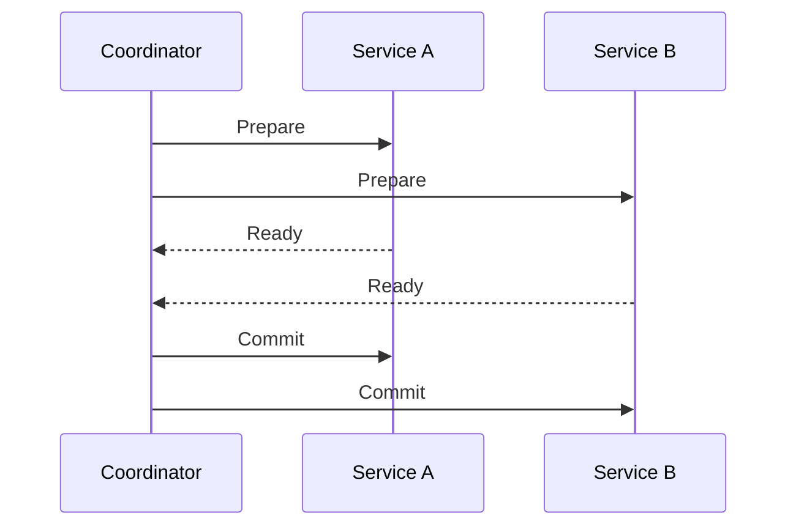
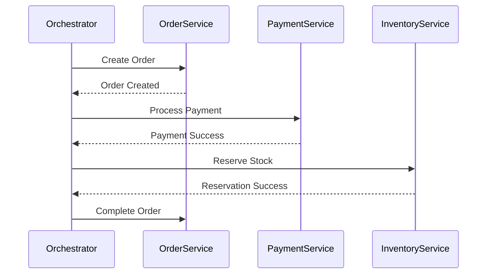
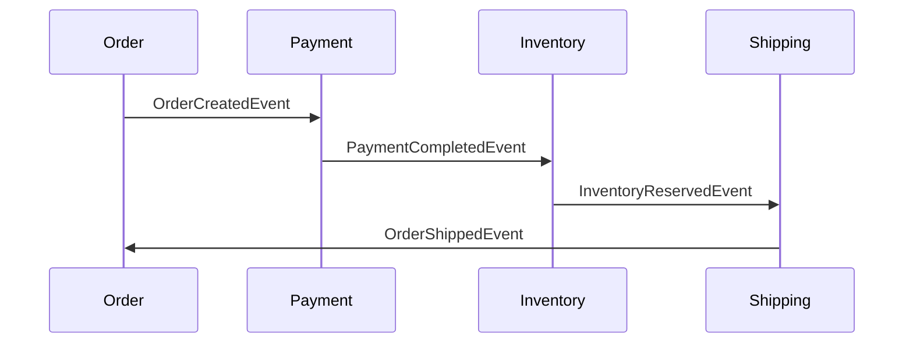
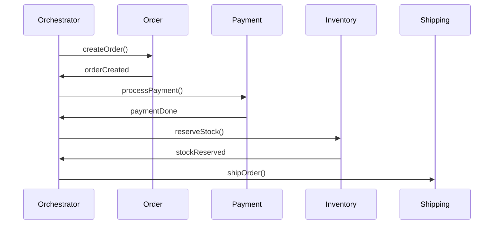

Sure — here’s a clean, detailed **GitHub-style Markdown documentation** explaining **2-Phase Commit**, **3-Phase Commit**, and their **relationship with the Saga design pattern**, along with diagrams and real-world examples.

---

# 🧩 Distributed Transactions: 2-Phase Commit, 3-Phase Commit & Saga Pattern

## 📘 Overview

In a **distributed system**, multiple services or databases must often coordinate to maintain **data consistency** across transactions.
However, ensuring **atomicity** (all-or-nothing behavior) across services is challenging due to network failures, latency, or crashes.

There are three main approaches to handle this:

1. **Two-Phase Commit (2PC)** – Strong consistency but blocking.
2. **Three-Phase Commit (3PC)** – Tries to improve fault tolerance.
3. **Saga Pattern** – Event-driven alternative for eventual consistency.

---

## ⚙️ 1. Two-Phase Commit (2PC)

**Goal:** Ensure all participants in a distributed transaction either **commit** or **rollback** together.

### 🔹 Components

* **Coordinator:** Manages the transaction.
* **Participants (Workers):** Databases or services that execute operations.

### 🔹 Phases

#### Phase 1: Prepare Phase

* Coordinator sends a **“Prepare”** request to all participants.
* Each participant executes the transaction locally but does **not commit** yet.
* Each participant replies:

  * ✅ “Yes” (ready to commit)
  * ❌ “No” (cannot commit)

#### Phase 2: Commit Phase

* If all respond “Yes” → Coordinator sends **“Commit”**.
* If any respond “No” → Coordinator sends **“Rollback”**.

### 🧠 Example

```
User places an order:
 → Service A (Order)
 → Service B (Payment)
 → Service C (Inventory)
```

| Phase   | Action                                       |
| ------- | -------------------------------------------- |
| Prepare | Coordinator asks A, B, C if ready to commit. |
| Commit  | If all ready, send COMMIT. Else ROLLBACK.    |

### 🧨 Problem

* **Blocking:** If coordinator crashes after prepare but before commit, participants stay locked.
* **Not fault-tolerant:** Relies on coordinator availability.

---

## ⚙️ 2. Three-Phase Commit (3PC)

**Goal:** Reduce blocking and improve fault tolerance of 2PC.

### 🔹 Phases

#### 1. CanCommit Phase

Coordinator asks participants if they can commit.

* Participants reply “Yes” or “No”.

#### 2. PreCommit Phase

If all say “Yes”:

* Coordinator sends “PreCommit” (temporary commit).
* Participants log the transaction and acknowledge.

#### 3. DoCommit Phase

After receiving all “ACKs”:

* Coordinator sends “DoCommit”.
* Participants finalize the commit.

### 🧩 Key Difference from 2PC

* Adds a **timeout mechanism** and intermediate **PreCommit** phase.
* If coordinator fails, participants can decide based on logs → **non-blocking**.

### ⚠️ Limitations

* Still complex to implement.
* Network partitions can cause inconsistency.
* Rarely used in modern microservices — replaced by **Sagas**.

---

## 🧠 3. Saga Pattern

**Goal:** Manage distributed transactions **without locks** using **event-based compensation**.

### 🔹 Concept

A **Saga** is a sequence of **local transactions**.
Each local transaction updates its own database and publishes an **event** to trigger the next step.

If one step fails → run **compensating transactions** to undo previous steps.

### 🔹 Two Saga Coordination Types

| Type                               | Description                                                        |
| ---------------------------------- | ------------------------------------------------------------------ |
| **Choreography (Event-driven)**    | Each service listens and reacts to events. No central coordinator. |
| **Orchestration (Command-driven)** | Central **Saga Orchestrator** directs transaction flow.            |

### 🔹 Example: E-commerce Order

1. **Order Service** → Create order → emits `OrderCreated`
2. **Payment Service** → Processes payment → emits `PaymentSuccessful`
3. **Inventory Service** → Reserves items → emits `InventoryReserved`
4. **Shipping Service** → Ships order → emits `OrderShipped`

If **Payment fails** → Compensation steps:

* Cancel order
* Release inventory

---

## 🔗 Relationship Between 2PC/3PC and Saga

| Feature              | 2PC / 3PC                          | Saga Pattern                     |
| -------------------- | ---------------------------------- | -------------------------------- |
| **Consistency Type** | Strong (Atomic)                    | Eventual                         |
| **Performance**      | Slow (locking)                     | Fast (non-blocking)              |
| **Failure Handling** | Blocking / Coordinator crash       | Compensating transactions        |
| **Use Case**         | Banking systems, strict atomic ops | Microservices, high availability |
| **Implementation**   | Transaction Manager                | Event Bus / Orchestrator         |

---

## 🏗️ Example Architecture Diagram (Mermaid)



---

### 🧭 Saga Orchestration Example



---

## 💡 Real-World Usage

| Company     | Approach             | Use Case                    |
| ----------- | -------------------- | --------------------------- |
| **Amazon**  | Saga (Choreography)  | Order fulfillment & refunds |
| **Netflix** | Saga (Orchestration) | Billing and subscription    |
| **Banks**   | 2PC / 3PC            | Transaction integrity       |

---

## 🧾 Summary

| Concept  | Description                                                    |
| -------- | -------------------------------------------------------------- |
| **2PC**  | Ensures atomic commits across systems but can block.           |
| **3PC**  | Improves fault tolerance with extra pre-commit phase.          |
| **Saga** | Breaks large transactions into local steps with compensations. |

---

## 🧰 When to Use What

| Scenario                              | Recommended Pattern    |
| ------------------------------------- | ---------------------- |
| Cross-database transaction (monolith) | **2PC**                |
| Critical financial consistency        | **3PC**                |
| Microservice-based systems            | **Saga Pattern**       |
| Event-driven architecture             | **Choreographed Saga** |
| Centralized flow control              | **Orchestrated Saga**  |

---

## 🧱 Code Snippet Example (Saga - Orchestrator Pattern)

```java
public class OrderSagaOrchestrator {

    public void startSaga(Order order) {
        try {
            paymentService.process(order);
            inventoryService.reserve(order);
            shippingService.ship(order);
            orderService.complete(order);
        } catch (Exception e) {
            // Compensation logic
            shippingService.cancel(order);
            inventoryService.release(order);
            paymentService.refund(order);
            orderService.cancel(order);
        }
    }
}
```

---

## 📚 References

* [Distributed Transactions - Martin Fowler](https://martinfowler.com/articles/patterns-of-distributed-systems/saga.html)
* [Sagas: Coordinating Microservices Transactions](https://microservices.io/patterns/data/saga.html)
* [PostgreSQL XA Transactions (2PC)](https://www.postgresql.org/docs/current/sql-prepare-transaction.html)

---

Excellent — this is a **core distributed systems design topic**, especially in **Spring Boot microservices** when you want **data consistency across services without 2PC (Two-Phase Commit)**. Let’s go step-by-step so you understand both **how to implement the Saga pattern** and the **difference between choreography and orchestration**, with clear examples and implementation guidance.

---

## 🧩 What is Saga Pattern?

In distributed microservices, a **Saga** is a **sequence of local transactions** that are coordinated to maintain **eventual consistency**.
Each local transaction updates its own database and **publishes an event** to trigger the next transaction.

If a step fails, **compensating transactions** undo the previous successful steps.

---

## 🧠 Why Saga?

| Challenge                                    | Why Saga Helps                                  |
| -------------------------------------------- | ----------------------------------------------- |
| Distributed transactions across multiple DBs | Avoids 2PC, uses local DB transactions          |
| Eventual consistency instead of ACID         | Uses domain events to coordinate steps          |
| Fault tolerance                              | Compensating actions handle failures gracefully |
| Decoupling services                          | Each microservice owns its data and logic       |

---

## 🔧 Typical Example: Order Processing System

**Services involved:**

1. **Order Service** — create an order
2. **Payment Service** — deduct payment
3. **Inventory Service** — reserve or release items
4. **Shipping Service** — ship products

Each service has its **own DB** and **Spring Boot microservice**.

---

## ⚙️ Steps to Design Saga in Spring Boot

1. **Define microservices boundaries**
   Each service manages its own local data and logic.

2. **Enable event-based communication**
   Use **Kafka, RabbitMQ**, or **Spring Cloud Stream** for events.

3. **Design domain events**
   E.g., `OrderCreatedEvent`, `PaymentCompletedEvent`, `InventoryReservedEvent`.

4. **Create compensating transactions**

   * If payment fails → cancel order
   * If inventory reservation fails → refund payment

5. **Implement one of the Saga coordination patterns:**

   * **Choreography (Event-based)**
   * **Orchestration (Central controller)**

---

# ⚙️ 1. Saga — **Choreography Pattern** (Event-driven)

### 🏗️ Architecture

Each microservice **listens for events** and **emits new events** after performing local transactions.
There is **no central coordinator**.



---

### 🧩 Implementation Steps in Spring Boot

**1. Use Event Broker**
→ Kafka / RabbitMQ / Spring Cloud Stream

**2. Define Events**

```java
public class OrderCreatedEvent {
    private String orderId;
    private Double amount;
    // getters/setters
}
```

**3. Publish Events**

```java
@Service
public class OrderService {
    @Autowired
    private KafkaTemplate<String, OrderCreatedEvent> kafkaTemplate;

    public void createOrder(Order order) {
        orderRepository.save(order);
        kafkaTemplate.send("order-events", new OrderCreatedEvent(order.getId(), order.getAmount()));
    }
}
```

**4. Consume Events**

```java
@Service
public class PaymentService {
    @KafkaListener(topics = "order-events")
    public void handleOrderCreated(OrderCreatedEvent event) {
        if (processPayment(event)) {
            kafkaTemplate.send("payment-events", new PaymentCompletedEvent(event.getOrderId()));
        } else {
            kafkaTemplate.send("payment-events", new PaymentFailedEvent(event.getOrderId()));
        }
    }
}
```

**5. Compensating Transaction**

```java
@KafkaListener(topics = "payment-events")
public void handlePaymentFailed(PaymentFailedEvent event) {
    orderService.cancelOrder(event.getOrderId());
}
```

---

### ✅ Advantages

* Fully **decentralized**
* Easy to **add new services**
* Works well with **event-driven systems**

### ⚠️ Disadvantages

* **Complex event chains**
* Harder to **debug and monitor**
* Risk of **cyclic dependencies**

---

# ⚙️ 2. Saga — **Orchestration Pattern** (Centralized Controller)

### 🏗️ Architecture

A **central orchestrator service** coordinates the Saga — it **calls each microservice** in sequence and decides compensations.



---

### 🧩 Implementation Steps in Spring Boot

**1. Create a Saga Orchestrator Service**

```java
@Service
public class OrderSagaOrchestrator {

    @Autowired private OrderClient orderClient;
    @Autowired private PaymentClient paymentClient;
    @Autowired private InventoryClient inventoryClient;

    public void executeSaga(String orderId) {
        try {
            orderClient.createOrder(orderId);
            paymentClient.processPayment(orderId);
            inventoryClient.reserveItem(orderId);
            // success
        } catch (Exception e) {
            // Compensating actions
            paymentClient.refundPayment(orderId);
            orderClient.cancelOrder(orderId);
        }
    }
}
```

**2. Use Feign Clients for Communication**

```java
@FeignClient(name = "payment-service")
public interface PaymentClient {
    @PostMapping("/payments")
    void processPayment(@RequestParam String orderId);

    @PostMapping("/payments/refund")
    void refundPayment(@RequestParam String orderId);
}
```

**3. Define Compensating APIs**
Each service must provide rollback APIs (e.g., `cancelOrder`, `refundPayment`).

---

### ✅ Advantages

* Easier to **trace and debug**
* Centralized **business logic**
* Fine-grained **control flow**

### ⚠️ Disadvantages

* **Single point of failure**
* **Tight coupling** to orchestrator logic
* Harder to scale horizontally

---

## 🔍 When to Use Which?

| Scenario                   | Use **Choreography** | Use **Orchestration** |
| -------------------------- | -------------------- | --------------------- |
| Event-driven microservices | ✅                    |                       |
| Few services involved      | ✅                    |                       |
| Many dependent steps       |                      | ✅                     |
| Need fine-grained control  |                      | ✅                     |
| Want high scalability      | ✅                    |                       |
| Easier debugging needed    |                      | ✅                     |

---

## 🧰 Tech Stack Recommendations for Spring Boot Sagas

| Component               | Tools                                       |
| ----------------------- | ------------------------------------------- |
| Messaging               | Kafka, RabbitMQ, AWS SNS/SQS                |
| Orchestration Framework | Axon Framework, Temporal.io, Camunda, Zeebe |
| Tracing & Observability | OpenTelemetry, Jaeger                       |
| State Management        | Redis or Database per service               |
| API Communication       | Feign Clients, WebClient                    |

---

## 🧠 Pro Tip (For Real-World Implementation)

* Use **outbox pattern** to publish events reliably from the same DB transaction.
* Use **idempotency tokens** to handle duplicate event processing.
* Enable **retries with exponential backoff** in orchestrators.
* Implement **distributed tracing** to see full Saga execution.
* Use **DLQ (Dead Letter Queue)** for failed events in choreography.

---

## 📄 Example Folder Structure (Spring Boot)

```
order-service/
 ├─ src/main/java/com/example/order
 │   ├─ controller/
 │   ├─ service/
 │   ├─ events/
 │   ├─ kafka/
 │   └─ compensations/
payment-service/
inventory-service/
saga-orchestrator/
 ├─ src/main/java/com/example/saga/
 │   ├─ orchestrator/
 │   ├─ feign/
 │   └─ config/
```

---

Would you like me to generate a **GitHub README.md version** of this (with diagrams and markdown formatting for your repo)?
I can include:

* ✅ Mermaid diagrams
* ✅ Code samples
* ✅ Comparison tables
* ✅ Setup steps for Spring Boot + Kafka orchestration

It’ll be a perfect ready-to-share documentation.
