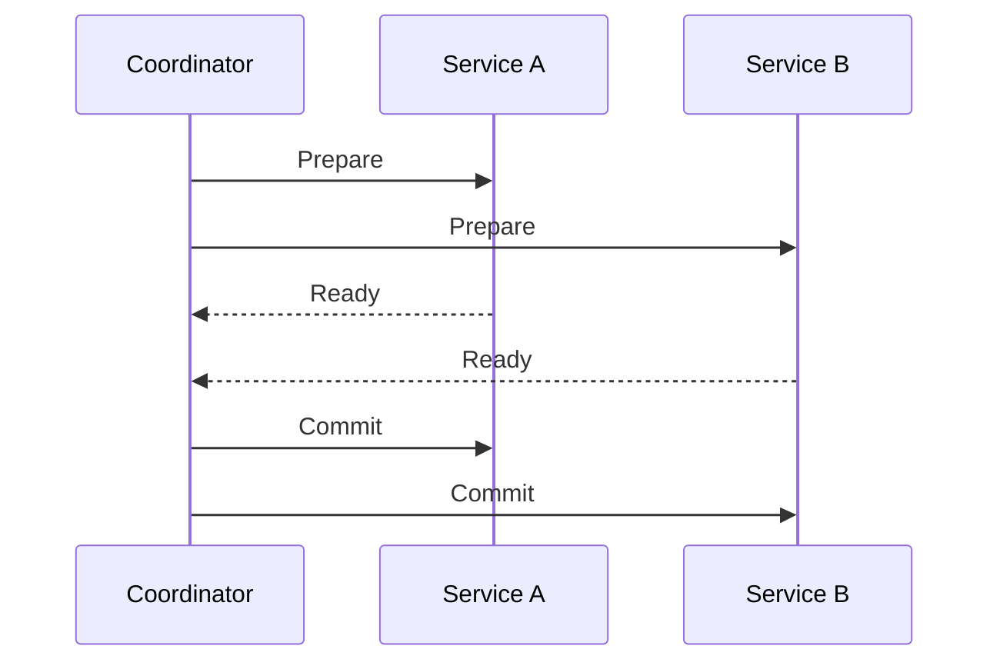
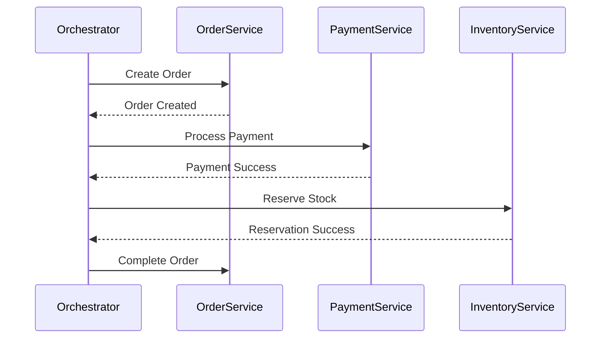

Sure — here’s a clean, detailed **GitHub-style Markdown documentation** explaining **2-Phase Commit**, **3-Phase Commit**, and their **relationship with the Saga design pattern**, along with diagrams and real-world examples.

---

# 🧩 Distributed Transactions: 2-Phase Commit, 3-Phase Commit & Saga Pattern

## 📘 Overview

In a **distributed system**, multiple services or databases must often coordinate to maintain **data consistency** across transactions.
However, ensuring **atomicity** (all-or-nothing behavior) across services is challenging due to network failures, latency, or crashes.

There are three main approaches to handle this:

1. **Two-Phase Commit (2PC)** – Strong consistency but blocking.
2. **Three-Phase Commit (3PC)** – Tries to improve fault tolerance.
3. **Saga Pattern** – Event-driven alternative for eventual consistency.

---

## ⚙️ 1. Two-Phase Commit (2PC)

**Goal:** Ensure all participants in a distributed transaction either **commit** or **rollback** together.

### 🔹 Components

* **Coordinator:** Manages the transaction.
* **Participants (Workers):** Databases or services that execute operations.

### 🔹 Phases

#### Phase 1: Prepare Phase

* Coordinator sends a **“Prepare”** request to all participants.
* Each participant executes the transaction locally but does **not commit** yet.
* Each participant replies:

  * ✅ “Yes” (ready to commit)
  * ❌ “No” (cannot commit)

#### Phase 2: Commit Phase

* If all respond “Yes” → Coordinator sends **“Commit”**.
* If any respond “No” → Coordinator sends **“Rollback”**.

### 🧠 Example

```
User places an order:
 → Service A (Order)
 → Service B (Payment)
 → Service C (Inventory)
```

| Phase   | Action                                       |
| ------- | -------------------------------------------- |
| Prepare | Coordinator asks A, B, C if ready to commit. |
| Commit  | If all ready, send COMMIT. Else ROLLBACK.    |

### 🧨 Problem

* **Blocking:** If coordinator crashes after prepare but before commit, participants stay locked.
* **Not fault-tolerant:** Relies on coordinator availability.

---

## ⚙️ 2. Three-Phase Commit (3PC)

**Goal:** Reduce blocking and improve fault tolerance of 2PC.

### 🔹 Phases

#### 1. CanCommit Phase

Coordinator asks participants if they can commit.

* Participants reply “Yes” or “No”.

#### 2. PreCommit Phase

If all say “Yes”:

* Coordinator sends “PreCommit” (temporary commit).
* Participants log the transaction and acknowledge.

#### 3. DoCommit Phase

After receiving all “ACKs”:

* Coordinator sends “DoCommit”.
* Participants finalize the commit.

### 🧩 Key Difference from 2PC

* Adds a **timeout mechanism** and intermediate **PreCommit** phase.
* If coordinator fails, participants can decide based on logs → **non-blocking**.

### ⚠️ Limitations

* Still complex to implement.
* Network partitions can cause inconsistency.
* Rarely used in modern microservices — replaced by **Sagas**.

---

## 🧠 3. Saga Pattern

**Goal:** Manage distributed transactions **without locks** using **event-based compensation**.

### 🔹 Concept

A **Saga** is a sequence of **local transactions**.
Each local transaction updates its own database and publishes an **event** to trigger the next step.

If one step fails → run **compensating transactions** to undo previous steps.

### 🔹 Two Saga Coordination Types

| Type                               | Description                                                        |
| ---------------------------------- | ------------------------------------------------------------------ |
| **Choreography (Event-driven)**    | Each service listens and reacts to events. No central coordinator. |
| **Orchestration (Command-driven)** | Central **Saga Orchestrator** directs transaction flow.            |

### 🔹 Example: E-commerce Order

1. **Order Service** → Create order → emits `OrderCreated`
2. **Payment Service** → Processes payment → emits `PaymentSuccessful`
3. **Inventory Service** → Reserves items → emits `InventoryReserved`
4. **Shipping Service** → Ships order → emits `OrderShipped`

If **Payment fails** → Compensation steps:

* Cancel order
* Release inventory

---

## 🔗 Relationship Between 2PC/3PC and Saga

| Feature              | 2PC / 3PC                          | Saga Pattern                     |
| -------------------- | ---------------------------------- | -------------------------------- |
| **Consistency Type** | Strong (Atomic)                    | Eventual                         |
| **Performance**      | Slow (locking)                     | Fast (non-blocking)              |
| **Failure Handling** | Blocking / Coordinator crash       | Compensating transactions        |
| **Use Case**         | Banking systems, strict atomic ops | Microservices, high availability |
| **Implementation**   | Transaction Manager                | Event Bus / Orchestrator         |

---

## 🏗️ Example Architecture Diagram (Mermaid)



---

### 🧭 Saga Orchestration Example



---

## 💡 Real-World Usage

| Company     | Approach             | Use Case                    |
| ----------- | -------------------- | --------------------------- |
| **Amazon**  | Saga (Choreography)  | Order fulfillment & refunds |
| **Netflix** | Saga (Orchestration) | Billing and subscription    |
| **Banks**   | 2PC / 3PC            | Transaction integrity       |

---

## 🧾 Summary

| Concept  | Description                                                    |
| -------- | -------------------------------------------------------------- |
| **2PC**  | Ensures atomic commits across systems but can block.           |
| **3PC**  | Improves fault tolerance with extra pre-commit phase.          |
| **Saga** | Breaks large transactions into local steps with compensations. |

---

## 🧰 When to Use What

| Scenario                              | Recommended Pattern    |
| ------------------------------------- | ---------------------- |
| Cross-database transaction (monolith) | **2PC**                |
| Critical financial consistency        | **3PC**                |
| Microservice-based systems            | **Saga Pattern**       |
| Event-driven architecture             | **Choreographed Saga** |
| Centralized flow control              | **Orchestrated Saga**  |

---

## 🧱 Code Snippet Example (Saga - Orchestrator Pattern)

```java
public class OrderSagaOrchestrator {

    public void startSaga(Order order) {
        try {
            paymentService.process(order);
            inventoryService.reserve(order);
            shippingService.ship(order);
            orderService.complete(order);
        } catch (Exception e) {
            // Compensation logic
            shippingService.cancel(order);
            inventoryService.release(order);
            paymentService.refund(order);
            orderService.cancel(order);
        }
    }
}
```

---

## 📚 References

* [Distributed Transactions - Martin Fowler](https://martinfowler.com/articles/patterns-of-distributed-systems/saga.html)
* [Sagas: Coordinating Microservices Transactions](https://microservices.io/patterns/data/saga.html)
* [PostgreSQL XA Transactions (2PC)](https://www.postgresql.org/docs/current/sql-prepare-transaction.html)

---

Would you like me to include a **diagram showing how 2PC, 3PC, and Saga differ visually** (side-by-side flow comparison) in this same GitHub markdown?
It’ll make the explanation more presentation-ready.
