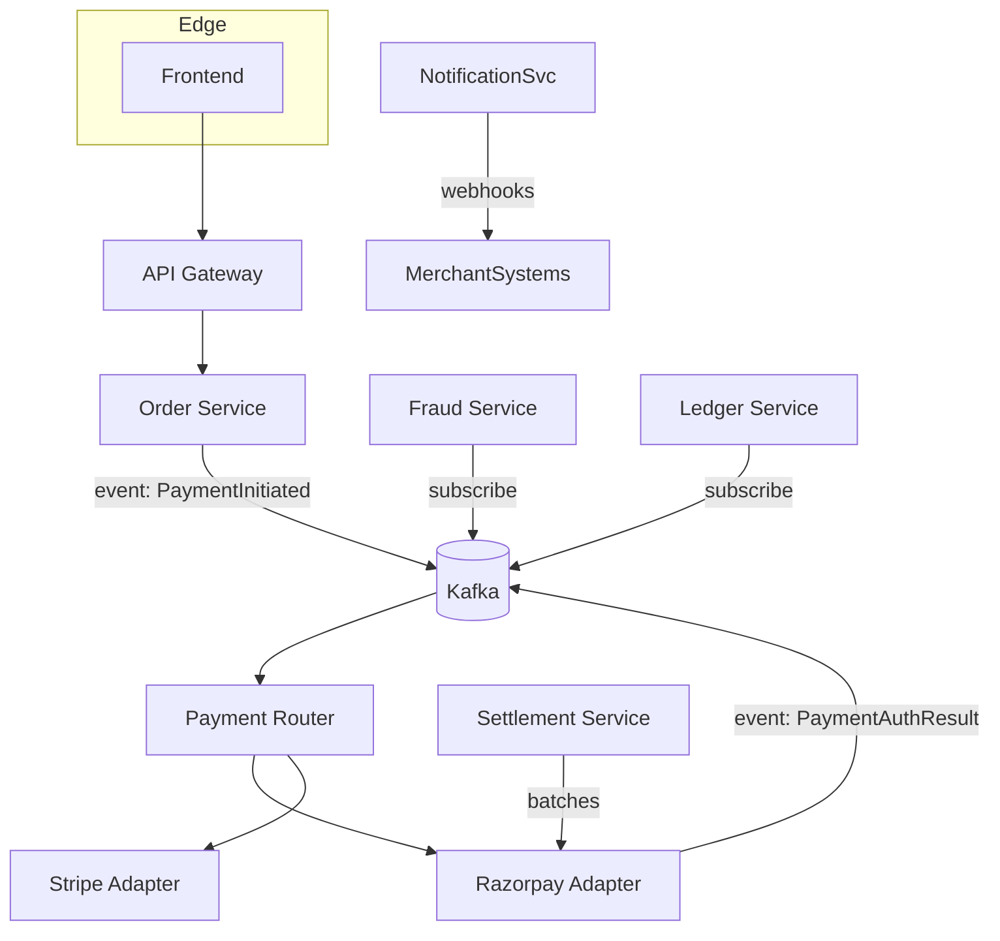

Great — below is a complete, production-ready **Payment Processing System Design** document in **GitHub-flavored Markdown**, with recommended tools, design patterns, real-world approaches for **card / UPI / cash**, plus **Mermaid** diagrams and practical notes (security, compliance, scaling). I’ve cited authoritative sources for the most important claims and flows.

> 📌 **Notes:**
>
> * I cite authoritative docs (Razorpay, NPCI/UPI, Visa, Stripe, PCI DSS, AWS blog) for the most load-bearing facts. ([Razorpay][1])
> * Diagrams are Mermaid — paste into GitHub README or mermaid.live to render.
> * This is a long doc; use it as a template you can adapt to your product and regional rules.

---

# Payment Processing System — Full Documentation

## Table of contents

1. Overview & goals
2. High-level flows (Card, UPI, Cash)
3. Recommended architecture (microservices, event-driven)
4. Key components & responsibilities
5. Tools, libraries & frameworks (by layer)
6. Design patterns & resilience strategies
7. Security & compliance (PCI DSS, tokenization, HSM)
8. Reconciliation, settlement & bookkeeping
9. Real-world approaches & examples (Amazon Pay UPI, PhonePe, Razorpay, Visa)
10. Mermaid diagrams (high-level flow + microservice orchestration)
11. Example API contracts & idempotency model
12. Operational concerns & runbook checklist

---

## 1. Overview & goals

A payment system must securely accept payments, execute authorization and capture, manage settlement and reconciliation, provide refunds/chargebacks, ensure compliance (PCI DSS), and scale with low latency and high reliability.

Primary non-functional goals:

* **Security & compliance** (data protection, PCI)
* **Reliability & availability** (99.99%+ for gateway)
* **Scalability** (handle peak spikes, e.g., sales events)
* **Extensibility** (add new payment methods/countries)
* **Observability** (traces, metrics, logs) — critical for disputes and fraud analysis.

---

## 2. High-level flows

### 2.1 Card (credit/debit) — online (Card-Not-Present)

1. Customer enters card in checkout (or uses saved token).
2. Frontend calls merchant backend → creates an **order** and **payment intent**.
3. Merchant calls Payment Service Provider (PSP) / Acquirer (e.g., Stripe, Razorpay). PSP routes to card networks (Visa/Mastercard). Authorization request travels: Merchant → Acquirer → Card Network → Issuing Bank → Response. ([Visa Developer][2])
4. If authorized → capture later (immediate or delayed capture).
5. Settlement: acquirer batches captures to card networks and funds move in clearing/settlement.
6. Reconciliation and accounting on merchant ledger.

### 2.2 UPI (India) — instant bank-to-bank

1. Customer selects UPI ID/QR in checkout.
2. Merchant triggers UPI collect or deep-link to UPI app; user approves & enters UPI PIN.
3. NPCI (UPI rails) routes request to bank PSP, and funds move instantly via IMPS rails. UPI is real-time. ([NPCI][3])

### 2.3 Cash / Cash-on-Delivery (COD)

* Merchant records order as COD. Courier collects cash at delivery.
* Post-delivery, courier provider reports cash collection; merchant reconciles with courier’s settlement file and updates ledger. COD requires stronger **reconciliation** and **fraud controls** (e.g., verification on delivery).

---

## 3. Recommended architecture (summary)

* **API Gateway / Edge** (TLS termination, rate limiting, WAF).
* **Auth/Customer Service** (accounts, KYC references).
* **Ordering Service** (orders & payment intents).
* **Payment Orchestrator / Router** (routes a payment attempt to specific PSPs or bank adapters).
* **Acquirer Adapter(s) / PSP Integrations** (Razorpay, Stripe, Bank APIs, Visa Token Service).
* **Ledger / Payments DB** (immutable event log + balance model).
* **Settlement & Reconciliation Service** (batches, bank statements ingestion).
* **Fraud & Risk Service** (scoring, rules engine).
* **Notifications / Webhooks** (to merchant systems and clients).
* **Background processing**: message bus (Kafka/RabbitMQ) + worker pools for retries, settlement processing.
* **Observability**: distributed tracing, APM, metrics, alerting.

Use **event-driven microservices** for loose coupling and scale; orchestration can be a mix of orchestration (sagas) and choreography (events). Recent best practice is to use event-driven orchestration for payment steps to allow parallel processing (fraud, webhook, ledger). ([Amazon Web Services, Inc.][4])

---

## 4. Key components & responsibilities

### API Gateway / Edge

* TLS, WAF, IP allowlists, rate limiting, auth tokens.

### Checkout (Client)

* PCI: never send raw PAN to your backend unless certified. Use client-side SDKs (PSP checkout) or tokenization.
* Provide fallback for 3DS flows and UPI deep-links.

### Payment Orchestrator

* Builds canonical payment model (orderId, amount, currency, method, metadata).
* Selects PSP/acquirer based on routing rules (region, cost, success rates, payment method).
* Emits events: `PaymentInitiated` → `PaymentAuthorized` → `PaymentCaptured` → `PaymentSettled`/`Failed`.

### PSP / Bank Adapters

* Implement retry, idempotency keys, and mapping of PSP-specific statuses to canonical statuses.

### Ledger / Accounting

* Two-layer model: **Transaction events** (immutable append-only) + **aggregated balances** (materialized views).
* Always reconcile ledger state with settlement statements from PSPs/banks.

### Fraud & Risk

* Real-time scoring (ML + rules); block/screen suspicious flows.
* Use statistical models and device-fingerprinting; integrate 3rd-party fraud services if needed.

### Settlement & Reconciliation

* Periodic ingestion of PSP/Bank statement files (CSV/MT940/ISO20022).
* Match captures to settlements; mark differences for manual investigation.

---

## 5. Tools, libraries & frameworks

### Infrastructure & Platforms

* **Cloud**: AWS / GCP / Azure (pick one). For event-driven: Amazon MSK or Kafka, SQS/SNS for fan-out. (See AWS patterns for payment orchestration.) ([Amazon Web Services, Inc.][4])
* **Message Bus**: Kafka (high throughput), RabbitMQ (simplicity)
* **DBs**: PostgreSQL (ACID transactional ledger), CockroachDB or Spanner for global scale; Redis for caches and locks.
* **Object storage**: S3-compatible for statements/backups.

### Backend languages / frameworks

* **Java + Spring Boot** (mature ecosystem, strong in banking),
* **Go** (low-latency microservices),
* **Node.js / TypeScript** (fast integrations and web SDK),
* **Python** for ML/risk services.

### Payment Providers & SDKs

* **Stripe** (global API-first PSP) — official SDKs for many languages. ([Stripe][5])
* **Razorpay** (India-first PSP) — docs & SDKs for UPI/cards/EMI. ([Razorpay][1])
* **Bank SDKs / Visa APIs** for card-network flows. ([Visa Developer][2])

### Tokenization / Security

* **PCI-compliant token vault** (use PSP tokenization or your own HSM).
* **HSMs / Cloud KMS** for key management.
* **TLS + mTLS** for inter-service comms.

### Observability & Ops

* **APM**: Datadog/NewRelic/Zipkin/Jaeger
* **Logging**: ELK / Loki
* **Monitoring**: Prometheus + Grafana
* **SRE tooling**: chaos testing, runbooks, SLO/SLA dashboards.

### Fraud & AML tools

* **3rd-party**: Sift, Riskified, Forter (fraud scoring)
* **KYC / AML**: Jumio, Onfido (if needed).

### DevOps / CI-CD

* GitHub Actions / GitLab CI / Jenkins; Terraform for infra-as-code (IaC).

---

## 6. Design patterns & resilience strategies

### Patterns

* **Event Sourcing + Command Query Responsibility Segregation (CQRS)** for ledger and auditability.
* **Saga pattern** (orchestration) for multi-step flows (authorization → capture → settlement → reconciliation).
* **Circuit Breaker** and **Bulkhead** patterns around PSP integrations.
* **Idempotency keys** for all payment API calls to avoid duplicate charges.
* **Retry with exponential backoff** + **dead-letter queue (DLQ)** for failing external calls.

### Resilience Practices

* **Timeouts & graceful degradation** — don’t block checkout on non-critical checks.
* **Fallback PSPs / multi-acquirer routing** — route to alternate PSP on failure or to optimize cost.
* **Observability**: trace payments across services (trace-id across HTTP and messages).

---

## 7. Security & compliance

### PCI DSS

* If you process card data, follow **PCI DSS** controls (12 requirements). Prefer using PSP tokenization or client-side hosted fields to minimize PCI scope. ([PCI Security Standards Council][6])

### Tokenization

* Replace PANs with tokens (PSP tokenization or vault). Never store raw PAN/CVV unless fully PCI-certified.

### Encryption and Key Management

* Use **HSM** or Cloud KMS for keys; TLS 1.2+ for transit. Rotate keys periodically.

### 3DS & SCA

* Support 3-D Secure flows where required (EU SCA, some card issuers). Implement redirect/ACS flows and fallback.

### Data retention & privacy

* Retain minimal PII; follow GDPR/local privacy laws; keep audit logs for dispute resolution.

---

## 8. Reconciliation, settlement & bookkeeping

* **Daily / hourly settlements**: PSP provides settlement reports; match captures to settlement lines.
* Use a **reconciliation engine** to auto-match by payment ID, amount, and timestamp; flag mismatches.
* Maintain a **chargeback/ disputes** workflow: store evidence (receipts, shipment tracking) and provide to acquirer.

---

## 9. Real-world approaches & examples

### Razorpay (India) — aggregator/PSP

* Provides order creation, checkout UI, UPI, card, and bank integrations. Merchants call Razorpay Orders API and use Razorpay Checkout; Razorpay handles routing to banks/acquirers. ([Razorpay][1])

### UPI & PhonePe / Google Pay / Amazon Pay (India)

* UPI is the central rails run by NPCI. Big UPI apps (PhonePe, Google Pay, Amazon Pay) are PSPs or PSP integrators that interact with banks/NPCI and offer rich UX, deep-links/UPI collect flows and QR flows. UPI transactions are instant and routed by NPCI to participant banks. ([NPCI][3])

### Visa / Card Networks

* Visa/Mastercard act as network switches for authorization and settlement. Merchants typically integrate via an acquirer or PSP which abstracts network details. Tokenization (Visa Token Service) reduces PAN exposure. ([Visa Developer][2])

### Amazon Pay UPI

* Amazon integrates UPI into its checkout flow; for UPI it uses the user’s registered bank/UPI ID and a UPI flow for PIN entry and approval. ([Amazon India][7])

---

## 10. Mermaid diagrams

### 10.1 High-level payment flow (card)


### 10.2 Microservices event-driven orchestration (simplified)



---

## 11. Example API contracts & idempotency

### Create Payment Intent (POST)

Request:

```json
POST /v1/payments
{
  "client_id":"abc-123",
  "order_id":"order-987",
  "amount": 49900,
  "currency":"INR",
  "method":"card",   // card | upi | netbanking | cod
  "metadata": {"customer_id":"cust-1"}
}
```

Headers:

```
Idempotency-Key: <uuid-v4>
Authorization: Bearer <jwt>
```

Response:

```json
{
  "payment_id":"pay_01F...",
  "status":"PENDING",
  "redirect_url": "https://.../3ds"  // if 3DS
}
```

**Idempotency**: use `Idempotency-Key` in requests to external PSPs and merchant API to ensure retries are safe. Store the key + response for TTL (e.g., 24–48 hours).

---

## 12. Operational concerns & runbook checklist

* SLA & SLO definitions (latency, success rate) and alert thresholds.
* Runbook for: PSP outage, double-charges, chargeback handling, settlement mismatch.
* Regular PCI scans and penetration testing.
* Daily reconciliation jobs and manual investigation queue.
* Disaster Recovery: multi-region active-passive or active-active with state replication.

---

## Appendix — Quick decision checklist for choosing approach

* Want lowest PCI scope? → Use PSP-hosted checkout + tokenization.
* Need UPI in India? → Integrate a PSP (Razorpay, PayU) or bank PSP; support deep-links & QR. ([Razorpay][1])
* Need global cards & multi-currency? → Use Stripe or multi-acquirer routing. ([Stripe][5])
* High-throughput, low-latency? → Event-driven architecture with Kafka + stateless workers. ([Amazon Web Services, Inc.][4])

---

## Five most important references (authoritative)

1. Razorpay — How payment gateway works & integration docs. ([Razorpay][1])
2. NPCI — UPI architecture and product docs. ([NPCI][3])
3. Visa Developer — payments processing and APIs. ([Visa Developer][2])
4. Stripe — payment processing explained & architecture guidance. ([Stripe][5])
5. PCI Security Standards — PCI DSS requirements & guidance. ([PCI Security Standards Council][6])

---

## Quick concrete examples / "recipes"

### Example A — Accept card with minimal PCI scope (fast)

* Use Stripe Elements or Razorpay Checkout on frontend (hosted inputs), send token to backend → create Payment Intent on PSP → confirm capture → ledger update. (No PAN stored on merchant servers.) ([Stripe][5])

### Example B — UPI Collect integration (India)

* Merchant creates an **order**. Merchant or PSP sends a UPI Collect request (or uses deep-link/QR) with UPI ID / VPA. User approves on their UPI app and enters UPI PIN. NPCI routes to bank → instant success/fail callback. Reconcile with PSP settlement report. ([NPCI][3])

### Example C — Multi-PSP routing for resiliency

* Payment Router checks PSP health and historical success rates; tries primary, on failure retries to secondary PSP using the same idempotency key; record routing metrics to tune priorities. (Pattern used by large merchants and aggregators.) ([Medium][8])

---

## Final checklist before production

* Use PSP-hosted fields or tokenize PANs. (Minimize PCI scope.) ([PCI Security Standards Council][6])
* Implement idempotency and strong logging/traceability of payment flows.
* Build reconciliation pipeline and manual investigation UI.
* Implement fraud paradigms and in-line rules engine for high-risk flows.
* Test failure modes: PSP outages, network partitions, retries & duplicate messages.

---

If you want, I can:

* Produce a **one-page architecture diagram** (PNG or SVG) rendered from the Mermaid diagrams above.
* Generate **code snippets** for a sample Payment Orchestrator in **Spring Boot** or **Node.js** (complete with idempotency and Kafka events).
* Create a **README + OpenAPI spec** for the `POST /v1/payments` and webhook endpoints.

Which of those would you like next?

[1]: https://razorpay.com/docs/payments/payment-gateway/how-it-works/?preferred-country=IN&utm_source=chatgpt.com "Razorpay Payment Gateway Flow"
[2]: https://developer.visa.com/capabilities/vpp?utm_source=chatgpt.com "Visa Payments Processing"
[3]: https://www.npci.org.in/product/upi?utm_source=chatgpt.com "UPI: Unified Payments Interface - Instant Mobile Payments"
[4]: https://aws.amazon.com/blogs/architecture/modernization-of-real-time-payment-orchestration-on-aws/?utm_source=chatgpt.com "Modernization of real-time payment orchestration on AWS"
[5]: https://stripe.com/resources/more/payment-processing-explained?utm_source=chatgpt.com "How payment processing works"
[6]: https://www.pcisecuritystandards.org/standards/?utm_source=chatgpt.com "Payment Card Data Security Standards (PCI DSS)"
[7]: https://www.amazon.in/gp/help/customer/display.html?nodeId=202212990&utm_source=chatgpt.com "Unified Payment Interface (UPI) - FAQs"
[8]: https://shaheerakhlaque.medium.com/microservices-architecture-for-payment-aggregation-f151609a3e11?utm_source=chatgpt.com "Microservices Architecture for Payment Aggregation"
    